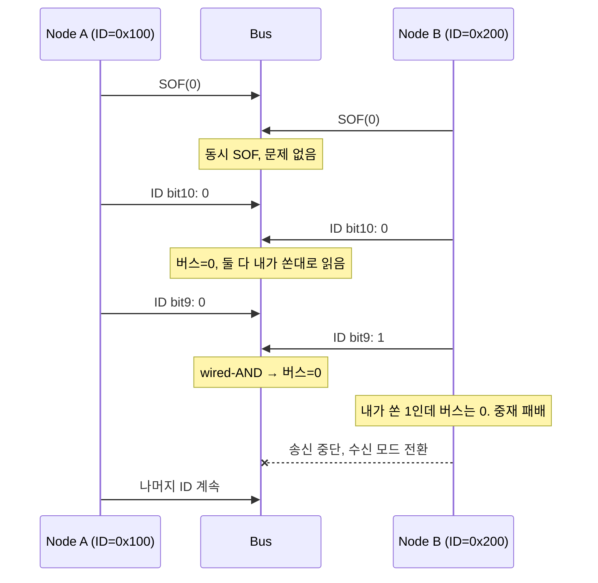
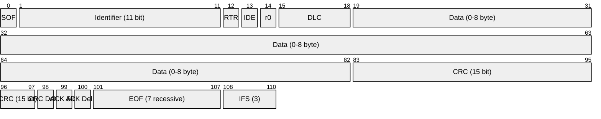

# CH6. Classical CAN 프레임 심화

::: info 입문(ISOBUS CH4)과의 차이
[ISOBUS 스터디 CH4](/study/isobus/04-can-data-frame)에서는 Classical CAN 프레임의 "어떤 필드가 있는지"를 그림 레벨에서 다뤘다. 이 챕터는 같은 프레임을 <strong>bit 단위</strong>로 다시 뜯는다. Stuff bit이 어떻게 붙고, CRC가 어떤 다항식으로 계산되며, Remote/Overload/Error 프레임이 언제 나가고, 중재 구간에서 희귀하지만 실제로 발생하는 엣지 케이스까지 파고든다.
:::

::: info 학습 목표
- Classical CAN 프레임의 각 필드를 bit 단위로 설명할 수 있다.
- Bit stuffing이 적용되는 범위와 실제 전송 bit 수를 계산할 수 있다.
- CAN CRC-15의 생성 다항식을 이해하고 예제 메시지로 손 계산할 수 있다.
- Remote/Overload/Error 프레임이 언제·왜 나가는지 구분한다.
- 중재 구간에서 발생하는 엣지 케이스와 그 결과를 설명할 수 있다.
:::

## 1. 전체 Frame Layout 재확인

Classical CAN 11-bit Standard data frame의 필드 배치는 다음과 같다.

| 필드 | 길이(bit) | 내용 |
|------|-----------|------|
| SOF | 1 | dominant. 프레임 시작, Hard Sync 트리거 |
| Arbitration | 11 + 1 | Identifier 11bit + RTR |
| Control | 1 + 1 + 4 | IDE + r0 + DLC |
| Data | 0~64 | DLC에 따라 0~8 byte |
| CRC | 15 + 1 | CRC-15 + CRC Delimiter(1 recessive) |
| ACK | 1 + 1 | ACK Slot + ACK Delimiter(1 recessive) |
| EOF | 7 | 7 recessive |
| IFS | 3 | 3 recessive (Intermission) |

Arbitration 구간의 <strong>RTR(Remote Transmission Request)</strong>은 data frame에서 0(dominant), remote frame에서 1(recessive)이다. Control 구간의 <strong>IDE(Identifier Extension)</strong>는 11-bit standard에서 0, 29-bit extended에서 1이다. <strong>r0</strong>은 예약 bit로 dominant가 정상이지만, 수신기는 이 값이 무엇이든 허용해야 한다. <strong>DLC</strong>는 4비트로 실제 data byte 수를 나타내지만, Classical에서는 9~15 값도 8byte로 클램프된다.

EOF 7개와 IFS 3개를 합쳐 프레임 사이에는 <strong>최소 10 recessive bit</strong>의 간격이 생긴다. 이 구간 동안 수신기는 프레임 수신 처리를 마치고 다음 SOF를 기다린다. 이 간격이 필요한 이유는 수신 컨트롤러가 FIFO로 프레임을 올리고, 상위 핸들러가 파싱하는 시간을 확보하기 위해서다. 고성능 MCU에서는 충분히 여유 있는 시간이지만 8bit MCU에서는 IFS조차 짧게 느껴질 때가 있어 뒤이어 설명할 Overload Frame이 그 보완책이다.

Arbitration 구간의 길이가 프레임 간 우선순위를 결정하는데, 이 길이는 고정이다. ID 값이 낮을수록(dominant 비트가 많을수록) wired-AND 경쟁에서 자주 이긴다. 이 점은 [CH5의 동기화 이론](/study/can/05-synchronization)에서 전제한 구조적 조건이기도 하다.

## 2. Bit Stuffing 상세

### 2.1 규칙

Classical CAN의 bit stuffing 규칙은 단순하다. <strong>같은 레벨이 5 bit 연속</strong>되면, 송신기는 그 뒤에 <strong>반대 레벨 1 bit</strong>를 강제로 삽입한다. 수신기는 같은 규칙으로 stuff bit을 발견하면 그 bit을 버리고 원래 데이터를 복원한다.

이 규칙이 필요한 이유는 <strong>재동기화</strong>다. 송수신 오실레이터 편차가 있는 상태에서 같은 레벨이 너무 오래 이어지면 edge가 사라져 수신기가 누적 오차를 교정할 기회를 잃는다. 최대 5 bit마다 반드시 edge가 나오도록 보장하면 [CH5에서 다룬](/study/can/05-synchronization) Resync가 동작할 수 있다.

### 2.2 적용 범위

Stuff bit이 삽입되는 구간은 <strong>SOF부터 CRC 마지막 bit까지</strong>다. 그 이후는 제외된다.

| 필드 | Stuffing 적용 |
|------|---------------|
| SOF | O |
| Arbitration(ID + RTR) | O |
| Control(IDE + r0 + DLC) | O |
| Data | O |
| CRC(15 bit) | O |
| CRC Delimiter | X |
| ACK Slot | X |
| ACK Delimiter | X |
| EOF(7 recessive) | X |
| IFS | X |

CRC Delimiter 이후부터 EOF 7 recessive까지 stuff bit이 없는 이유는, 이 구간이 <strong>고정 형식(fixed-form)</strong>이기 때문이다. 수신기는 CRC Delimiter 다음을 정확히 예측할 수 있으므로 stuff bit 없이도 동기화가 유지된다. 오히려 이 구간에 6 recessive가 연속으로 나오는 것이 정상이고, 여기서 6 dominant가 나오면 그것은 <strong>Error Flag</strong>로 해석된다.

### 2.3 실제 전송 bit 수 계산

Stuff bit이 프레임 길이에 주는 영향은 계산으로 추정 가능하다. 11-bit ID, 8 byte data, DLC=8 기준 bit 수는 다음과 같다.

- Stuff 대상 구간(SOF~CRC): 1 + 12 + 6 + 64 + 15 = <strong>98 bit</strong>
- 최악 stuff(매 5 bit마다 1 bit 삽입): floor((98-1)/4) ≈ 24 bit 추가
- 고정 구간(CRC delim~EOF): 1 + 1 + 1 + 7 = 10 bit
- IFS: 3 bit

결과적으로 Standard frame의 bit 수는 최소 <strong>111 bit</strong>, 최악 <strong>135 bit</strong> 범위다. 1Mbps 기준으로 한 프레임이 차지하는 시간은 111~135μs. 이 편차는 [CH10 버스 부하·응답시간](/study/can/10-busload-response-time) 계산에서 Worst-Case Response Time을 산출할 때 결정적으로 작용한다.

실무에서 worst-case를 정확히 잡으려면 <strong>stuff bit의 최대 개수</strong>가 단순 floor 연산과 살짝 다르다는 점도 알아야 한다. stuff bit 자체도 "이전 5 bit과 다른 레벨"이기 때문에 그 다음 5 bit에 또 같은 레벨이 이어지면 또 stuffing된다. 최악 경우 분석은 ID·DLC·data byte 구성에 따라 달라지지만, 관례적으로 <strong>ID_max_stuff = floor((34+8*N-1)/4)</strong> 공식을 Tindell의 논문(1994)에서 가져다 쓴다.

## 3. CRC 계산

### 3.1 생성 다항식

Classical CAN은 <strong>CRC-15</strong>를 사용한다. 생성 다항식은 다음과 같다.

$$
G(x) = x^{15} + x^{14} + x^{10} + x^{8} + x^{7} + x^{4} + x^{3} + 1
$$

비트 표현으로는 `1100 0101 1001 1001` (0xC599, 16bit) 이지만 CAN에서는 leading 1을 제외하고 15bit만 CRC 필드에 실린다. 이 다항식은 Hamming distance 6을 보장한다. 즉 5 bit 이하의 오류를 100% 검출하고, 15 bit 이하의 burst error도 전부 잡아낸다.

### 3.2 적용 대상

CRC 계산 입력은 <strong>destuffing 이전 원본 비트</strong>다. SOF부터 data field 끝까지의 비트열을 CRC 레지스터에 넣고 다항식 나눗셈을 수행한다. Stuff bit은 <strong>CRC 계산에 포함되지 않는다</strong>. 실제 전송 시에는 CRC 필드 내부에도 5 bit 동일 레벨이 나오면 stuff bit이 추가되지만, 수신기는 destuffing 후 원본 15 bit만 비교한다.

### 3.3 손 계산 예제

예제 메시지: ID=0x123, DLC=1, Data=0x42

SOF~Data까지의 bit stream(stuff bit 전):

```
SOF    : 0
ID     : 001 0010 0011   (0x123, 11bit)
RTR    : 0
IDE    : 0
r0     : 0
DLC    : 0001            (1 byte)
Data   : 0100 0010       (0x42)
```

이어붙이면 `0 00100100011 0 0 0 0001 01000010` = <strong>28 bit</strong>.

CRC 계산은 이 28비트 뒤에 0을 15개 붙이고, 상위 비트부터 현재 비트가 1이면 $G(x)$ (16bit)와 XOR, 0이면 shift만 하는 과정의 반복이다. 실무에서는 shift register 구현을 그대로 쓴다.

::: details CRC 계산 의사 코드
```c
uint16_t can_crc15(const uint8_t *bits, size_t nbits) {
    uint16_t crc = 0;
    for (size_t i = 0; i < nbits; i++) {
        uint8_t bit = bits[i];
        uint8_t crc_next = bit ^ ((crc >> 14) & 1);
        crc = (crc << 1) & 0x7FFF;
        if (crc_next) crc ^= 0x4599;  // G(x) without MSB
    }
    return crc & 0x7FFF;
}
```
비트 스트림을 순차로 집어넣고 MSB와 새 비트를 XOR한 결과로 다항식 XOR 여부를 결정한다. CAN 컨트롤러 하드웨어도 이와 동일한 15bit shift register를 갖고 있다.
:::

수신기는 같은 절차로 CRC를 계산한 뒤 프레임에 실린 CRC와 비교한다. 일치하지 않으면 <strong>CRC Error</strong>로 판정해 Error Frame을 쏘고, 송신기는 TEC/REC를 증가시킨다.

CAN-15 다항식의 수학적 성질도 잠시 짚자. 이 다항식은 원시(primitive) 다항식을 곱해 만든 형태로, 최대 <strong>5 bit 랜덤 오류</strong>를 100% 감지하고, <strong>15 bit 이하의 burst error</strong>도 전부 잡는다. 16 bit 이상의 burst에서는 이론적 감지율이 $1 - 2^{-14}$ 수준이다. 실제 CAN 버스에서 관측되는 오류는 대부분 EMI·ESD 순간 펄스로 인한 짧은 burst라 CRC-15로도 충분한 신뢰성을 제공했다. 하지만 이 근거가 8 byte payload를 전제로 한 것이므로 CAN FD의 64 byte에는 부족해 CRC-17/21이 새로 도입됐다.

## 4. Remote Frame — 왜 쓰지 말아야 하는가

Remote Frame은 다른 노드에게 "이 ID의 데이터를 보내달라"고 요청하는 프레임이다. Data frame과 비교하면 다음이 다르다.

| 항목 | Data Frame | Remote Frame |
|------|-----------|--------------|
| RTR | 0 (dominant) | 1 (recessive) |
| DLC | data byte 수 | 요청할 byte 수(실제 data는 없음) |
| Data field | 0~8 byte | 없음 |

Remote Frame은 초기 CAN 명세(1986)부터 있었지만, <strong>현대 automotive 실무에서는 사용이 권장되지 않는다</strong>. 이유는 여러 가지다.

- <strong>중재 충돌</strong>: 같은 ID로 data frame과 remote frame이 동시에 송신되면, RTR 비트에서 data frame(RTR=0, dominant)이 이긴다. 이 동작은 "요청자가 요청을 받기도 전에 응답이 나오는" 이상한 순서를 낳는다.
- <strong>DLC 모호성</strong>: 원본 CAN 2.0 명세에서 Remote Frame의 DLC가 실제 전송 바이트 수인지, 요청한 바이트 수인지 해석이 갈렸다. 벤더별 구현 차이가 존재한다.
- <strong>CAN FD에서 삭제</strong>: ISO 11898-1:2015는 CAN FD 프레임에서 Remote Frame 자체를 허용하지 않는다. FDF 비트가 recessive이고 RTR이 있어야 할 자리에 r1(reserved)이 오는 구조다.

현업에서 "주기 데이터 + 이벤트 데이터"는 이제 <strong>producer가 cyclic transmit</strong>하거나, UDS/ISO-TP 기반 Request-Response로 처리한다. Remote Frame을 쓰겠다는 요구가 오면 의심부터 하는 것이 맞다.

다만 일부 레거시 임베디드 프로젝트나 저비용 센서·액추에이터에서는 여전히 Remote Frame을 쓰는 곳이 있다. 특히 CANopen 규격의 일부 서비스에서 RTR이 명세에 포함돼 있다. 이런 경우에도 권장은 "필요하면 쓰되 동일 ID로 data frame과 remote frame을 겹쳐 쓰지 않는" 패턴이다.

## 5. Overload Frame

Overload Frame은 수신기가 <strong>다음 프레임 수신 준비가 안 됐을 때</strong> 버스에 시간을 벌어주는 특수 프레임이다. 구조는 Error Frame과 유사하다.

| 필드 | 길이 | 내용 |
|------|------|------|
| Overload Flag | 6 bit | dominant |
| Overload Delimiter | 8 bit | recessive |

Overload Frame이 발생하는 조건은 CAN 2.0B 명세에 두 가지로 명시돼 있다.

1. 수신기의 내부 처리가 늦어 <strong>IFS(Intermission) 동안에도 준비가 안 됐을 때</strong>. 이때 IFS의 첫 bit에 dominant를 쏴서 다음 프레임 시작을 지연시킨다.
2. <strong>IFS의 3번째 bit에서 dominant를 감지</strong>했을 때. 이는 다른 노드가 이미 Overload를 시작했다는 뜻이므로 동조해 Overload Flag를 이어 쏜다.

Overload Frame은 최대 <strong>2회 연속</strong>까지만 허용된다. 세 번째 Overload Flag는 Error로 간주되어 Error Frame이 발생한다. 현대 고성능 MCU에서는 FIFO 깊이가 충분해 Overload Frame이 거의 나오지 않지만, 저가 8bit MCU나 오버로드된 버스에서는 여전히 관찰된다.

Overload Flag도 Error Flag와 마찬가지로 <strong>다른 노드의 bit stream을 파괴</strong>한다. 차이점은 "의도된 지연"이라는 점이다. Error Flag는 오류가 감지됐다는 긴급 신호지만 Overload Flag는 "잠깐만 기다려 달라"는 요청이다. CAN 컨트롤러는 두 flag를 구분해 로깅하기 때문에 진단 장비는 <strong>Error Frame 카운트와 Overload Frame 카운트를 별도</strong>로 관리한다.

## 6. Error Frame

Error Frame은 오류를 감지한 노드가 즉시 쏴서 다른 노드들에게도 "이 프레임은 무효"임을 알리는 프레임이다. 송신 노드의 상태에 따라 두 종류가 있다.

| 종류 | Flag | 설명 |
|------|------|------|
| Active Error Flag | 6 dominant | Error Active 상태 노드가 발행 |
| Passive Error Flag | 6 recessive | Error Passive 상태 노드가 발행 |
| Error Delimiter | 8 recessive | 공통 |

Active Error Flag는 6 dominant이기 때문에 <strong>다른 정상 프레임을 파괴</strong>한다. 이는 모든 노드가 오류를 확실히 인지하게 만드는 강력한 신호다. 반면 Passive Error Flag는 6 recessive라 아무도 파괴하지 못한다. Error Passive 상태(TEC ≥ 128) 노드가 다른 정상 노드의 송신을 방해하지 않도록 설계된 것이다.

Error Frame은 CRC Error, Form Error, ACK Error, Bit Error, Stuff Error 등 5종 오류([CH9에서 상세](/study/can/09-error-handling))를 감지한 즉시 발생한다. 이 구조 덕분에 Classical CAN은 <strong>버스 레벨에서 오류가 모든 노드에게 동시에 전파</strong>된다. 이를 <strong>ECC(Error Containment Concept)</strong>라고 부른다.

Error Frame 발생은 프레임 송신을 중단시키고 재송신 대기열에 다시 넣는다. Classical CAN 컨트롤러는 성공할 때까지 무제한 재시도하는 것이 기본 동작이다. 이 때문에 결함이 있는 노드가 계속 Error Frame을 쏘면 <strong>전체 버스가 마비</strong>될 수 있다. 이를 막는 장치가 Error Passive 전환과 Bus-off 상태이며, [CH9](/study/can/09-error-handling)에서 TEC/REC 카운터 규칙으로 상세히 다룬다.

## 7. 중재 엣지 케이스

### 7.1 동시 송신

두 노드 A(ID=0x100)와 B(ID=0x200)가 같은 SOF에 송신을 시작했다고 하자. Arbitration 구간에서 bit-by-bit으로 자기 비트와 버스 비트를 비교한다.



패배한 노드 B는 즉시 송신을 중단하고 <strong>수신 모드</strong>로 전환한다. Error가 아니다. B는 지금 버스에 흐르는 프레임(A의 프레임)을 정상 수신하고, IFS 이후 다시 송신을 시도한다. 이 "지고도 수신으로 매끄럽게 넘어가는 것"이 CAN의 가장 큰 설계 미덕이다.

### 7.2 같은 ID로 두 노드가 송신

규약은 <strong>동일 ID를 두 노드가 쓰는 것을 금지</strong>한다. 만약 두 노드가 같은 ID로 동시에 송신하면, 데이터 필드가 다르지 않은 이상 중재는 성공적으로 끝나지만 데이터 내용에서 bit error가 발생한다. 이때 양쪽 모두 Bit Error를 감지하고 Error Frame을 쏜다. 결과적으로 버스 오류로 이어지고, 두 노드의 TEC가 증가한다.

DBC 설계 단계에서 ID 충돌을 막는 것이 기본이다. J1939처럼 PGN + Source Address 조합으로 ID가 자동 생성되는 상위 프로토콜이라면 이 문제는 대부분 예방된다.

### 7.3 Stuff bit이 중재 구간에 들어갈 때

Arbitration 구간에도 stuff bit이 들어간다. 그런데 이 stuff bit은 "데이터 의미상의 비트"가 아니다. 만약 중재 중 stuff bit 위치에서 자기 비트와 버스가 다르다면 이는 <strong>Stuff Error</strong>로 처리되고 Error Frame이 발생한다. 중재 패배로 처리되지 않는다. 명세상 stuff bit 위치에서의 mismatch는 에러로 본다는 규정이 있기 때문이다.

이 구분은 실무 디버깅에서 중요하다. "왜 아무도 지지 않았는데 에러가 뜨는가?"의 답이 종종 이 케이스다.

## 8. 29-bit Extended ID vs 11-bit Standard

CAN 2.0B는 <strong>29-bit Extended Identifier</strong>를 추가로 정의한다. Arbitration 구간 차이는 다음과 같다.

| 필드 | Standard(2.0A) | Extended(2.0B) |
|------|----------------|-----------------|
| ID 상위 | 11 bit | 11 bit (Base ID) |
| SRR | - | 1 bit (recessive, RTR 자리) |
| IDE | 0 (dominant) | 1 (recessive) |
| ID 하위 | - | 18 bit (Extended ID) |
| RTR | 1 bit | 1 bit |
| r1, r0 | r0 1bit | r1 + r0 |

중재 우선순위가 중요한 관점은 <strong>IDE 비트</strong>다. Base ID가 같은 Standard와 Extended가 동시에 송신되면, IDE 자리에서 Standard(0) vs Extended(1)가 되어 <strong>Standard가 이긴다</strong>. 즉 같은 Base ID라면 Extended는 항상 Standard보다 우선순위가 낮다. 혼합 네트워크 설계 시 critical 제어 메시지는 Standard로 두고, 진단·텔레메트리 같은 저우선 트래픽을 Extended로 두는 것이 관례다.

Extended Frame은 arbitration 구간이 길어 worst-case 전송 시간이 Standard 대비 약 20 bit 더 길다. [CH10](/study/can/10-busload-response-time)의 응답 시간 계산에서 이 차이가 누적된다.

<strong>SRR(Substitute Remote Request)</strong> 비트는 Extended Frame의 독특한 존재다. Standard Frame의 RTR 자리(ID 11bit 다음)에 항상 <strong>recessive</strong>로 고정돼 들어간다. 이 비트는 상술한 IDE 비교를 위한 준비 단계로, "나는 Extended Frame이다. 중재에서 Standard에게 양보하겠다"는 신호로 읽으면 된다. Extended Frame의 실제 RTR 비트는 29bit ID 전부와 r1을 거친 뒤에야 나타난다.

29-bit ID 공간이 제공하는 가장 큰 이점은 J1939 같은 <strong>PGN·Source Address 기반 프로토콜</strong>을 표현할 수 있다는 점이다. J1939는 29bit을 Priority(3) + EDP(1) + DP(1) + PDU Format(8) + PDU Specific(8) + Source Address(8)로 쪼갠다. 이 때문에 J1939·ISOBUS·NMEA2000은 모두 Extended Frame을 전제로 한다. 승용차 본체(body) 네트워크는 여전히 11bit Standard가 주류지만, 상용차·농기계·선박은 Extended가 기본이다.

## 9. Classical CAN Frame Bit Layout



Data 구간은 DLC에 따라 0~64 bit으로 가변이다. Stuff bit은 이 그림에는 표시하지 않았다. 실제 버스에서는 SOF부터 CRC 마지막까지의 구간에 최대 24 bit의 stuff bit이 더 들어갈 수 있다.

오실로스코프로 실제 버스를 찍었을 때 몇 가지 눈에 띄는 패턴이 있다. 프레임 시작에서 SOF 이후 처음 여러 dominant가 이어지면 가장 먼저 stuff bit이 들어가는 것이 눈에 보인다. 중재 구간과 데이터 구간의 경계는 파형만으로는 구분되지 않고, 분석기 SW의 decode 결과를 따라가야 한다. CRC Delimiter 이후의 ACK Slot은 송신기가 recessive로 띄워 놓고 <strong>다른 노드가 dominant로 끌어내기를 기다리는 지점</strong>이라 파형의 drop을 보면 실제 ACK을 준 노드가 있는지 확인할 수 있다.

## 10. 실무 포인트

::: warning 프레임 구조 관련 자주 하는 실수
- <strong>DLC=8 초과 값 오해</strong>: Classical에서 DLC 9~15는 모두 8byte로 클램프. CAN FD에서는 다른 의미. 혼용 네트워크에서 이를 혼동하면 상위 파서가 깨진다.
- <strong>Remote Frame 의존</strong>: 레거시 시스템 마이그레이션 시 Remote Frame을 cyclic으로 바꾸는 작업이 필요. 그대로 두면 FD 전환 시 반드시 막힌다.
- <strong>CRC 경계 오해</strong>: 송신기는 stuff bit 포함해 버스에 실지만, CRC 계산은 stuff bit <strong>제외</strong>. 커스텀 소프트 CAN 구현에서 가장 흔한 버그.
- <strong>ACK 누락을 에러로 해석 안 함</strong>: 송신 중 ACK Slot에서 recessive만 보이면 ACK Error. 단독 네트워크(노드 1개)에서는 영원히 ACK을 못 받아 계속 재송신 반복.
- <strong>Error Frame에 놀람</strong>: 매우 드물게는 정상. 하지만 bus-load 2% 이상의 Error Frame은 반드시 원인 추적해야 한다.
:::

::: details Error Frame과 Overload Frame 구분법
두 프레임 모두 "6 dominant + 8 recessive" 구조라 겉모습은 비슷하다. 구분 포인트는 <strong>언제 나왔는가</strong>다. 프레임 도중(데이터 전송 중) 나온 dominant 6개는 Error Flag, 프레임 사이 IFS 구간에서 시작된 것은 Overload Flag. 오실로스코프만 보고 구분하기는 어려우니 CAN 분석기(Kvaser, PEAK 등)의 로그에서 이벤트 타입을 확인해야 한다.
:::

## 다음 챕터

Classical CAN의 프레임 구조를 bit 레벨까지 이해했다면, 이제 그 한계를 극복하기 위해 태어난 <strong>CAN FD</strong>로 넘어간다. FDF/BRS/ESI, 64 byte payload, 확장된 CRC, 샘플 포인트 분리 같은 변경점을 bit 단위로 짚는다.

다음: [CH7. CAN FD 심화](/study/can/07-can-fd-deep)

::: tip 핵심 정리
- Classical CAN frame은 SOF~IFS까지 필드가 고정돼 있고, Stuff bit은 SOF~CRC 마지막까지만 적용된다.
- CRC-15는 $x^{15}+x^{14}+x^{10}+x^8+x^7+x^4+x^3+1$이고, destuffing 후 원본 bit으로 계산한다.
- Remote Frame은 중재 충돌·DLC 모호성 때문에 현대에는 권장되지 않고, CAN FD에서는 아예 삭제됐다.
- Overload/Error Frame은 버스 레벨 제어 프레임이며, Error Active/Passive에 따라 Flag 레벨이 다르다.
- 중재에서 진 노드는 자동으로 수신 모드로 전환되며 에러가 아니다. 같은 ID 동시 송신만 진짜 에러다.
:::
