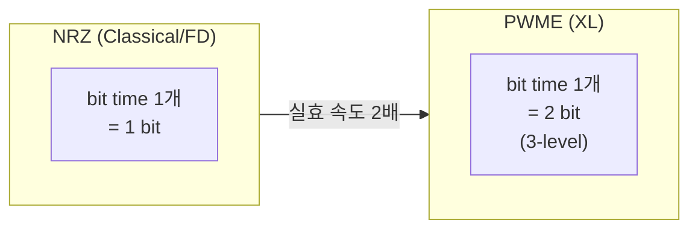
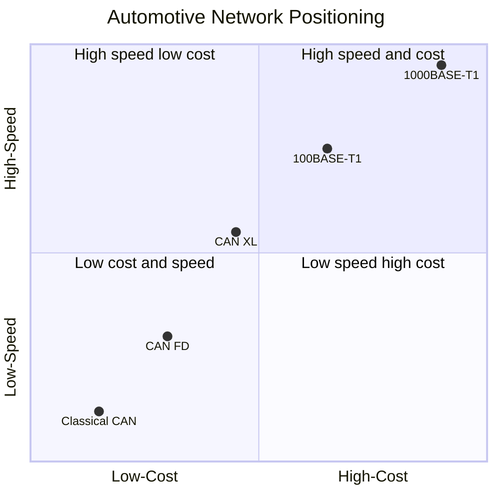
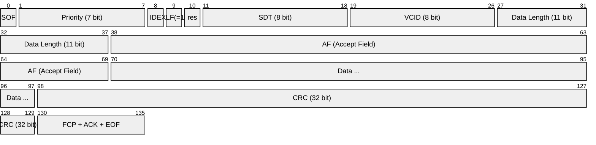

# CH8. CAN XL 개요

::: info 학습 목표
- CAN XL이 CAN FD 위에 왜 또 필요했는지 설명할 수 있다.
- SDT(Service Data Type)의 역할과 상위 프로토콜 터널링 방식을 이해한다.
- PWME 인코딩이 NRZ 대비 어떤 원리로 속도를 끌어올리는지 안다.
- 2048 byte 페이로드와 ISO-TP의 관계를 설명할 수 있다.
- 차량 이더넷(100/1000BASE-T1)과 TSN(gPTP·TAS·CBS)이 무엇이고 CAN XL과 어떻게 포지션이 갈리는지 구분한다.
- CAN XL 실전 도입이 어디에 어울리고 어디에 과잉인지 판단 기준을 가진다.
:::

## 1. 배경 — FD도 한계가 있다

CAN FD는 Classical의 1Mbps·8byte 벽을 8Mbps·64byte로 확장했다. 하지만 2020년 이후 자동차 네트워크 요구는 다시 이 천장을 두드렸다.

- ADAS·Zone 컨트롤러 간 fusion 데이터: 한 프레임에 수백 byte 단위 구조체를 담고 싶다.
- 인포테인먼트의 소프트웨어 업데이트: 수백 MB 펌웨어 전송에 ISO-TP 수십만 프레임 분할은 비효율.
- <strong>TCP/IP 기반 상위 서비스</strong>를 기존 CAN 물리 배선에 통합하고 싶다. 차량 이더넷은 배선 비용·MCU 부하가 크다.

CiA(CAN in Automation)는 이 요구에 대응해 <strong>CiA 610-1</strong> 시리즈로 CAN XL(eXtended data-field Length) 규격을 2022년 확정했다. ISO 11898-1/2 개정은 진행 중이며 2026년 4월 시점에서 실차 적용은 여전히 제한적이다. 상용 트랜시버는 NXP TJA146x, Infineon TLE946x 계열이 샘플 단계부터 양산 초기로 이동 중이다.

CAN XL이 FD 위에 또 필요했던 근본 이유는 <strong>상위 프로토콜 통합</strong>이다. FD는 여전히 Classical과 마찬가지로 "ID가 어떤 의미인지는 배포된 DBC를 따로 봐야 하는" 구조다. 반면 현대 차량은 AUTOSAR·SOME/IP·IP/UDP 등 다양한 상위 서비스가 물리 링크 하나 위에서 공존해야 하는 상황인데, FD는 이를 담기엔 너무 단순하다. XL은 프레임 레벨에 상위 식별자를 넣고, 이더넷과의 브리지까지 염두에 두고 설계됐다.

## 2. 주요 변경점 요약

| 항목 | Classical | CAN FD | <strong>CAN XL</strong> |
|------|-----------|--------|---------------------------|
| Max data | 8 byte | 64 byte | <strong>2048 byte</strong> |
| Max bit rate | 1 Mbps | 8 Mbps | <strong>10~20 Mbps</strong> (PWME) |
| Payload 인코딩 | NRZ | NRZ | <strong>PWME</strong> (3-level) |
| 상위 프로토콜 식별 | DBC/ID 관례 | DBC/ID 관례 | <strong>SDT 필드 명시</strong> |
| Arbitration ID | 11 또는 29 bit | 11 또는 29 bit | <strong>Priority + VCID</strong> 구조 |
| Frame 호환성 | CAN | CAN+FD | <strong>CAN+FD+XL</strong> (별도 포맷) |
| CRC | 15 | 17/21 | <strong>32</strong> |

변화의 핵심은 세 가지다. 페이로드 크기 대폭 증가, 데이터 구간 인코딩 방식 교체, 상위 프로토콜 식별 체계 도입. 이 셋은 각각 독립된 변화처럼 보이지만 서로 맞물려 있다. 페이로드가 크면 상위 프로토콜을 통째로 담을 수 있고, 그 상위 프로토콜을 구분할 식별자가 필요하며, 커진 데이터를 합리적인 시간 안에 보내려면 인코딩을 바꿔 속도를 올려야 한다.

## 3. SDT — Service Data Type

Classical·FD에서 "이 ID가 어떤 의미냐"는 전적으로 <strong>DBC 파일이나 J1939 PGN 같은 관례</strong>에 맡겨져 있었다. CAN XL은 프레임에 <strong>SDT 1 byte</strong>를 포함해 상위 프로토콜을 명시한다.

| SDT 값 | 의미 |
|--------|------|
| 0x01 | Content-based Addressing (Classical 호환 방식) |
| 0x03 | CANopen |
| 0x04 | AUTOSAR IP/UDP 터널링 |
| 0x06 | IEEE 802.3 Ethernet frame 터널링 |
| 0x07 | MAC-based routing |
| 기타 | CiA 611-1 / 611-2에서 지정 |

SDT가 0x06이면 프레임 payload는 Ethernet frame 그대로 실려 있다고 해석된다. 이 덕분에 CAN XL은 <strong>이더넷 프레임을 CAN 물리층으로 터널링</strong>할 수 있다. TCP/IP 기반 서비스가 기존 CAN 케이블 위에서 동작할 수 있게 된다는 뜻이다. 대용량 동영상까지는 못 가지만, 진단·OTA·텔레메트리 수준은 충분하다.

이더넷 터널링이 제공하는 실질적 이점은 <strong>기존 TCP/IP 응용 스택을 그대로 재사용</strong>할 수 있다는 점이다. HTTP·MQTT·DDS 같은 고수준 프로토콜을 자동차 진단 포트에서 직접 끌어 쓸 수 있고, 상위 모니터링 툴이 일반 IP 네트워크처럼 볼 수 있다. 이는 MCU 펌웨어 개발 관점에서 학습 곡선을 크게 낮춘다. 반면 순수 제어 트래픽은 기존 CAN DBC 방식을 그대로 유지해 SDT=0x01로 실으면 된다.

::: info SDT가 하는 실전 역할
수신 ECU는 SDT를 보고 곧장 상위 스택으로 dispatch 한다. Classical CAN에서 ID 필터링 후 DBC 파싱 후 상위 핸들러를 고르던 것에 비해 계층 분리가 명확해진다. Gateway ECU가 CAN XL ↔ Automotive Ethernet 중계를 구현할 때 특히 효율적이다.
:::

## 4. PWME — 데이터 구간 속도 2배

CAN XL의 가장 독특한 변경은 <strong>PWM-like 3-level 인코딩</strong>이다. 정식 명칭은 여러 논문·벤더 자료에서 PWM Encoding, PWM-E, 또는 duo-binary-like encoding 등으로 불린다.

Classical과 FD는 <strong>NRZ(Non-Return to Zero)</strong>를 쓴다. 1 bit time에 dominant/recessive 한 레벨을 놓는 방식이다. PWME는 같은 bit time 안에서 <strong>3-level 차동 신호</strong>를 써서 2 bit을 실어낸다. 구체적으로는 첫 절반(phase 1)과 나머지 절반(phase 2)의 레벨 조합으로 2 bit을 표현하는 구조다.

같은 bit time에서 2배 데이터를 실으니 symbol rate 5 Mbps에서도 data rate는 10 Mbps가 된다. Bosch·NXP 테스트에서는 20 Mbps 영역까지 물리적으로 가능한 것으로 보고돼 있다.

Arbitration 구간은 여전히 NRZ를 쓴다. Wired-AND 중재가 3-level 인코딩과 맞지 않기 때문이다. BRS처럼 <strong>data 구간 진입 시점에만 PWME로 스위칭</strong>한다. CAN FD의 이중 속도 철학을 한 단계 더 확장한 구조다.

PWME의 기술적 근거는 <strong>전송선 대역폭은 symbol rate가 결정</strong>한다는 점이다. Symbol rate를 올리지 못할 때(케이블·트랜시버 한계 때문에) 대신 symbol 하나에 여러 bit을 실으면 실효 data rate을 올릴 수 있다. 이더넷의 100BASE-T1도 비슷한 아이디어(PAM3 3-level 인코딩)를 쓰고, xDSL·5G 무선까지 이어지는 범용 접근이다. CAN XL은 이 원리를 CAN 물리층에 도입한 셈이다.

::: warning PWME와 트랜시버
PWME는 기존 CAN 트랜시버로 송수신 불가능하다. 반드시 <strong>XL 트랜시버</strong>가 필요하다. CAN FD 트랜시버와도 호환되지 않는다. 혼용 네트워크에서는 Classical/FD 노드와 XL 노드를 물리적으로 분리하고 Gateway로 연결하는 것이 현실적이다.
:::

## 5. 2048 byte Payload — ISO-TP 해방

Classical·FD에서 <strong>ISO 15765-2(ISO-TP)</strong>는 8/64 byte 한계를 넘어서는 메시지를 여러 프레임으로 쪼개 전송하는 표준이다. UDS 진단이 대표 사용처다. 10 KB 응답 한 번에 Single Frame → First Frame → Consecutive Frame 수십~수백 개로 쪼개진다. [CH19 ISO-TP](/study/can/19-iso-tp)에서 이 분할·재조립 프로토콜을 상세히 다룬다.

CAN XL의 2048 byte payload는 대부분의 메시지를 <strong>단일 프레임</strong>으로 커버한다. 1 MB 같은 대용량은 여전히 분할이 필요하지만, 그 횟수는 100배 이상 줄어든다. 결과는 두 가지다.

- Flow Control 왕복 감소. UDS 업로드/다운로드 속도 개선.
- 수신측 ECU의 reassembly 버퍼 압박 감소.

반면 주의할 점도 있다. 2048 byte 프레임은 <strong>한 번에 채널을 점유하는 시간이 매우 길어진다</strong>. 10 Mbps에서도 2048 byte = ~1.6 ms. 이 시간 동안 더 높은 우선순위 제어 메시지가 뒤에 쌓인다. 실시간성 요구가 엄격한 파워트레인·브레이크 제어에는 여전히 짧은 프레임이 유리하다.

이 때문에 CAN XL 네트워크에서는 메시지 크기 전략이 중요해진다. 한 버스에 controller data(짧고 빈번)와 diagnostic data(크고 드문)가 혼재하면, 긴 XL 프레임이 실행 중일 때 controller는 최악 1.6 ms를 기다려야 한다. 이를 회피하려면 <strong>물리 버스를 분리</strong>하거나, 긴 프레임을 여러 개의 256~512 byte 프레임으로 쪼개는 내부 정책을 두는 방식이 쓰인다. 여전히 분할이 필요하다는 사실은, 대용량 데이터에는 처음부터 이더넷이 더 맞는다는 신호로도 읽힌다.

## 6. CRC와 SBC

CAN XL은 <strong>CRC-32</strong>를 쓴다. 2048 byte 페이로드 기준 Hamming distance 6을 확보하기 위함이다. 추가로 <strong>SBC(Sequence Bit Count)</strong>라는 필드가 새로 도입돼 프레임 내부 비트 수 자체를 별도로 체크한다. Stuff bit이나 encoding 오류로 비트 수가 어긋나는 경우도 잡는다.

CRC-32는 Ethernet·PCIe·ZIP 등에서 수십 년간 검증된 다항식이라 구현 IP가 풍부하다. CAN 컨트롤러가 기존에 갖고 있던 CRC-15/17/21 모듈에 하드웨어 CRC-32 엔진을 추가해야 하고, 소프트웨어 구현 시에는 32bit shift register 또는 table-lookup 방식 중 선택한다. 2048 byte 같은 큰 페이로드에서는 table-lookup이 성능상 유리하다.

## 7. CAN FD와의 호환성

CAN XL 프레임은 Classical·FD와 <strong>별도 포맷</strong>이다. 프레임 헤더 초반의 특정 비트 패턴으로 XL 여부를 구분한다. XL 전용 세그먼트에서는 CAN/FD 노드가 동작 불가능하므로, 과도기에는 세그먼트 분리가 표준 아키텍처다.

XL 전용 트랜시버는 보통 "CAN FD Fallback"을 지원한다. 즉 네트워크 전체가 XL로 합의되지 않았으면 FD 모드로 동작하다가, XL 노드만으로 구성된 세그먼트에서 XL 모드로 전환한다. 이는 BRS-like 협상 방식으로, 프레임별로 속도·인코딩을 재협상한다.

현실적으로 XL·FD·Classical을 한 버스에 섞는 시도는 거의 없다. Gateway 한 대가 세 버전의 세그먼트를 각각 관리하고, 상위 application 레벨에서 routing table로 메시지를 중계하는 구조가 권장된다. 이 구조는 차량 아키텍처의 <strong>E/E(Electrical/Electronic) architecture</strong>에서 Zone 기반 설계와 자연스럽게 맞아 떨어진다. Zone controller가 내부는 XL, 외부는 FD·Classical을 쓰며 물리 버스를 분리하고 software-defined routing으로 연결한다.

## 8. 차량 이더넷과의 경계

CAN XL을 이야기할 때 반드시 대비해야 하는 것이 <strong>차량 이더넷</strong>(100BASE-T1, 1000BASE-T1)이다.

| 항목 | CAN XL | 100BASE-T1 | 1000BASE-T1 |
|------|--------|-------------|--------------|
| Max bit rate | 10~20 Mbps | 100 Mbps | 1 Gbps |
| Payload | 2048 byte | 1500 byte (MTU) | 1500 byte |
| 케이블 | 기존 CAN twisted pair | Single pair | Single pair |
| 중재 | Wired-AND | CSMA/CD·Switched | Switched only |
| 우선순위 | ID 기반 | VLAN Priority·TSN | VLAN·TSN |
| 보안 | MACsec 불가 | MACsec 지원 | MACsec 지원 |
| 비용 | 저렴(기존 배선 재사용) | 중 | 고 |

CAN XL은 "<strong>중간자</strong>" 포지션이다. CAN FD보다 빠르고 풍성하지만 이더넷만큼 빠르지 않고, 이더넷보다 싸지만 FD보다 복잡하고 비싸다. 용도가 명확히 갈린다.

한 가지 중요한 차이는 <strong>보안</strong>이다. 차량 이더넷은 MACsec으로 링크 레벨 암호화·인증을 기본 지원하지만 CAN XL은 자체 MAC 계층 보안이 없다. 보안은 여전히 상위 계층인 <strong>SecOC</strong>(Secure Onboard Communication, [CH23](/study/can/23-defense-secoc))로 처리해야 한다. 즉 XL이 "물리적으로 배선을 재사용하면서 상위 스택의 다변화"를 제공할 수는 있지만, 보안 모델은 기존 CAN과 동일한 수준에 머문다.

이 포지셔닝 차트는 실제 차량 프로젝트에서 네트워크 기술을 선택할 때 기본 프레임이 된다. 왼쪽 하단의 Classical CAN은 여전히 가장 저렴하고 성숙한 선택지로, 저속 body 제어에 압도적이다. 오른쪽 상단의 1000BASE-T1은 중앙 컴퓨터 간 backbone이나 high-bandwidth ADAS fusion에만 쓰인다. CAN XL은 그 사이를 메우는 기술로, 프로젝트 요구가 "FD로 부족하지만 이더넷은 과잉"인 영역에 정확히 들어간다.

## 9. TSN 짧게 — 차량 이더넷의 결정성

차량 이더넷이 제어 네트워크까지 파고든 계기는 <strong>TSN(Time-Sensitive Networking)</strong>이다. 이더넷은 원래 CSMA/CD 기반이라 결정적 지연을 보장하지 못했지만, TSN은 이를 해결한다.

- <strong>gPTP(IEEE 802.1AS)</strong>: 네트워크 전체 시간 동기화. ns 단위.
- <strong>TAS(Time-Aware Shaper, 802.1Qbv)</strong>: 타임 슬롯 기반 전송 스케줄링. 특정 시간에만 특정 큐 송신.
- <strong>CBS(Credit-Based Shaper, 802.1Qav)</strong>: 우선순위별 대역폭 예약.
- <strong>Frame Preemption(802.1Qbu)</strong>: 큰 프레임을 고우선 프레임이 선점 가능.
- <strong>Stream Reservation(802.1Qat)</strong>: 송수신 경로의 대역폭을 미리 예약해 손실 없음 보장.

TSN이 없으면 차량 이더넷은 인포테인먼트·OTA용 best-effort에 머문다. TSN이 있어야 ADAS·X-by-Wire 제어까지 올라갈 수 있다. 2024년 이후 양산되는 프리미엄 차량의 중앙 E/E 아키텍처는 대부분 100BASE-T1 + TSN을 backbone으로 쓰고 있고, 여기에 zone controller 하위에 CAN FD·XL이 붙는 구조가 일반화되고 있다.

CAN XL은 이 TSN과 직접 연관되지 않는다. Arbitration 자체가 결정적 중재(ID 기반 prioritization)라 TSN 같은 외부 스케줄러가 필요 없다. 단 SDT=0x06으로 <strong>Ethernet frame을 터널링할 때</strong>만, 상위에서 TSN 스타일 트래픽을 CAN XL 위에 얹는 간접 연결 관계가 생긴다.

즉 TSN은 차량 이더넷 스택의 결정성을 보장하는 확장이고, CAN XL은 원래부터 결정적인 CAN의 용량·유연성을 확장한 것이다. 두 기술이 같은 "결정적 네트워크"라는 범주에 속하지만 접근 방식이 완전히 다르다는 점이 중요하다. 현대 차량 E/E 아키텍처에서는 두 기술이 <strong>계층 분리</strong>로 공존한다. 센서·액추에이터 레벨은 CAN/FD/XL, backbone은 TSN-capable 이더넷, 이를 zone controller가 브리지한다.

## 10. 실전 도입은 언제?

::: info CAN XL을 선택해야 하는 경우
- <strong>Zone 컨트롤러 간 링크</strong>: body/interior zone의 중간 집계기들 사이에 FD 대역이 부족한 경우.
- <strong>ADAS 센서 fusion 보조 채널</strong>: 메인은 이더넷, 보조·백업이 CAN XL.
- <strong>진단·OTA 고속화</strong>: UDS·플래시 write 시간 단축이 명확한 비용 이득을 만들 때.
- <strong>기존 CAN 배선 재활용</strong>이 전제 조건일 때. 리폼 차량, 레거시 산업 장비 고속화.
:::

::: warning CAN XL이 과잉인 경우
- 일반 body 제어, 파워트레인 상태 보고 같이 <strong>메시지 크기 8~64 byte면 충분</strong>한 트래픽.
- 안전 필수 제어(브레이크, 스티어링). 짧은 프레임으로 결정적 latency 확보가 더 중요.
- 100 Mbps 이상 대역이 필요한 인포테인먼트. 이건 그냥 이더넷으로.
- 이미 FD로 충분히 동작 중인 네트워크. XL로의 마이그레이션 비용(ECU 교체·테스트)이 이득보다 크다.
:::

## 11. CAN XL Frame 핵심 필드

Classical·FD와 비교해 가장 다른 점은 <strong>Priority / VCID / SDT / Data Length</strong>이 새로 도입됐다는 것이다. ID 개념이 "Priority + VCID"로 분리되면서, 우선순위와 논리 채널이 명시적으로 구분된다. Data Length는 11비트라 최대 2048 byte까지 가변 길이를 바로 표현한다.

Priority 7 bit은 중재용 우선순위로, 기존 Classical CAN의 11bit ID보다 짧지만 중재 목적으로는 충분하다. <strong>VCID(Virtual CAN ID)</strong> 8 bit은 같은 우선순위 안에서 서로 다른 논리 채널을 구분하는 역할이다. 이 분리 구조가 AUTOSAR의 communication cluster·PDU 개념과 자연스럽게 맞물린다.

AF(Accept Field)는 수신측 필터링을 돕는 32 bit 필드로, 하드웨어 필터가 프레임을 빠르게 걸러낼 수 있도록 설계됐다. 기존 Classical에서는 ID 전체를 필터링 비교 대상으로 썼지만, XL에서는 AF 비트 단위로 유연한 필터를 구성해 CPU 부하를 덜 수 있다.

## 12. 실무 포인트

::: warning CAN XL 도입 전 체크
- 컨트롤러·트랜시버·케이블 모두 XL 대응. 혼합 불가.
- 기존 DBC 기반 툴체인은 XL 미지원. Vector·Kvaser 최신 툴만 가능.
- SDT 설계: 어떤 트래픽에 어떤 SDT를 할당할지 아키텍처 레벨에서 결정.
- 긴 프레임(수백~2048 byte)이 높은 우선순위 제어에 주는 지연 영향 분석. 실시간 critical 메시지는 여전히 짧게.
- 2026년 기준 실차 양산 라인에 들어간 CAN XL은 소수. reference design과 벤더 지원 상태 확인 필수.
:::

::: details CiA 610 시리즈 참고
- CiA 610-1: CAN XL protocol and physical coding sublayer specifications
- CiA 610-3: CAN XL transceiver tests
- CiA 611-1: Higher-layer protocol for CAN XL SDT
- CiA 611-2: Ethernet tunneling over CAN XL

현재 CiA 문서는 일부가 무료 공개, 일부는 유료다. 실무 채택을 고민하는 단계라면 CiA 회원사 계정을 통해 전체 시리즈를 확보하는 것이 안전하다. Bosch·NXP·Infineon 같은 트랜시버 벤더들이 제공하는 application note에도 실전 설계 팁이 풍부하다.
:::

## 다음 챕터

프레임 3종 세트(Classical·FD·XL)를 훑었다. 이제 CAN 네트워크의 <strong>신뢰성</strong> 파트로 넘어간다. 5종 오류 분류, TEC/REC 카운터, Error Active/Passive/Bus-off 상태 전이까지 오류 격리 메커니즘을 정리한다. CAN이 수십 년간 현장에서 살아남은 가장 큰 이유가 이 신뢰성 메커니즘이며, Classical·FD·XL 모두 같은 원리 위에서 동작한다.

다음: [CH9. 오류 감지·격리](/study/can/09-error-handling)

::: tip 핵심 정리
- CAN XL은 2048 byte payload, 10~20 Mbps 속도를 기존 CAN 배선에서 낸다.
- SDT 1 byte로 상위 프로토콜(CANopen, AUTOSAR, Ethernet 터널링 등)을 프레임에 명시한다.
- PWME 3-level 인코딩으로 같은 symbol rate에서 2배 속도. 기존 트랜시버와 호환되지 않는다.
- 차량 이더넷(100BASE-T1, 1000BASE-T1)과 TSN은 XL보다 상위 레인지. XL은 FD와 이더넷 사이의 중간자 포지션.
- 실전 도입은 zone controller·ADAS 보조·고속 진단 같이 명확한 용도일 때만. body 제어에는 과잉.
:::
