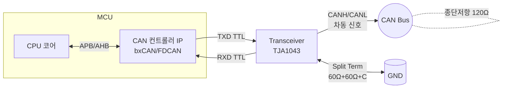
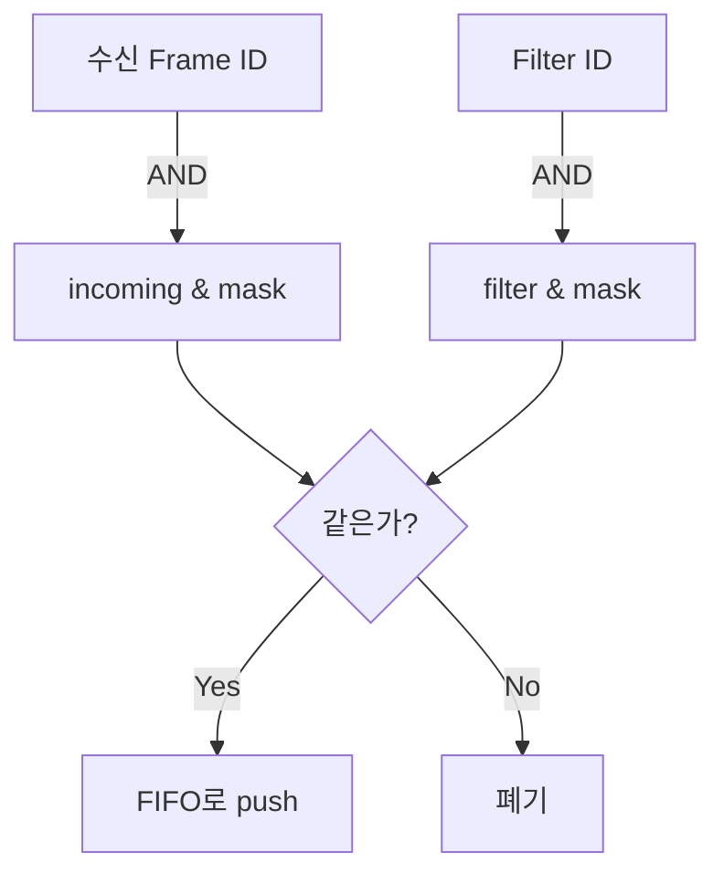

# CH11. 컨트롤러·트랜시버

::: info 학습 목표
- CAN 노드의 <strong>블록 구조</strong>(MCU 코어 / CAN 컨트롤러 IP / 트랜시버 / 버스)를 경계 신호 관점에서 구분한다.
- STM32 bxCAN, FDCAN, MCP2515의 <strong>메일박스·FIFO·Message RAM 구조</strong> 차이를 이해한다.
- TJA1043·TJA1042·TCAN1042HGV 등 주류 트랜시버의 mode와 <strong>Partial Networking(PN)</strong> 동작을 정리한다.
- 필터와 마스크를 <strong>비트 연산</strong>으로 직접 계산해 원하는 ID 집합만 받는 설정을 도출한다.
- 실제 배선에서 EMC 관점의 split termination, 공통 모드 초크(CMC), TVS를 어디에 배치하는지 파악한다.
:::

CAN은 하나의 프로토콜이지만, 실제 보드에는 이 프로토콜을 책임지는 부품이 여러 층으로 나뉘어 있다. 각 층은 서로 다른 회사·서로 다른 인터페이스 규격으로 이어지므로, 설계자는 <strong>어느 기능이 어느 부품에 있는지</strong>를 늘 의식해야 한다. 특히 "필터가 안 먹는 것 같다"는 식의 문제가 발생했을 때 범인이 컨트롤러의 필터 설정인지, 트랜시버의 수신 기능인지, 아니면 배선의 반사인지 구분하지 못하면 디버깅이 길어진다. 이 장은 그 구분을 명확하게 두는 것을 우선 목표로 한다.

CAN 노드 하나를 만든다고 가정하자. MCU에서 `send_frame()` 함수를 호출했을 때 그 한 번의 API가 실제로는 세 번의 경계를 넘는다. 첫째, CPU 코어가 <strong>메일박스 레지스터</strong>에 프레임을 적재하는 내부 버스 경계. 둘째, 컨트롤러 IP가 TTL 레벨 TXD/RXD로 <strong>트랜시버</strong>에 신호를 넘기는 보드 레벨 경계. 셋째, 트랜시버가 CANH/CANL <strong>차동 전압</strong>으로 바꿔 버스로 내보내는 전기 경계. 이 장에서는 이 세 경계 각각에서 어떤 부품이, 어떤 역할을 하며, 우리가 코드와 회로로 무엇을 결정해야 하는지 해부한다.

## 1. 블록 구조



- <strong>CPU</strong>는 프로토콜을 모른다. 레지스터 쓰기/읽기와 ISR만 담당한다. 즉 소프트웨어 관점에서 "프레임을 보낸다"는 것은 <strong>메일박스 레지스터에 헤더와 데이터를 써 넣고 TX 요청 비트를 올리는 일</strong>이 전부다.
- <strong>컨트롤러 IP</strong>가 프로토콜 엔진이다. 프레임 조립, 비트 스터핑, CRC, 중재, ACK 검사, 에러 카운터(TEC/REC) 전부 하드웨어로 돌아간다. 이 덕분에 CPU가 프레임당 수백 비트의 세밀한 타이밍을 따라갈 필요가 없다.
- <strong>트랜시버</strong>는 TTL 논리 신호를 <strong>차동 전압</strong>으로 바꾸는 아날로그 front-end다. dominant일 때 CANH≈3.5V / CANL≈1.5V, recessive일 때 둘 다 ≈2.5V 부근으로 떠 있다. 즉 VDIFF = CANH - CANL이 2V 이상이면 dominant, 0V 부근이면 recessive로 해석된다.
- 버스 양 끝에 <strong>120Ω 종단저항</strong>이 한 쌍 걸려 60Ω의 실효 임피던스를 만든다. 이 저항이 없거나 잘못된 위치에 있으면 반사파가 돌아와 eye diagram이 좁아지고, 그 결과는 stuff error·CRC error로 나타난다. (CH1·CH2에서 파형 관점으로 다뤘다.)

즉 우리가 드라이버로 다루는 것은 <strong>CPU ↔ 컨트롤러 IP</strong> 경계뿐이고, <strong>IP ↔ 트랜시버</strong> 경계는 PCB와 부품 선택으로, <strong>트랜시버 ↔ 버스</strong> 경계는 배선과 종단으로 다룬다. 한 경계라도 실수하면 동작이 안 되므로 세 층을 함께 머릿속에 두는 습관이 필요하다.

## 2. 컨트롤러 종류

| 구분 | 종류 | 특징 |
|------|------|------|
| <strong>내장형 (MCU IP)</strong> | STM32 bxCAN(F1/F4), FDCAN(G4/H7/U5) | ST 계열 대표, CAN 2.0B 또는 FD |
| | SAME5x MCAN (Bosch M_CAN) | Bosch IP, FD/TDC 지원 |
| | NXP FlexCAN | i.MX·S32K, 여러 채널 |
| | ESP32 TWAI | Espressif SoC, CAN 2.0B |
| <strong>외장형 (SPI)</strong> | Microchip MCP2515 | Classical CAN, 가장 널리 쓰임 |
| | Microchip MCP2517FD/MCP2518FD | CAN FD |
| | NXP TJA1055 | LS-CAN 전용 |

외장형은 SPI로 통신한다. SPI clock이 병목이라 <strong>고속 버스(≥500 kbps)</strong>에서는 인터럽트 큐잉이 빠듯해 내장형이 유리하다. 예를 들어 MCP2515가 10 MHz SPI로 동작할 때, 프레임 한 개를 읽어오려면 헤더 포함 대략 14~17바이트의 SPI 전송이 필요하다. 500 kbps 버스에서 100% 부하가 걸리면 초당 약 4,000 프레임이 오가는데, SPI 지연과 ISR 진입 오버헤드가 쌓이면 프레임 누락이 시작된다. 반대로 기존 MCU에 CAN이 없을 때나 채널 수를 유연하게 늘릴 때는 외장형이 해답이다. 또한 <strong>갈바닉 절연</strong>이 필요한 산업용 구성에서는 외장 IC + 디지털 아이솔레이터 조합이 설계상 깔끔하다.

선택 기준을 정리하면 다음과 같다.

- 속도 1 Mbps 이상 또는 CAN FD → <strong>내장 FDCAN</strong>이 1순위.
- 기존 MCU 유지 + 채널 추가 → <strong>MCP2515/MCP2518FD</strong>.
- 다채널(4채널 이상) 산업용 게이트웨이 → <strong>NXP FlexCAN 탑재 MCU</strong>.
- 저가 IoT · 취미용 → <strong>ESP32 TWAI</strong> 또는 STM32 F1.

## 3. bxCAN (STM32 F1/F4) 구조

STM32 F 시리즈의 클래식 CAN IP는 다음 구조다.

- <strong>Tx mailbox 3개</strong> — 동시에 세 프레임까지 pending 가능. 우선순위는 (1) ID 값, (2) 전송 요청 순서 두 모드 중 설정. CAN 규격상 낮은 ID가 우선이므로 (1)을 고르면 버스 중재와 내부 우선순위가 자연스럽게 일치한다.
- <strong>Rx FIFO 2개(FIFO0/FIFO1)</strong> — 각 FIFO는 <strong>4 스테이지 깊이</strong>. 필터가 각 FIFO로 라우팅한다. 높은 우선순위 메시지를 FIFO0에, 나머지를 FIFO1에 몰아 넣어 서로 다른 ISR 우선순위를 주는 식으로 운용 가능하다.
- <strong>Filter bank 14~28개</strong> — 32-bit 단일, 16-bit 이중, list mode/mask mode 모두 지원. 듀얼 CAN(F105/F107 등) 칩에서는 필터 뱅크를 CAN1/CAN2가 나눠 쓰며, 경계는 <code>SlaveStartFilterBank</code>로 정한다.
- <strong>Time triggered</strong> 옵션 — 특정 시점에 자동 송신하는 TTCAN 기반 기능. 일반적인 이벤트 기반 애플리케이션에선 거의 쓰이지 않지만, 차량 backbone에서 엄격한 스케줄이 필요할 때 사용한다.

```c
// bxCAN 필터 설정 예시
CAN_FilterTypeDef f = {
    .FilterBank = 0,
    .FilterMode = CAN_FILTERMODE_IDMASK,
    .FilterScale = CAN_FILTERSCALE_32BIT,
    .FilterIdHigh     = 0x0123 << 5,   // 11-bit ID를 상위로 밀기
    .FilterIdLow      = 0x0000,
    .FilterMaskIdHigh = 0x07F0 << 5,   // 상위 7bit만 검사
    .FilterMaskIdLow  = 0x0000,
    .FilterFIFOAssignment = CAN_FILTER_FIFO0,
    .FilterActivation = ENABLE,
};
HAL_CAN_ConfigFilter(&hcan1, &f);
```

## 4. FDCAN (STM32 G4/H7/U5) 구조

Bosch M_CAN IP를 채용한 FDCAN은 bxCAN과 완전히 다른 구조다.

- <strong>Message RAM</strong>이라는 단일 SRAM 영역을 <strong>사용자가 직접 배치</strong>한다. Standard/Extended Filter, Rx FIFO0/FIFO1, Rx dedicated buffer, Tx Event FIFO, Tx FIFO/Queue, Tx buffer를 오프셋으로 할당한다.
- <strong>Tx FIFO / Tx Queue</strong> 모드 선택. FIFO는 순서 보장, Queue는 ID 우선순위.
- <strong>Standard/Extended Filter element</strong>가 구조체로 표현된다. 각 element는 type(range/dual/classic), FIFO 대상, 우선순위를 필드로 가진다.
- <strong>TDC(Transmitter Delay Compensation)</strong>가 있어 FD 고속 데이터 구간에서 transceiver loop delay를 보상한다. 1 Mbps까지는 선택 사항이지만, 2 Mbps 이상에서는 사실상 필수다.
- <strong>Filter priority</strong>를 각 element마다 설정할 수 있다. 급한 제어 메시지와 진단 메시지를 같은 FIFO에 받되 우선 처리를 명시하는 식으로 활용한다.

::: warning Message RAM 할당 실수
FDCAN에서 가장 흔한 실수가 Message RAM 오프셋 계산을 잘못해 Rx FIFO와 Filter element가 <strong>겹치는 경우</strong>다. HAL 함수 <code>HAL_FDCAN_ConfigGlobalFilter</code>, <code>HAL_FDCAN_ConfigFilter</code>, <code>HAL_FDCAN_ConfigFifoWatermark</code>를 초기화 순서에 맞춰 호출하고, <code>hfdcan.Init.StdFiltersNbr</code> 같은 개수 필드를 합쳐 RAM 용량(보통 2.5KB)을 넘지 않는지 확인한다.
:::

### bxCAN 송수신 경로

bxCAN에서 송신은 <strong>세 개의 Tx mailbox</strong> 어디에 들어갔든 버스 중재 로직이 가장 낮은 ID를 고르거나(기본) 요청 순서대로(FIFO) 고른다. 그 결정은 하드웨어가 하지만, 우리가 고려해야 할 점은 "mailbox가 가득 차면 어떻게 할 것인가"다. HAL_BUSY를 받은 순간 드라이버는 재시도를 해야 하고, 재시도 지연이 길어지면 <strong>응답 시간 분석(CH10)</strong>에서 잡은 worst-case가 깨진다.

수신 쪽은 프레임이 들어오면 필터 뱅크를 순차적으로 검사해 매치되는 첫 번째 필터가 지정한 FIFO로 들어간다. 필터 매치가 없으면 <strong>폐기</strong>된다. FIFO에 공간이 없으면 <strong>Rx FIFO overrun</strong> 플래그가 올라가고 해당 프레임은 버려진다. Lock 모드 두 가지 중 "새 프레임으로 덮어쓰기"를 고르면 구버전이 사라지고, "Lock 모드"면 신버전이 버려진다. 안전 시스템에선 후자가 의미 있지만, 측정용 레코더에선 전자가 유리하다.

## 5. MCP2515 구조

외장 SPI CAN 컨트롤러의 대표. Classical CAN만 지원한다.

- <strong>3 Tx buffer (TXB0~TXB2)</strong> — 각각 priority 필드 2bit를 가진다.
- <strong>2 Rx buffer (RXB0, RXB1)</strong>과 각 버퍼에 대한 <strong>MASK/FILTER</strong>:
  - RXB0: MASK0 + FILTER0/1
  - RXB1: MASK1 + FILTER2/3/4/5
- <strong>INT 핀</strong>이 MCU 외부 인터럽트에 연결된다. Rx, Tx, ERR 각각의 원인 비트(CANINTF)를 읽어 구분한다.
- SPI command: <code>RESET</code>, <code>READ(0x03)</code>, <code>WRITE(0x02)</code>, <code>RTS(0x8x)</code>, <code>READ STATUS(0xA0)</code>, <code>BIT MODIFY(0x05)</code>.

```c
// MCP2515 필터 설정 의사코드
mcp_write(RXM0SIDH, (mask >> 3) & 0xFF);
mcp_write(RXM0SIDL, (mask << 5) & 0xE0);
mcp_write(RXF0SIDH, (filter >> 3) & 0xFF);
mcp_write(RXF0SIDL, (filter << 5) & 0xE0);
```

MCP2515는 <strong>1 Mbps에서 불안정</strong>하다는 악명이 있다. 원인은 내부 로직과 SPI 인터페이스의 구조적 한계다. 500 kbps 이하에서는 견고하게 동작하지만, 1 Mbps에서 스트레스 테스트를 돌리면 errata 항목에 명시된 대로 간헐적 수신 누락이나 양방향 송수신 시 ACK 이슈가 관찰된다. 이 때문에 1 Mbps 이상의 안정 운용이 필요하면 <strong>MCP2517FD/MCP2518FD</strong> 같은 CAN FD 칩으로 이동하거나, 애초에 내장형 MCU를 쓰는 편이 낫다.

## 6. 트랜시버

| 모델 | 특징 | 주요 mode |
|------|------|-----------|
| TJA1043 | PN 미지원, HS 트랜시버 기본기 | Normal / Listen-only / Standby / Go-to-sleep |
| TJA1042 | 저전력, 5V I/O | Normal / Standby |
| TCAN1042HGV | TI, 갈바닉 절연 버전 있음 | Normal / Silent |
| TJA1145 | <strong>Partial Networking 지원</strong> | Normal / Standby / Sleep / PN active |

트랜시버는 드라이버 관점에서는 거의 보이지 않는 부품처럼 느껴지지만, 실제로는 소비 전류·EMI·ESD 내성·wake-up 동작 같은 시스템 특성의 상당 부분을 좌우한다. 제품에 따라 Normal 모드 전류가 5mA 수준인 것과 10mA 이상인 것이 나뉘고, 대기 전류도 μA 단위에서 큰 차이가 난다. 차량·농기계처럼 시동 OFF 상태에서 수 일간 배터리에 걸려 있는 환경에서는 <strong>대기 전류가 그대로 암전류</strong>로 이어지므로 신중히 고른다.

트랜시버가 제공하는 공통 기능.

- <strong>Slew-rate control</strong> — 스위칭 기울기를 완만히 해서 EMI를 줄이는 옵션. Low-speed 모드나 전용 핀으로 조절.
- <strong>Silent / Listen-only mode</strong> — TXD를 버스로 내보내지 않고 수신만. 진단 툴에서 버스 관측할 때 쓴다.
- <strong>Standby/Sleep</strong> — 소비 전류 수십 µA 수준. 버스에 wake-up pulse가 들어오면 깨어난다.
- <strong>Wake-up detection</strong> — 로컬(핀 에지)과 원격(버스 신호) 두 방식.
- <strong>TxD dominant timeout</strong> — MCU가 죽어 TXD를 dominant로 붙잡고 있어도 일정 시간 후 트랜시버가 강제로 recessive로 돌려 버스를 보호한다.
- <strong>Undervoltage lockout (UVLO)</strong> — VCC가 규격 이하로 떨어지면 출력을 recessive로 고정해 오동작 프레임을 버스에 흘리지 않는다.
- <strong>Split pin (VSPLIT)</strong> — split termination의 가운데 탭을 제공해 공통 모드를 바로 바이패스하게 돕는다.
- <strong>Thermal shutdown</strong> — 칩 온도가 임계치를 넘으면 출력을 비활성화해 스스로를 보호한다. 단락 상태가 지속될 때 칩을 살린다.

## 7. Partial Networking 트랜시버

TJA1145 같은 PN 트랜시버는 스스로 <strong>CAN 프레임을 해석</strong>할 수 있는 최소 로직을 내장한다. MCU가 꺼진 상태에서도 트랜시버가 버스를 관측하다가 <strong>미리 설정된 ID와 페이로드 패턴</strong>(wake-up frame)을 보면 INH 핀을 띄워 MCU·LDO를 깨운다.

- 평상시 ECU는 <strong>Sleep</strong> 상태로 수 µA만 소비.
- 네트워크 매니저가 특정 ECU만 깨우고 싶을 때 <strong>해당 ECU의 wake 프레임</strong>만 송신.
- 다른 ECU들은 패턴이 안 맞으니 계속 Sleep → 연료 절감, 배터리 보존.

PN이 매력적인 이유는 <strong>네트워크 토폴로지를 바꾸지 않고</strong> 배터리 소모와 EMC를 함께 개선한다는 점이다. 기존 CAN 배선을 그대로 두고 트랜시버만 교체하고, ECU 상위의 CanTrcv 드라이버 설정만 고치면 된다. 다만 wake 프레임의 ID·DLC·데이터 패턴을 <strong>차량 전체에서 관리</strong>해야 하므로 네트워크 설계 단계에서 매트릭스를 잡아두지 않으면 유지보수가 금세 꼬인다.

PN 트랜시버는 SPI 또는 I2C로 MCU와 통신해 wake 패턴을 주입받는다. 주입 타이밍은 MCU가 sleep 진입 직전이며, 한 번 주입된 패턴은 트랜시버 내부 레지스터에 저장되어 MCU 전원이 꺼져도 유지된다. 덕분에 MCU는 완전히 전원을 내릴 수 있고, 트랜시버는 버스를 지속 감시하면서 초저전력(수 µA)을 유지한다.

::: tip AUTOSAR와의 연관
AUTOSAR의 <strong>Partial Networking(PN)</strong>은 COM·Nm·CanNm·CanSM·CanIf·CanTrcv 모듈이 협력한다. 하드웨어 PN 트랜시버는 이 중 <strong>CanTrcv</strong> 드라이버가 직접 제어하고, wake-up/sleep 전환 조건은 NM 상위 계층이 결정한다. (CH17 참조)
:::

## 8. 필터·마스크 수학

CAN 수신 필터는 <strong>비트 연산식 하나</strong>로 요약된다.

<div class="formula">
수신 수락 조건: (incoming_ID & mask) == (filter & mask)
</div>

- <strong>mask의 각 비트가 1</strong>이면 그 자리를 비교한다.
- <strong>mask의 각 비트가 0</strong>이면 그 자리는 don't care — 어떤 값이든 통과.

### 예시

`mask = 0x7F0`, `filter = 0x1A0`를 설정하면 하위 4비트가 don't care가 된다. 즉 `0x1A0 ~ 0x1AF` 16개 ID가 모두 통과한다. 특정 컴포넌트의 여러 서브 메시지를 하나의 필터로 묶을 때 유용하다.

반대로 `mask = 0x7FF`, `filter = 0x123`이면 정확히 `0x123`만 받는다. 이를 <strong>정확 일치 모드(List mode)</strong>로 별도 구분하는 컨트롤러도 있다.



필터는 두 가지 실수 유형이 흔하다. 하나는 <strong>마스크와 필터의 역할을 헷갈려</strong> don't care를 반대로 적는 경우, 다른 하나는 <strong>extended ID 패킹</strong>에서 비트 위치를 잘못 잡는 경우다. 첫 번째는 시뮬레이터에서 즉시 드러나지만 두 번째는 특정 ID에서만 재현되어 디버깅이 길어진다. 그래서 실무에서는 필터 테이블을 정의한 헤더 파일을 만들고, 마스크 계산을 매크로로 자동화해 각 ECU 간 설정을 통일한다.

필터·마스크 계산은 단순해 보이지만, 실제 차량 네트워크 설계에서는 수십~수백 개의 ID를 <strong>제한된 필터 뱅크</strong>에 효율적으로 매핑해야 해서 비트 관점의 사고가 필요하다. 특히 ID 체계를 설계할 때 <strong>앞부분 비트에 기능 카테고리</strong>를 넣고 뒷부분 비트에 인스턴스 번호를 넣는 식으로 구조화하면, 하나의 필터로 같은 카테고리 메시지 전부를 걸 수 있어 효율이 높다.

실전 예를 하나 더 보자. 차량 내 <strong>브레이크 제어 ECU</strong>가 받아야 할 메시지가 다음과 같다고 가정하자.

- `0x100` — 휠속도 전체 (10ms 주기)
- `0x101` — 휠속도 좌/우 (10ms)
- `0x102` — 휠속도 전/후 (10ms)
- `0x103` — ABS 상태 (20ms)
- `0x200` — ESC 명령 (50ms)
- `0x7DF` — OBD 요청 (이벤트)
- `0x7E0` — UDS 요청 (이벤트)

앞의 네 개 `0x100~0x103`은 마스크 `0x7FC`, 필터 `0x100`으로 묶는다(하위 2bit don't care). `0x200`은 정확 일치. `0x7DF`·`0x7E0`은 마스크 `0x7FE`, 필터 `0x7DE`. 이렇게 하면 <strong>7개 메시지를 3개의 필터 엔트리로</strong> 커버하며, 필터 뱅크를 절약해 다른 기능에 쓸 수 있다. 필터 최적화는 CAN 설계에서 자주 과소평가되지만, ECU 리소스가 빠듯한 embedded 환경에서는 매우 중요하다.

반대로 필터를 너무 넓게 잡아 <strong>불필요한 프레임까지 수신</strong>하면 CPU가 ID 판별 로직에 시간을 낭비한다. 필터는 "하드웨어에 맡길 수 있는 필터링"과 "소프트웨어가 감당할 판별" 사이에서 균형을 맞추는 도구다. 하드웨어 필터 뱅크가 모자라면 일부 판별을 소프트웨어로 옮기는 것이 현명할 수 있다.

### Standard vs Extended

11-bit ID와 29-bit ID는 레지스터 배치가 다르다. bxCAN에선 32-bit 필터 레지스터에 <code>STDID[10:0] | IDE | RTR | EXTID[17:0]</code> 순서로 패킹해야 한다. 실수하기 쉬운 부분이라 HAL 함수의 shift 값을 반드시 확인한다. FDCAN에선 Standard Filter Element(S0)와 Extended Filter Element(F0/F1)가 별도 구조체이므로 한쪽에만 등록하면 다른 종류 ID는 필터링에 걸리지 않고 전부 통과 혹은 전부 폐기된다.

## 9. 배선과 EMC

컨트롤러·트랜시버 선택만큼 회로 패턴도 중요하다.

- <strong>Twisted pair</strong> — CANH/CANL은 반드시 꼬아 배선. 공통 모드 noise가 같은 방향으로 실려 차동에서 상쇄된다.
- <strong>Split termination</strong> — 60Ω + 60Ω + <strong>가운데 소형 커패시터(4.7~10nF)를 GND로 bypass</strong>. 공통 모드를 흡수해 EMI를 크게 줄인다.
- <strong>CMC(Common Mode Choke)</strong> — CANH/CANL 두 라인을 같은 방향으로 감아 차동 신호는 통과, 공통 모드는 블록. 고노이즈 환경(트랙터 엔진룸 등)에 필수.
- <strong>TVS 다이오드</strong> — ESD/load dump를 흡수. CANH-GND, CANL-GND 각각 또는 CANH-CANL 간 배치. 자동차용은 보통 24V·27V 트리거 TVS.
- <strong>스터브 길이</strong> — 노드 탭 선은 30cm 이내, 전체 버스의 10% 이하. (CH1 참조)
- <strong>접지 전략</strong> — 트랜시버 GND는 노이즈가 심한 파워 GND에서 스타 접지 방식으로 분리한다. PCB 단일 그라운드 플레인을 쓰되 고전류 리턴 경로와 트랜시버 GND가 겹치지 않게 배치한다.
- <strong>EMI 필터</strong> — 트랜시버와 커넥터 사이에 <strong>CMC + TVS</strong> 순으로 배치하고, CMC 이전에 <strong>VSPLIT 바이패스 커패시터</strong>를 둔다. 순서가 바뀌면 TVS가 CMC 뒤에서 ESD 에너지를 제대로 흡수하지 못한다.

::: warning 회로 리뷰 체크리스트
- 종단저항 120Ω × 2개만 있는가? 중간에 추가 120Ω이 들어가면 60Ω이 30Ω이 되어 드라이버가 과부하 받는다.
- 트랜시버 VCC에 디커플링 100nF + 10µF가 가까이 배치됐는가?
- TxD dominant timeout이 버스 idle 시간보다 긴가? (보통 수 ms)
- PN 트랜시버를 쓸 때 MCU sleep 진입 전 CanTrcv 상태 전환 시퀀스를 지켰는가?
:::

## 10. 부품 선택 체크리스트

실무에서 CAN 노드 BOM을 정할 때 쓸 체크리스트.

- <strong>비트레이트와 프로토콜</strong> — CAN 2.0 250/500 kbps면 거의 모든 컨트롤러가 가능하지만, FD 2~5 Mbps가 목표면 TDC 지원 IP가 필요하다.
- <strong>채널 수</strong> — 2채널 이상이면 FDCAN 듀얼 내장 MCU(G4, H7) 또는 외장 다중 IC를 검토한다.
- <strong>소비 전력</strong> — Sleep 시 요구 전류가 50 µA 이하면 PN 트랜시버가 거의 필수.
- <strong>EMC 등급</strong> — 자동차 IEC 61000-4-x 통과 인증을 받으려면 CMC + TVS + split termination 풀 구성이 사실상 표준.
- <strong>절연 여부</strong> — 산업 장비에서 그라운드 루프가 문제면 갈바닉 절연형 트랜시버(ISO1050 등) 또는 디지털 아이솔레이터 + 일반 트랜시버 조합.
- <strong>유지 가능성</strong> — 제조사 장기 공급 정책(Last Time Buy 일정)을 BOM에 반영. 자동차 ECU는 10년 이상 동일 부품 공급이 필요할 수 있다.

한 번 결정한 부품은 <strong>수년간 같이 간다</strong>는 점을 염두에 두고, 초기 비용뿐 아니라 유지보수·인증 비용까지 종합적으로 평가한다.

## 다음 챕터

다음은 [CH12. MCU 드라이버](/study/can/12-mcu-driver)다. 이 장에서 구조로 본 bxCAN/FDCAN을 실제로 <strong>초기화·송신·ISR·에러 처리</strong>까지 코드로 내려서, 동작하는 드라이버 골격을 C로 완성한다.

::: tip 핵심 정리
- CAN 노드는 <strong>CPU ↔ 컨트롤러 IP ↔ 트랜시버 ↔ 버스</strong> 네 단계로 구성된다.
- bxCAN은 3 Tx mailbox / 2 Rx FIFO / 14 filter bank, FDCAN은 <strong>Message RAM을 직접 배치</strong>한다.
- MCP2515는 SPI 외장형으로 MASK+FILTER 세트가 RXB0(2개), RXB1(4개)에 붙는다.
- <strong>필터 매치 식</strong>: <code>(incoming_ID & mask) == (filter & mask)</code>. mask의 0 비트는 don't care.
- TJA1145 같은 <strong>PN 트랜시버</strong>는 MCU가 잠든 상태에서 wake-up 프레임을 자체 파싱해 ECU를 깨운다.
- 회로는 <strong>twisted pair + split termination + CMC + TVS</strong> 조합이 기본이다.
:::
