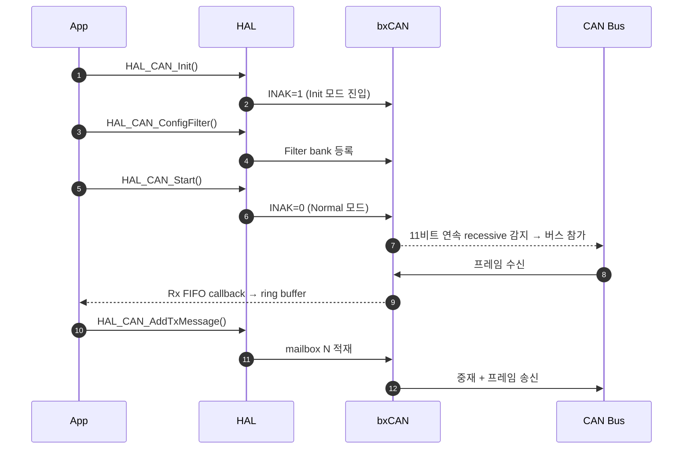
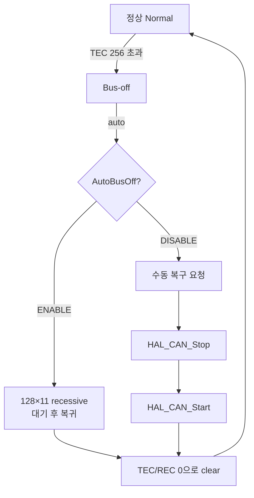

# CH12. MCU 드라이버 구현

::: info 학습 목표
- STM32 bxCAN/FDCAN의 <strong>초기화 흐름</strong>(클럭 → GPIO → 타이밍 → 필터 → Start)을 코드로 구성한다.
- <strong>송신 API</strong>의 mailbox 할당·busy 처리와 <strong>ISR 기반 수신</strong>의 ring buffer 패턴을 익힌다.
- <strong>에러 콜백</strong>에서 ESR을 해석해 TEC/REC·bus-off를 감지하고 복구 로직을 짠다.
- Polling vs Interrupt, RTOS vs Bare-metal에서의 <strong>동시성 고려</strong>를 실전 수준으로 정리한다.
- FDCAN 고유 항목(Message RAM 배치, FrameFormat, TDC)을 드라이버 관점에서 다룬다.
:::

CH11에서 본 컨트롤러 블록을 이 장에서는 직접 <strong>움직이는 코드</strong>로 바꾼다. 목표는 "특정 ID를 받으면 링 버퍼에 쌓고, 주기적으로 몇 개 ID를 송신하며, bus-off가 나면 스스로 복구"하는 드라이버 골격을 STM32 HAL 기준으로 완성하는 것이다. 예제는 bxCAN(F4) 기반이며, FDCAN(G4) 차이는 끝에 별도로 다룬다. HAL API를 베이스로 하지만, 레지스터 수준의 이해가 필요한 지점에서는 <code>hcan1.Instance->...</code> 방식으로 직접 접근하는 예시도 함께 보인다.

드라이버를 설계할 때는 <strong>세 가지 층</strong>을 분리하는 것이 깨끗하다. 첫째, <strong>HAL 래퍼 층</strong>에서 레지스터와 직접 씨름한다. 둘째, <strong>큐/버퍼 층</strong>에서 ring buffer와 mutex로 동시성을 정리한다. 셋째, <strong>애플리케이션 디스패치 층</strong>에서 ID별 콜백을 부른다. 이 경계를 명확히 하면 FDCAN으로 마이그레이션할 때 첫 층만 바꾸면 된다.

드라이버가 반드시 제공해야 할 API를 네 개로 축약하면 다음과 같다.

- <code>can_init(uint32_t bitrate)</code> — 주파수·필터·NVIC 설정 후 Start.
- <code>can_send(id, data, len)</code> — 송신 큐에 enqueue, mailbox 자동 관리.
- <code>can_recv(out_id, out_data, out_len)</code> — ring buffer에서 pop.
- <code>can_register_rx(uint32_t id, rx_cb_t cb)</code> — ID별 콜백 등록.

이 네 개가 갖춰지면 상위 애플리케이션은 HAL API를 전혀 보지 않고도 CAN을 쓸 수 있다. 이식성을 고려한다면 이 네 함수의 시그니처를 <strong>헤더 파일에 고정</strong>하고, 내부 구현만 bxCAN·FDCAN·MCP2515에 맞춰 교체한다.

## 0. 드라이버 레이어링

MCU 드라이버를 설계할 때는 기능 단위로 파일을 나누고, 각 파일 간 의존 관계를 단방향으로 유지한다. 예시.

- <code>can_bsp.c</code> — 클럭·GPIO·NVIC 등 보드 의존 부분. MCU 변경 시 여기만 손 본다.
- <code>can_hal.c</code> — bxCAN 레지스터 래핑. Send/Recv/필터/에러 함수.
- <code>can_queue.c</code> — ring buffer와 송신 큐.
- <code>can_dispatch.c</code> — ID→콜백 테이블 관리.
- <code>can_app.c</code> — 상위 애플리케이션 로직.

이 구조는 ISO 26262 기능 안전 프로젝트에서 <strong>테스트 가능성</strong>을 확보하기 위해서도 권장된다. 각 층을 단위 테스트로 따로 검증할 수 있고, 문제 발생 시 어느 층인지 빠르게 좁혀진다.

## 1. 초기화 흐름



초기화는 반드시 이 순서를 지킨다. 특히 <strong>필터를 Start 전에 enable</strong>해야 한다. 순서를 바꾸면 Start 직후 들어온 프레임이 버려진다. 또한 Start는 <strong>버스 상에 11비트 연속 recessive</strong>가 관측되어야 Normal로 전환되는데, 다른 노드가 계속 송신 중이면 정상 동작이고 트랜시버가 연결되지 않은 경우(전원 미공급 등)에는 영원히 Init에 머무른다. 이때 앱이 무한 대기하지 않도록 timeout을 반드시 둔다.

클럭 구성에서 흔한 실수 하나. STM32 F4에서 bxCAN은 <strong>APB1 클럭</strong>에 걸려 있다. APB1이 42MHz면 CAN 클럭도 42MHz다. CubeMX에서 시스템 클럭을 변경한 뒤 BRP·TSEG를 재계산하지 않으면 버스 타이밍이 어긋난다. 반대로 FDCAN은 별도의 <strong>FDCAN kernel clock</strong> 소스를 RCC에서 고를 수 있어, 비트레이트에 맞게 80MHz·120MHz 등으로 설정할 수 있다.

```c
static CAN_HandleTypeDef hcan1;

static void CAN1_Init(void) {
    hcan1.Instance = CAN1;
    hcan1.Init.Prescaler = 10;        // f_CAN=80MHz → TQ=125ns
    hcan1.Init.Mode = CAN_MODE_NORMAL;
    hcan1.Init.SyncJumpWidth = CAN_SJW_3TQ;
    hcan1.Init.TimeSeg1 = CAN_BS1_12TQ;   // Prop+P1
    hcan1.Init.TimeSeg2 = CAN_BS2_3TQ;    // P2  → SP ≈ 81%
    hcan1.Init.TimeTriggeredMode = DISABLE;
    hcan1.Init.AutoBusOff = ENABLE;       // bus-off 자동 복구
    hcan1.Init.AutoWakeUp = DISABLE;
    hcan1.Init.AutoRetransmission = ENABLE;
    hcan1.Init.ReceiveFifoLocked = DISABLE;
    hcan1.Init.TransmitFifoPriority = DISABLE; // ID 우선순위 모드

    if (HAL_CAN_Init(&hcan1) != HAL_OK) Error_Handler();

    CAN_FilterTypeDef f = {
        .FilterBank = 0,
        .FilterMode = CAN_FILTERMODE_IDMASK,
        .FilterScale = CAN_FILTERSCALE_32BIT,
        .FilterIdHigh = 0x0100 << 5,
        .FilterIdLow = 0,
        .FilterMaskIdHigh = 0x0700 << 5,   // 상위 3bit만 일치 검사
        .FilterMaskIdLow = 0,
        .FilterFIFOAssignment = CAN_FILTER_FIFO0,
        .FilterActivation = ENABLE,
        .SlaveStartFilterBank = 14,
    };
    HAL_CAN_ConfigFilter(&hcan1, &f);

    HAL_CAN_ActivateNotification(&hcan1,
        CAN_IT_RX_FIFO0_MSG_PENDING |
        CAN_IT_TX_MAILBOX_EMPTY |
        CAN_IT_ERROR | CAN_IT_BUSOFF |
        CAN_IT_ERROR_WARNING | CAN_IT_ERROR_PASSIVE);

    HAL_CAN_Start(&hcan1);
}
```

### 초기화 지연 함정

실무에서 자주 나오는 문제가 "보드가 막 켜졌을 때 첫 번째 송신이 실패한다"는 증상이다. 원인은 대부분 <strong>트랜시버의 standby → normal 전환 지연</strong>이다. 트랜시버 STB 핀을 normal로 띄운 후에도 내부적으로 수십 µs~ms의 전환 시간이 필요한데, MCU가 이를 무시하고 즉시 can_send를 호출하면 프레임이 버스로 나가지 못한다. 해결책은 (1) 트랜시버 데이터시트에 명시된 `t_sby_nrm` 이상 대기, (2) 첫 전송은 loopback 모드에서 자기 검증 후 normal로 전환, (3) 첫 전송 실패에 대한 관대한 재시도 로직 두기.

또 하나는 <strong>전원 안정화</strong>다. 차량 12V 전원이 크래킹으로 흔들리는 동안 MCU가 재부팅되면 트랜시버가 아직 충분한 VCC를 받지 못한 상태일 수 있다. Power-Good 신호를 감시하거나, <strong>수 십 ms 초기 지연</strong>을 둬서 안정화를 기다리는 패턴이 권장된다.

## 2. 송신 구현

Tx mailbox는 3개다. 세 슬롯이 모두 pending이면 <code>HAL_BUSY</code>가 반환된다. 실무에선 별도 송신 큐를 두고, mailbox가 비면 큐에서 pop해 채우는 패턴을 쓴다.

```c
HAL_StatusTypeDef can_send(uint32_t id, const uint8_t *data, uint8_t len) {
    CAN_TxHeaderTypeDef tx = {
        .StdId = id,
        .ExtId = 0,
        .IDE = CAN_ID_STD,
        .RTR = CAN_RTR_DATA,
        .DLC = len,
        .TransmitGlobalTime = DISABLE,
    };
    uint32_t mailbox;
    return HAL_CAN_AddTxMessage(&hcan1, &tx, (uint8_t*)data, &mailbox);
}
```

<strong>우선순위 정책</strong>은 <code>TransmitFifoPriority</code>로 고른다.

- <code>DISABLE</code>(기본): <strong>ID가 작은 프레임이 먼저</strong>. 버스 중재 규칙과 일치해 자연스럽지만, 저우선 프레임이 굶을 수 있다.
- <code>ENABLE</code>: <strong>요청 순서대로(FIFO)</strong>. 순서가 중요한 주기 메시지에 유용.

실무에서는 <strong>애플리케이션 레벨 송신 큐</strong>를 하나 더 두고, TX mailbox empty 인터럽트에서 큐를 pop해 mailbox에 채우는 구조가 편하다. 이 구조라면 CPU는 큐에 push만 하면 되고 HAL_BUSY를 직접 다룰 필요가 없다.

```c
static volatile tx_msg_t tx_queue[64];
static volatile uint16_t tx_head, tx_tail;

void HAL_CAN_TxMailbox0CompleteCallback(CAN_HandleTypeDef *h) { refill_tx(h); }
void HAL_CAN_TxMailbox1CompleteCallback(CAN_HandleTypeDef *h) { refill_tx(h); }
void HAL_CAN_TxMailbox2CompleteCallback(CAN_HandleTypeDef *h) { refill_tx(h); }

static void refill_tx(CAN_HandleTypeDef *h) {
    if (tx_head == tx_tail) return;
    tx_msg_t m = tx_queue[tx_tail];
    CAN_TxHeaderTypeDef th = { .StdId=m.id, .IDE=CAN_ID_STD,
                               .RTR=CAN_RTR_DATA, .DLC=m.len };
    uint32_t mb;
    if (HAL_CAN_AddTxMessage(h, &th, m.data, &mb) == HAL_OK) {
        tx_tail = (tx_tail + 1) % 64;
    }
}
```

## 3. 수신 구현 — ISR 기반

수신은 <strong>ISR → ring buffer → main loop</strong> 패턴이 표준이다. ISR 안에서는 최소한의 일만 한다. 복잡한 디코딩·로깅·RTOS queue 여러 단 전달 같은 작업은 메인 태스크에서 처리한다. ISR은 "데이터를 가져와 공유 버퍼에 넣는다"까지만 책임지고, 그 외 로직은 나중에 실행하는 원칙을 지킨다. 이렇게 해야 <strong>인터럽트 지연</strong>이 짧아지고 다른 고우선 이벤트(모터 제어, 센서 샘플링)도 놓치지 않는다.

```c
#define RX_RING_SIZE 64

typedef struct { uint32_t id; uint8_t len; uint8_t data[8]; } rx_msg_t;

static volatile rx_msg_t rx_ring[RX_RING_SIZE];
static volatile uint16_t rx_head, rx_tail;

void HAL_CAN_RxFifo0MsgPendingCallback(CAN_HandleTypeDef *hcan) {
    CAN_RxHeaderTypeDef rh;
    uint8_t buf[8];
    if (HAL_CAN_GetRxMessage(hcan, CAN_RX_FIFO0, &rh, buf) != HAL_OK) return;

    uint16_t next = (rx_head + 1) % RX_RING_SIZE;
    if (next == rx_tail) {
        // overflow: 통계만 올리고 버린다
        g_rx_drops++;
        return;
    }
    rx_ring[rx_head].id = rh.StdId;
    rx_ring[rx_head].len = rh.DLC;
    memcpy((void*)rx_ring[rx_head].data, buf, rh.DLC);
    rx_head = next;
}

// main loop에서
void can_process(void) {
    while (rx_tail != rx_head) {
        rx_msg_t m = rx_ring[rx_tail];
        rx_tail = (rx_tail + 1) % RX_RING_SIZE;
        dispatch(&m);  // 사용자 콜백
    }
}
```

### Reentrancy

<code>HAL_CAN_RxFifo0MsgPendingCallback</code>은 FIFO에 프레임이 <strong>하나 들어올 때마다 한 번</strong> 호출된다. 그러나 RX FIFO 깊이는 4이므로, 높은 속도에선 한 번의 ISR 진입 동안 FIFO에 추가로 쌓일 수 있다. FIFO를 완전히 비우려면 <strong>while 루프</strong>로 GetRxMessage를 반환값이 에러일 때까지 반복해도 된다. 단 ISR 체류 시간은 짧게 유지.

RTOS 환경에서는 ring buffer 대신 <strong>FreeRTOS queue</strong> 또는 <strong>StreamBuffer</strong>를 쓴다. ISR에서 `xQueueSendFromISR` 후 `portYIELD_FROM_ISR`로 우선순위 높은 태스크를 바로 깨우는 것이 표준 패턴이다. 이 경우 메모리 할당과 동기화가 커널 수준에서 관리되어 버퍼 오버플로 처리가 일관된다.

## 4. 에러 처리

에러 처리는 드라이버 품질을 가르는 핵심 영역이다. 정상 동작을 만드는 것은 수십 줄이면 가능하지만, 비정상 상황에서 <strong>재동작·통계 수집·애플리케이션 알림</strong>까지 깔끔하게 처리하는 드라이버는 훨씬 적다. 여기서 가장 자주 놓치는 것이 "bus-off 상태에서도 상위 애플리케이션이 계속 can_send를 호출하고 있는 경우"다. 상위 레이어가 현재 상태를 알 수 있도록 <strong>상태 플래그 API</strong>를 반드시 노출한다.

에러는 두 경로로 들어온다.

1. <strong>HAL_CAN_ErrorCallback</strong> — 하드웨어가 기록한 에러 비트를 알림.
2. <strong>폴링 레벨</strong>에서 <code>HAL_CAN_GetError(&hcan1)</code>로 직접 조회.

```c
void HAL_CAN_ErrorCallback(CAN_HandleTypeDef *hcan) {
    uint32_t err = HAL_CAN_GetError(hcan);
    if (err & HAL_CAN_ERROR_BOF) {
        g_busoff_count++;
        can_recover_from_busoff(hcan);
    }
    if (err & HAL_CAN_ERROR_EPV) g_error_passive = 1;
    if (err & HAL_CAN_ERROR_EWG) g_error_warning = 1;
    if (err & (HAL_CAN_ERROR_STF|HAL_CAN_ERROR_FOR|HAL_CAN_ERROR_CRC|
               HAL_CAN_ERROR_BR|HAL_CAN_ERROR_BD|HAL_CAN_ERROR_ACK)) {
        g_frame_errors++;
    }
    __HAL_CAN_CLEAR_FLAG(hcan, CAN_FLAG_LEC0);
}
```

ESR(Error Status Register)에는 다음 비트가 담겨 있다.

- <strong>EWGF</strong> — Error Warning (TEC 또는 REC가 96 초과).
- <strong>EPVF</strong> — Error Passive (TEC 또는 REC가 128 초과).
- <strong>BOFF</strong> — Bus-off (TEC가 256 초과).
- <strong>LEC[2:0]</strong> — 마지막 에러 코드(Stuff/Form/Ack/Bit Recessive/Bit Dominant/CRC 구분).

실무에서는 LEC를 주기적으로 로깅해 어떤 에러가 지배적인지 파악한다. Stuff/Form은 물리 계층 문제, Ack는 다른 노드 부재, Bit error는 상대 노드와의 dominant/recessive 해석 충돌을 시사한다.

TEC/REC는 ESR 레지스터에서 직접 읽는다.

```c
uint8_t tec = (hcan1.Instance->ESR >> 16) & 0xFF;
uint8_t rec = (hcan1.Instance->ESR >> 24) & 0xFF;
```

### Bus-off 복구

bus-off가 나면 CAN 노드는 <strong>수동 개입 없이는 다시 송신하지 않는다</strong>. `AutoBusOff=ENABLE`이면 HAL이 128회 × 11 recessive 이후 자동으로 normal로 복귀한다. 많은 제품은 이 자동 복귀보다 <strong>즉시 수동 복귀</strong>를 선호한다. 이유는 두 가지다. 첫째, bus-off 직후는 버스가 이미 한 번 망가진 상태이므로 <strong>물리 계층 점검 루틴</strong>을 돌려야 할 수 있다. 둘째, 자동 복귀는 규격상 긴 wait 시간이 필요해 안전 제어 루프의 지연으로 이어진다. 단 <strong>재실패가 연속</strong>되면 단순 Start 재시도가 CPU를 점유하므로, 재시도 간격을 점진적으로 늘리는 백오프 로직이 함께 필요하다.



```c
void can_recover_from_busoff(CAN_HandleTypeDef *hcan) {
    HAL_CAN_Stop(hcan);
    HAL_Delay(5);
    HAL_CAN_Start(hcan);
    HAL_CAN_ActivateNotification(hcan, CAN_IT_RX_FIFO0_MSG_PENDING |
        CAN_IT_ERROR | CAN_IT_BUSOFF);
}
```

## 5. Polling vs Interrupt 선택

| 방식 | 장점 | 단점 | 적합 |
|------|------|------|------|
| Polling | 단순, 디버깅 쉬움 | FIFO 오버플로 위험, CPU 낭비 | 저속·저부하 시스템, 초기 브링업 |
| Interrupt | 지연 작음, 효율 | ISR 설계 잘못하면 긴 critical section | 대부분의 실전 |
| DMA | 대용량 버스트 유리 | 드라이버 복잡도 | FDCAN Rx FIFO + DMA 구성 |

폴링은 <strong>브링업·기본 검증</strong> 단계에서 특히 가치가 있다. ISR·NVIC 설정이 잘못됐는지 판단할 때, 먼저 폴링으로 수신이 동작하는지 확인하면 문제를 물리 계층 쪽인지 인터럽트 체인 쪽인지 구분할 수 있다. 즉 디버그 단계의 폴링 버전과 정식 운용용 인터럽트 버전을 <strong>같은 코드베이스 안에 동시에</strong> 유지하면 유용하다.

폴링 버전은 아래처럼 간단하다.

```c
while (HAL_CAN_GetRxFifoFillLevel(&hcan1, CAN_RX_FIFO0) > 0) {
    HAL_CAN_GetRxMessage(&hcan1, CAN_RX_FIFO0, &rh, buf);
    dispatch_raw(&rh, buf);
}
```

RTOS(FreeRTOS 등)를 쓰면 <strong>ISR에서 queue send</strong>하고 전용 태스크에서 처리한다. `xQueueSendFromISR` + `portYIELD_FROM_ISR` 패턴.

DMA를 적극 활용하는 예는 FDCAN에서 <strong>Rx FIFO → SRAM</strong>으로 직접 프레임을 긁어오는 구성이다. 이 경우 ISR은 "DMA가 몇 개 전달했는가"만 읽으면 되고, 프레임 본문 복사는 DMA 엔진이 대신한다. 고속 측정기·레코더처럼 <strong>모든 프레임을 놓치지 않아야</strong> 하는 용도에 쓴다.

### ISR 지연 측정

드라이버 개발 중 가장 유용한 도구가 <strong>ISR 내부에서 GPIO 토글</strong>해 지연을 관측하는 방법이다. 프레임이 들어오고 ISR이 호출되기까지의 지연을 <strong>ISR entry latency</strong>라 부르며, Cortex-M4/M7은 약 12~15 cycle이다. 72MHz MCU에서 약 170ns 수준. 여기에 HAL 래퍼 진입·FIFO drain·ring buffer push까지 포함해도 보통 수 µs 이내에서 끝난다. 만약 10 µs를 넘으면 우선순위 배치나 불필요한 데이터 복사를 의심한다.

### TX 실패 원인 디버깅

송신이 실패할 때 확인할 목록.

1. <strong>ACK 누락</strong> — 버스에 자신 외 다른 노드가 없으면 ACK를 받지 못해 TEC가 올라가고 결국 bus-off로 간다. 단독 시험에는 Loopback 모드 또는 Silent/Loopback 조합을 쓴다.
2. <strong>비트 타이밍 불일치</strong> — 상대 노드와 BRP·TSEG 값이 달라 Sample Point가 어긋나면 CRC error가 연속 발생한다. CH4의 계산식으로 양쪽을 다시 맞춘다.
3. <strong>필터 설정 오류</strong> — Tx에는 영향이 없지만 <strong>자기 자신이 보낸 프레임</strong>의 ACK(다른 노드에서 오는)를 감지하지 못할 수도 있다. Loopback 모드 활용.
4. <strong>전원 노이즈</strong> — 송신 순간 전류 급증으로 MCU/트랜시버 VCC가 흔들리면 stuff error가 나온다. 디커플링 커패시터 재점검.

## 6. FDCAN(STM32 G4/H7) 주요 차이

FDCAN은 bxCAN과 코드 구조가 상당히 다르다. 단순히 이름만 바뀐 것이 아니라 내부 아키텍처 자체가 Bosch M_CAN IP로 교체되어 <strong>HAL API 이름, 콜백 시그니처, 설정 구조체</strong>가 모두 새롭다. 기존 F4 드라이버를 G4로 포팅할 때 가장 시간을 소모하는 부분이 이 교체 작업이다.

- <strong>Message RAM element 배치 직접 지정</strong> — <code>hfdcan.Init.MessageRAMOffset</code>, <code>StdFiltersNbr</code>, <code>ExtFiltersNbr</code>, <code>RxFifo0ElmtsNbr</code>, <code>TxFifoQueueElmtsNbr</code> 등을 합산해 2.5KB RAM을 넘지 않게.
- <strong>Dedicated Rx buffer</strong> 옵션 지원. 특정 ID를 FIFO가 아닌 고정 버퍼에 받을 수 있다.
- <strong>FrameFormat</strong>: <code>FDCAN_FRAME_CLASSIC</code>(CAN 2.0), <code>FDCAN_FRAME_FD_NO_BRS</code>(FD but single rate), <code>FDCAN_FRAME_FD_BRS</code>(FD + 고속 데이터).
- <strong>TDC(Transmitter Delay Compensation)</strong> — 1 Mbps 이상 데이터 구간에서 필수. <code>HAL_FDCAN_ConfigTxDelayCompensation</code>.
- 송신 API가 <code>HAL_FDCAN_AddMessageToTxFifoQ</code>, 수신은 <code>HAL_FDCAN_GetRxMessage</code>에 RxLocation 파라미터.

```c
FDCAN_TxHeaderTypeDef th = {
    .Identifier = 0x123,
    .IdType = FDCAN_STANDARD_ID,
    .TxFrameType = FDCAN_DATA_FRAME,
    .DataLength = FDCAN_DLC_BYTES_64,
    .BitRateSwitch = FDCAN_BRS_ON,
    .FDFormat = FDCAN_FD_CAN,
    .ErrorStateIndicator = FDCAN_ESI_ACTIVE,
};
HAL_FDCAN_AddMessageToTxFifoQ(&hfdcan1, &th, payload);
```

FDCAN 초기화에서 놓치기 쉬운 부분이 <strong>Extension (FD) 비트와 BRS 비트를 함께 구성</strong>하는 것이다. 프레임이 FD인지 여부는 FDF 비트로, BRS로 데이터 구간 고속화 여부를 결정한다. FD를 꺼 둔 채 CAN 2.0 프레임을 송신하는 상황에서 상대 노드가 FD-only라면 FDF 불일치로 전부 거부된다. 또한 FDCAN은 <strong>Rx FIFO element 크기</strong>를 페이로드 최대 길이에 맞춰 할당해야 하는데, element size를 8로 두고 64바이트 FD 프레임을 받으려 하면 오버런이 난다.

FDCAN의 장점은 <strong>dedicated Rx buffer</strong>로 특정 ID에 대해 전용 슬롯을 두는 것이다. 예컨대 응답이 반드시 도착해야 하는 UDS 응답 ID를 dedicated buffer로 라우팅하면 일반 트래픽이 폭주해도 해당 응답이 묻히지 않는다. 안전 기능과 관련된 메시지를 격리할 때 매우 유용하다.

## 7. 공유 자원 동기화

송신 큐는 ISR(mailbox empty)과 태스크(큐 push)가 함께 접근한다.

- <strong>Bare-metal</strong>: 짧은 critical section만 쓰려면 `__disable_irq()` / `__enable_irq()` 쌍. 더 나은 방법은 mailbox empty IT에서 pop만 하고, push는 태스크에서만.
- <strong>RTOS</strong>: `QueueHandle_t` 또는 mutex. ISR 경로는 `FromISR` API 사용.
- <strong>ISR disable 최소화</strong> — 전체 인터럽트 마스크 대신 BASEPRI로 특정 우선순위만 막는다.
- <strong>Lock-free 링 버퍼</strong>는 단일 producer / 단일 consumer 조건에서만 안전하다. 두 ISR이 동시에 push할 가능성이 있다면 head 인덱스 경쟁으로 데이터 유실이 발생한다.

메모리 배리어도 주의한다. Cortex-M4에서 ISR과 태스크가 같은 버퍼를 공유할 때, 컴파일러가 head/tail 업데이트 순서를 재배열하지 않도록 <code>volatile</code> + 필요 시 <code>__DMB()</code>를 쓴다.

## 7-1. 드라이버 테스트 전략

드라이버를 완성한 뒤 반드시 통과시켜야 할 테스트 케이스.

- <strong>루프백 테스트</strong> — CAN을 Loopback 모드로 두고 자기 송신을 자기 수신으로 받는다. HAL·필터·링 버퍼 경로가 모두 동작하는지 최소 검증.
- <strong>2 노드 핑퐁</strong> — 두 보드가 번갈아 송수신한다. 실제 버스 중재·ACK 경로를 검증.
- <strong>부하 내성</strong> — cangen으로 70~80% 부하를 주고 10분간 드랍이 없는지 확인.
- <strong>bus-off 복구</strong> — 트랜시버 TX를 강제로 풀업/풀다운 해 bus-off를 유도하고 자동 복귀 시간 측정.
- <strong>오실레이터 drift 내성</strong> — 한쪽 보드 클럭을 ±0.5% 시프트해도 에러 없이 동작하는지 확인(CH5 참조).

이런 테스트를 통과하지 못한 드라이버를 양산에 올리면, 필연적으로 필드에서 <strong>"가끔 먹통이 된다"</strong>는 리포트가 올라온다. 테스트 자동화는 cangen·candump·python-can으로 쉽게 묶을 수 있다.

## 8. 흔한 함정

::: warning 디버깅 체크리스트
- <strong>필터 미설정</strong>으로 Start했다 — 모든 프레임이 버려진다. FilterActivation=ENABLE 확인.
- ISR 안에서 <code>printf</code>, <code>HAL_Delay</code>, 긴 루프 실행 — WDT 리셋 또는 FIFO 오버플로.
- <code>AutoRetransmission</code>을 <strong>DISABLE</strong>로 두고 ACK 없는 환경(단독 노드)에서 통신 안 되는 것으로 오해.
- bxCAN Dual CAN(CAN1/CAN2)의 <strong>SlaveStartFilterBank</strong> 설정 누락 — CAN2 필터가 동작하지 않는다.
- FDCAN Message RAM 겹침 — 초기화는 성공해도 수신이 전부 실패하거나 hard fault.
- <strong>GPIO alternate function 번호</strong>를 잘못 써서 트랜시버까지 신호가 안 나감. CN 핀맵 재확인.
:::

## 9. 주기 송신과 시간 관리

많은 ECU가 고정 주기(10ms, 20ms, 100ms 등)로 메시지를 내보낸다. 이를 구현하는 방법은 세 가지다.

- <strong>하드웨어 타이머 + TIM IT</strong>에서 can_send 호출. 가장 일반적.
- <strong>SysTick tick counter</strong>로 소프트웨어 스케줄러 운영. OS가 없을 때.
- <strong>RTOS task + vTaskDelayUntil</strong>. 지터가 적고 관리가 쉽다.

지터 관점에서 보면 RTOS task가 수 µs 수준의 정확도를 유지하는 반면, bare-metal while loop 안에서 조건 체크로 주기를 세면 수백 µs~ms 수준의 오차가 누적된다. <strong>안전 제어 루프</strong>는 하드웨어 타이머 IT 기반이 기본이다.

여러 주기가 동시에 돌아갈 때는 <strong>테이블 드리븐 스케줄러</strong>가 유용하다. `{id, period_ms, next_tx_ms, builder_fn}` 엔트리를 배열로 두고, 1 ms tick마다 배열을 훑어 `next_tx_ms`가 도래한 항목을 큐잉한다. 이 구조는 메시지 추가·삭제가 코드 변경 없이 가능해 대규모 네트워크에서 확장이 쉽다.

burst 송신을 피하는 것도 중요한 설계 포인트다. 많은 주기 메시지의 위상이 동일 tick에 겹치면 <strong>해당 순간에 버스 부하가 스파이크</strong>한다. 각 메시지의 `next_tx_ms` 초기값을 메시지별로 조금씩 오프셋을 두면 전체 부하가 고르게 분산된다. 이 기법은 상용 CAN 스택(Vector CANoe, AUTOSAR COM 등)에서도 기본 전략이다.

## 10. 로깅과 통계

드라이버가 운영 중 수집해야 할 통계.

- 송신 성공/실패 카운트 (원인별: HAL_BUSY, HAL_TIMEOUT, HAL_ERROR)
- 수신 성공/drop 카운트 (drop 원인: ring overflow, 잘못된 DLC 등)
- bus-off 발생 횟수와 마지막 발생 시각
- TEC/REC 최대값 이력
- 필터 바이패스 통계(필터를 통과했지만 애플리케이션에서 처리하지 못한 메시지 수)

이 통계를 UART/USB/외부 플래시에 주기적으로 남기면 필드 이슈 발생 시 사후 분석이 가능하다. 특히 <strong>정상 동작 시간</strong>과 <strong>비정상 이벤트 시간</strong>을 비교해 이상 징후를 추적하는 운영 진단 로직의 기반이 된다.

실무에서 중요한 포인트 하나 더. 통계는 <strong>ISR 안에서 증가</strong>시키면 간단하지만 race condition이 생길 수 있다. 가장 안전한 방법은 64-bit 카운터를 쓰되 상위 32-bit와 하위 32-bit를 두 번의 read로 취합할 때 lock 또는 DMB를 쓰는 것. 간단한 모니터링용이라면 32-bit 카운터 wraparound를 그냥 감수하고 값을 관찰만 해도 무방하다.

## 다음 챕터

다음은 [CH13. SocketCAN 기초](/study/can/13-socketcan-basics)다. MCU 쪽 드라이버를 만들었다면, 반대편 PC·Linux 보드에서 CAN을 다루는 <strong>SocketCAN</strong> 스택으로 넘어가 can-utils와 python-can으로 실전 모니터링·테스트 환경을 구성한다.

::: tip 핵심 정리
- 초기화 순서는 <strong>클럭·GPIO → 비트 타이밍 → 필터 → Start</strong>가 철칙이다.
- 송신은 3 mailbox를 큐와 결합해 관리하고, <strong>ID vs FIFO 우선순위</strong> 정책을 명시적으로 고른다. mailbox empty 콜백에서 refill하는 구조가 일반적이다.
- 수신은 <strong>ISR에서 FIFO → ring buffer</strong>, 사용자 로직은 main loop/태스크에서 처리.
- <strong>bus-off 복구</strong>는 AutoBusOff 자동 복귀 또는 <code>Stop→Start</code> 수동 복구.
- <strong>FDCAN</strong>은 Message RAM 배치·FrameFormat·TDC를 직접 설정해야 한다.
- ISR은 짧게, 공유 자원은 RTOS queue나 BASEPRI 기반 critical section으로 보호.
:::
