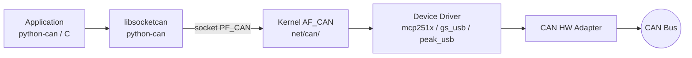
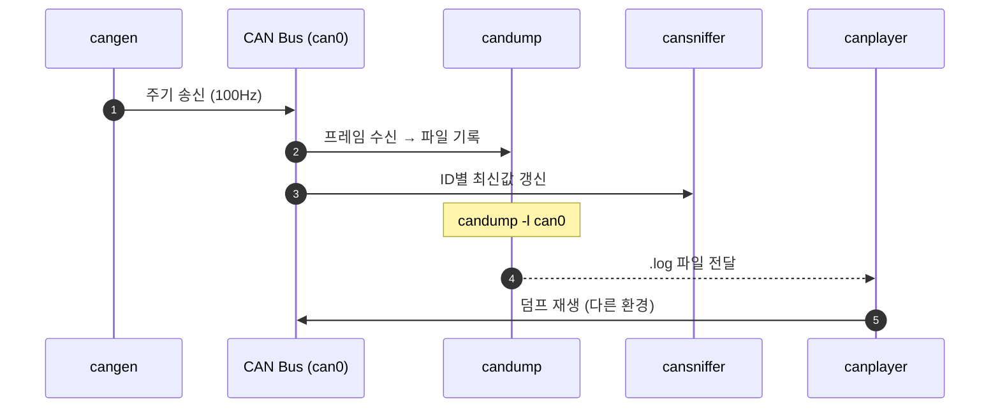

# CH13. SocketCAN 기초

::: info 학습 목표
- Linux <strong>SocketCAN</strong>의 아키텍처를 파악하고 AF_CAN이 일반 BSD socket과 어떻게 다른지 구분한다.
- Peak/Kvaser/gs_usb 같은 <strong>대표 하드웨어</strong>의 드라이버 흐름을 이해한다.
- `ip link`로 <strong>can0 인터페이스</strong>를 올리고 통계를 확인하는 절차를 손에 익힌다.
- <strong>can-utils</strong>의 candump·cansend·cangen·cansniffer·canplayer를 목적별로 구분해 쓴다.
- <strong>python-can</strong>으로 Bus/Message/Notifier/Listener 패턴을 적용해 자동화 스크립트를 짠다.
- Raspberry Pi + MCP2515 HAT처럼 <strong>SPI 기반 CAN</strong> 환경을 구축한다.
:::

CH12까지는 MCU가 주인공이었다. 이번 장은 반대편, 즉 PC·Linux SBC에서 CAN 버스를 보고 조작하는 세계다. Linux는 CAN을 <strong>network 인터페이스</strong>로 취급한다. ethernet 카드를 `ip link`로 올리듯 CAN도 `ip link set can0 up`으로 올린다. 이 추상화 덕에 CAN이 기존 네트워크 스택·툴 생태계와 자연스럽게 맞물린다. 즉 tcpdump와 같은 발상의 툴(candump)로 덤프를 뜨고, iptables 같은 규칙 엔진(cangw)으로 라우팅하며, Python socket 라이브러리처럼 친숙한 API로 사용자 공간 앱을 짠다.

SocketCAN의 출발은 2002년 독일 Volkswagen 연구소에서였다. CAN을 "특별한 주변장치"가 아니라 <strong>범용 네트워크 스택</strong>의 한 프로토콜 패밀리로 편입시키는 설계였고, 현재는 리눅스 메인라인에 완전히 녹아들어 있다. 그래서 우리가 해야 할 작업은 <strong>하드웨어를 붙이고, 인터페이스를 올리고, 툴을 쓰는 것</strong>으로 축약된다.

## 1. SocketCAN 아키텍처



리눅스 커널은 `net/can/` 디렉토리에 <strong>AF_CAN 프로토콜 패밀리</strong>를 구현한다. 이 구조의 장점은 개발자가 이미 익숙한 소켓 API, 네트워크 유틸리티, iproute2 툴 체인을 <strong>그대로 재사용</strong>할 수 있다는 점이다. 사용자 공간에서 다음 한 줄이면 CAN socket을 연다.

```c
int s = socket(PF_CAN, SOCK_RAW, CAN_RAW);
```

이후 `bind(s, can0_addr, ...)`, `read(s, ...)`, `write(s, ...)`는 TCP/UDP 서버·클라이언트 작성 경험과 그대로 같은 패턴이다. 즉 기존 네트워크 프로그래머가 추가 학습 비용 없이 CAN을 다룰 수 있다. 프레임 구조도 단일 struct `can_frame`으로 정의되어 있어 read/write 한 번에 하나의 프레임이 오간다. 이 <strong>API의 단순함</strong>이 SocketCAN 채택률의 핵심이다.

- <strong>CAN_RAW</strong> — 가장 기본. 프레임 단위로 보내고 받는다. 애플리케이션이 모든 타이밍·주기를 직접 제어한다.
- <strong>CAN_BCM(Broadcast Manager)</strong> — 주기 송신·타임아웃 감시를 커널에 위임. 사용자 공간이 매 주기마다 깨어날 필요가 없어 지터와 CPU 부하가 크게 준다.
- <strong>CAN_ISOTP</strong> — ISO-TP 세그먼트화를 커널 모듈이 처리(CH19 참조). 다바이트 UDS 메시지를 SF/FF/CF로 쪼개는 것을 커널이 맡아 준다.
- <strong>CAN_J1939</strong> — J1939 프로토콜을 커널에서 직접 지원. PGN, BAM·CMDT 전송, address claim이 커널 객체로 추상화된다.

SocketCAN의 또 다른 강점은 <strong>여러 CAN 인터페이스를 동시에 다루기 쉬움</strong>이다. `can0`·`can1`·`vcan0` 각각이 독립된 net device이므로, 한 프로세스가 서로 다른 버스를 동시에 bind해 게이트웨이 역할을 할 수 있다. 커널 모듈 <strong>cangw</strong>는 이 라우팅을 커널 내부에서 선언적으로 설정해 주는 도구로, CH14에서 다룬다.

## 2. 지원 하드웨어

| 제품 | 커널 모듈 | 인터페이스 | 비고 |
|------|-----------|------------|------|
| Peak PCAN-USB | peak_usb | USB | 상용, 안정적 |
| Kvaser Leaf/U | kvaser_usb | USB | 상용, 다채널 |
| candleLight / gs_usb | gs_usb | USB | 오픈소스 펌웨어, 저렴 |
| Innomaker USB2CAN | gs_usb 호환 | USB | FD 옵션 |
| SLCAN 어댑터 | slcan (tty) | Serial/USB-CDC | ASCII 프로토콜, 저속 |
| MCP2515 HAT (RPi) | mcp251x | SPI | 저렴, 500 kbps 이하 권장 |
| STM32 USB-CAN | gs_usb 등 | USB | DIY 자작 보드 많음 |

커널 4.x 이후 대부분 mainline에 포함되어 별도 모듈 컴파일 없이 <strong>`lsmod`로 확인만 하면 된다</strong>. 예외적으로 오래된 배포판이나 산업용 임베디드 커널에서는 모듈이 기본 비활성화된 경우가 있어 `CONFIG_CAN`, `CONFIG_CAN_RAW`, `CONFIG_CAN_MCP251X` 같은 옵션이 켜져 있는지 확인해야 한다.

## 3. 인터페이스 올리기

```bash
# 1) 기존 상태 확인
ip -details link show can0

# 2) 비트레이트 설정 + UP
sudo ip link set can0 type can bitrate 500000
sudo ip link set can0 up

# 3) Tx queue 길이 늘리기 (대량 송신 시)
sudo ip link set can0 txqueuelen 1000

# 4) 통계
ip -s link show can0
# TX:  bytes, packets, errors, dropped, carrier, collsns
# RX:  bytes, packets, errors, dropped, overrun, mcast
```

에러 통계에서 주목할 필드.

- <strong>bus-error</strong> 카운트(별도 옵션 필요: `berr-reporting on`)
- <strong>restart-count</strong> — bus-off 후 자동 재시작 횟수
- <strong>RX overrun</strong> — 커널 큐가 넘쳐 프레임이 드랍된 수. 값이 올라가면 앱이 read 속도를 못 따라가는 것
- <strong>TX errors</strong> — ACK 누락, arbitration lost 이후 재전송 실패 등. 물리 계층 이상이 의심될 때 가장 먼저 본다.
- <strong>state</strong> — ERROR-ACTIVE / ERROR-WARNING / ERROR-PASSIVE / BUS-OFF. <code>ip -details</code>로 확인 가능하며 상태 전이 이력도 RESTART-COUNT로 함께 관측된다.

```bash
# 자동 복구 활성화 + 버스 에러 리포트
sudo ip link set can0 type can bitrate 500000 restart-ms 100 berr-reporting on
```

::: tip vcan — 가상 CAN
하드웨어 없이 테스트하려면 <strong>vcan</strong> 모듈을 쓴다.
```bash
sudo modprobe vcan
sudo ip link add dev vcan0 type vcan
sudo ip link set up vcan0
```
CH14에서 본격적으로 다룬다.
:::

## 4. can-utils 핵심 명령

`sudo apt install can-utils`로 설치한다. 가장 자주 쓰는 명령.

### candump — 덤프·모니터

```bash
candump can0                        # 모든 프레임
candump -t d can0                   # 타임스탬프(delta)
candump can0,123:7FF                # ID 0x123만 (id:mask 필터)
candump can0,0:0,#FFFFFFFF          # 에러 프레임 포함
candump -l can0                     # 파일로 기록 (candump-YYYY...log)
candump any                         # 모든 CAN 인터페이스
```

필터 문법: <code>id:mask</code>. <strong>(frame_id & mask) == id</strong>를 만족하는 프레임만 통과. CH11의 필터 수학과 동일. 콤마로 여러 필터를 이어 붙이면 OR 조건, <code>~</code> 접두사는 <strong>배제 필터</strong>(매치되는 것을 버린다)로 동작한다. 현장에서 <strong>특정 주기 메시지를 제거</strong>하고 이벤트성 프레임만 보고 싶을 때 유용하다.

candump는 디폴트 출력이 읽기 쉽지만, 자동화에서는 <strong>`-L` 옵션</strong>으로 로그 호환 형식을 쓰거나 `-ta`로 절대 타임스탬프, `-x`로 확장 포맷을 고르는 편이 파싱하기 좋다. 현장에서 덤프를 쌓아 두고 나중에 python 스크립트로 재분석하는 흐름이 많은데, 이때 타임스탬프 포맷이 명확해야 CH10의 응답 시간 분석 같은 계산에 활용할 수 있다.

### cansend — 단일 송신

```bash
cansend can0 123#DEADBEEF           # 11-bit ID 0x123, 4 bytes
cansend can0 1F334455#01.02.03.04   # 29-bit extended ID
cansend can0 123#R                  # Remote 프레임
cansend can0 123##1.DEADBEEF        # CAN FD (## 뒤 flags + data)
```

cansend는 <strong>한 번만 쏘는 단순 툴</strong>이므로 주기 송신이나 조건부 응답이 필요하면 bash loop나 python-can을 쓴다. 예컨대 `for i in {1..100}; do cansend can0 123#01; sleep 0.01; done` 식으로 간단한 스트레스 테스트를 구성할 수 있다.

### cangen — 테스트 트래픽 생성

```bash
cangen can0 -g 5 -I 123 -L 8 -D R
# -g 5ms gap, -I fixed ID 0x123, -L fixed 8 byte, -D R 데이터 랜덤

cangen can0 -g 1 -e -L i            # 29-bit, 길이 증가 패턴
```

버스 부하 측정(CH10)과 짝지어 쓴다.

### cansniffer — 시그널 감시

```bash
cansniffer can0
```

ID별로 <strong>최신 데이터</strong>를 한 줄씩 유지하고, 값이 바뀐 바이트만 하이라이트한다. 주기 메시지가 많은 자동차·농기계 네트워크에서 <strong>무엇이 변하고 있는가</strong>를 눈으로 확인할 때 압도적으로 편하다. 예컨대 스로틀을 밟기 전후로 어떤 ID의 어느 바이트가 변하는지 찾아 <strong>신호 리버스 엔지니어링</strong>에 들어가는 첫 단계로 쓴다.

### canplayer — 덤프 재생

```bash
candump -l can0                     # 파일에 기록
# ... 나중에 재생 ...
canplayer -I candump-2026-04-20.log can0=can0
```

`ifaceA=ifaceB` 문법으로 <strong>다른 인터페이스로 리매핑</strong>해 재생할 수 있다. 현장에서 덤프 떠 와서 사무실 vcan으로 재생하는 시나리오.

## 5. python-can 예제

```python
import can

# 버스 열기
bus = can.Bus(channel='can0', interface='socketcan')

# 송신
msg = can.Message(
    arbitration_id=0x123,
    data=[0x01, 0x02, 0x03, 0x04],
    is_extended_id=False,
)
bus.send(msg, timeout=0.1)

# 수신 루프
for msg in bus:
    print(f"{msg.timestamp:.3f}  {msg.arbitration_id:03X}  {msg.data.hex()}")
```

가장 먼저 익혀야 할 패턴은 <strong>"Bus 객체 + for msg in bus 루프"</strong>다. 이것만으로도 candump와 동등한 기능을 python으로 구현할 수 있다. 여기에 DBC 파서(cantools)를 붙이면 raw byte를 <strong>물리량 시그널</strong>로 디코드해 그대로 로그/그래프에 쓸 수 있다.

### Notifier / Listener 패턴

여러 리스너를 동시에 붙일 때.

```python
import can

bus = can.Bus(channel='can0', interface='socketcan')
logger = can.Logger('drive.log')
printer = can.Printer()
notifier = can.Notifier(bus, [logger, printer])

import time; time.sleep(30)
notifier.stop()
bus.shutdown()
```

`can.Logger`는 확장자로 포맷을 판단한다. `.log`는 candump 호환, `.asc`는 Vector ASC, `.blf`는 Vector BLF.

Notifier는 <strong>하나의 버스를 여러 소비자가 공유</strong>하게 해 준다. 한 프로세스에서 로깅·모니터링·제어 로직을 동시에 돌릴 때 유용하다. 다만 리스너의 `on_message_received`가 동기 함수이므로, 무거운 작업은 리스너에서 직접 하지 말고 <strong>queue로 넘겨 별도 스레드</strong>에서 처리하는 것이 권장된다.

### 필터 + 주기 송신

```python
bus.set_filters([
    {"can_id": 0x100, "can_mask": 0x700, "extended": False},
])

task = bus.send_periodic(
    can.Message(arbitration_id=0x200, data=[0]*8, is_extended_id=False),
    period=0.1,  # 100ms
)
# ...
task.stop()
```

### asyncio

`python-can` 4.x는 asyncio를 지원한다.

```python
import asyncio, can

async def main():
    bus = can.Bus(channel='can0', interface='socketcan')
    reader = can.AsyncBufferedReader()
    notifier = can.Notifier(bus, [reader], loop=asyncio.get_event_loop())
    async for msg in reader:
        print(msg)

asyncio.run(main())
```

## 6. gs_usb(candleLight) 어댑터

오픈소스 펌웨어 <strong>candleLight</strong>가 동작하는 저가(USB-C 기준 2~4만원대) CAN 어댑터가 최근 급격히 늘었다. Linux 커널에 <code>gs_usb</code> 드라이버가 포함되어 꽂으면 `can0`이 자동 생성된다. CANable·CANable Pro·Innomaker USB2CAN·Makerbase CANable 등 국내외 여러 제품이 동일 펌웨어를 공유한다.

- <strong>장점</strong>: 펌웨어가 오픈소스(GitHub), 저렴, 일부 보드는 <strong>CAN FD 지원</strong>(CANable 2.0, Canable Pro FD 등).
- <strong>단점</strong>: USB 지연 때문에 μs 수준 타임스탬프 정확도는 상용 Kvaser 대비 떨어짐. 고정밀 측정에는 비권장.

## 7. 필터 설정 (SocketCAN RAW)

커널에게 필터를 넘겨 놓으면 <strong>커널 단에서 걸러</strong> 사용자 공간으로 올라오는 프레임을 줄일 수 있다.

```c
struct can_filter rfilter[2];
rfilter[0].can_id   = 0x123;
rfilter[0].can_mask = CAN_SFF_MASK;      // 11-bit 정확 일치
rfilter[1].can_id   = 0x200;
rfilter[1].can_mask = 0x700;             // 상위 3bit만 일치
setsockopt(s, SOL_CAN_RAW, CAN_RAW_FILTER, &rfilter, sizeof(rfilter));
```

python-can의 `set_filters()`가 내부적으로 동일한 setsockopt를 호출한다.

## 7-1. 성능 주의 사항

SocketCAN은 편리하지만 <strong>리눅스 유저스페이스의 지연 특성</strong>을 그대로 안고 간다. 일반적인 데스크톱 커널에서 주기 송신의 지터는 수 ms, preempt-rt 커널을 써도 수백 µs 수준이다. 1 ms 이하의 정밀 주기가 필요하면 <strong>CAN_BCM</strong>으로 커널에 송신을 위임하거나, MCU 쪽 드라이버로 타이밍 책임을 넘긴다.

수신 측도 마찬가지로, 부하가 높은 시스템에서 Python 스크립트가 read에 들어가는 주기가 커지면 <strong>SocketCAN 수신 큐가 넘쳐</strong> 프레임이 드랍된다. 방어책은 다음 세 가지다.

- <strong>socket 수신 버퍼 키우기</strong> — <code>setsockopt(SO_RCVBUF)</code>로 1 MB 이상으로 늘린다.
- <strong>전담 수신 스레드</strong>를 돌려 파싱/로깅은 별도 큐로 넘긴다.
- <strong>커널 필터</strong>를 써서 애초에 올라오는 프레임 수를 줄인다.

즉 SocketCAN은 "항상 가볍다"가 아니라 "가볍게 쓰기 쉬운 API"다. 측정기·레코더처럼 loss가 절대 허용되지 않는 용도라면, 반드시 <strong>RX overrun 카운터</strong>를 지속 감시하고 장시간 부하 시험을 거친다.

## 8. CAN FD

FD 대응 하드웨어에서는 비트레이트를 nominal/data 두 개 설정한다.

```bash
sudo ip link set can0 up type can \
    bitrate 500000 dbitrate 2000000 \
    sample-point 0.8 dsample-point 0.75 \
    fd on
```

FD 프레임은 페이로드가 최대 64바이트까지 가능하고, 데이터 구간 비트레이트가 nominal보다 빠르다. 그만큼 <strong>물리 신호 품질</strong>에 민감해, 일반 CAN에서 문제없던 배선에서도 FD로 전환하면 CRC error가 늘어날 수 있다. 이 경우 CH7에서 다룬 FD용 sample point 재계산과 TDC 설정을 다시 검토한다.

python-can에서도 `fd=True`와 `bitrate_switch=True`를 인자로 넘긴다.

```python
bus = can.Bus(channel='can0', interface='socketcan', fd=True)
msg = can.Message(arbitration_id=0x456, data=bytes(64),
                  is_fd=True, bitrate_switch=True)
bus.send(msg)
```

## 9. 실전 실습 — Raspberry Pi + MCP2515 HAT

가장 흔한 저가 구성. `/boot/config.txt`에 오버레이를 추가한다.

```
dtparam=spi=on
dtoverlay=mcp2515-can0,oscillator=16000000,interrupt=25
dtoverlay=spi-bcm2835
```

오실레이터 주파수는 HAT 제품마다 다르다(8/16/20 MHz). 구매한 보드의 실크 인쇄 또는 판매 페이지를 꼼꼼히 확인한다. 이 값이 <strong>실제 크리스털과 1 MHz라도 다르면</strong> 비트 타이밍 계산이 어긋나 모든 프레임이 에러가 된다. 부팅 후.

```bash
dmesg | grep mcp251x
sudo ip link set can0 up type can bitrate 500000
candump can0
```

동작이 이상하면 체크.

- 오실레이터 값이 실제 HAT과 일치하는가(가장 흔한 실패 원인).
- GPIO25가 INT 핀과 맞는가.
- 종단저항 점퍼가 올바르게 꽂혀 있는가.
- SPI 속도가 과도하게 낮지 않은가(기본값이 10 MHz 미만이면 고부하에서 드랍).
- `spi-bcm2835` 대신 `spi-bcm2708`이 로드되어 있지 않은가(구형 오버레이).

RPi 5나 최근 보드는 SPI 하드웨어와 오버레이 구성이 달라 MCP2515 HAT 호환성 이슈가 간헐적으로 보고된다. 보드 릴리즈 노트를 먼저 확인하고, 가능하면 <strong>USB-CAN 어댑터</strong>(gs_usb 기반)를 쓰는 편이 빠르게 동작 확인할 수 있다.

RPi + MCP2515 구성은 교육·시연용으로는 충분하지만, <strong>양산·장기 운용</strong>에는 한계가 있다. SPI 지연 누적으로 고부하 시 프레임 누락이 발생하고, MCP2515 자체의 1 Mbps 이슈로 FD는 불가능하다. 현장 로거·게이트웨이로 쓸 것이라면 <strong>gs_usb 기반 USB 어댑터</strong>나 <strong>내장 CAN 컨트롤러가 있는 SBC</strong>(Jetson Nano의 경우 내장 CAN, 또는 SocketCAN-friendly 산업 컴퓨터)를 검토한다.

## 10. 흐름 정리 — 툴 간 상호 작용



한 현장에서 cangen으로 부하를 주고 candump로 덤프 뜨고, 사무실에 돌아와 canplayer로 vcan에 재생하며 python-can 스크립트로 회귀 테스트를 돌리는 <strong>사이클</strong>이 실무의 기본 패턴이다. 각 툴은 역할이 겹치지 않고 직교하므로 <strong>어떤 상황에 어떤 툴을 꺼낼지</strong>만 머릿속에 정리되면 된다.

- 버스에 어떤 ID가 흐르는지 전부 보고 싶다 → candump.
- 한 프레임만 쏴 보고 싶다 → cansend.
- 대량 부하를 흘려 버스 점유율을 보고 싶다 → cangen + (CH10의 부하 계산).
- 시그널이 어떻게 변하는지 눈으로 따라가고 싶다 → cansniffer.
- 이전에 기록한 시나리오를 다시 재현하고 싶다 → canplayer.

이 다섯 개 명령과 python-can 한 세트면, SocketCAN 기반 CAN 작업의 90%는 처리된다. 나머지 10%는 cangw·BCM·ISO-TP 같은 고급 주제로 CH14에서 다룬다.

실제 협업 환경에서 이 툴들이 가장 빛나는 순간은 <strong>재현 가능한 증거</strong>를 남길 때다. 개발자가 "가끔 통신이 끊긴다"고 하는 대신, <strong>candump 로그 + cangen 재현 스크립트</strong>를 함께 공유하면 상대방이 동일 조건을 자기 환경에서 재현해 원인을 좁힐 수 있다. 팀 단위 디버깅 효율이 크게 올라간다.

또한 CI/CD에서도 SocketCAN이 핵심이다. 빌드 서버에 vcan을 띄우고 python-can 테스트 스크립트를 `pytest`로 돌리면, 실제 하드웨어 없이도 프로토콜 로직 회귀 검증이 가능하다. 단 <strong>타이밍 검증</strong>은 실제 버스에서만 유효하므로 HIL 환경에서 별도로 다룬다.

::: warning 자주 걸리는 실수
- `ip link set can0 up`을 <strong>먼저</strong>하고 나서 bitrate를 설정하려 하면 "Device or resource busy". 순서는 type+bitrate → up.
- Tx queue가 기본 10으로 작다. 고속 버스에서 `ENOBUFS`가 뜨면 <strong>txqueuelen</strong>을 늘린다.
- candump의 필터 `id:mask`에서 헷갈리기 쉬운 것이 <strong>순서</strong>다. candump는 `id:mask` 형태로 mask가 뒤.
- MCP2515는 <strong>1 Mbps에서 불안정</strong>한 경우가 많다. 500 kbps 이하로 운용 권장.
- python-can `Bus()`가 deprecated 이름 교체가 잦다. 4.x에서는 <code>interface=</code>를 쓴다.
:::

## 11-0. 자동화 시나리오

실전에서 SocketCAN을 쓰는 대표적 자동화 시나리오 몇 가지.

- <strong>HIL 테스트</strong> — 실제 ECU 대신 python-can 스크립트가 시뮬레이션 노드 역할을 한다. CI/CD에서 pytest로 수천 번 반복해 회귀 테스트.
- <strong>CAN 덤프 분석</strong> — 현장에서 수집한 로그를 pandas로 로드해 시그널 통계, 이상치, 주기 메시지 누락을 스크립트로 추출.
- <strong>게이트웨이</strong> — 두 CAN 버스(예: 차량 powertrain / body) 사이에서 특정 메시지만 필터·변환해 중계. cangw 또는 사용자 공간 프로그램으로 구현.
- <strong>부팅 스크립트</strong> — systemd service로 부팅 시 can0 자동 up + 특정 ID 모니터링 로그 파일 rotate.
- <strong>원격 디버깅</strong> — VPN으로 접속한 차량의 SocketCAN 인터페이스를 엔지니어가 원격에서 candump로 관찰.

## 11. 간단한 모니터링 웹 대시보드 예

python-can + FastAPI + WebSocket 조합으로 실시간 CAN 대시보드를 붙이는 흐름은 다음과 같다. 첫째, CAN 백그라운드 리더 스레드가 프레임을 큐에 쌓는다. 둘째, FastAPI 앱이 WebSocket으로 프론트엔드에 전달한다. 셋째, 브라우저가 JavaScript로 그래프를 그린다.

이 구조는 <strong>원격 진단·현장 점검 툴</strong>로 매우 유용하다. 특히 농기계나 산업 장비처럼 현장이 분산되어 있을 때, 엔지니어가 노트북을 들고 가지 않고도 브라우저만으로 상태를 확인할 수 있다. 보안상 중요한 ECU에 대해서는 인증·접근 제어를 당연히 함께 설계해야 하지만(CH22·23 참조), 개발·검증 단계에서는 이런 내부 툴이 시간을 크게 절약한다.

python-can 외에 <strong>C 기반 고성능 앱</strong>이 필요하면 libsocketcan 없이 직접 AF_CAN 소켓을 쓰는 편이 단순하다. 약 20줄 이하로 read 루프를 작성할 수 있고, 시스템콜 외 오버헤드가 없다. 임베디드 Linux 제품에 CAN 게이트웨이를 붙일 때 이 방식이 일반적이다.

## 11-2. DBC 파일 활용

자동차·농기계 실무에서 SocketCAN만으로는 충분하지 않고, 거의 반드시 <strong>DBC 파일</strong>을 함께 다룬다. DBC는 Vector가 정의한 메시지·시그널 사전 형식으로, 메시지 이름·ID·주기·시그널 비트 위치·스케일 팩터·물리 단위가 모두 담겨 있다.

```python
import cantools, can
db = cantools.database.load_file('agri.dbc')
bus = can.Bus(channel='can0', interface='socketcan')

for msg in bus:
    try:
        decoded = db.decode_message(msg.arbitration_id, msg.data)
        print(decoded)
    except KeyError:
        pass
```

이렇게 하면 `{'EngineSpeed': 850.0, 'CoolantTemp': 72.5}` 같은 물리 시그널 딕셔너리를 바로 얻는다. DBC 기반 모니터링은 현장 디버깅 툴과 내부 HIL 환경 양쪽에서 표준 접근이다.

## 12. 요약 팁

- <strong>디바이스 존재 확인은 <code>ip -details link show</code></strong>에서 시작한다. 인터페이스가 없으면 드라이버 로드부터 의심.
- <strong>비트레이트 설정은 인터페이스가 DOWN일 때만</strong> 가능. UP 상태에서 변경 시도는 busy 에러.
- <strong>candump 덤프 로그는 플레인 텍스트</strong>라 `grep`·`awk`·python으로 바로 가공 가능.
- <strong>python-can 4.x</strong>는 `bustype=` 대신 `interface=`를 권장한다. 구버전 코드 업그레이드 시 주의.
- <strong>CAN FD 지원 여부</strong>는 어댑터 펌웨어에 종속된다. gs_usb 기반이라도 펌웨어 버전에 따라 FD가 꺼져 있을 수 있다.
- <strong>시리얼 SLCAN</strong> 어댑터를 쓸 때는 `slcand` 데몬으로 tty를 SocketCAN 인터페이스로 래핑한다. 속도·지연 면에서 USB 어댑터보다 불리하지만 구형 장비에서 유용하다.
- <strong>버스 트래픽이 없을 때</strong>도 인터페이스 상태는 확인 가능. `ip -details link show can0`에서 state가 ERROR-ACTIVE면 정상 대기 중이다.

## 다음 챕터

다음은 [CH14. SocketCAN 고급](/study/can/14-socketcan-advanced)이다. vcan, cangw(프레임 게이트웨이·변환), 커널 isotp 모듈, FD 관점의 성능 튜닝, BCM을 활용한 주기 송신 오프로드까지 실전 심화로 들어간다.

::: tip 핵심 정리
- SocketCAN은 CAN을 <strong>network 인터페이스</strong>로 추상화해 `ip link`와 BSD socket으로 다룬다.
- <code>ip link set can0 up type can bitrate 500000</code> 한 줄이면 인터페이스가 뜬다.
- can-utils는 <strong>candump(관측) / cansend(단발) / cangen(부하) / cansniffer(시그널) / canplayer(재생)</strong>로 역할이 나뉜다.
- python-can은 Bus/Message + Notifier/Listener 패턴으로 자동화와 비동기 처리에 유리하다.
- gs_usb 기반 candleLight 어댑터로 <strong>저렴한 FD 지원</strong>이 가능해졌다.
- 필터는 <strong>커널 단 setsockopt(CAN_RAW_FILTER)</strong>에서 거는 것이 가장 효율적이다.
- Raspberry Pi + MCP2515 HAT 구성에서 가장 흔한 실패 원인은 <strong>오실레이터 주파수 불일치</strong>다.
:::
