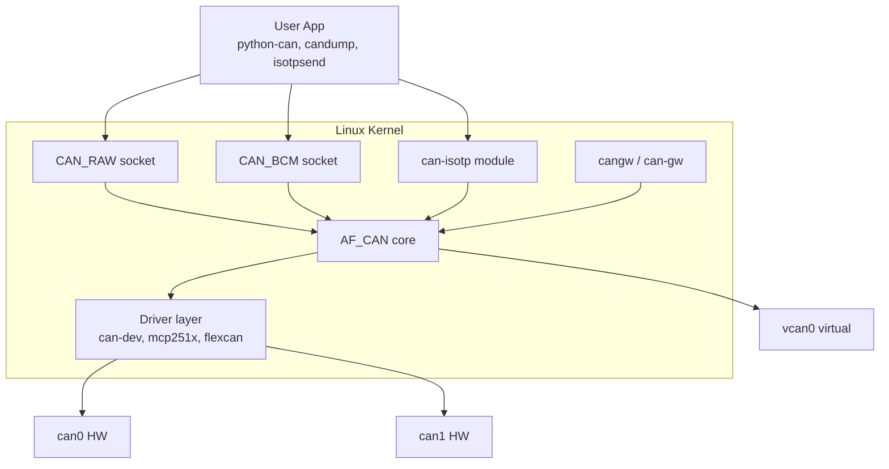
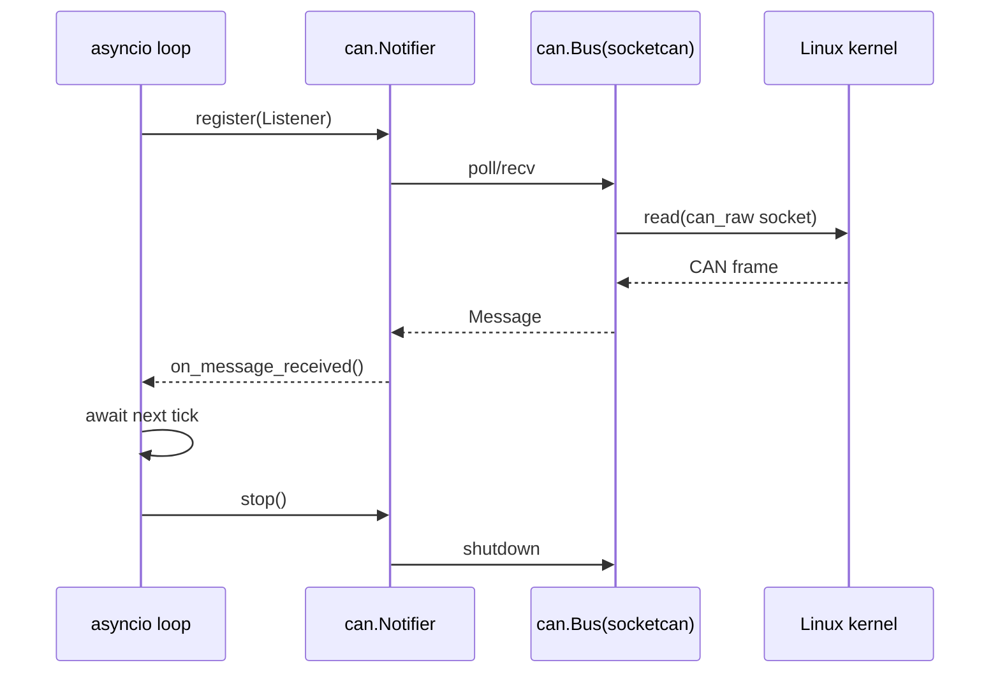

# CH14. SocketCAN 고급

::: info 학습 목표
- Virtual CAN(vcan)으로 하드웨어 없이 CAN 애플리케이션을 개발·테스트할 수 있다.
- cangw로 커널 내에서 두 CAN 인터페이스를 라우팅·필터링·변환할 수 있다.
- can-isotp 커널 모듈로 ISO 15765-2 segmentation을 커널에 맡기는 방법을 안다.
- Broadcast Manager(BCM)로 주기 송신과 타임아웃 감지를 효율적으로 구현한다.
- CAN FD를 SocketCAN에서 올리고, python-can의 다양한 백엔드와 asyncio 패턴을 쓸 수 있다.
:::

## 0. 이전 장과 이 장의 차이

CH13에서는 `can0` 인터페이스를 올리고 `candump`·`cansend`로 프레임을 보내는 기초를 다뤘다. 이 장은 그 위에서 실전 시스템을 만들 때 필요한 기법을 모은다. 같은 SocketCAN이지만, 가상 인터페이스로 하드웨어 종속성을 끊고, 커널 내 게이트웨이로 라우팅을 구성하고, ISO-TP·BCM으로 애플리케이션 복잡도를 줄이는 <strong>엔지니어링 도구함</strong>이다. 차량 개발에서 "CAN을 잘 쓴다"는 말이 이 장의 내용에 얼마나 익숙한가에 달려 있다 해도 과언이 아니다.

## 1. SocketCAN의 레이어드 관점

CH13에서 본 `can0`는 빙산의 일각이다. SocketCAN은 리눅스 네트워크 스택 위에 CAN 전용 프로토콜 패밀리(<strong>PF_CAN</strong>)를 얹은 구조라서, 그 위에 다양한 커널 모듈이 붙는다. 실제 하드웨어가 없어도 동작하는 <strong>vcan</strong>, 두 버스를 잇는 <strong>cangw</strong>, 전송 계층을 구현하는 <strong>can-isotp</strong>, 주기 송신을 커널이 대신 해주는 <strong>BCM</strong>이 모두 같은 레이어 위에 올라앉는다.



위 그림이 앞으로의 모든 이야기의 뼈대다. 각 블록이 무엇이고 어떻게 조립되는지 하나씩 풀어낸다.

이 구조의 장점은 <strong>프로토콜별 소켓 타입</strong>이 분리돼 있다는 데 있다. `CAN_RAW`는 원시 프레임을 그대로 주고받고, `CAN_BCM`은 주기 송신과 타임아웃 감지를 커널 타이머 위에 올리며, `CAN_ISOTP`는 ISO 15765-2의 segmentation까지 커널이 책임진다. 즉 애플리케이션 개발자는 "어떤 레벨에서 CAN을 다룰 것인가"를 소켓 타입 하나로 결정한다. 또한 `cangw`는 소켓이 아니라 netlink 기반 커널 기능이므로 유저 프로세스가 죽어도 라우팅이 유지된다. 이 점은 <strong>상시 동작 게이트웨이</strong>를 만들 때 결정적이다.

## 2. Virtual CAN — 하드웨어 없이 테스트

`vcan`은 <strong>가상 CAN 인터페이스</strong>를 제공하는 커널 모듈이다. 물리 트랜시버 없이 커널 내부에서 루프백처럼 동작해 개발·CI 환경에서 특히 유용하다.

```bash
sudo modprobe vcan
sudo ip link add dev vcan0 type vcan
sudo ip link set vcan0 up
```

이것만으로 `candump vcan0`, `cansend vcan0 123#DEADBEEF`가 즉시 돌아간다. 여러 개가 필요하면 `vcan1`, `vcan2`를 추가로 만들면 된다. 재부팅 후에도 유지하려면 systemd-networkd의 netdev 파일에 `Kind=vcan`으로 선언하거나, `ip link`를 호출하는 단순 init 스크립트를 `/etc/systemd/system/`에 두는 방식이 보편적이다.

::: tip vcan의 쓰임새
- 로컬 개발 — 트랜시버·어댑터를 꽂지 않고 애플리케이션 로직만 검증.
- 유닛 테스트 — pytest·GoogleTest에서 `vcan0`를 세팅하고 송수신 assertion.
- CI 파이프라인 — GitHub Actions runner에 `modprobe vcan` 한 줄만 추가하면 E2E 테스트 가능.
- 프로토콜 설계 검증 — DBC·ISO-TP·UDS 시뮬레이션을 실기 없이 먼저 끝낸다.
:::

vcan에는 타이밍 오류·오류 프레임·bus-off가 없다는 점을 기억해야 한다. 오류 시나리오를 재현하려면 별도의 수단이 필요하고, 이때는 실기·Vector CANoe·specialized fault injector를 써야 한다.

또한 vcan은 본질적으로 루프백이라, 한 프로세스가 송신하면 같은 인터페이스에 바인드된 모든 소켓이 수신한다. 송신자가 자기 프레임을 다시 받는 "echo"를 원치 않으면 `CAN_RAW_RECV_OWN_MSGS` 소켓 옵션을 끄면 된다. python-can에서는 `receive_own_messages=False`가 기본값이다. 이 동작은 실제 CAN 버스와 달라 단위 테스트에서 <strong>자기 송신 루프</strong>를 잘못 탐지하는 원인이 되기도 한다.

대역폭 제한도 없다. 실제 500kbps·1Mbps 물리 버스의 버스 부하·지연을 검증하려면 vcan은 부족하고, `tc qdisc`나 CAN traffic generator 어댑터를 써야 한다. 그러나 <strong>로직 정합성</strong>만 본다면 vcan만으로도 프로젝트의 80% 이상 테스트가 커버된다.

유틸리티 중 <strong>vxcan</strong>도 알아두면 좋다. 두 개의 가상 인터페이스가 paired 형태로 생성돼, 한쪽에서 보낸 프레임이 다른 쪽에서 수신되는 구조다. 서로 다른 netns(network namespace)에 각각 배치하면 격리된 두 ECU 시뮬레이션을 한 머신에서 깔끔히 구현할 수 있다. 컨테이너·샌드박스 테스트에 특히 유용하다.

## 3. cangw — 커널 내 CAN 라우팅

<strong>cangw</strong>는 `can-gw` 커널 모듈을 제어하는 유저 툴이다. 두 개 이상의 CAN 인터페이스 사이에서 프레임을 복사·필터링·변형하는 <strong>브리지/게이트웨이</strong> 역할을 한다. 유저 공간을 거치지 않고 커널 내부에서 처리되므로 지연이 작다.

```bash
# can0 -> can1로 모든 프레임 복사(echo 활성)
cangw -A -s can0 -d can1 -e

# ID 필터: 0x123만 통과
cangw -A -s can0 -d can1 -f 123:C00007FF

# 페이로드 수정: 8바이트 중 특정 바이트를 덮어씀
cangw -A -s can0 -d can1 -m SET:IL:0.0.8.0xDEADBEEF00
```

`-s`·`-d`는 source·destination, `-e`는 자기 인터페이스에서도 echo를 유지하라는 뜻이다. `-f`는 ID:MASK 형식 필터, `-m`은 modifier 규칙이다. `cangw -L`로 현재 규칙을 나열하고 `-D`로 삭제한다.

modifier는 순서가 중요하다. `AND`·`OR`·`XOR`·`SET` 연산이 있고, 대상은 ID·DLC·페이로드·타임스탬프 모두 가능하다. 예를 들어 `SET:IL:0.0.8.0xDEADBEEF00`에서 `IL`은 Identifier·Length, 그 뒤 숫자들은 적용 바이트 위치·길이다. 규칙 하나로 ID 변환·페이로드 덮어쓰기·DLC 조정까지 할 수 있으므로 <strong>게이트웨이 로직을 유저 코드 한 줄 없이</strong> 구성하는 것이 가능하다.

실전 규칙 세트는 다음과 같은 모양이 많다.

```bash
# 민감 메시지 차단(0x7F0~0x7FF 진단 범위는 통과시키지 않음)
cangw -A -s can0 -d can1 -f 000:FFFF    # 일단 전체 통과
cangw -A -s can0 -d can1 -f 7F0:FFF0 -i # 0x7F0~0x7FF는 inverse로 제외

# ID 재매핑(섀시 0x200 -> 파워트레인 0x300)
cangw -A -s can0 -d can1 -f 200:7FF -m SET:I:0x300
```

규칙은 커널 내부 링크드 리스트로 관리되므로 수십 개도 성능에 거의 영향이 없다. 다만 모든 소스·목적 쌍에 대해 규칙이 선형 탐색되므로, 한 인터페이스에 수백 개를 붙이면 지연이 생길 수 있다.

::: info cangw의 실전 활용
- <strong>브리지</strong>: 차량 섀시 CAN과 파워트레인 CAN을 게이트웨이로 연결하면서 민감 메시지는 필터링.
- <strong>ECU 에뮬레이션</strong>: 미완성 ECU의 자리에 vcan 채널을 만들고, 일부 메시지만 실기로 전달.
- <strong>로드맵 재구성</strong>: 기존 메시지 ID를 프로젝트 새 규약으로 변환(ID remap + 페이로드 수정).
- <strong>분석용 tap</strong>: 모든 프레임을 별도 인터페이스로 복제해 `candump`·Wireshark로 관찰.
- <strong>테스트 더블</strong>: 실차에서 들어온 프레임을 변조해 시뮬레이션 버스로 넘김. 고장 주입 시나리오에 유용.
:::

cangw는 <strong>경계 방어 장치</strong>로도 쓰인다. 차량 네트워크에 진단 포트를 노출해야 하는 상황에서, 진단 전용 ID만 통과시키고 나머지는 차단하는 규칙을 걸어두면 외부 공격 벡터를 크게 줄일 수 있다. CH22·CH23의 보안 관점과 자연스럽게 이어진다.

## 4. can-isotp — ISO 15765-2를 커널로

UDS·OBD-II는 8바이트(또는 FD 64바이트)를 넘는 페이로드를 보내기 위해 <strong>ISO 15765-2(ISO-TP)</strong>라는 전송 계층을 쓴다. 이를 유저 공간에서 구현하면 Flow Control·Block Size·ST_min 타이밍에 민감해 버그가 잘 생긴다. `can-isotp` 모듈은 이 segmentation·reassembly를 커널에서 처리해주는 공식 구현이다.

```bash
sudo modprobe can-isotp
isotpsend -s 7E0 -d 7E8 can0 < payload.bin
isotprecv -s 7E8 -d 7E0 can0
```

`-s`는 송신 ID(tester가 ECU에게 보낼 요청 ID), `-d`는 수신 ID(ECU가 tester에게 보낼 응답 ID). 위 예는 UDS 관례에 맞춘 표준 페어다. 파이썬에서는 `SocketcanIsotp` backend나 `can-isotp` Python binding으로 동일 인터페이스를 쓴다.

```python
import socket
s = socket.socket(socket.AF_CAN, socket.SOCK_DGRAM, socket.CAN_ISOTP)
s.bind(('can0', 0x7E0, 0x7E8))
s.send(b'\x22\xF1\x90')  # UDS ReadDataByIdentifier
resp = s.recv(4095)
```

세부 프로토콜(SF/FF/CF, FC의 Block Size·ST_min, padding)은 CH19에서 상세히 다룬다. 여기서는 "커널 인터페이스로 바로 풀 페이로드를 주고받을 수 있다"는 점만 짚어두면 충분하다.

`can-isotp`의 이점은 세 가지다. 첫째, 타이밍이 정확하다. ST_min을 지키는 것은 고빈도 주기 일을 가진 유저 공간에서는 쉽지 않은데, 커널 타이머는 편차가 작다. 둘째, Flow Control의 응답을 놓쳐 segment가 뒤엉키는 버그가 없다. 셋째, 플랫폼 간 일관된 인터페이스를 얻는다. Windows의 PCAN-ISO-TP API나 Vector XL의 TP 레이어와 동일한 개념으로 쓸 수 있다.

단점은 인터페이스당 하나의 송수신 쌍만 bind 가능한 제약이다. 여러 ECU와 동시에 통신하려면 추가 소켓을 열어야 한다. 또한 padding·extended addressing 같은 옵션은 `setsockopt`로 세밀히 조정해야 하며, 이를 모르면 "왜 ECU가 응답을 안 하지"에서 몇 시간을 허비한다.

## 5. Broadcast Manager(BCM) — 주기 송신의 효율판

BCM은 `CAN_BCM` 프로토콜로 열리는 소켓을 통해 <strong>주기 송신과 수신 타임아웃 감지</strong>를 커널이 대행하는 장치다. `cansend` 루프를 유저 공간에서 돌리면 스케줄링 지터·컨텍스트 스위치가 개입하지만, BCM은 커널 타이머에 직접 올라가므로 더 정밀하다.

```python
import socket, struct
s = socket.socket(socket.AF_CAN, socket.SOCK_DGRAM, socket.CAN_BCM)
s.connect(('can0',))
# TX_SETUP: 100ms 주기로 0x123 메시지 반복 송신
```

BCM은 수신 측에서도 강력하다. "특정 ID가 500ms 동안 오지 않으면 이벤트 발생" 같은 <strong>timeout monitor</strong>를 걸어두면, 유저가 폴링할 필요 없이 커널이 통보한다. Network Management(CH17)에서 타임아웃 감지가 핵심이 될 때 다시 등장한다.

BCM의 또 다른 쓸모는 <strong>조건부 변경 감지</strong>다. 동일 ID의 페이로드가 이전과 달라진 순간만 이벤트를 올려주는 모드가 있다. 대시보드 갱신·텔레매틱스 업로드처럼 "값이 바뀔 때만 올려라" 요구에 정확히 부합한다. 바이트 단위·비트 단위 마스크로 비교 범위를 좁힐 수도 있어, 신호 하나가 변할 때만 반응하는 저전력 로직도 커널에서 해결된다.

단점도 있다. BCM 소켓 하나당 관리할 수 있는 룰 수에 한계가 있고(보통 수백 개), 메시지 ID가 수천 개인 대형 차량 네트워크에서는 소켓을 분할해야 한다. 또한 BCM은 주기 송신 사이사이에 <strong>동적 페이로드 교체</strong>가 가능하지만, 이 때문에 race condition이 나기도 한다. 커널 제공 API(`TX_SEND` vs `TX_SETUP`)를 정확히 구분해 쓰는 연습이 필요하다.

::: tip cyclic 송신의 세 선택지
- `cangen -g 10` — 간단한 스트레스 테스트.
- `cansend` 루프 — 빠른 스크립트.
- BCM — 정밀한 주기·타임아웃이 필요한 ECU 시뮬레이션. 실전 rest-bus simulation에 적합.
:::

## 6. CAN FD on SocketCAN

CAN FD는 SocketCAN에서 `ip` 명령으로 간단히 올린다.

```bash
sudo ip link set can0 up type can \
    bitrate 500000 dbitrate 2000000 fd on \
    sample-point 0.75 dsample-point 0.75
```

`bitrate`는 arbitration phase 속도, `dbitrate`는 data phase 속도다. `fd on`을 빠뜨리면 드라이버는 classical CAN 모드로만 동작한다. 송신 시 `cangen -x can0`처럼 `-x` 옵션을 주면 CAN FD 프레임을 생성하고, `cansend can0 123##1DEADBEEF...` 형식(`##`가 FD flag, 그 뒤 1자리 hex가 ESI/BRS)으로 수동 발생도 가능하다.

python-can에서는 `Bus(interface='socketcan', channel='can0', fd=True)`만 쓰면 된다. 프레임 길이는 0·1·2·3·4·5·6·7·8·12·16·20·24·32·48·64 바이트 중에서 선택한다.

FD 링크를 올릴 때 제일 먼저 확인할 값은 <strong>sample-point와 dsample-point</strong>다. arbitration phase와 data phase의 샘플 포인트를 분리 지정해야 안정성이 나오는데, 많은 현장 매뉴얼이 classical CAN의 경험칙(75%)을 그대로 쓰다가 고속 data phase에서 비트 오류가 쏟아지는 사고를 겪는다. CH4·CH7에서 설명한 비트 타이밍 규칙을 상기하며, FD에서는 data phase 샘플 포인트를 올리기보다 <strong>SJW를 넉넉히 잡아</strong> 오실레이터 편차를 흡수하는 쪽이 안전하다.

또한 `ip -details link show can0`로 현재 비트율·샘플 포인트·FD 여부를 확인하는 습관이 중요하다. 드라이버가 요청한 비트율과 실제 가능한 비트율 사이에 차이가 있을 수 있고, 드라이버는 근사 값을 조용히 채택한다.

## 7. python-can 백엔드 확장

python-can은 <strong>어댑터 추상화 레이어</strong>다. 같은 코드가 다른 하드웨어에서 돌게 해준다.

| backend | 플랫폼 | 비고 |
|---------|--------|------|
| `socketcan` | Linux | 기본. vcan/cangw/isotp과 궁합 최고 |
| `pcan` | Win/Lin/macOS | PEAK PCAN-USB, PCAN-Basic API 필요 |
| `vector` | Windows | Vector CANcase/VN1600, XL Driver Library 필요 |
| `kvaser` | Win/Lin/macOS | Kvaser CANlib 필요 |
| `slcan` | 모든 OS | SLCAN 호환 어댑터(candleLight 일부) |
| `gs_usb` | 모든 OS | candleLight 펌웨어의 USB CAN(오픈소스) |
| `seeedstudio` | 모든 OS | Seeed USB-CAN-B 시리얼 프로토콜 |
| `neovi` | Win/Lin | Intrepid ValueCAN/neoVI |

선택은 코드 한 줄이다.

```python
import can
bus = can.Bus(interface='pcan', channel='PCAN_USBBUS1', bitrate=500000)
bus = can.Bus(interface='vector', app_name='CANalyzer', channel=0, bitrate=500000)
bus = can.Bus(interface='socketcan', channel='can0', fd=True)
```

동일한 `Bus` 객체에 `recv()`·`send()`·`Notifier`를 걸면 된다. 대부분의 백엔드가 CAN FD·error frame·filter를 지원하지만, 세부 기능은 벤더 문서와 python-can 호환 표를 반드시 확인해야 한다.

백엔드가 바뀌면 타임스탬프의 기준도 달라진다. socketcan은 리눅스 커널의 `SO_TIMESTAMPING`을 사용해 <strong>하드웨어 타임스탬프</strong>를 잡을 수 있지만, 일부 저가 어댑터는 유저 공간에 도착한 시각을 쓴다. 정밀한 지연 측정·bus-load 계산에서는 이 차이가 중요하므로, "어느 시점의 타임스탬프인가"를 명시하는 문서를 프로젝트에 남기는 것이 좋다.

또한 필터(`can_filters=[{"can_id": 0x123, "can_mask": 0x7FF}]`)는 socketcan에서는 커널에서 걸러지므로 유저 공간에 오는 프레임 수가 줄어든다. 벤더 백엔드는 유저 공간 필터인 경우가 많아, 고부하 버스에서는 <strong>CPU 사용률 차이</strong>가 체감된다.

## 8. asyncio와 Notifier — 이벤트 기반 처리

대량 프레임을 처리할 때 `while True: bus.recv()` 패턴은 빠르게 한계에 부딪힌다. python-can의 `Notifier`는 내부 스레드에서 수신을 돌리며 등록된 Listener에 디스패치한다. asyncio와 결합하면 단일 이벤트 루프에서 수백 ID를 깔끔히 다룰 수 있다.

```python
import asyncio, can

class MyListener(can.Listener):
    def on_message_received(self, msg):
        print(msg.arbitration_id, msg.data)

async def main():
    bus = can.Bus(interface='socketcan', channel='can0')
    loop = asyncio.get_running_loop()
    notifier = can.Notifier(bus, [MyListener()], loop=loop)
    await asyncio.sleep(10)
    notifier.stop()
    bus.shutdown()

asyncio.run(main())
```

Notifier가 소켓 I/O를 이벤트 루프에 위임하는 흐름은 다음과 같다.



Listener는 여러 개를 체인할 수 있다. 로깅 리스너 + 디코더 리스너 + 매칭 리스너를 한 버스에 붙이는 구성이 실전에서 가장 깔끔하다.

<strong>AsyncBufferedReader</strong>와 <strong>BufferedReader</strong>는 Listener와 짝을 이루는 큐 리더다. 코루틴 안에서 `await reader.get_message()`로 단일 메시지를 받거나, 이벤트 단위로 처리 순서를 보장할 수 있다. 이렇게 꾸리면 신호 디코딩·UDS 상태 기계·상위 애플리케이션을 각각 다른 코루틴에 둘 수 있어 <strong>테스트와 유지보수</strong>가 훨씬 쉬워진다.

스레드 기반 Notifier와 asyncio Notifier는 혼합해서는 안 된다. 하나의 Bus에 두 종류를 동시에 얹으면 프레임을 한쪽이 먼저 소비해 다른 쪽이 굶는다. 로깅 파이프라인을 이원화할 때는 <strong>Bus 인스턴스 자체를 분리</strong>하거나, 로깅용 별도 커널 소켓을 붙이는 구성이 안전하다.

## 9. DBC 연동 preview

python-can 자체는 바이트열만 다루지만, <strong>cantools</strong>와 결합하면 signal 단위 인코딩·디코딩이 가능해진다.

```python
import can, cantools
db = cantools.database.load_file('vehicle.dbc')
msg = db.get_message_by_name('EngineData')
data = msg.encode({'RPM': 1000.0, 'Temp': 80.0})
bus = can.Bus(interface='socketcan', channel='can0')
bus.send(can.Message(arbitration_id=msg.frame_id, data=data, is_extended_id=False))
```

DBC 파싱·Intel/Motorola 바이트 오더·Factor/Offset 계산은 CH16에서 상세히 다룬다. 여기서는 "python-can + cantools 조합이면 신호 수준으로 작업할 수 있다"만 기억하면 된다.

cantools는 `candump` 로그 파일도 바로 해석한다. 몇 시간짜리 필드 로그를 CLI 한 줄로 신호 CSV로 변환해 두면, pandas·Jupyter에서 시각화·분석이 즉시 가능하다. 이 흐름이 실전 필드 분석의 기본기다.

## 10. Docker/CI 통합

vcan만 있으면 E2E 테스트 컨테이너를 꾸밀 수 있다. 핵심은 두 가지: <strong>privileged 모드</strong>와 <strong>커널 모듈 로딩</strong>이다. 컨테이너 자체가 커널을 공유하므로, 호스트에서 `modprobe vcan`을 해두면 컨테이너 안에서 `ip link add`만으로 인터페이스가 뜬다.

```yaml
# docker-compose.yml 단편
services:
  can-tests:
    image: python:3.12
    privileged: true
    command: >
      bash -c "ip link add dev vcan0 type vcan &&
               ip link set vcan0 up &&
               pytest tests/"
```

GitHub Actions에서는 Linux runner에 `sudo modprobe vcan`을 두면 충분하다. 단, macOS·Windows runner에는 vcan이 없으므로 테스트 매트릭스를 OS별로 분기해야 한다.

컨테이너 이미지에는 `can-utils`·`iproute2`·`python3-can`·`python3-cantools`를 포함시키는 것이 편하다. 이 네 패키지만 있으면 `candump`·`cansend`·`isotpsend`·`cantools decode`를 모두 돌릴 수 있고, CI 스크립트가 간결해진다. 이미지를 한 번 캐시해두면 워크플로우 실행마다 설치 시간이 사라진다.

::: warning 실기 회귀 테스트는 따로
vcan은 논리적 검증에 강하지만 물리·타이밍·오류 동작은 재현하지 못한다. CI는 vcan으로, 야간·주간 실기 회귀는 Kvaser·PCAN과 연결된 별도 러너로 이원화하는 구성이 현실적이다.
:::

## 11. 운영 체크리스트

SocketCAN을 실전 배포할 때 빠뜨리지 말아야 할 항목을 모았다.

1. <strong>링크 자동 복구</strong> — 버스 오프 복구는 드라이버가 자동으로 해주지 않는다. `ip link set can0 type can restart-ms 100`으로 지연 시간을 설정하거나, systemd 서비스에서 `restart-now`를 주기적으로 찌르는 구성이 보편적이다.
2. <strong>큐 튜닝</strong> — `ip link set can0 txqueuelen 1000` 등으로 송신 큐를 넉넉히 잡아둔다. 기본값이 10인 경우가 있어 고부하에서 드랍이 발생한다.
3. <strong>타임스탬프 정확도</strong> — `SO_TIMESTAMPING`의 하드웨어 모드 지원 여부를 드라이버별로 확인하고, 진단 툴에 명시한다.
4. <strong>권한 관리</strong> — CAN 소켓 bind는 CAP_NET_RAW가 필요하다. 서비스 유저에 capability를 부여하거나, systemd의 `AmbientCapabilities=CAP_NET_RAW`로 제한을 건다.
5. <strong>로깅·디스크 용량</strong> — `candump -l can0`는 대용량 로그를 만든다. logrotate·디스크 모니터링을 반드시 붙인다.
6. <strong>vcan 정리 자동화</strong> — 테스트 종료 시 `ip link delete vcan0`로 인터페이스를 정리해야 다음 러너가 깨끗한 상태로 시작한다.

## 다음 챕터

SocketCAN의 가상·브리지·ISO-TP·FD·백엔드·asyncio·Docker까지 훑었다. 이제는 실기 쪽 장비를 본다. CH15에서는 <strong>Vector·Kvaser·PEAK</strong> 같은 상용 하드웨어와 <strong>BusMaster·SavvyCAN·Wireshark</strong> 같은 소프트웨어 툴을 비교하고 상황별 선택 기준을 제시한다.

::: tip 핵심 정리
- vcan은 하드웨어 없이 CAN 애플리케이션을 개발·CI 테스트하게 해준다. 오류 시나리오는 재현 불가.
- cangw는 커널 내에서 두 CAN 인터페이스 사이를 복사·필터·변조하는 브리지를 만든다.
- can-isotp 모듈은 ISO 15765-2 segmentation을 커널에 맡겨 UDS·OBD-II 구현을 단순화한다.
- BCM은 정밀한 주기 송신과 타임아웃 감지를 커널 타이머 기반으로 대행한다.
- CAN FD는 `ip link set ... dbitrate fd on` 한 줄이면 SocketCAN에서 바로 동작한다.
- python-can은 socketcan·pcan·vector·kvaser 등 다수 백엔드를 같은 API로 추상화하며, Notifier + asyncio 조합이 실전 패턴이다.
:::
