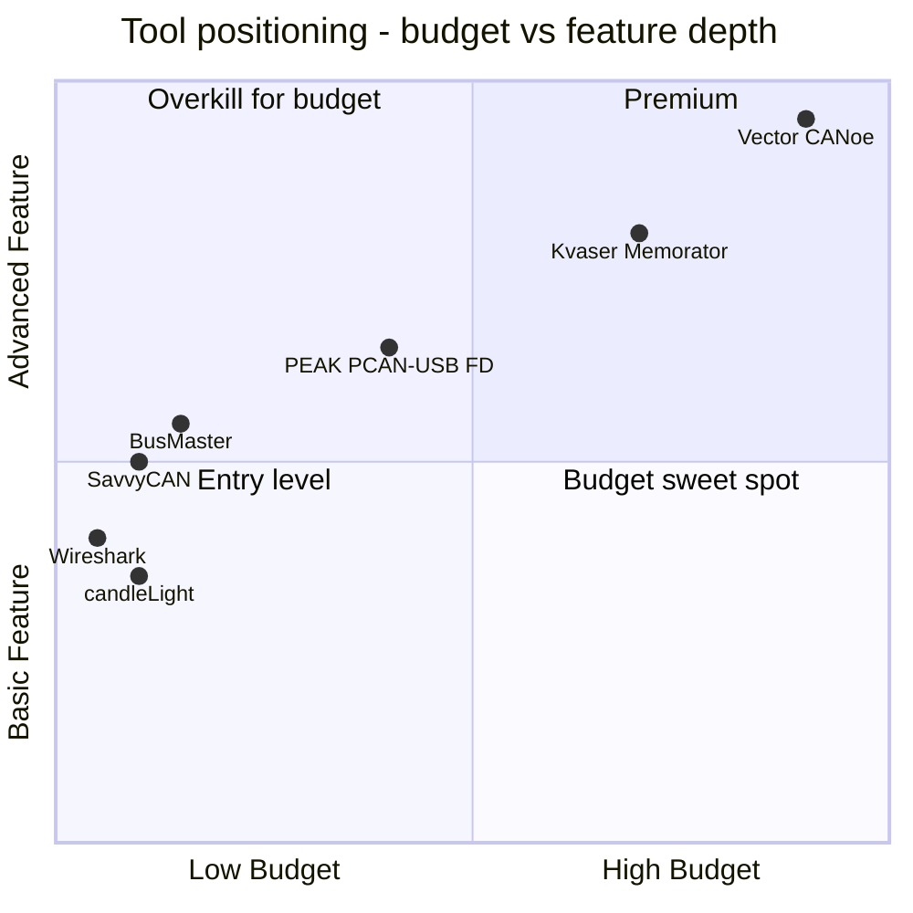
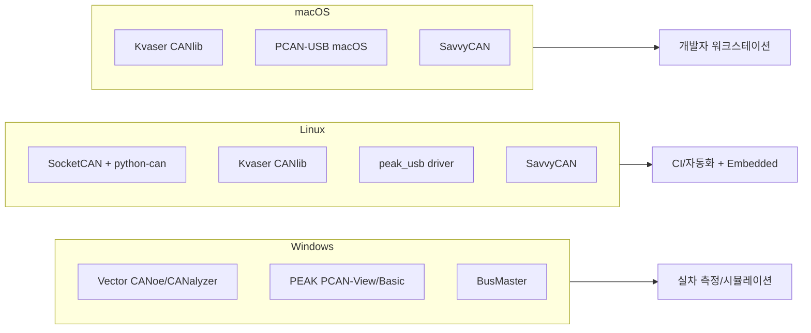

# CH15. 하드웨어 툴

::: info 학습 목표
- Vector·Kvaser·PEAK 같은 상용 CAN 어댑터의 포지셔닝과 강점을 구분할 수 있다.
- candleLight·SeeedStudio 같은 오픈소스·저가 어댑터가 어디에 맞고 어디에서 약한지 안다.
- BusMaster·SavvyCAN·Wireshark·cantools 같은 소프트웨어 툴을 상황별로 고를 수 있다.
- 예산·OS·FD·DBC·스크립팅 관점의 비교표를 보고 프로젝트 초기에 장비를 결정한다.
- 프로덕션·실차 로깅·리버스 엔지니어링·CI 자동화 각각에 맞는 체인을 구성한다.
:::

## 1. 장비 선택이 바로 비용이다

CAN 프로젝트의 생산성은 <strong>툴 체인</strong>에 크게 좌우된다. 어댑터 하나, 분석 소프트웨어 하나가 며칠의 디버깅을 단축한다. 반대로 잘못 고르면 특정 OS에서만 동작하거나, CAN FD를 못 찍거나, DBC 연동이 불가능해 같은 작업을 두 배로 한다. 이 장은 시장에서 실제로 쓰이는 장비·소프트웨어를 카테고리별로 훑고, 끝에서 선택 기준을 정리한다.

특히 <strong>팀 전체가 같은 툴을 쓰는가</strong>가 중요하다. 설계팀·펌웨어팀·검증팀·양산팀이 서로 다른 어댑터와 분석기를 쓰면, 같은 현상을 서로 다르게 기록해 재현 가능성이 떨어진다. 초기에 툴 체인을 표준화하는 투자가 프로젝트 수명 동안 되돌아온다. 이 장은 그 결정을 돕는 것이 목적이다.

## 2. 어댑터·소프트웨어·로그의 3층 구조

툴 체인을 논할 때는 레이어를 분리해 이해하는 것이 편하다. 가장 아래가 <strong>어댑터(하드웨어)</strong>다. USB·PCIe·M.2 등으로 호스트와 연결되고, 차량 버스의 신호를 디지털 프레임으로 바꾼다. 중간은 <strong>소프트웨어(분석·시뮬레이션)</strong>다. 그래프·스크립팅·DBC 해석을 제공한다. 맨 위는 <strong>로그·분석 산출물</strong>이다. 형식이 표준화돼야 나중에 다시 읽힌다.

이 3층이 다른 벤더로 구성될 수도 있다. Kvaser 어댑터 + Vector CANoe + MF4 로그 같은 조합이 실제로 흔하고, SocketCAN + SavvyCAN + pcapng 같은 오픈 스택도 마찬가지다. 한 층을 고치면 다른 층도 대체 가능한지 미리 확인해야 큰 전환 비용을 피한다.

## 3. 상용 어댑터 — Vector, Kvaser, PEAK

### Vector CANcase / CANoe / CANalyzer

업계 표준에 가장 가까운 스택이다. Vector는 <strong>어댑터 + 소프트웨어</strong>를 한 벤더가 제공하는 것이 강점이다. <strong>CANoe</strong>는 시뮬레이션까지 아우르는 통합 환경이고, <strong>CANalyzer</strong>는 그중 분석·측정 파트만 뽑은 경량 버전이다. Measurement setup으로 라이브 모니터링, trace window로 시간축 분석, statistics로 busload·프레임 주기 통계, <strong>CAPL</strong> 스크립팅으로 자동화 시나리오를 짠다. DBC·ARXML(AUTOSAR)·LDF(LIN)·FIBEX(FlexRay)까지 모두 읽는다.

단점은 가격이다. 라이선스·하드웨어·옵션 번들이 모두 독립이라 도입 비용이 높다. 대신 OEM·Tier1과의 호환성과 신뢰성을 얻는다.

CAPL은 진입 장벽이 낮지 않다. C 문법 기반이지만 이벤트 모델·타이머·메시지 접근 방식이 독특하고, 디버깅 툴도 CANoe 내부에 종속돼 있어 일반 C 개발자가 곧바로 능숙해지기는 어렵다. 다만 일단 익히면 <strong>rest bus simulation·HIL·자동 회귀</strong>의 강력한 도구가 된다. 국내 OEM 프로젝트에서는 CAPL 능력을 요구하는 포지션이 꾸준히 열린다.

### Kvaser Leaf Pro / Memorator / PCIe

USB·PCIe 폼팩터의 <strong>고성능 로깅·측정용</strong> 어댑터다. <strong>CANlib</strong> SDK가 C·Python·.NET을 지원하고, macOS·Linux 대응도 비교적 양호하다. <strong>Memorator</strong> 라인은 SD 카드를 품은 standalone 로거라, 노트북 없이 차량에 직접 연결해 24시간 기록을 남긴다. 리버스 엔지니어링·필드 테스트에서 특히 인기가 많다.

Kvaser는 벤더 소프트웨어보다 <strong>SDK 개방성</strong>이 핵심 강점이다. 회사 특유의 툴 체인을 그대로 얹거나, python-can의 `kvaser` backend로 바로 연결 가능하다.

Memorator에는 <strong>t-script</strong>라는 독자 스크립트 엔진이 있어, 장치 단독으로 이벤트 트리거·조건부 로깅을 실행한다. 예컨대 "엔진 회전수가 임계값을 넘는 순간부터 30초간만 로깅" 같은 규칙을 장치에 심어둘 수 있다. 필드 디버깅에서 시간·저장 공간을 동시에 아끼는 방법이다.

### PEAK PCAN-USB / PCAN-PCI

가성비의 대명사다. <strong>PCAN-View</strong>(무료 GUI), <strong>PCAN-Basic API</strong>(C·Python·.NET), 유료의 <strong>PCAN-Explorer</strong>까지 스택이 잘 짜여 있다. 개인 엔지니어·소규모 팀의 입문 장비로 널리 쓰인다. Linux `peak_usb` 드라이버가 커널에 들어와 있어 SocketCAN에서도 거의 plug-and-play다.

CAN FD 버전(PCAN-USB FD)까지 합리적 가격에 나와서, 지난 몇 년간 점유율이 꾸준히 늘었다.

PEAK의 장점은 제품 계층이 깊다는 점이다. USB 단일 채널 보급형부터 PCIe 4채널·M.2·최근에는 <strong>PCAN-Router</strong>·<strong>PCAN-Gateway</strong>처럼 자체 ECU처럼 동작하는 제품까지 갖춰, 프로토타입·소량 생산에 끼워 넣기 좋다. 국내에서는 대학 연구실·스타트업이 가장 많이 쓰는 라인이기도 하다.

## 4. 오픈소스·저가 어댑터

### candleLight(gs_usb)

STM32 기반 오픈 펌웨어를 얹은 USB-CAN 장치의 총칭이다. 리눅스에는 `gs_usb` 드라이버가 들어 있어 `ip link` 한 줄에 뜬다. 하드웨어 설계와 펌웨어가 공개되어 있어 자작도 가능하다. 가격이 저렴하지만 <strong>상용 품질·테크 서포트는 기대할 수 없다</strong>.

CANable·CANtact·Innomaker USB2CAN 등 파생 제품군이 많고, 펌웨어만 교체하면 SLCAN·gs_usb 모드를 자유롭게 오간다. 교육·개인 프로젝트·간단한 홈 자동화에는 더 이상 고를 필요가 없을 정도로 충분하다.

### USB2CAN

Windows·Linux에서 SLCAN 프로토콜 또는 전용 드라이버로 붙는 제품군. 저가 현장 용도에 좋다.

### SeeedStudio USB-CAN-B / CAN-B FD

시리얼 프로토콜 기반의 저가 어댑터. python-can `seeedstudio` 백엔드가 있다. 퀵 프로토타입·교육용으로 쓸 만하다.

::: warning 저가 어댑터의 한계
가격은 매력적이지만 고부하 구간에서 프레임 드랍, 타임스탬프 정확도 부족, 펌웨어 버그 같은 문제를 만나기 쉽다. 차량 출고 단계 측정·법적 로깅·인증 테스트에는 상용 Vector·Kvaser·PEAK를 쓰는 것이 현실적이다.
:::

## 5. 소프트웨어 툴

### BusMaster

BOSCH가 오픈소스로 공개한 <strong>무료 CAN 분석기</strong>다. PEAK·Kvaser·ETAS·Vector 어댑터를 붙일 수 있고, DBC decoder·signal viewer·로그 replay·자동 시그널 그래프까지 갖춰 무료치고는 막강하다. Windows 전용이 아쉬운 점.

강점은 <strong>노드 시뮬레이션</strong>이 가능하다는 점이다. 간단한 JS/Python 유사 스크립트로 특정 ID를 주기 송신하거나 다른 ID에 반응하게 할 수 있어, 가벼운 rest bus simulation을 무료로 만든다. 대규모 프로젝트는 CANoe가 유리하지만, 학습·소규모 프로토타입에는 BusMaster가 비용 대비 효용이 가장 크다.

### SavvyCAN

<strong>차량 해킹·리버스 엔지니어링 커뮤니티</strong>에서 사실상 표준이 된 오픈소스 툴이다. SocketCAN·CANdle·CANable 같은 저가 어댑터와 잘 맞고, ID 단위로 변화 감지·스크러빙·fuzzing 기능이 있다. Windows·Linux·macOS 모두 돈다.

핵심 기능은 <strong>Sniffer</strong>, <strong>Frame Playback</strong>, <strong>Scripting</strong>, <strong>DBC 관리</strong>다. Sniffer 창에서 특정 ID를 고정시키고 차량 동작을 바꾸면 어떤 바이트가 변하는지 직관적으로 보인다. 여기서 관찰한 내용을 DBC로 옮기고, 다시 스크립트로 자동 검증하는 흐름이 리버스 워크플로우의 전형이다.

### Wireshark

네트워크 스니퍼로 유명하지만 Wireshark도 <strong>SocketCAN 링크 타입</strong>을 이해한다. `tshark -i can0`으로 캡처하고 pcapng로 저장해 나중에 다시 열 수 있다. 패킷 분석·필터 언어(`can.id == 0x123`)를 그대로 쓸 수 있어 네트워크 엔지니어 출신에게 친숙하다.

최근 버전에서는 <strong>ISO-TP·UDS dissector</strong>가 포함되어, CAN 하위 레벨이 아니라 세그먼트화된 진단 메시지를 조립된 상태로 보여준다. 이더넷·DoIP 테스트와 한 화면에 놓고 보기 좋아, 연결된 차량 게이트웨이의 상위 레이어 검증에 특히 편리하다.

### cantools

Python 기반 <strong>DBC 파서·디코더</strong>. CLI로 `cantools decode dbc vehicle.dbc can0` 하나면 candump 스트림을 실시간 신호 값으로 바꿔 보여준다. CH16에서 상세히 다룬다.

### 기타 주목할 도구

- <strong>Kayak</strong> — Java 기반 오픈소스 CAN 분석기. 멀티 플랫폼.
- <strong>CANdo</strong> — 영국 Netronics의 소형 CAN 어댑터·소프트웨어 세트. 경량 프로토타입에 적합.
- <strong>CANEdge</strong>(CSS Electronics) — 덴마크제 초소형 standalone 로거. SD·클라우드 업로드 조합이 특장점.
- <strong>python-can-logconvert</strong> — `.log`·`.asc`·`.blf`·`.mf4` 포맷 간 변환. Vector ASC 로그를 리눅스 파이프라인으로 가져올 때 자주 쓴다.

## 6. 선택 기준 표

| 축 | Vector CANoe | Kvaser Memorator | PEAK PCAN-USB | candleLight | BusMaster | SavvyCAN |
|----|--------------|------------------|---------------|-------------|-----------|----------|
| 예산 | 고(수백만원~) | 중(수십~백만원) | 저~중(십만원대) | 최저(수만원) | 무료 SW | 무료 SW |
| OS | Windows | Win/Lin/macOS | Win/Lin/macOS | Win/Lin/macOS | Windows | Win/Lin/macOS |
| CAN FD | O(고급) | O | O(FD 모델) | 일부 제품 | 의존 | O |
| DBC/ARXML | O/O | O(CANlib) | O(PCAN-Explorer) | 외부 툴 | O | O(일부) |
| 실시간 시각화 | 최상 | 좋음 | 좋음 | 보통 | 좋음 | 좋음 |
| 로그 재생 | O | O(Memorator SD) | O | 외부 | O | O |
| 스크립팅 | CAPL | CANlib(C/Py) | PCAN-Basic | python-can | CANScript | 내부 스크립트 |

이 표는 절대적인 순위가 아니다. "같은 무게로 여러 축을 놓고 볼 때 이렇게 위치한다"는 <strong>포지셔닝 맵</strong>에 가깝다. 예산 대비 기능을 2축 그래프로 보면 더 직관적이다. 또한 이 표에 없는 축이 두 개 있는데, <strong>학습 곡선</strong>과 <strong>기술 지원</strong>이다. 무료·오픈소스 툴은 학습 곡선이 완만하지만 공식 지원이 없고, 상용 툴은 고비용 대신 에스컬레이션 경로가 분명하다. 프로젝트의 리스크 허용도와 인력 구성을 보고 가중치를 조정해야 한다.



## 7. 실전 활용 사례

### 프로덕션 배포 전 — signal timing 측정

출하 전 ECU의 주기 메시지가 규격을 지키는지 확인할 때는 <strong>CANalyzer statistics</strong> 기능이 가장 빠르다. 각 ID의 평균·최소·최대 주기, jitter, busload를 한 화면에 보여준다. 요구사항 "10ms ±1ms" 같은 규격이 얼마나 지켜지는지 즉시 확인할 수 있다.

이 측정에서 자주 놓치는 것이 <strong>가속 테스트</strong>다. 버스 부하를 인위적으로 70~80%까지 올렸을 때 특정 메시지의 지연이 얼마나 길어지는지, error passive가 발생하는지를 본다. 실기 시험에서 평균 부하는 여유가 있었지만 피크에서 규격을 위반한 사례가 많기 때문이다. 가속 테스트는 CANoe Stimulation·python-can `cangen -g 1` 같은 도구로 쉽게 만든다.

### 차량에서 24시간 로깅

현장 트래킹·간헐 고장 재현에는 노트북을 붙여두기 힘들다. <strong>Kvaser Memorator</strong>에 SD 카드를 꽂아 차량에 설치하면 키 온·오프 기준으로 자동 로깅된다. 나중에 `.kmf` 또는 `.asc`로 덤프해 분석한다.

SD 카드 용량 산정이 중요하다. 500kbps 버스를 평균 40% 부하로 24시간 기록하면 대략 2~3GB가 쌓인다. 일주일 단위 현장 투입이라면 32GB 이상이 안전하다. 또한 차량 전원 차단 시 파일 손상 방지를 위해 <strong>상시 전원·슈퍼 캐패시터 백업</strong>이 있는 로거를 고르는 것이 안전하다. 최근에는 Kvaser 외에도 CSS Electronics CANedge, Influx Rebel이 이 시장에서 치열하게 경쟁한다.

### 리버스 엔지니어링

미지의 차량 네트워크를 해석할 때는 <strong>SavvyCAN + Kvaser/PCAN</strong>이 정석이다. ID 단위로 값 변화를 스크러빙하고, 가설을 세운 후 주행하면서 검증한다. 공격 벡터(CH22)는 이 도구를 전제로 한다.

보편적 절차는 네 단계다. 먼저 <strong>정적 관찰</strong>로 ID 목록·주기·활성 노드 수를 파악하고, 다음 <strong>조작 상관</strong>으로 특정 행위(핸들 조작·브레이크·방향지시등)에 반응하는 ID를 좁힌다. 그 다음 <strong>비트 플립 실험</strong>으로 페이로드 안쪽의 필드를 찾고, 마지막 <strong>장기 로깅</strong>으로 가설을 확인한다. 각 단계마다 도구의 강점이 다르므로 하나만 고집하면 효율이 떨어진다.

### CI에서 자동화 테스트

CI 러너에서는 SocketCAN + vcan이 왕이다(CH14). python-can·cantools로 pytest에서 메시지 어서션을 건다. 인증 테스트가 필요하면 별도 야간 러너에 PCAN-USB·Kvaser를 붙여 실기 회귀까지 돌린다.

이 체계의 장점은 <strong>CI가 깨지는 이유</strong>를 명확히 구분할 수 있다는 점이다. vcan 단계에서 깨지면 로직 버그, 실기 단계에서 깨지면 타이밍·물리 계층 문제로 빠르게 분류된다. 한 러너에 모든 테스트를 몰아넣으면 원인 분석에 시간이 더 든다.

## 8. OS별 툴 체인

OS가 고정되면 선택지가 크게 좁아진다. 아래 도식이 가장 자주 보는 조합이다.



Windows는 Vector·BusMaster 생태계가 가장 풍부하고, Linux는 SocketCAN을 중심으로 개발·CI가 가장 자연스럽고, macOS는 Kvaser·PEAK를 통해 SavvyCAN·python-can을 얹는 구성이 보편적이다.

## 9. CANoe 시뮬레이션과 CAPL 맛보기

CANoe의 진짜 힘은 분석이 아니라 <strong>시뮬레이션</strong>에서 나온다. 미완성 ECU 자리에 가상 노드를 심는 <strong>rest bus simulation</strong>이 대표적이다. CAPL(Communication Access Programming Language)은 이벤트 기반 언어다.

```capl
variables
{
  message EngineData engineMsg;
  msTimer tmr100ms;
}

on start
{
  setTimer(tmr100ms, 100);
}

on timer tmr100ms
{
  engineMsg.RPM = 1000 + random(500);
  output(engineMsg);
  setTimer(tmr100ms, 100);
}

on message VehicleSpeed
{
  write("Speed received: %d", this.Speed);
}
```

`on timer`는 주기 송신, `on message`는 수신 이벤트 핸들러다. 실제 프로젝트에서는 이런 스크립트 수십 개가 모여 가상 차량을 구성하고, 개발 중인 ECU 하나만 실기로 끼워 통합 테스트를 한다. Kvaser·PEAK 환경에서는 CAPL 대신 python-can·Kvaser t-script로 비슷한 패턴을 짠다.

한 가지 기억할 점은 <strong>시뮬레이션 정밀도</strong>다. CANoe는 클럭을 정확히 맞추고, 주기 송신 지터를 수 μs 단위로 제어한다. python-can·CAPL 유저 공간 시뮬레이터는 OS 스케줄러에 의존하므로 ms 단위 편차가 드물지 않다. 타이밍에 엄격한 프로토콜(XCP DAQ, SecOC timestamp)을 검증할 때는 이 차이가 test failure로 드러난다. CI에서 검증하기 어려운 타이밍 항목은 CANoe 세션을 남겨두는 것이 현실적이다.

## 10. 로그 포맷 — 공용어가 중요하다

어떤 도구를 쓰든 결과는 <strong>로그 파일</strong>로 남는다. 파일 포맷은 다시 들여다볼 때 도구 선택을 규정한다.

- <strong>ASC(Vector ASCII)</strong> — 가장 흔한 텍스트 포맷. 타임스탬프·ID·데이터가 한 줄에. 큰 파일도 `grep`으로 다룰 수 있는 장점이 있다.
- <strong>BLF(Vector Binary Logging)</strong> — 바이너리·압축. 수 GB 로그를 효율적으로 담고, CANoe·CANalyzer 기본 포맷.
- <strong>MF4(ASAM MDF 4)</strong> — 측정·캘리브레이션 분야의 표준. 신호·이벤트·다중 버스(CAN·LIN·FlexRay·Ethernet)를 한 파일에.
- <strong>candump log(SocketCAN)</strong> — 리눅스 진영 표준. `(timestamp) interface id#data` 형식.
- <strong>PCAP/PCAPNG</strong> — Wireshark 연동. socketcan 링크 타입 명시 필요.

로그 포맷이 혼재되면 분석이 파편화된다. `python-can`의 `Logger`·`LogReader`는 이 포맷들 사이를 변환해주므로, 프로젝트 초기에 <strong>1차 로그 포맷</strong>을 정하고 분석 스택을 그쪽에 맞추는 것이 효율적이다. OEM 제출용은 대개 BLF·MF4로 수렴한다.

## 11. 툴 선정 체크리스트

프로젝트 초기에 던져야 할 질문들이다.

1. <strong>어떤 OS가 메인인가?</strong> Windows면 Vector, Linux면 SocketCAN이 자연스럽다.
2. <strong>CAN FD 필요한가?</strong> 최신 ECU·ADAS라면 거의 필수. FD 모델을 처음부터 고른다.
3. <strong>DBC/ARXML 표준을 쓰는가?</strong> OEM 프로젝트라면 ARXML 지원 필수. 자체 포맷은 cantools로 충분.
4. <strong>standalone 로깅이 필요한가?</strong> 차량·농기계 야외 테스트에는 Memorator급 필수.
5. <strong>시뮬레이션·rest bus가 필요한가?</strong> 있다면 CANoe 또는 자작 python-can 시뮬레이터.
6. <strong>CI에서 돌려야 하는가?</strong> SocketCAN + vcan 기반으로 설계하고, 상용 툴에 종속되지 않게 한다.

이 여섯 질문의 답을 모으면 벤더 두 개쯤으로 후보가 좁혀진다. 이후는 예산·조직 표준·기존 자산이 결정한다.

추가로 고려해야 할 것은 <strong>교육·인증·커뮤니티</strong>다. Vector·Kvaser는 공식 교육 과정이 있어 팀 온보딩이 빠르고, 국내에도 파트너 교육이 열린다. 오픈소스 진영은 문서·포럼·GitHub 이슈가 많아 독학 친화적이다. 프로젝트가 장기라면 인력 확보·유지보수 관점까지 넣어 결정해야 한다.

## 12. 현장 사용자가 흔히 하는 실수

- <strong>어댑터 전원을 의심하지 않는다</strong> — USB 허브 전력 부족으로 샘플 드랍이 나는데 "소프트웨어 탓"이라 고생하는 경우가 흔하다.
- <strong>타임스탬프 기준을 문서화하지 않는다</strong> — 하드웨어 vs 호스트 타임스탬프 차이가 수 ms. 장기 로그 비교 시 원인 모를 편차가 된다.
- <strong>DBC 버전 관리를 로컬에서만 한다</strong> — 실기 로그 파일에는 DBC 해시가 안 박힌다. 분석 시 "그때 어떤 DBC였지?"로 몇 시간 허비한다.
- <strong>CAN FD 스위치를 까먹는다</strong> — 어댑터는 FD인데 링크를 classical로 올려 통신이 안 되는 초기 실수. `ip -details link`를 습관화한다.
- <strong>보정·교정 주기를 무시한다</strong> — 측정 장비는 교정이 필요하다. 특히 오실로스코프·BusMaster 타이밍 측정에서 교정 주기를 놓치면 데이터 신뢰성이 떨어진다.

## 다음 챕터

이제 장비는 쥐었다. 다음은 언어다. CAN 프레임에 신호를 실어 나르는 공용어가 <strong>DBC</strong>다. CH16에서는 DBC 파일 구조, Intel/Motorola 바이트 오더, Factor/Offset 계산, cantools로 파싱·인코딩·C 코드 생성까지 실전으로 풀어낸다.

::: tip 핵심 정리
- Vector는 업계 표준에 가장 가깝고 가격이 높다. Kvaser는 SDK 개방성·standalone 로깅, PEAK는 가성비가 강점이다.
- 저가·오픈소스 어댑터(candleLight·SeeedStudio)는 학습·자작에 좋지만 프로덕션 측정에는 부적합하다.
- BusMaster(Win)·SavvyCAN(멀티 OS)·Wireshark·cantools가 무료 소프트웨어 체인의 뼈대다.
- 선택은 예산·OS·FD·DBC·스크립팅·standalone 로깅 여섯 축으로 끊는다.
- CI 자동화는 SocketCAN + vcan, 실기 회귀는 Kvaser·PEAK, 시뮬레이션은 CANoe가 전형 조합이다.
:::
