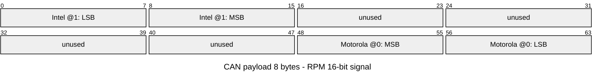
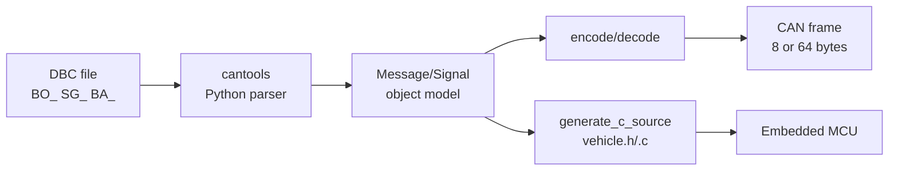

# CH16. DBC와 시그널 인코딩

::: info 학습 목표
- DBC 파일의 역할과 위상, 기본 문법(BO_ / SG_)을 읽을 수 있다.
- Intel(LSB) vs Motorola(MSB) 바이트 오더의 차이와 실무 함정을 구분한다.
- Factor·Offset·Unit으로 raw 값과 물리 값을 변환한다.
- Multiplexed signal의 개념과 용도를 안다.
- cantools로 DBC를 파싱·encode·decode하고, C 코드까지 생성해 임베디드에 이식한다.
- ARXML·LDF·FIBEX가 DBC와 어떻게 관계되는지, 그리고 DBC 자산을 어떻게 관리할지 안다.
:::

## 0. 이 장의 위치

CH14·CH15에서 SocketCAN·상용 툴로 프레임을 다루는 법을 봤다. 그러나 프레임은 바이트의 묶음이지 <strong>의미</strong>가 아니다. DBC는 그 의미를 기술하는 계약서다. DBC 없이는 analyzer가 "이건 RPM이고 값은 1000이야"라는 말을 못 한다. 이 장은 DBC 문법, 바이트 오더, 스케일 계산, cantools 기반 자동화를 연결해서, CAN 통신을 "바이트"에서 "신호"로 올려다보는 시점을 만든다.

## 1. DBC란 무엇인가

<strong>DBC(Database CAN)</strong>는 Vector가 만든 ASCII 포맷으로, CAN 네트워크의 <strong>메시지·신호·노드</strong>를 한 파일에 기술한다. OEM·Tier1·분석 툴·시뮬레이터가 모두 DBC를 입·출력 포맷으로 쓰기 때문에 사실상 업계 표준이 됐다. 차량 개발자가 "CAN 매트릭스"라고 부르는 것이 대개 DBC 파일이다.

DBC가 없으면 모든 것이 바이트 배열이다. `0x123 8 DE AD BE EF 00 00 01 F4` 같은 덤프가 "RPM 1000, 온도 80℃" 같은 의미로 변환되려면 DBC에 기술된 디코딩 규칙이 필요하다.

DBC는 단순한 문서가 아니라 <strong>계약</strong>이다. 송신 ECU와 수신 ECU, 그리고 분석 도구가 모두 같은 파일을 기준 삼아 동작한다. 그래서 DBC의 변경은 곧 인터페이스 변경이고, 팀 전체에 파급 효과를 가진다. 이 장은 DBC의 문법을 읽는 방법과 함께, 실무에서 자주 만나는 함정을 정리한다.

## 2. DBC 파일 구조 훑기

DBC는 키워드 기반 텍스트다. 핵심은 <strong>BO_ (Message)</strong>와 <strong>SG_ (Signal)</strong> 두 줄이다.

```
BO_ 256 EngineData: 8 ECU1
    SG_ RPM : 0|16@1+ (0.25,0) [0|16383.75] "rpm" Dashboard
    SG_ Temp : 16|8@1+ (1,-40) [-40|215] "degC" Dashboard

BO_ 257 VehicleSpeed: 4 ECU2
    SG_ Speed : 0|16@1+ (0.01,0) [0|655.35] "km/h" Dashboard
```

한 줄씩 읽어보자.

- `BO_ 256 EngineData: 8 ECU1` — 메시지 ID 256(0x100), 이름 `EngineData`, DLC 8바이트, 송신자 `ECU1`.
- `SG_ RPM : 0|16@1+ (0.25,0) [0|16383.75] "rpm" Dashboard` —
  - `0|16` → 시작 비트 0에서 16비트 길이
  - `@1+` → Intel(LSB first) 바이트 오더, unsigned
  - `(0.25, 0)` → factor 0.25, offset 0
  - `[0|16383.75]` → 최소·최대 물리 값
  - `"rpm"` → 단위
  - `Dashboard` → 수신자 노드

이름 붙이기 관례도 눈여겨볼 만하다. 메시지 이름은 보통 송신 주체와 내용을 결합한 명사(EngineData, ChassisSpeed)로, 신호 이름은 물리량과 접미사(`_Status`, `_Active`, `_Request`)를 섞어 의미를 드러낸다. 한 프로젝트 안에서 일관성을 지키지 않으면 DBC 병합 시 충돌과 오해가 쌓이므로, 초기 단계에 네이밍 가이드를 문서화해 두는 것이 중요하다.

<strong>시작비트|비트길이@바이트오더부호</strong>의 문법이 DBC의 심장이다. 이걸 읽지 못하면 DBC를 읽는 게 아니다.

추가로 DBC는 <strong>BU_</strong>(노드 목록), <strong>CM_</strong>(주석), <strong>BA_</strong>(속성), <strong>VAL_</strong>(값 테이블)을 갖는다. BU_에는 네트워크에 참여하는 모든 노드가 열거되고, CM_로는 메시지·신호에 사람이 읽을 설명을 달 수 있다. BA_는 주기·타임아웃·기본값 등 메타 속성을 지정하고, VAL_은 "0=Off, 1=On, 2=Auto"처럼 enum 매핑을 기록한다. 실무 DBC는 이 요소들이 엉켜 수만 줄에 이르지만, BO_/SG_의 뼈대를 놓치지만 않으면 해석은 어렵지 않다.

## 3. Intel vs Motorola — 바이트 오더의 함정

CAN 프레임의 <strong>8바이트 페이로드</strong>에 signal을 어디에 어떻게 놓을지 결정하는 것이 바이트 오더다. DBC는 두 가지를 지원한다.

- <strong>Intel(little-endian)</strong> — `@1`로 표기. LSB가 낮은 바이트·낮은 비트에 놓인다.
- <strong>Motorola(big-endian)</strong> — `@0`로 표기. MSB가 낮은 바이트에 놓인다.

둘의 차이는 단순해 보이지만, 특히 <strong>여러 바이트에 걸친 신호</strong>에서 버그의 단골 원인이다. 16비트 RPM 신호가 start_bit=0, length=16일 때, 같은 바이트 배열이 Intel과 Motorola에서 어떻게 해석되는지 보자.



같은 "RPM"이라도 DBC 표기가 `0|16@1+`(Intel)와 `7|16@0+`(Motorola, MSB 비트 오프셋 규약) 때 페이로드의 비트 배치가 달라진다. 두 시스템이 같은 DBC를 썼다고 믿고 바이트 오더만 다르게 구현하면 값이 <strong>엉뚱한 수</strong>로 나오고, 종종 상한을 벗어나 안전 판정까지 뒤틀린다.

Intel이 실무에서 선호되는 이유는 <strong>MCU의 바이트 오더와 일치</strong>하기 때문이다. ARM Cortex-M·x86 계열은 little-endian이라 Intel 배치가 메모리와 직접 맞다. 반면 Motorola 방식은 과거 68K·PowerPC 계열 ECU에서 시작해 자동차 업계에 뿌리내렸다. 오래된 파워트레인 ECU·엔진 제어 모듈에서는 아직 Motorola가 지배적이다. 최근 신규 설계는 거의 Intel로 가고 있지만, 혼합된 DBC를 만날 가능성은 당분간 계속된다.

::: warning 바이트 오더 실전 함정
- 수기로 짠 C 인코더는 거의 항상 Intel·Motorola 중 하나만 정확하다. 믹스된 DBC를 만나면 자동 생성기(cantools, Vector DaVinci)를 써야 한다.
- Motorola 비트 오프셋 규약은 도구마다 미묘하게 다르다. <strong>"sawtooth" vs "forward"</strong> 표기가 있어 Kvaser·Vector·BUSMASTER에서 간혹 해석 충돌이 일어난다. DBC 도구 호환성 표를 참고해야 한다.
:::

## 4. Factor·Offset — raw와 물리의 다리

CAN은 정수만 실어 나른다. 소수·음수·단위는 <strong>factor</strong>와 <strong>offset</strong>으로 매핑한다.

```
physical = raw × factor + offset
raw      = (physical − offset) / factor
```

RPM 예시: raw = 4000, factor = 0.25, offset = 0 → physical = 1000 RPM. 8비트짜리 온도 신호에서 factor = 1, offset = −40을 쓰면 raw 0~255가 −40~215℃로 매핑된다. 이런 식으로 <strong>부호·소수·단위 스케일</strong>을 DBC가 전부 흡수한다.

factor 선택은 분해능·오버플로우의 균형이다. 분해능을 높이려 factor를 작게 잡으면 같은 물리 범위를 표현하는 데 더 많은 비트가 필요하다. 반대로 factor가 너무 크면 양자화 잡음이 커진다. 예컨대 차량 속도를 0.01 km/h 단위로 표현하려면 16비트로도 0~655 km/h까지가 한계다. 요구 명세의 분해능·최대값·비트 예산을 한 번에 놓고 결정해야 한다.

signed 값은 `@1-` 또는 `@0-`처럼 부호 비트를 표시한다. 내부는 <strong>2의 보수</strong>다. Length에 맞춰 sign extension을 해주어야 하므로 수기 구현 시 빠지기 쉬운 함정이다.

실무 요령은 <strong>min·max를 반드시 작성</strong>하는 것이다. DBC가 허용하는 범위가 명시돼 있으면 cantools·CANoe가 encode 단계에서 범위 체크를 해주어, 의도치 않은 값이 버스로 흘러가는 것을 막는다. 범위를 비워두는 관행은 수십만 줄짜리 DBC에서 자주 보이지만, 장기적으로는 버그의 온상이 된다. 새 DBC를 만들 때 사내 스타일 가이드에 "min·max 필수"를 명시하는 것이 좋다.

## 5. Initial Value·Default — 놓치면 조용히 어긋난다

DBC에는 `BA_ "GenSigStartValue"`처럼 <strong>초기값</strong>을 지정하는 속성이 있다. ECU가 부팅된 직후, 실제 센서 값이 들어오기 전까지 이 초기값이 버스에 실려 나간다. 초기값이 명확하지 않으면 수신자는 "0인지, 미초기화인지, 실제 측정치인지" 구분하지 못한다. 조향각·가속도 같은 안전 관련 신호에서는 <strong>특수 불량 값</strong>(0xFF·0x7FFF)을 초기값으로 약속하는 방식이 흔하다.

또한 <strong>SNA(Signal Not Available)</strong> 개념이 AUTOSAR·J1939에 명시되어 있다. 일부 raw 값을 "유효하지 않음"으로 고정 예약하고, 수신자는 그 값을 만났을 때 신호를 무시하거나 fallback 로직으로 전환한다. DBC에서 이 규약이 명시적으로 표현되지 않을 때가 많아, 팀 내부 스타일 가이드로 고정해 두는 것이 안전하다.

## 6. Multiplexed Signal — 한 자리의 여러 모드

메시지 공간이 부족할 때 같은 자리에 <strong>모드에 따라 다른 신호</strong>를 싣는 기법이다. 한 비트 필드(mode)가 다음 자리의 의미를 결정한다.

```
BO_ 512 DiagData: 8 ECU3
    SG_ Mode M        : 0|4@1+ (1,0) [0|15] "" Tester
    SG_ BatteryVoltage m0 : 8|16@1+ (0.01,0) [0|655.35] "V" Tester
    SG_ OilTemp m1        : 8|16@1+ (1,-40) [-40|215] "degC" Tester
```

`M`(대문자)이 mode selector, `m0`·`m1`이 각각 mode 0·1에서만 유효한 신호다. `cantools`는 `decode_message(..., decode_choices=True)`로 mode 해석을 자동 처리한다. 주로 <strong>DTC·UDS 같은 진단 메시지</strong>에서 자주 보인다.

확장 문법으로 <strong>Extended multiplex</strong>가 있다. mode 값 자체가 또 다른 서브 모드를 선택하는 계층 구조다. 최근 CAN FD 메시지에서는 64바이트 공간 안에 여러 의미를 섞어 담기 위해 이 기법이 자주 쓰인다. 다만 해석기 호환성을 반드시 확인해야 한다. Vector CANdb++·cantools 최신판은 지원하지만 구형 툴은 그렇지 않다.

## 7. cantools 실전 — 파싱·인코딩·디코딩

cantools는 파이썬에서 DBC를 다루는 표준 도구다.

```python
import cantools
import can

db = cantools.database.load_file('vehicle.dbc')
msg = db.get_message_by_name('EngineData')
data = msg.encode({'RPM': 1000.0, 'Temp': 80.0})

bus = can.Bus(interface='socketcan', channel='can0')
bus.send(can.Message(arbitration_id=msg.frame_id, data=data, is_extended_id=False))

for frame in bus:
    if frame.arbitration_id == msg.frame_id:
        decoded = msg.decode(frame.data)
        print(decoded)  # {'RPM': 1000.0, 'Temp': 80.0}
```

`encode`는 물리 값을 받아 바이트 배열로 바꾸고, `decode`는 그 반대다. 범위를 벗어난 값은 <strong>EncodeError</strong>를 던지므로 테스트 안전망이 된다. CLI도 유용하다.

또한 cantools는 <strong>시뮬레이터</strong>로도 쓸 수 있다. `cantools plot`은 로그 파일을 받아 신호별 시간축 그래프를 그려주고, `cantools monitor`는 실시간 대시보드 형태로 신호 값을 갱신한다. 별도 GUI 없이 터미널 하나로 필드 확인을 끝낼 수 있어, 간단한 점검·시연에 요긴하다.

```bash
# 라이브 디코딩
candump can0 | cantools decode vehicle.dbc

# 특정 신호만 보기
cantools decode --no-strict vehicle.dbc log.asc
```

분석 파이프라인은 보통 `candump → cantools decode → jq/pandas`로 이어진다.

cantools의 또 한 가지 강점은 <strong>strict 모드</strong>다. encode 시 범위 벗어남, scale·offset 계산 후 정수 변환이 불가능한 경우, multiplex mode 불일치 등을 예외로 던진다. 이 예외를 테스트에 엮어두면 잘못된 값이 실기 단계로 넘어가기 전에 걸린다. 반대로 `strict=False`는 값이 잘리거나 반올림되므로, 긴급 디버깅에서만 쓰고 평소에는 strict를 유지해야 한다.

## 8. DBC에서 C 코드로

임베디드에서 cantools 런타임을 돌릴 수는 없다. cantools는 이를 위해 <strong>C 소스 생성기</strong>를 제공한다.

```bash
cantools generate_c_source vehicle.dbc
```

이 명령은 `vehicle.h`·`vehicle.c`를 만들어낸다. 각 메시지마다 `vehicle_engine_data_pack()`·`vehicle_engine_data_unpack()` 같은 함수를 생성하고, 범위 검증·스케일 계산을 정적 코드로 인라인한다. 임베디드에서 <strong>런타임 DBC 파싱 오버헤드가 사라지고</strong>, 빌드 시점에 타입 안전성을 얻는다.

```c
struct vehicle_engine_data_t engine = { 0 };
engine.rpm = vehicle_engine_data_rpm_encode(1000.0);
engine.temp = vehicle_engine_data_temp_encode(80.0);

uint8_t frame[8];
vehicle_engine_data_pack(frame, &engine, sizeof(frame));
can_send(0x100, frame, 8);
```

Vector 생태계에서는 <strong>DaVinci Configurator</strong>가 AUTOSAR Com·ComStack 레이어를 자동 생성한다. 원리는 같다(ARXML에서 C 코드로), 범위만 더 넓다.

이 생성 코드는 보통 <strong>플래시 크기</strong>와 <strong>스택 사용량</strong>이 최적화된다. 중요한 비교 대상은 손으로 쓴 인코더인데, 수기 코드는 함정을 피하기 어렵고(바이트 오더·sign extension·multiplex), 유지보수도 힘들다. DBC가 바뀔 때마다 자동 재생성되는 구조를 잡아두면 장기적으로 품질과 속도가 같이 올라간다. 생성 코드의 테스트는 동일 DBC를 cantools로 인코딩한 결과와 바이트 단위로 비교하는 <strong>golden test</strong>가 가장 견고하다.

## 9. ARXML·LDF·FIBEX — DBC의 친척들



DBC 혼자만 있는 것이 아니다. 산업에서는 표준 포맷이 여러 개 공존한다.

- <strong>ARXML(AUTOSAR XML)</strong> — AUTOSAR 세계의 상위 포맷. DBC가 기술하는 신호·메시지·네트워크에 더해 <strong>소프트웨어 컴포넌트·인터페이스·스케줄</strong>까지 담는다. OEM 프로젝트 공식 산출물.
- <strong>LDF(LIN Description File)</strong> — LIN 네트워크용 DBC 유사물. 슬레이브·프레임·스케줄 테이블 기술.
- <strong>FIBEX</strong> — FlexRay·이더넷까지 포함하는 XML 기반 상위 포맷. 차량 전체 백본 네트워크를 한 파일로 묘사.

DBC로 시작해 프로젝트가 커지면 ARXML·FIBEX로 옮겨가는 것이 일반적이다. cantools는 일부 ARXML도 읽을 수 있지만, 완전한 AUTOSAR 툴체인은 Vector·EB Tresos 같은 상용 도구 몫이다.

정보량은 ARXML이 가장 많지만, 동시에 <strong>가장 읽기 어렵다</strong>. 수백 MB의 XML은 사람이 직접 다룰 수 없고 전용 툴이 필수다. OEM 프로젝트 합류 초기에 ARXML 때문에 당황하는 엔지니어가 많은데, "DBC를 몇 배로 부풀린 것"이라고 이해하면 심리적 장벽이 낮아진다. 기본 모델은 같다 — 메시지·신호·노드·매핑이 XML 요소로 세분화됐을 뿐이다.

## 10. DBC 자산 관리

DBC 파일은 <strong>민감한 지식 자산</strong>이다. 메시지·신호 이름은 차량 내부 구조를 그대로 드러내고, 리버스 엔지니어링의 지름길이 된다. 관리 원칙은 단순하다.

- <strong>버전 관리</strong> — Git에 커밋하되, 크기가 크면 Git LFS를 쓴다. 한 DBC에 수만 줄이 흔하다.
- <strong>릴리즈 태그</strong> — 차량 모델·연식·sample lot 단위로 태그를 붙여 추적.
- <strong>스키마 검증 CI</strong> — PR마다 `cantools database dump`·범위 검증·naming convention 체크를 CI에 건다.
- <strong>배포 보호</strong> — 외부 협력사에 DBC를 전달할 때는 <strong>부분 DBC</strong>(해당 노드 메시지만)로 추려 서명과 함께 전달.
- <strong>백업</strong> — 프로젝트 종료 후에도 DBC는 A/S·리콜 분석에서 다시 꺼낸다. 장기 아카이브가 필수.
- <strong>해시 인쇄</strong> — DBC 파일의 SHA256을 빌드 산출물·릴리즈 노트에 함께 남기면, 현장에서 "이 로그는 어떤 DBC로 해석해야 하나"를 즉시 특정할 수 있다.
- <strong>서명</strong> — DBC 조작은 잘못된 신호 값을 자연스럽게 만들 수 있어 보안에 직접 영향을 준다. 공급망에서 오가는 DBC는 서명이 검증된 경로로만 배포한다.

::: info DBC diff의 기술
DBC 파일은 ASCII라 `git diff`가 동작하지만, 수만 줄에서는 의미 있는 변경을 찾기 힘들다. `cantools compare old.dbc new.dbc` 또는 Vector의 CANdb++ diff 기능이 signal 단위로 차이를 뽑아준다. 릴리즈 노트에 이 diff를 첨부하는 것이 관행이다.
:::

## 11. 흔한 실수 체크리스트

실무에서 자주 만나는 DBC 함정 모음이다.

1. <strong>바이트 오더 혼동</strong> — Intel·Motorola를 한 DBC에 섞어 쓰면 수기 구현이 반드시 틀린다. 자동 생성기로 가야 한다.
2. <strong>Signed vs Unsigned 착각</strong> — 온도·조향각처럼 음수가 정상인 신호에 `+`를 쓰면 영상만 표시된다.
3. <strong>Factor 단위 혼선</strong> — 같은 RPM이라도 factor 0.25와 1.0이 섞인 프로젝트가 있다. 통합 단계에서 값이 4배·0.25배로 나오면 이 문제다.
4. <strong>Multiplex mode 누락</strong> — mode selector 없이 다중 신호를 해석하면 데이터가 섞인다.
5. <strong>DLC 불일치</strong> — DBC가 선언한 DLC와 실제 ECU 송신 길이가 다르면 cantools는 strict 모드에서 decode를 거부한다. `--no-strict`로 넘기면 조용히 잘못 해석되니 가능하면 엄격 모드로 둔다.
6. <strong>Value table 번역 실수</strong> — enum 같은 `VAL_` 테이블의 값·문자열 매핑이 DBC 간 불일치하면 리포트 값이 이상해진다.
7. <strong>BU_ 불일치</strong> — 메시지 송신자·수신자 노드 정의가 실제 네트워크 구성과 다르면, rest bus simulation에서 의도치 않은 노드가 메시지를 생성하거나 기대한 노드가 송신을 안 할 수 있다.
8. <strong>주기 정보 누락</strong> — `BA_ "GenMsgCycleTime"` 속성을 빼먹으면 시뮬레이션이 주기 송신을 못 설정한다. 자동 측정 스크립트도 이 정보에 의존한다.
9. <strong>중복 ID</strong> — 서로 다른 메시지에 같은 ID가 들어가면 분석기가 마지막 정의만 사용하는 도구가 있다. 병합 시 주의.
10. <strong>CRC·Counter 자동화 누락</strong> — SecOC·E2E 보호처럼 CRC·Alive counter가 포함된 메시지는 수기 인코딩이 아니라 라이브러리 호출이 필요하다. DBC 주석·스키마에 명시해야 한다.

## 12. 실전 워크플로우 예시

신입 엔지니어가 "새 ECU의 DBC를 통합하라"는 과제를 받았다고 하자. 전형적 절차는 다음과 같다.

1. <strong>DBC 수령·검증</strong> — `cantools database dump vehicle.dbc`로 메시지·신호를 훑는다. 범위·바이트 오더·signed/unsigned가 설계 문서와 일치하는지 확인.
2. <strong>기존 DBC와 병합</strong> — 중복 ID, 이름 충돌, 노드 중복을 체크. `cantools compare`·Vector CANdb++ diff가 중심 도구.
3. <strong>시뮬레이션 확인</strong> — vcan + cantools·BusMaster로 rest bus를 돌려 새 메시지가 올바른 주기로 송신되는지, 디코딩 값이 설계 범위 안에 있는지 본다.
4. <strong>생성 코드 회귀</strong> — `cantools generate_c_source`로 C 코드 생성. 기존 임베디드 빌드에 병합 후 golden test 통과 여부 확인.
5. <strong>실기 통합</strong> — 실제 ECU와 연결해 candump + cantools decode로 라이브 검증. 오류·버스 부하·타임아웃을 관찰.
6. <strong>릴리즈</strong> — DBC 파일, 해시, diff 노트, 회귀 테스트 결과를 한 릴리즈로 묶어 기록.

이 여섯 단계가 돌면 DBC 통합의 사고는 대부분 막힌다. 처음에는 번거로워 보이지만, DBC 관련 현장 사고의 90%는 1~4단계를 건너뛴 데서 나온다.

## 13. DBC의 한계와 대안

DBC에도 약점이 있다. <strong>SOME/IP·DoIP·서비스 지향 통신</strong>처럼 차량 이더넷에서 쓰는 메시지 모델을 표현하지 못한다. CAN XL·Ethernet TSN이 보편화되면서 DBC만으로는 네트워크 전체를 기술하기 어려워졌다.

차량 업계는 이를 <strong>ARXML 기반 통합</strong>이나 <strong>FIBEX 상위 포맷</strong>으로 대응 중이다. 또한 JSON·YAML로 된 경량 대체안(예: CSS Electronics의 JSON signal DB)도 커뮤니티에서 실험되고 있다. 그러나 당분간 생태계의 중심은 DBC가 유지된다. 적어도 2030년까지는 이 포맷을 읽고 쓰는 능력이 차량·농기계 개발자의 기본 소양으로 남을 가능성이 높다.

## 다음 챕터

DBC로 <strong>신호의 의미</strong>를 얻었다. 이제 신호가 올라탄 네트워크 전체가 어떻게 깨고 자는지, 어떤 노드가 언제 살아 있는지 조율하는 <strong>Network Management</strong>로 넘어간다. CH17에서는 OSEK NM, AUTOSAR NM, Partial Networking을 실전 관점에서 다룬다.

::: tip 핵심 정리
- DBC는 차량 CAN 네트워크의 공용어다. BO_(메시지)·SG_(신호) 문법이 심장이다.
- `start|length@byteorder+sign` 표기와 Intel·Motorola 바이트 오더 차이가 실무 버그의 대부분을 만든다.
- physical = raw × factor + offset 공식을 신호마다 DBC가 기술한다. signed·multiplex도 문법으로 표현된다.
- cantools로 파싱·encode·decode가 한 줄이고, `generate_c_source`로 임베디드용 정적 코드까지 나온다.
- ARXML·LDF·FIBEX는 DBC의 친척·상위 포맷이며, 프로젝트 성숙도에 따라 선택이 달라진다.
- DBC는 민감 자산이다. Git LFS·릴리즈 태그·CI 검증·부분 DBC 배포로 관리한다.
:::
