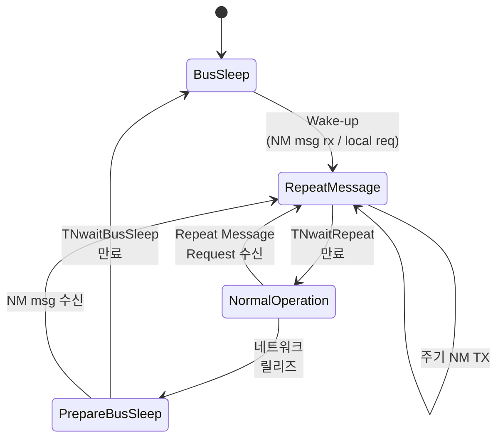
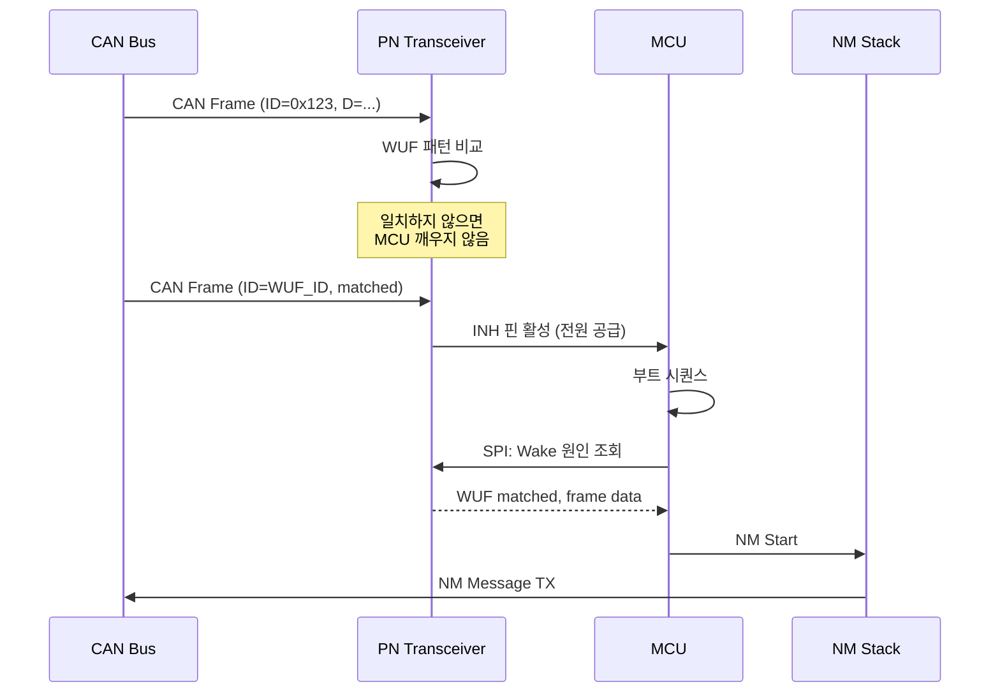

# CH17. Network Management

## 학습 목표

- OSEK NM의 Direct와 Indirect 방식 차이를 설명한다
- AUTOSAR CAN NM의 상태 머신과 타이머 파라미터를 이해한다
- Partial Networking(PN)의 동작 원리와 Selective Wake-up Frame 구조를 파악한다
- PNC(Partial Network Cluster) 기반 ECU 그룹 관리 개념을 익힌다
- 실전 튜닝에서 흔히 만나는 NM·PN 버그 유형을 분별한다

## 배경 — NM이 왜 필요한가

현대 차량에는 적게는 30개, 많게는 100개를 넘는 ECU가 탑재된다. 이 ECU들은 키 온(key-on), 도어 오픈, 원격 시동, 주행 중 특정 기능 활성화 같은 다양한 이벤트를 통해 서로 다른 시점에 깨어나고 서로 다른 시점에 잠든다. 단순 CAN bus monitor만으로는 "지금 네트워크에 누가 참여하고 있는지", "모든 ECU가 수면을 허락했는지"를 알 수 없다. 누군가가 아직 통신이 필요하다고 주장하는 동안 다른 ECU가 제멋대로 잠들면 메시지가 유실되고, 반대로 모두 깨어 있어도 될 필요가 없는데 계속 살아 있으면 암전류가 증가해 배터리가 방전된다.

Network Management(NM)는 이런 문제를 해결하기 위한 표준 메커니즘이다. "네트워크가 살아 있어야 하는가"와 "언제 잠들어도 되는가"를 분산된 노드들이 합의하는 프로토콜이다.

## OSEK NM — Direct vs Indirect

OSEK NM은 AUTOSAR 이전 시대의 표준이다. 크게 두 가지 방식이 있다.

### Direct NM

각 노드가 링(ring)처럼 논리적인 토큰을 주고받는다. 노드 A는 노드 B에게 "나 살아 있음" 메시지를 보내고, B는 다시 C에게 전달하는 식이다. 한 바퀴 돌아서 모두가 인지되면 네트워크가 살아 있음이 확정된다. 설계는 정교하지만 구현이 복잡하고, 한 노드가 빠지면 링이 깨져 복구 로직이 필요하다. 지금은 레거시 시스템에서만 쓰인다.

### Indirect NM

애플리케이션 메시지 자체를 감시해서 sleep 여부를 판단한다. 일정 시간 동안 자신이 관심 있는 메시지가 오지 않으면 "네트워크가 쉬어도 되겠다"고 판단한다. 단순하지만 NM 트래픽을 별도로 정의하지 않아 간접적이고, 튜닝이 애매하다는 단점이 있다.

## AUTOSAR CAN NM

AUTOSAR에서는 CAN NM Protocol이라는 명시적 프로토콜을 정의했다. 현재 양산 차량에서 가장 널리 쓰이는 방식이다.

### 동작 원리

노드가 "awake" 상태이면 주기적으로 NM Message를 송신한다. 보통 1초 주기다. 특정 NM ID 범위는 OEM별로 예약되어 있고, Source Node ID는 CAN ID의 하위 바이트에 인코딩되는 방식이 일반적이다. 모든 노드가 일정 시간(TNwaitBusSleep) 동안 NM 메시지를 내보내지 않으면 그때 비로소 Bus-Sleep으로 전환된다.

### 상태 머신

AUTOSAR CAN NM은 네 가지 상태를 갖는다.

- **Bus-Sleep**: NM 메시지 송수신 없음. 버스 idle
- **Prepare Bus-Sleep**: 송신은 멈췄지만 아직 수면 전이 대기 중
- **Repeat Message**: 깨어난 직후 자기 존재를 빠르게 알림
- **Network**: 정상 운영. 주기적 NM 송신

### User Data 8바이트

NM 메시지 페이로드는 8바이트로 정의된다. 바이트 0은 보통 Control Bit Vector(CBV)로 쓰인다.

| 비트 | 이름 | 의미 |
| --- | --- | --- |
| 0 | Repeat Message Request | 타 노드에 Repeat 상태 재진입 요청 |
| 3 | NM Coordinator Sleep Ready | 코디네이터 수면 가능 표시 |
| 4 | Active Wake-up | 이 노드가 능동적으로 깨웠음 |
| 6 | PNI | Partial Network Information 유효 표시 |

바이트 1 이후는 보통 PN 정보(Partial Network Cluster 비트맵)로 쓰인다.

### 주요 타이머

- **TTxRepeat**: Repeat Message 상태에서 NM TX 주기
- **TxEnsure**: NM 메시지 송신 보장 타임아웃
- **TNwaitBsRepeat**: Repeat 상태 유지 시간
- **TNwaitBusSleep**: Prepare Bus-Sleep → Bus-Sleep 전이 대기 시간

:::warning
타이머 튜닝이 잘못되면 차량이 주차된 상태에서 특정 ECU만 랜덤하게 깨어나 암전류를 증가시키거나, 반대로 모두가 너무 빨리 잠들어 도어 잠금 응답이 지연되는 현상이 발생한다. NM 타이머는 네트워크 전체에서 일관되게 합의되어야 한다.
:::

## Partial Networking (PN)

### 목표

NM만으로는 "네트워크가 살아 있는지/죽었는지"만 결정된다. 하지만 실제로 차량은 "네트워크는 살아 있어도 특정 ECU는 필요 없으니 재우자"는 요구가 있다. 이유는 두 가지다.

- **에미션(배출가스) 규제**: 불필요한 ECU를 돌리면 연비가 떨어지고 CO2가 증가한다
- **배터리 보호**: 적은 전류라도 수백 대 ECU가 합쳐지면 무시 못 할 부하다

Partial Networking은 "필요 없는 ECU는 재운다"는 철학을 프로토콜로 구현한 것이다.

### Selective Wake-up Frame

일반 wake-up은 버스에 어떤 트래픽이라도 나타나면 트랜시버가 MCU를 깨운다. PN은 "정해진 ID와 Data 패턴을 만족해야만" 트랜시버가 MCU를 깨우도록 한다. 트랜시버 내부에 등록된 WUF(Wake-Up Frame) 패턴과 일치할 때만 INH(Inhibit) 핀을 통해 MCU 전원을 활성화한다.

대표적인 PN-capable 트랜시버 예시:

- **NXP TJA1145** — CAN PN 지원, SPI로 WUF 패턴 등록
- **Infineon TLE9251V** — 유사 기능
- **Microchip MCP2542FD** — CAN FD PN

트랜시버 내부 레지스터에 CAN ID, DLC, Data Mask, Data Value를 등록해 두면 해당 패턴에 일치하는 프레임만 wake-up을 트리거한다.

### 트랜시버가 MCU를 깨우는 플로우

### PNC (Partial Network Cluster)

PN은 ECU 단위가 아니라 **기능 단위로 그룹핑**된다. 예를 들어 "트레일러 제어" PNC, "인포테인먼트" PNC, "파워트레인 진단" PNC처럼 기능 범주를 정의한다. 각 NM 메시지에는 PNC 비트맵이 들어가고, 특정 PNC 비트가 1이면 그 클러스터에 속한 ECU들만 깨어난다.

이 덕분에 "진단 포트에 장비가 연결되면 진단 PNC만 깨우기", "트레일러가 연결되면 트레일러 PNC만 깨우기"처럼 세밀한 전력 관리가 가능하다.

## 실전 주의

:::warning 흔한 버그
1. **NM 타이머 불일치로 random sleep** — OEM 사양 대비 ECU 구현이 TNwaitBusSleep을 짧게 잡으면 특정 ECU가 먼저 잠들어 메시지 손실 발생
2. **WUF 패턴 불일치** — Data Mask를 잘못 잡아 정상적인 wake-up 프레임에 반응하지 않음. 특정 조건(예: 온도 표시 변경)에서만 안 깨어나는 식의 재현 어려운 버그
3. **Active Wake-up Bit 미설정** — 내가 깨웠는데 CBV에 반영 안 해서 다른 노드들이 이상한 판단을 함
4. **PNC 비트맵 버전 불일치** — OEM 사양이 개정됐는데 일부 ECU만 구 버전 비트맵 사용
:::

## 오픈소스 구현

- **Elektrobit, Vector, ETAS**: 양산용 AUTOSAR Stack. CAN NM/PN 완비. 유료
- **CANoe simulation**: 개발 단계에서 NM/PN 시뮬레이션 제공
- **Linux**: 공식적인 AUTOSAR NM 구현은 없다. 필요 시 user-space로 직접 구현해야 한다
- **OpenAUTOSAR / arccore**: 일부 오픈 AUTOSAR 프로젝트가 NM을 포함하지만 프로덕션 품질은 아니다

:::tip
NM·PN은 표준이 존재해도 OEM별 설정(타이머, ID 범위, PNC 정의)이 각자 다르다. 특정 차량 플랫폼에서 일하게 되면 해당 OEM의 NM 사양서를 반드시 확보해야 한다.
:::

## 다음 챕터

다음 챕터에서는 ECU 내부 변수와 맵을 런타임에 측정·조정하는 캘리브레이션 프로토콜인 CCP/XCP를 다룬다.

::: tip 핵심 정리
- NM은 ECU들이 분산 합의로 네트워크 수면 여부를 결정하는 메커니즘이다
- OSEK Direct/Indirect → AUTOSAR CAN NM으로 진화했고 현재 양산의 표준이다
- AUTOSAR CAN NM은 Bus-Sleep / Prepare / Network / Repeat Message 네 상태를 갖는다
- Partial Networking은 PN-capable 트랜시버가 정의된 WUF 패턴에만 반응해 MCU를 깨운다
- PNC는 기능 단위 클러스터로 세밀한 부분 네트워크 제어를 가능하게 한다
- NM 타이머 튜닝과 WUF 패턴 일관성은 실전에서 가장 자주 발생하는 버그 포인트다
:::
