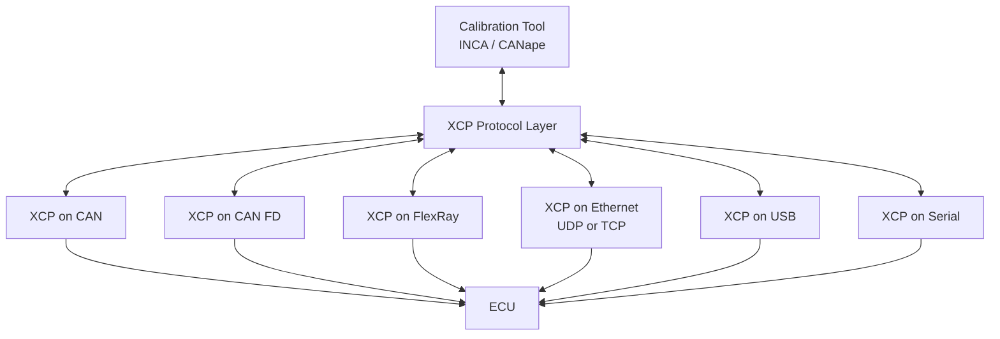
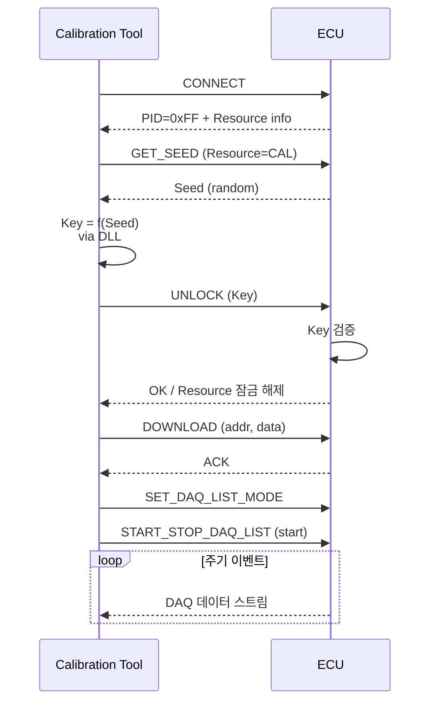

# CH18. XCP / CCP

## 학습 목표

- ECU 캘리브레이션이 왜 필요한지, 어떤 작업인지 이해한다
- CCP와 XCP의 역사적 관계와 각각의 특징을 파악한다
- XCP의 주요 명령(CONNECT, DOWNLOAD, DAQ, STIM)과 A2L 파일의 역할을 익힌다
- Seed & Key 기반 리소스 접근 제어 구조를 설명한다
- 프로덕션 ECU에서 XCP가 왜 보안 이슈가 되는지 알고 대응책을 구상한다

## 캘리브레이션이 왜 필요한가

ECU 내부에는 수많은 **맵(matp), 파라미터, 상수**가 있다. 예를 들어 가솔린 엔진 ECU에는 RPM × Load 2차원 맵으로 정의된 점화 시기 테이블이 있고, 온도별 보정 계수, 공연비 타겟 테이블 같은 수천 개의 수치가 담겨 있다. 이 수치들은 엔진이 달라질 때마다, 차량 중량이 달라질 때마다, 연료 품질이 달라질 때마다 다시 튜닝되어야 한다.

개발 단계에서는 ECU를 다이노(dynamometer)에 걸어놓고 **실시간으로 내부 변수를 읽고(측정), 맵 값을 바꿔보며(조정) 최적점을 찾는다**. 펌웨어를 매번 빌드해서 플래시하는 방식으로는 생산성이 나오지 않는다. 파워트레인, 섀시, ADAS 개발에서 캘리브레이션은 필수 과정이고 이를 표준화한 것이 CCP와 XCP다.

## CCP (CAN Calibration Protocol)

- 1990년대 초반 ASAP(ASAM Automation Standard Application Protocol) 작업반에서 정의
- CAN 전용 프로토콜
- **CRO(Command Receive Object)**와 **DTO(Data Transmission Object)** 두 개의 CAN ID를 사용해 툴 → ECU / ECU → 툴 방향 통신
- 명령어 코드가 1바이트, counter가 1바이트 등 고정 구조

지금은 레거시로 간주되고 신규 개발은 XCP로 한다. 다만 10~20년 된 양산 차량 플랫폼에서는 여전히 유지보수를 위해 CCP를 지원해야 하는 경우가 있다.

## XCP (Universal Measurement and Calibration Protocol)

**ASAM MCD-1 XCP v1.x**로 표준화되었다. CCP의 여러 한계를 개선했고 무엇보다 **Transport-agnostic**하다는 것이 결정적 차이다.

- XCP on CAN
- XCP on CAN FD
- XCP on FlexRay
- XCP on Ethernet (UDP/TCP)
- XCP on USB
- XCP on SxI (Serial)

동일한 프로토콜 레이어가 여러 물리 계층 위에서 동작한다. Ethernet을 쓰면 CAN 대비 수백 배 빠른 DAQ 대역폭을 얻을 수 있어 고속 측정이 필요한 ADAS 개발에서는 XCP on Ethernet이 거의 필수다.

### Transport 확장성

## 주요 명령

### 연결·세션

- **CONNECT / DISCONNECT** — 세션 시작/종료
- **GET_STATUS** — ECU 상태 조회
- **GET_SEED / UNLOCK** — Resource별 Seed-Key 인증

### 메모리 접근

- **SHORT_UPLOAD** — 짧은 메모리 영역 읽기 (7바이트 이내)
- **UPLOAD / DOWNLOAD** — 긴 메모리 블록 읽기/쓰기
- **BUILD_CHECKSUM** — 특정 영역 체크섬 계산 요청 (EEPROM 무결성 검증 등)

### DAQ (Data Acquisition)

- **SET_DAQ_LIST_MODE** — DAQ 리스트 설정
- **START_STOP_DAQ_LIST** — DAQ 시작/중지
- ECU는 설정된 이벤트(주기 10ms, crank angle 등)마다 지정된 변수들을 스트리밍으로 내보낸다
- 캘리브레이션 툴은 이 데이터를 받아 그래프로 실시간 시각화

### STIM (Stimulation)

- DAQ의 반대 방향
- 툴이 ECU 내부 신호를 주입해 특정 블록의 동작을 **바이패스**한다
- 예: 센서 입력을 인위적으로 주입해 제어 로직 반응 검증

### XCP 연결 플로우

## A2L 파일 — 캘리브레이션의 지도

A2L(ASAM MCD-2 MC)은 **ECU 메모리 맵을 사람이 읽을 수 있는 형태로 기술한 텍스트 파일**이다. 안에는 다음 정보가 담긴다.

- 변수명, 메모리 주소, 데이터 타입
- 맵의 축(axis) 정보, 스케일링, 단위
- EPK(EEPROM Checksum) — 펌웨어 버전과 A2L 버전의 일치 검증
- DAQ 이벤트 정의, 가능한 측정 변수 목록
- 주소는 ECU 펌웨어 빌드 시점의 심볼 주소와 일치해야 한다

캘리브레이션 툴(INCA, CANape, ATI Vision)은 A2L을 로드해 "지금 ECU의 rpm 변수 주소가 0x20001234이고 타입이 uint16이다"를 알고 해당 주소를 DOWNLOAD/UPLOAD한다. 그래서 **A2L과 펌웨어가 일치하지 않으면 엉뚱한 주소를 건드려 ECU를 뻗게 만들 수 있다**.

## Seed & Key 리소스 접근 제어

XCP는 Resource를 네 가지로 나눈다.

| Resource | 의미 |
| --- | --- |
| CAL/PAG | Calibration / Paging |
| DAQ | Data Acquisition |
| STIM | Stimulation |
| PGM | Programming (flashing) |

각 Resource마다 별도의 Seed-Key 인증을 요구할 수 있다. ECU가 랜덤 Seed를 생성하면 툴은 OEM이 배포한 DLL 또는 알고리즘으로 Key를 계산해 되돌려 준다. ECU는 Key를 검증해 해당 Resource의 잠금을 해제한다. DLL이 없으면 해당 Resource에 접근 불가다.

## XCP on CAN 프레임 구조

- 보통 2개의 CAN ID를 예약 — 하나는 Command(툴 → ECU), 하나는 Response(ECU → 툴)
- **Max CTO** (Command Transfer Object) — Command 길이 최대값, 기본 8
- **Max DTO** (Data Transfer Object) — DAQ 데이터 길이 최대값
- CAN FD를 쓰면 CTO/DTO가 최대 64바이트까지 늘어난다

:::info
DAQ 대역폭 계산은 실무 설계에서 매우 중요하다. 예를 들어 10ms 주기로 32바이트 측정 데이터를 보내려면 `32 × 100 = 3200 Bytes/s`인데, 이것이 여러 DAQ 리스트로 늘어나면 CAN 500kbps 버스로는 금방 포화된다. 이런 이유로 ADAS/EV 개발에서는 XCP on Ethernet이 기본이다.
:::

## 실전 툴과 오픈소스

| 툴 | 제공사 | 특징 |
| --- | --- | --- |
| INCA | ETAS | 파워트레인 표준. A2L, 측정, 캘리브레이션 UI |
| CANape | Vector | 멀티버스(CAN, FR, Ethernet) 통합 |
| ATI Vision | ATI | 고속 측정 강점 |
| dSPACE ControlDesk | dSPACE | HIL 연동 강점 |
| pyXCP | 오픈소스(Python) | XCP 마스터 라이브러리 |
| openXCP | 오픈소스 | ECU 측 XCP 슬레이브 참고 구현 |

## 보안 — XCP는 원래 개발 단계용

:::warning 프로덕션 ECU와 XCP
XCP는 본래 **개발·양산 라인 캘리브레이션용** 프로토콜이다. 출고된 ECU에 XCP 포트가 열려 있고 Seed-Key가 약하거나 DLL이 유출되면 다음이 가능해진다.

- 메모리 덤프(리버스 엔지니어링)
- 제어 파라미터 변조(튠업, 배기가스 규제 회피)
- STIM으로 센서 신호 위조(주행 제어 조작)

대응책:
- 출고 펌웨어에서 XCP 서비스 자체를 비활성화
- 비활성화가 어려우면 강력한 Seed-Key(비대칭 서명) 적용
- PGM 리소스는 반드시 별도 강화 인증(UDS Security Access와 연계)
:::

## 다음 챕터

다음 챕터에서는 8바이트 CAN 프레임 한계를 넘어 수 KB 단위 UDS 메시지를 전송하기 위한 Transport Protocol인 ISO-TP를 다룬다.

::: tip 핵심 정리
- CCP는 1990년대 CAN 전용 캘리브레이션 프로토콜이고 XCP가 그 후속이다
- XCP는 Transport-agnostic 설계로 CAN, CAN FD, FlexRay, Ethernet, USB를 모두 지원한다
- 주요 기능은 메모리 접근(UPLOAD/DOWNLOAD), 측정(DAQ), 자극(STIM)이다
- A2L은 ECU 메모리 맵의 지도 파일이고 펌웨어와 일치해야 한다
- Seed-Key는 Resource별 접근 제어 수단이고 DLL 관리가 핵심이다
- 프로덕션 ECU에서 XCP를 열어두는 것은 큰 보안 리스크이므로 반드시 비활성화하거나 강화해야 한다
:::
