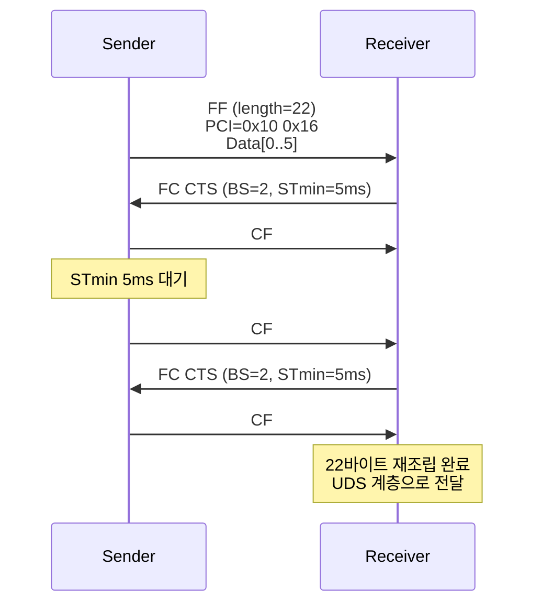

# CH19. ISO-TP (ISO 15765-2)

## 학습 목표

- ISO-TP가 왜 필요한지, UDS 스택에서 어떤 위치에 있는지 이해한다
- 네 가지 N-PCI(Single/First/Consecutive/Flow Control) 포맷을 구분한다
- Flow Control의 CTS/WAIT/OVERFLOW와 BS/STmin 파라미터 의미를 익힌다
- Normal/Extended/Mixed 주소 지정 방식의 차이를 파악한다
- Linux can-isotp 커널 모듈과 Python 라이브러리 활용법을 정리한다

## 왜 필요한가

UDS(ISO 14229)는 진단 서비스 표준인데, 플래시 프로그래밍이나 긴 DID(Data Identifier) 읽기 같은 요청은 수 KB 단위 페이로드를 주고받아야 한다. 하지만 Classical CAN 프레임은 최대 8바이트, CAN FD도 최대 64바이트밖에 안 된다. 이 간극을 메우기 위해 **ISO 15765-2(ISO-TP)**가 정의되었다.

ISO-TP는 CAN 데이터 링크 계층 위에서 **분할(segmentation), 재조립(reassembly), 흐름 제어(flow control)**를 수행한다. 상위에는 UDS(ISO 14229-1), OBD-II(ISO 15031-5), DoCAN 등이 올라간다.

```
+--------------------------+
|  UDS (ISO 14229-1)       |
+--------------------------+
|  ISO-TP (ISO 15765-2)    |  <- 이 챕터
+--------------------------+
|  CAN / CAN FD            |
+--------------------------+
```

## 네 가지 N-PCI

N-PCI(Network Protocol Control Information)는 CAN 페이로드의 첫 바이트(또는 상위 비트)에 담기는 제어 정보다. 상위 4비트로 프레임 타입을 구분한다.

| 타입 | 값 | 의미 |
| --- | --- | --- |
| Single Frame (SF) | 0x0L | 한 프레임에 완결 |
| First Frame (FF) | 0x1LLL | 멀티 프레임의 첫 조각 |
| Consecutive Frame (CF) | 0x2N | 이어지는 조각 |
| Flow Control (FC) | 0x3F | 수신측의 흐름 제어 |

### Single Frame (SF)

- PCI: `0x0L` (L = data 길이, 0~7)
- Classical CAN에서 최대 7바이트 payload
- CAN FD 확장 시 `0x00 LL` 형식으로 최대 62바이트까지

```
[ 0x0L | D0 | D1 | D2 | D3 | D4 | D5 | D6 ]
```

### First Frame (FF)

- PCI 2바이트: `0x1LLL` (12비트 길이, 최대 4095바이트 선언)
- 실제 데이터는 Classical CAN 기준 6바이트 담김

```
[ 0x1L | LL | D0 | D1 | D2 | D3 | D4 | D5 ]
```

길이가 4095 초과일 때는 escape code(0x10 0x00)를 쓰고 다음 4바이트로 32비트 길이를 싣는다(ISO 15765-2:2016).

### Consecutive Frame (CF)

- PCI 1바이트: `0x2N` (N = sequence number, 0~F 순환)
- 실제 데이터 7바이트
- FF 다음 CF는 N=1부터 시작, 0xF 다음엔 0x0으로 순환

```
[ 0x2N | D0 | D1 | D2 | D3 | D4 | D5 | D6 ]
```

### Flow Control (FC)

- PCI 3바이트: FS/BS/STmin
- FS(Flow Status) 상위 nibble 0x3 + 하위 nibble
  - **0x30 CTS** (Continue To Send) — 계속 보내라
  - **0x31 WAIT** — 잠시 대기
  - **0x32 OVERFLOW** — 수용 불가, 포기

```
[ 0x3F | BS | STmin | -- | -- | -- | -- | -- ]
```

## Flow Control 파라미터

### Block Size (BS)

송신자가 FC 한 번 받은 뒤 연속으로 보낼 수 있는 CF 수.

- `BS=0` — 무제한 송신 (수신측이 버퍼가 넉넉할 때)
- `BS=8` — 8개 CF 보내고 다시 FC 대기
- 대형 전송에서 BS로 버퍼 오버플로 방지

### Separation Time Minimum (STmin)

연속된 CF 사이 최소 간격.

| STmin 값 | 의미 |
| --- | --- |
| `0x00` | 0ms (최대한 빨리) |
| `0x01 ~ 0x7F` | 1ms ~ 127ms |
| `0xF1 ~ 0xF9` | 100μs ~ 900μs (고속) |
| 기타 | 예약, 수신측 최대값으로 간주 |

수신 ECU의 처리 속도가 느릴 때 STmin을 늘려 부하를 맞춘다.

## 시퀀스 시나리오 — 22바이트 전송

22바이트를 보내려면 한 프레임에 담을 수 없으니 FF + CF 구조가 된다.



- FF 1개 + CF 3개로 총 6+7+7+2 = 22 바이트 전송
- BS=2이므로 CF 2개마다 FC 한 번
- STmin=5ms이므로 CF 사이 5ms 간격

## 주소 지정 방식

### Normal Addressing

- 각 방향마다 CAN ID 하나씩 할당 (진단 요청 ID, 응답 ID 한 쌍)
- 예: 0x7E0(요청), 0x7E8(응답)
- 가장 단순, 가장 널리 사용

### Extended Addressing

- CAN Data[0]에 **Target Address**를 삽입해 같은 CAN ID를 여러 노드가 공유
- PCI가 Data[1]부터 시작 → 실 payload는 1바이트 줄어든다
- 11-bit CAN ID 고갈 회피용

### Mixed Addressing

- 29-bit Extended CAN ID 포맷을 사용해 Source/Target Address를 ID에 인코딩
- J1939·ISO 15765-3에서 주로 사용

## 패킷 포맷 비교


네 가지 프레임 타입의 PCI 구조를 한눈에 보면:

| 타입 | Byte0 | Byte1 | Byte2 | Byte3~ |
| --- | --- | --- | --- | --- |
| SF | `0x0L` | D0 | D1 | D2~D6 |
| FF | `0x1L` | `LL` | D0 | D1~D5 |
| CF | `0x2N` | D0 | D1 | D2~D6 |
| FC | `0x3F` | BS | STmin | padding |

## CAN FD 매핑

CAN FD(최대 64B 페이로드)에서는 확장이 필요하다.

- SF의 길이 필드가 4비트로는 부족 → escape code로 확장
- 4095바이트 초과 메시지 지원 위해 `0x10 0x00`에 이어 32비트 길이 지정
- BS/STmin은 그대로

ISO 15765-2:2016 개정에서 CAN FD 매핑이 공식화되었다.

## 에러 처리와 타임아웃

ISO-TP는 여러 타임아웃을 정의한다.

| 파라미터 | 의미 | 일반 값 |
| --- | --- | --- |
| N_As | 송신측 CAN 송신 완료 타임아웃 | 1s |
| N_Ar | 수신측 CAN 송신 완료 타임아웃 | 1s |
| N_Bs | 송신측 FC 대기 타임아웃 | 1s |
| N_Br | 수신측 FC 송신 지연 | < N_Bs |
| N_Cs | 송신측 CF 송신 지연 | < N_Cr |
| N_Cr | 수신측 CF 대기 타임아웃 | 1s |

:::warning 흔한 에러
- **N_Cr timeout** — CF가 STmin보다 늦게 오면 수신측이 세션 포기
- **BS overflow** — 수신측 버퍼 부족 시 FC=OVERFLOW 반환
- **Wrong sequence number** — CF의 N이 기대값과 다르면 세션 종료
- **Duplicate FF** — FF가 두 번 오면 진행 중 메시지를 버리고 새로 시작
:::

## Linux 구현 — can-isotp 커널 모듈

CH14에서 본 SocketCAN에는 `can-isotp` 커널 모듈이 포함되어 있다. user space에서는 일반 socket처럼 사용할 수 있다.

```c
int s = socket(PF_CAN, SOCK_DGRAM, CAN_ISOTP);
struct sockaddr_can addr;
addr.can_family = AF_CAN;
addr.can_addr.tp.tx_id = 0x7E0;
addr.can_addr.tp.rx_id = 0x7E8;
addr.can_ifindex = if_nametoindex("can0");
bind(s, (struct sockaddr*)&addr, sizeof(addr));

uint8_t payload[1024];
write(s, payload, 512);   // 자동으로 FF+CF 분할
int n = read(s, payload, sizeof(payload));  // 자동 재조립
```

커널이 FF/CF/FC를 자동 처리하고 user space는 원본 페이로드를 보낸다/받는다. 커맨드 라인 도구 `isotpsend`, `isotprecv`, `isotpdump`, `isotpserver`도 `can-utils`에 포함되어 있다.

## Python 구현

- **python-can-isotp** — Python 순수 구현. python-can 위에서 동작
- **isotp** (pyisotp) — pure Python, SocketCAN 백엔드 선택 가능

```python
import isotp, can

bus = can.Bus('can0', bustype='socketcan')
addr = isotp.Address(isotp.AddressingMode.Normal_11bits,
                     txid=0x7E0, rxid=0x7E8)
stack = isotp.CanStack(bus, address=addr,
                       params={'stmin': 5, 'blocksize': 8})
stack.send(b'\x22\xF1\x90' + b'\x00' * 500)
while not stack.transmitting():
    stack.process()
```

## 다음 챕터

다음 챕터에서는 ISO-TP 위에서 동작하는 진단 서비스 표준인 UDS(ISO 14229)를 다룬다.

::: tip 핵심 정리
- ISO-TP는 CAN 8/64바이트 페이로드 한계를 넘어 최대 수 KB 메시지를 분할 전송하는 표준이다
- 프레임 타입은 SF(0x0L), FF(0x1LLL), CF(0x2N), FC(0x3F) 네 가지다
- Flow Control은 CTS/WAIT/OVERFLOW 상태와 BS(Block Size), STmin(Separation Time)을 갖는다
- 주소 지정은 Normal, Extended, Mixed 세 방식이 있고 Normal이 가장 흔하다
- Linux에는 can-isotp 커널 모듈이 내장되어 있고 일반 socket처럼 쓰면 된다
- 여러 타임아웃(N_As, N_Bs, N_Cr 등) 튜닝이 실전 신뢰성에 직결된다
:::
