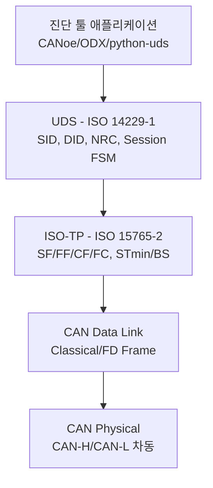
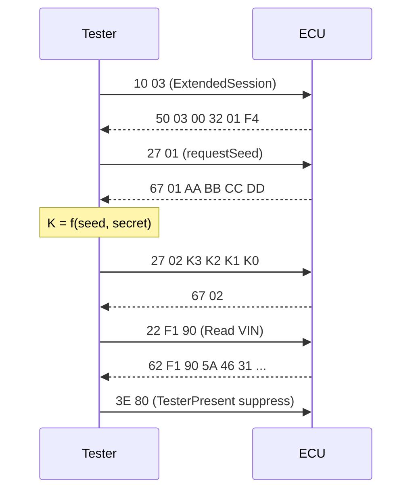

# CH20. UDS (ISO 14229)

CH19에서 다룬 <strong>ISO-TP(ISO 15765-2)</strong>가 8바이트를 넘는 긴 페이로드를 세그먼트로 쪼개 CAN 위에서 실어 나르는 전송 계층이었다면, 그 위에 올라가 <strong>무엇을 주고받을지</strong>를 정의하는 응용 계층이 바로 <strong>UDS(Unified Diagnostic Services)</strong>다. 규격은 <strong>ISO 14229-1</strong>에 정의되어 있고, CAN 링크 바인딩은 ISO 14229-3(구 ISO 15765-3), IP 바인딩은 ISO 13400(DoIP)다. UDS는 차량 생산 라인의 EOL 테스트, 정비소 스캔툴, OTA 재프로그래밍, 개발자의 로그 수집까지 같은 언어로 처리하는 사실상의 <strong>공용 API</strong>다.

::: info 학습 목표
- UDS가 ISO-TP 위에서 동작하는 <strong>응용 계층</strong>임을 이해하고 스택 전체를 그릴 수 있다.
- Positive/Negative Response 규칙과 주요 <strong>NRC</strong>를 외워 응답을 즉시 해석한다.
- 0x10/0x11/0x22/0x2E/0x27/0x19/0x14/0x31/0x34~0x37/0x3E <strong>핵심 SID 11종</strong>의 쓰임을 구분한다.
- Session 상태 머신과 <strong>Security Access Seed & Key</strong> 절차를 시나리오 단위로 설명한다.
- DoIP와의 차이, 그리고 Seed/Key의 보안 한계를 이해한다.
:::

## 1. UDS 스택 위치

UDS 한 요청이 물리 계층까지 내려가는 경로는 다음과 같다. 각 계층은 자기 역할만 하고 위·아래는 추상화된 API로 다룬다.



같은 UDS 요청이 <strong>CAN</strong>을 탈 수도 있고 <strong>이더넷(DoIP)</strong>을 탈 수도 있다는 점이 중요하다. 응용 계층은 링크를 모른다. 그래서 개발자가 작성한 UDS 시퀀스는 OBD-II 포트의 CAN에서도, 유선 DoIP에서도, 무선 OTA 게이트웨이 너머의 ECU에서도 그대로 동작한다.

## 2. 요청/응답 규칙

UDS 메시지의 첫 바이트는 항상 <strong>SID(Service Identifier)</strong>다. 응답은 두 종류뿐이다.

- <strong>Positive Response</strong> — 첫 바이트가 `SID + 0x40`. 예: 요청 `0x22`에 대한 성공 응답은 `0x62`.
- <strong>Negative Response</strong> — `0x7F`, 요청 SID, <strong>NRC(Negative Response Code)</strong> 3바이트로 고정.

즉 `0x7F 22 13`을 받으면 "ReadDataByIdentifier 실패, Incorrect Message Length"로 즉시 해석된다. 이 규칙 하나만 알면 덤프 로그만 보고도 상황을 짚어낼 수 있다.

### NRC 치트시트

| NRC | 이름 | 언제 자주 나오나 |
|-----|------|------------------|
| `0x10` | General Reject | 스펙 외 일반 거부, 드물다 |
| `0x11` | Service Not Supported | 해당 SID를 ECU가 구현하지 않음 |
| `0x12` | SubFunction Not Supported | SID는 맞지만 서브기능 불가 |
| `0x13` | Incorrect Message Length Or Invalid Format | 길이·포맷 오류 |
| `0x22` | Conditions Not Correct | 엔진 RPM, 속도 등 전제 불만족 |
| `0x24` | Request Sequence Error | Seed 없이 Key부터 보낸 경우 |
| `0x31` | Request Out Of Range | DID가 없거나 값 범위 벗어남 |
| `0x33` | Security Access Denied | 잠금 상태에서 보호 서비스 호출 |
| `0x35` | Invalid Key | 계산한 키가 틀림 |
| `0x36` | Exceeded Number Of Attempts | 실패 누적, delay 상태 |
| `0x37` | Required Time Delay Not Expired | delay 해제 전 재시도 |
| `0x78` | Response Pending | 처리 중, 잠시 후 응답함(P2*Server) |
| `0x7E/0x7F` | SubFunction/Service Not Supported In Active Session | 세션 전환 필요 |

`0x78`은 특별히 봐야 한다. 장시간 걸리는 요청(예: 플래시 지우기)에 대해 서버가 "<strong>살아 있으니 기다려라</strong>"라고 보내는 신호다. 클라이언트는 <strong>P2*Server</strong>(보통 5초) 타임아웃을 재장전한다.

## 3. 핵심 서비스 11종

외우는 양을 최소화하려면 이 11개 SID가 전부다. 나머지는 파생이다.

### 0x10 DiagnosticSessionControl

세션을 전환한다. 많은 보호 서비스가 특정 세션에서만 실행 가능해서 UDS 시퀀스는 거의 항상 `0x10`부터 시작한다.

- `0x10 01` — DefaultSession (전원 인가 시 기본)
- `0x10 02` — ProgrammingSession (플래시 쓰기용)
- `0x10 03` — ExtendedDiagnosticSession (개발·정비)

### 0x11 ECUReset

ECU를 재시작한다. `01` hardReset / `02` keyOffOnReset / `03` softReset.

### 0x27 SecurityAccess

보호된 서비스 사용 전에 반드시 통과해야 하는 관문이다. 홀수 레벨이 <strong>requestSeed</strong>, 짝수 레벨이 <strong>sendKey</strong>로 한 쌍을 이룬다. 레벨 01/03/05…은 제조사가 각각 의미를 부여한다(예: 01=정비, 03=프로그래밍).

```
Req: 27 01                    ; requestSeed Level1
Res: 67 01 AA BB CC DD        ; seed = 0xAABBCCDD

-- 클라이언트 측에서 K = f(seed, secret) 계산 --

Req: 27 02 XX XX XX XX        ; sendKey
Res: 67 02                    ; 성공
```

키 계산 함수 `f`는 제조사가 비밀로 한다. 실패가 누적되면 ECU가 <strong>delay timer</strong>를 걸어 일정 시간 동안 `0x37`만 반환한다. 브루트포스 방지 장치다.

### 0x22 ReadDataByIdentifier

<strong>DID(Data Identifier, 2바이트)</strong>로 특정 값을 읽는다. DID는 규격 일부 + 제조사 정의로 맵핑된다. 예: `F190` VIN, `F187` SparePartNumber.

```
Req: 22 F1 90
Res: 62 F1 90 5A 46 31 ...    ; VIN ASCII
```

### 0x2E WriteDataByIdentifier

DID로 쓴다. 보통 ExtendedSession + SecurityAccess 통과가 전제다.

### 0x19 ReadDTCInformation

DTC(Diagnostic Trouble Code)를 조회한다. 서브기능이 20개가 넘지만 현장에서는 `0x02 reportDTCByStatusMask`가 제일 많이 쓰인다.

```
Req: 19 02 08                 ; 0x08 = confirmedDTC만
Res: 59 02 FF  P0123 2F  P0301 24 ...
```

### 0x14 ClearDiagnosticInformation

DTC를 지운다. `14 FF FF FF`면 전체 그룹 클리어.

### 0x31 RoutineControl

ECU 내부에 미리 정의된 루틴(예: 플래시 섹터 지우기, 자동 보정 실행)을 시작/정지/결과조회한다. 서브기능 `01 startRoutine`, `02 stopRoutine`, `03 requestRoutineResults`.

### 0x34 / 0x36 / 0x37 플래시 시퀀스

플래시 프로그래밍은 이 세 서비스의 고정된 조합이다.

- `0x34 RequestDownload` — 대상 주소·크기 전송, 서버가 최대 블록 크기(`maxNumberOfBlockLength`) 응답
- `0x36 TransferData` — 블록 시퀀스 카운터와 함께 실제 바이트 전송 반복
- `0x37 RequestTransferExit` — 전송 종료 선언

실제로는 Programming 세션 진입 → Security Access → `0x31` Erase 루틴 → `0x34/0x36/0x37` → `0x31` Checksum 검증 → `0x11` Reset으로 이어진다.

### 0x3E TesterPresent

세션 유지용 heartbeat. 아무 서비스도 호출하지 않고 조용히 있으면 ECU는 `S3Server` 타임아웃(보통 5초)이 지나 <strong>Default 세션으로 강제 복귀</strong>한다. 그래서 스캔툴은 백그라운드에서 주기적으로 `3E 00` 또는 `3E 80`(suppress positive response)을 보낸다.

## 4. Session 상태 머신

세션은 단순한 플래그가 아니라 어떤 서비스가 허용되는지, 어떤 타이머가 돌아가는지를 결정하는 <strong>상태 머신</strong>이다.

```mermaid
stateDiagram-v2
    [*] --> Default
    Default --> Extended: 10 03
    Extended --> Default: S3 timeout<br>or 10 01
    Extended --> Programming: 10 02<br>+ SecurityAccess
    Programming --> Default: 11 ECUReset<br>or S3 timeout
    Default --> Programming: 10 02<br>(보안 통과 후)
```

핵심 규칙은 세 가지다. 첫째, 전원 인가 시 항상 <strong>Default</strong>다. 둘째, `0x3E TesterPresent`가 일정 시간 오지 않으면 ECU가 자동으로 Default로 돌아간다. 셋째, Programming 세션은 플래시 쓰기를 허용하는 가장 강한 상태라 반드시 Security Access를 선행한다.

## 5. DTC 포맷

UDS DTC는 <strong>4바이트</strong>다. 상위 3바이트가 <strong>ISO 15031-6 DTC 코드</strong>, 마지막 1바이트가 <strong>StatusByte</strong>다.

StatusByte의 비트는 bitmask로 읽는다.

| 비트 | 이름 | 의미 |
|-----|------|------|
| 0 | testFailed | 최근 테스트 실패 |
| 1 | testFailedThisOperationCycle | 현재 구동 사이클에서 실패 |
| 2 | pendingDTC | 1회 실패해 후보 등록 |
| 3 | confirmedDTC | 2회 이상 실패로 확정 |
| 4 | testNotCompletedSinceLastClear | Clear 이후 미실행 |
| 5 | testFailedSinceLastClear | Clear 이후 실패 이력 |
| 6 | testNotCompletedThisOperationCycle | 이번 사이클 미실행 |
| 7 | warningIndicatorRequested | MIL(체크엔진) 점등 요구 |

## 6. Seed & Key 시나리오

실전에서 가장 많이 참조할 시퀀스다. Default → Extended → SecurityAccess → ReadDataByIdentifier.



`50 03 00 32 01 F4`의 뒤 4바이트는 <strong>P2Server</strong>(50ms)와 <strong>P2*Server</strong>(5000ms) 타임아웃 파라미터다. ECU가 클라이언트에게 자기 타임아웃을 알려주는 방식이다.

## 7. 동적·주기 DID

- <strong>0x2A ReadDataByPeriodicIdentifier</strong> — 특정 DID를 slowRate/mediumRate/fastRate로 주기 송신하도록 요청. 데이터 로깅에 쓰인다.
- <strong>0x2C DynamicallyDefineDataIdentifier</strong> — 여러 DID를 묶어 가상의 DID 하나로 정의. 한 번의 `0x22` 요청으로 묶음 조회가 된다.

두 서비스 모두 서버 부하가 큰 편이라 운영 차량에선 제한적으로 허용된다.

## 8. CAN vs DoIP

UDS는 링크 독립적이라 했지만 실제 타이밍과 MTU는 다르다.

| 항목 | UDS on CAN (ISO 15765-3) | UDS on IP (ISO 13400 DoIP) |
|------|--------------------------|----------------------------|
| 물리 | CAN/CAN-FD | Ethernet 100BASE-T1/TCP |
| 전송 | ISO-TP 프레이밍 | DoIP Header + TCP |
| 최대 MTU | 4095 B (FD는 더 큼) | 수 MB |
| 속도 | 500k~8M bps | 100M~1G bps |
| 용도 | 정비소, OBD 포트 | OTA, 공장 EOL, 진단 게이트웨이 |

같은 `22 F1 90`을 써도 DoIP는 수 ms, CAN은 수십~수백 ms 단위로 끝나는 게 체감 차이다.

## 9. 보안 관점의 한계

전통 Seed/Key는 <strong>대칭 비밀</strong> 기반이다. 키 계산 함수가 유출되면 무력화된다. 실제로 차량 해킹 사례 중 상당수가 이 단계의 역공학이다. 최근 <strong>ISO/SAE 21434(Cybersecurity Engineering)</strong> 요구사항이 반영되면서 새 플랫폼은 <strong>인증서 기반 키 교환(예: PKI + AES-CMAC, ECDH)</strong>으로 갈아타는 중이다. 상세 내용은 CH23에서 다룬다.

## 다음 챕터

::: tip 핵심 정리
- UDS는 ISO-TP 위에서 도는 <strong>응용 계층</strong>이고 링크(CAN/DoIP)와 독립적이다.
- 응답은 Positive(<code>SID+0x40</code>) 또는 Negative(<code>0x7F SID NRC</code>) 딱 두 가지다.
- 핵심 SID 11개(`10/11/14/19/22/27/2E/31/34/36/37/3E`)만 외우면 대부분 시나리오가 해석된다.
- Session 상태 머신과 `0x3E` TesterPresent가 UDS 세션 수명을 결정한다.
- Seed & Key는 대칭 비밀 기반이라 취약하다. 최근 차량은 PKI 기반으로 전환 중.
:::

다음 챕터 CH21에서는 OBD-II(ISO 15031)를 다룬다. UDS의 공용 subset에 해당하는 배출 진단 표준으로, 어떤 승용차와도 대화할 수 있는 공용 API다.
