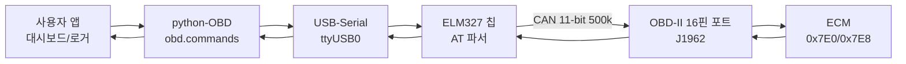
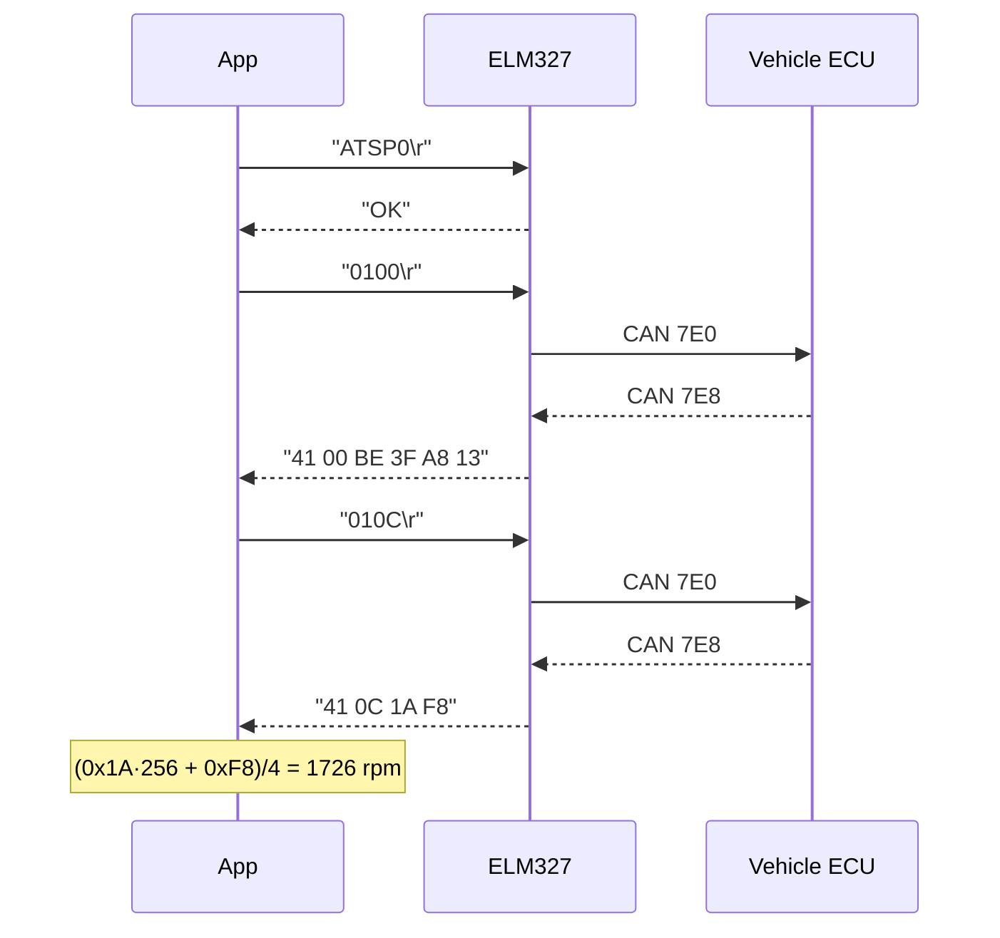

# CH21. OBD-II (ISO 15031)

차량 밑바닥에 있는 사다리꼴 16핀 커넥터, 그 포트가 바로 <strong>OBD-II</strong> 진단 포트다. 1996년 이후 북미에서 판매되는 모든 승용차가 이 규격을 의무적으로 탑재하고 있고, 우리가 쓰는 자동차 진단 앱이나 엔진 데이터 로거는 예외 없이 이 포트 하나로 차량과 대화한다. CH20의 UDS가 "제조사가 원하는 모든 것"을 정의하는 풀세트라면, OBD-II는 <strong>배출 가스 관련 정보에 한정된 공용 subset</strong>이다. 대신 어떤 차를 사도 동일하게 작동한다는 강력한 보편성을 얻었다.

::: info 학습 목표
- OBD-II의 <strong>법적 배경</strong>과 규격 체계(ISO 15031 / ISO 15765-4)를 이해한다.
- SAE J1962 16핀 <strong>커넥터 핀맵</strong>과 CAN 기반 물리 연결을 기억한다.
- <strong>Mode 10종</strong>과 주요 PID의 의미·변환식을 외운다.
- P/C/B/U로 시작하는 <strong>DTC 5자 코드</strong>를 raw 2바이트에서 직접 복원할 수 있다.
- <strong>ELM327 AT 명령</strong>과 python-OBD로 진단 요청을 직접 쏴볼 수 있다.
:::

## 1. 역사

- <strong>OBD-I</strong> (1970s~1990s 초반) — 캘리포니아 CARB가 배출 규제와 연계해 차량 자가 진단을 요구했지만 프로토콜·커넥터 모두 제조사마다 달랐다.
- <strong>OBD-II</strong> (1996~, 캘리포니아 CARB 의무, 연방은 1996 모델년부터) — J1962 커넥터, PID 체계, DTC 포맷을 표준화.
- <strong>EOBD</strong> (2001 가솔린, 2004 디젤, 유럽) — OBD-II와 거의 동일, 규제가 EU 지침 98/69/EC로 별도.
- <strong>OBD-II on CAN</strong> (2008~ 북미 의무) — 물리 링크로 CAN(ISO 15765-4)을 의무화. 그 이전엔 ISO 9141, KWP2000, J1850 VPW/PWM 혼재.

현대 차량(2008년식 이후)은 사실상 <strong>모두 CAN 기반 OBD-II</strong>라 이 장의 모든 예시도 CAN을 전제로 한다.

## 2. 물리 커넥터 SAE J1962

운전석 대시 아래에 있는 16핀 사다리꼴 커넥터다. 전원과 접지, 각 프로토콜 신호선이 핀 별로 약속되어 있다.

| 핀 | 신호 | 비고 |
|----|------|------|
| 2 | J1850 Bus+ | 구형 GM/Ford |
| 4 | Chassis GND | 섀시 접지 |
| 5 | Signal GND | 신호 접지 |
| 6 | <strong>CAN-H</strong> | ISO 15765-4 기본 |
| 7 | K-Line | ISO 9141/KWP2000 |
| 10 | J1850 Bus- | 구형 Ford |
| 14 | <strong>CAN-L</strong> | ISO 15765-4 기본 |
| 15 | L-Line | KWP2000 |
| 16 | +12V Battery | 상시 전원, 최대 10A 권장 |

CAN 기반 차량은 <strong>6번(CAN-H)/14번(CAN-L)</strong>이 핵심이다. ELM327 동글을 꽂으면 내부에서 이 두 핀이 트랜시버로 연결된다.

## 3. 지원 프로토콜 — ISO 15765-4

OBD-II on CAN은 ISO 15765-4가 허용하는 조합을 쓴다.

- <strong>11-bit 500 kbps</strong> — 가장 흔한 기본값. 거의 모든 최신 차량.
- <strong>29-bit 500 kbps</strong>
- <strong>11-bit 250 kbps</strong>
- <strong>29-bit 250 kbps</strong> — 주로 상용차(트럭)

요청 ID 체계는 다음과 같다.

- <strong>0x7DF</strong> — 기능 방송(functional). 모든 진단 ECU가 응답 대상.
- <strong>0x7E0~0x7E7</strong> — 물리 요청(ECU1~ECU8). ECM은 보통 0x7E0.
- <strong>0x7E8~0x7EF</strong> — 응답 ID. 요청 0x7E0의 응답이 0x7E8.

정체를 모르는 차도 `0x7DF`로 `01 00`을 쏘면 <strong>모든 OBD ECU가 각자 0x7E8·0x7E9…로 응답</strong>하니 일단 존재 여부와 속도를 확인할 수 있다.

## 4. Service Mode 10종

OBD-II의 "서비스"는 UDS에서 말하는 SID와 개념이 같지만 이름이 <strong>Mode</strong>다. 명확히 구분되는 10종뿐이다.

| Mode | 이름 | 용도 |
|------|------|------|
| `0x01` | Show current data | 엔진 RPM, 속도, 냉각수 온도 등 실시간 값 |
| `0x02` | Show freeze frame data | DTC 확정 순간의 스냅샷 |
| `0x03` | Show stored DTCs | 확정된 배출 관련 DTC 조회 |
| `0x04` | Clear DTCs and stored values | 모든 배출 DTC 및 freeze frame 클리어 |
| `0x05` | Test results, O2 sensors | CAN 차량에선 사용 안 함(0x06으로 통합) |
| `0x06` | Test results, Non-continuous monitors | 촉매, EVAP 등 주기성 모니터 |
| `0x07` | Show pending DTCs | 1회 실패, 확정 전 후보 |
| `0x08` | Control operations | 온보드 시스템 제어(거의 미사용) |
| `0x09` | Vehicle info | VIN, CAL ID, ECU 이름 |
| `0x0A` | Permanent DTCs | Clear 이후에도 남는 영구 DTC |

응답 Mode는 UDS처럼 `+0x40`이다. `0x01` → `0x41`, `0x03` → `0x43`.

## 5. PID (ISO 15031-5)

<strong>PID(Parameter ID)</strong>는 Mode 01에서 어떤 신호를 읽을지 지정하는 1바이트 식별자다. 요청은 `[Mode] [PID]` 2바이트, 응답은 PID마다 정해진 길이의 데이터가 뒤따른다.

| PID | 의미 | 길이 | 변환식(A·B·C·D는 응답 바이트) |
|-----|------|------|------------------------------|
| `0x00` | 지원 PID bitmap 01~20 | 4B | bit별 지원 여부 |
| `0x05` | CoolantTemp | 1B | A − 40 [°C] |
| `0x0C` | EngineRPM | 2B | (256·A + B) / 4 [rpm] |
| `0x0D` | VehicleSpeed | 1B | A [km/h] |
| `0x11` | ThrottlePosition | 1B | 100·A / 255 [%] |
| `0x2F` | FuelLevel | 1B | 100·A / 255 [%] |
| `0x42` | ControlModuleVoltage | 2B | (256·A + B) / 1000 [V] |
| `0x46` | AmbientAirTemp | 1B | A − 40 [°C] |
| `0x5C` | OilTemp | 1B | A − 40 [°C] |

예를 들어 `01 0C` 요청에 `41 0C 1A F8`이 오면 RPM = (0x1A·256 + 0xF8) / 4 = (26·256 + 248) / 4 = 6904 / 4 = <strong>1726 rpm</strong>이다.

## 6. DTC 포맷 — 5자 코드

OBD-II DTC는 사람이 읽을 때 5자리 영숫자지만, 버스 위에는 <strong>2바이트</strong> 원시값으로 흐른다. 변환 규칙이 항상 동일하다.

- 상위 2비트 → 시스템 접두어: `00` = <strong>P</strong>(Powertrain), `01` = <strong>C</strong>(Chassis), `10` = <strong>B</strong>(Body), `11` = <strong>U</strong>(Network).
- 다음 2비트 → 첫 자리 숫자: `00`=0 ISO 정의 공용, `01`=1 제조사 정의, `10`=2, `11`=3.
- 나머지 12비트 → 3자리 16진수.

예: raw `01 43`을 해석하면 `0000 0001 0100 0011`. 상위 2비트 `00`=P, 다음 2비트 `00`=0, 나머지 `0001 0100 0011`=0x143 → <strong>P0143</strong> (O2 센서 회로 저전압, Bank 1 Sensor 3). 반대로 `81 96`은 `10`=B, `00`=0, `1 1001 0110`=0x196 → <strong>B0196</strong>.

## 7. ELM327 어댑터

ELM Electronics의 PIC 기반 칩 <strong>ELM327</strong>은 AT 명령 한 줄로 OBD-II 프로토콜 자동 탐지·ISO-TP 멀티프레임 조립·헥스 문자열 변환을 전부 해준다. 시중의 USB/Bluetooth/Wi-Fi OBD 동글 대부분이 ELM327 또는 "ELM327 호환" 칩을 탑재한다.

주요 명령은 외울 만한 양이다.

```
ATZ          ; reset
ATE0         ; echo off
ATL0         ; linefeed off
ATSP0        ; set protocol auto (프로토콜 자동 검출)
ATH1         ; 응답에 헤더 표시
0100         ; Mode 01 PID 00 (지원 PID 조회)
010C         ; Mode 01 PID 0C (RPM)
03           ; Mode 03 (DTC 조회)
04           ; Mode 04 (DTC 클리어)
0902         ; Mode 09 PID 02 (VIN)
```

한 가지 주의할 점은 저가 시장의 <strong>"ELM327 호환"</strong> 칩이 대부분 <strong>복제 칩</strong>이라는 사실이다. 펌웨어 버전 문자열을 위조한 경우가 많고, 일부 AT 명령이 무반응이거나 특정 프로토콜에서 타임아웃이 난다. 차량 수리 용도라면 정품 ELM327 v1.5 이상 또는 <strong>STN11xx</strong>(OBDLink) 칩 제품을 쓰는 편이 안정적이다.

## 8. python-OBD 예제

파이썬에서는 `python-OBD` 라이브러리가 ELM327과 PID 디코딩을 전부 감싸준다.

```python
import obd

# USB-Serial로 잡히는 ELM327 동글
connection = obd.OBD('/dev/ttyUSB0')

# 실시간 엔진 RPM
r = connection.query(obd.commands.RPM)
print(r.value)            # 850.0 revolutions_per_minute

# 현재 DTC 목록
dtcs = connection.query(obd.commands.GET_DTC)
for code, desc in dtcs.value:
    print(code, desc)     # ('P0301', 'Cylinder 1 misfire')
```

내부적으로는 `ATSP0`으로 프로토콜을 자동 선정한 뒤 `010C`, `03` 같은 문자열을 순차로 쏘는 구조다. 같은 일을 위해 `pyserial`과 몇 줄의 직접 구현으로 내려가도 무방하다.

## 9. 통신 흐름

앱부터 ECU까지 실제 한 요청이 지나가는 계층은 다음과 같다.



앱이 `RPM`이라는 이름만 주면 아래로 내려갈수록 구체화된다. `010C` 문자열 → CAN 프레임 `7E0 # 02 01 0C 00 00 00 00 00` → 트랜시버 → 차량 버스 → ECU → 응답 `7E8 # 04 41 0C 1A F8 00 00 00` → 역변환 → `1726 rpm`.

## 10. 실전 타이밍

Mode 01 PID 0C 한 번이 어떻게 오가는지 시간 순서로 보면 이렇다.



ELM327이 우리 대신 ISO-TP Single Frame 포장과 풀이를 해준다는 점이 결정적이다. 개발자는 ASCII 헥스 스트림만 다루면 된다.

## 11. 실전 프로젝트 아이디어

- <strong>Raspberry Pi 대시보드</strong> — Pi + ELM327 Bluetooth + 7인치 LCD로 RPM/속도/수온/전압 실시간 표시.
- <strong>연비·주행 로거</strong> — PID 0x0C, 0x0D, 0x10(MAF) 조합으로 km/L 계산 후 SD카드에 CSV 기록.
- <strong>중고차 DTC 체크</strong> — 구매 직전 Mode 03/07/0A를 모두 조회해 영구 DTC 존재 여부 확인.
- <strong>정비소용 freeze frame 뷰어</strong> — Mode 02로 DTC 발생 순간의 RPM·스로틀·연료보정을 한 화면에.

## 12. OBD-II vs UDS

두 규격을 자주 혼동하는데 관계는 이렇게 정리된다.

| 항목 | OBD-II (ISO 15031) | UDS (ISO 14229) |
|------|---------------------|-----------------|
| 대상 | 배출 관련 공용 진단 | 제조사 자유, 풀세트 |
| 식별자 | Mode / PID | SID / DID |
| 강제성 | 법적 의무 | 자유 |
| 보안 | 없음(읽기 중심) | Security Access 존재 |
| 재프로그래밍 | 불가 | 가능(0x34/0x36/0x37) |
| 호환성 | 전 차종 공통 | 제조사별 다름 |

대체로 OBD-II는 UDS 서비스의 <strong>공용 부분 집합</strong>으로 설계됐지만 Mode 번호와 SID가 1:1로 맞지는 않는다. 예컨대 OBD Mode 03은 UDS의 `0x19 ReadDTCInformation`과 기능이 겹치지만 프로토콜 수준에서는 서로 다른 명령이다. 실무에서는 공용 진단을 원하면 OBD-II, 심화 진단·ECU 재프로그래밍을 원하면 UDS로 갈아탄다.

## 다음 챕터

::: tip 핵심 정리
- OBD-II는 1996년 이후 승용차 의무 탑재 규격이고 2008년부터는 사실상 <strong>CAN 기반</strong>이다.
- 커넥터는 SAE J1962 16핀, CAN-H/CAN-L은 각각 <strong>6/14번</strong> 핀이다.
- 통신은 요청 `0x7DF`/`0x7E0~7`, 응답 `0x7E8~F` 체계에 11-bit 500 kbps가 기본.
- Mode 10종과 PID 2바이트 요청만 알면 대부분의 실시간 진단이 가능하다.
- DTC는 raw 2바이트 → P/C/B/U 접두어 + 4자리 숫자로 규칙적으로 변환된다.
- ELM327 + python-OBD 조합이면 10줄 안에 실차 데이터를 읽을 수 있다.
:::

다음 챕터 CH22에서는 <strong>XCP/CCP</strong>를 다룬다. OBD-II·UDS가 "완성차에서 값을 읽는" 규격이었다면, XCP는 "개발 중인 ECU의 내부 변수를 <strong>calibration</strong>하는" 규격이다.
