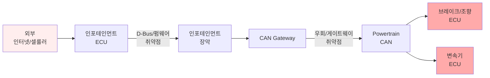
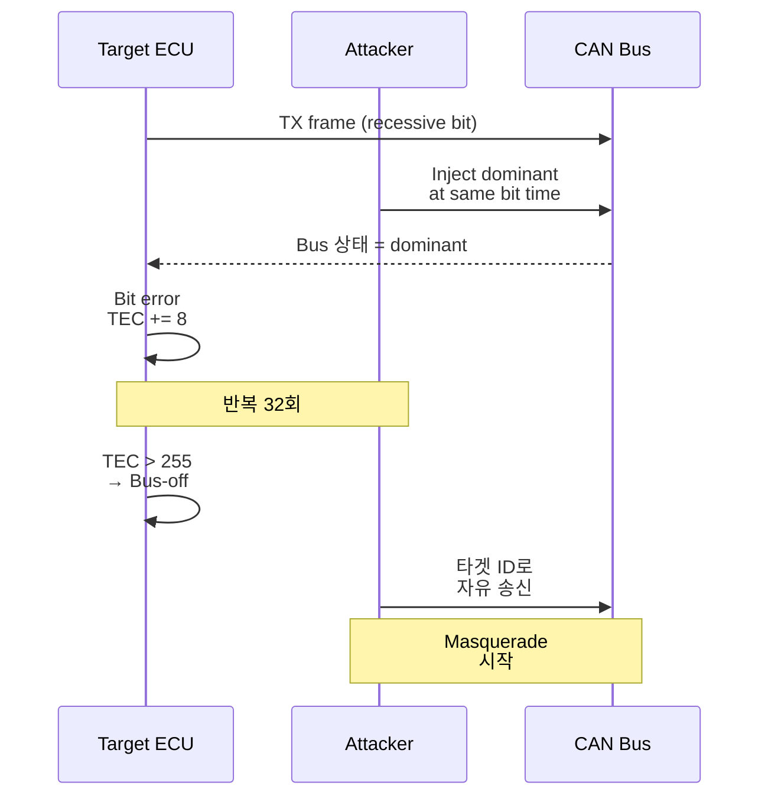

# CH22. CAN 공격 벡터

:::warning 경고
이 챕터는 방어 설계를 위한 학습 목적으로 쓰였다. 허락받지 않은 타 시스템에 대한 공격은 한국 정보통신망법·도로교통법·형법(업무방해)은 물론 해외의 CFAA·Computer Misuse Act 등에도 저촉되어 형사 처벌 대상이다. 실습은 반드시 본인이 소유한 장비 또는 명시적 동의를 받은 테스트 벤치에서만 수행한다. 공격의 원리를 아는 목적은 어디까지나 견고한 방어를 설계하기 위함이며, 이 챕터 역시 그 전제 아래에서 작성됐다.
:::

## 학습 목표

- CAN 프로토콜이 갖는 근본적 보안 한계를 설명한다
- Sniffing·Spoofing·Replay·DoS·Bus-off 등 주요 공격 벡터의 원리를 이해한다
- Bus-off Attack이 TEC 누적을 이용해 어떻게 타겟 ECU를 무력화하는지 시나리오로 파악한다
- 실제 자동차 해킹 사례에서 CAN이 어떻게 pivot 대상이 되었는지 감을 잡는다
- 공격 도구 생태계를 알고 방어 설계가 왜 까다로운지 이해한다
- UN R155 규제가 등장하게 된 역사적 맥락을 사례와 함께 이해한다

## CAN 설계의 근본적 한계

CAN은 1986년 Bosch가 발표한 프로토콜이다. 당시 차량 내부 네트워크는 외부 세계와 차단된 closed network로 간주되었다. 외부에서 차량에 접근할 경로가 사실상 OBD 포트 하나뿐이었고, 인포테인먼트도 CD 플레이어 수준이었으며 셀룰러 모뎀이나 Wi-Fi는 탑재되지 않았다. 그 결과 기본 스펙에 다음이 전혀 없다.

- <strong>인증(Authentication)</strong>은 프레임 송신자를 식별할 수단이 없음을 뜻한다. ID는 메시지 성격을 나타낼 뿐 "누가 보냈는가"를 증명하지 못한다
- <strong>기밀성(Confidentiality)</strong>이 없어서 페이로드가 평문으로 흐른다. 누구든 버스에 붙으면 모든 트래픽을 볼 수 있다
- <strong>무결성(Integrity)</strong>은 제한적이다. CRC는 전송 중 비트 오류 검출용이지 악의적 위변조를 막는 암호학적 수단이 아니다
- <strong>재전송 방지(Anti-replay)</strong>도 없다. 타임스탬프·nonce·카운터가 표준에 없어 과거 프레임을 그대로 다시 보내도 수신 측은 구별하지 못한다

게다가 CAN은 본질적으로 <strong>공유 버스(broadcast)</strong> 구조다. 한 노드가 장악되면 모든 노드에 영향을 줄 수 있다. 텔레매틱스·인포테인먼트처럼 외부 연결성이 높은 ECU가 뚫리면 그 ECU가 브레이크·스티어링 ECU와 동일한 버스를 공유하는 순간 공격 표면이 전 차량으로 확장된다. 네트워크 분리(세그멘테이션)를 아무리 해도 Gateway ECU 자체가 취약하면 결국 전부 통과한다.

이러한 한계는 프로토콜을 바꿔야 해결되지만, CAN은 수십 년간 수억 대 차량에 탑재됐기 때문에 프로토콜 자체를 교체하는 것은 현실적으로 불가능하다. 그래서 이후 SecOC 같은 상위 레이어 방어책이 등장했다. 다음 챕터의 주제다.

## 대표 차량 해킹 사례

### 2015 Jeep Cherokee — Miller·Valasek

Charlie Miller와 Chris Valasek은 <strong>Uconnect</strong> 인포테인먼트 유닛의 셀룰러(Sprint) 포트가 인터넷에 열려 있음을 발견했다. D-Bus 원격 명령으로 Uconnect 펌웨어를 재기록, CAN bus에 임의 프레임을 주입할 수 있는 backdoor를 심었다. 결과적으로 원격으로 와이퍼·라디오·에어컨 제어부터 시속 110km에서 변속기 중립 전환까지 수행했다. 이 사건으로 Fiat Chrysler는 140만 대를 리콜했고, UN R155 같은 자동차 사이버보안 규제의 직접적 계기가 되었다. 이 연구는 DEF CON과 Black Hat에서 공개된 뒤 자동차 업계 전반의 보안 패러다임을 바꿨다.

공격 체인의 세부는 이렇다. 셀룰러 망에서 임의 IP로 포트 6667을 열어 둔 인포테인먼트를 찾아낸 뒤 인증 없이 D-Bus 메시지를 보낼 수 있음을 확인했다. Uconnect에 존재하는 OMAP 칩의 별도 펌웨어 영역에 원격으로 ARM 바이너리를 올리는 것이 가능했고, 이 바이너리는 인포테인먼트의 CAN 컨트롤러와 직접 대화했다. 일단 여기까지 도달하면 CAN 버스에는 어떤 인증도 없으므로 브레이크·조향·변속기 ECU가 받는 모든 커맨드를 위조할 수 있었다.

### 2016 Tesla — Keen Security Lab

Tencent Keen Security Lab은 Tesla Model S의 브라우저 취약점을 통해 인포테인먼트 시스템에 침투, Gateway를 우회해 CAN에 접근했다. 주차 중 트렁크 개방부터 주행 중 급제동까지 시연했다. Tesla는 이후 펌웨어 서명 체인과 Gateway 방화벽을 강화했다. 이듬해 Keen Lab은 Model X에서도 유사한 체인을 성공시켰으며, 이는 OTA 업데이트 인프라가 있는 차량이라도 보안 아키텍처가 약하면 결국 뚫린다는 것을 보여줬다.

Tesla 사례의 인상적인 점은 Keen Lab이 공개 시점에 맞춰 Tesla에 책임 공개(responsible disclosure)를 해서 OTA로 패치가 먼저 배포된 뒤에 기술 세부를 공개했다는 사실이다. OTA가 있는 차량과 없는 차량의 대응 속도 차이는 상상 이상으로 크다. 일반 OEM은 리콜 절차를 밟는 데 수개월에서 수년이 걸리지만 Tesla는 며칠 만에 전 세계 차량을 일괄 업데이트했다.

### 공통점

두 사례 모두 CAN 자체를 직접 공격한 것이 아니다. <strong>외부 연결성이 있는 ECU(인포테인먼트, 텔레매틱스)를 pivot으로 삼아 CAN 버스에 진입</strong>하는 패턴이다. CAN은 일단 붙기만 하면 인증이 없으므로 그다음은 쉽다. 최근 발표된 공격 대부분도 이 구도를 유지한다. 외부 인터페이스 방어와 CAN 계층 방어 두 축이 모두 필요하다는 교훈이다.

## 공격 벡터 분류

### Sniffing

OBD-II 포트에 진단 장비처럼 꽂아 모든 트래픽을 수집한다. 합법(본인 소유 차량 분석)일 수도 불법(타인 차량 무단 접근)일 수도 있다. 수집된 raw CAN 트래픽은 DBC가 없으면 의미를 알 수 없으므로 공격자는 브레이크·액셀 입력 같은 known stimulus를 주면서 트래픽 변화를 관찰하는 <strong>리버스 엔지니어링</strong>으로 ID·시그널 매핑을 복원한다. 툴로는 candump, SavvyCAN, CANalyzer가 쓰인다. 모든 후속 공격의 기반이 되는 가장 기본적인 행동이다.

### Spoofing (Message Injection)

공격자가 정상 ECU인 척 프레임을 주입한다. 브레이크 ECU의 ID로 "브레이크 압력 0"을 보내거나, 속도 게이지에 다른 속도를 표시하게 만들거나, 에어백 전개 커맨드를 위조할 수 있다. 수신 ECU는 CAN ID만 보고 처리하므로 송신자 검증이 불가능하다. 원 ECU가 동일 ID로 동시에 프레임을 보내면 충돌이 일어나겠지만, 공격자가 타이밍을 맞춰 원 ECU보다 먼저 송신하거나 원 ECU를 Bus-off로 밀어낸 뒤 송신하면 정상처럼 보인다.

### Replay

과거에 캡처한 정상 프레임을 그대로 다시 송출한다. 도어 언락, 스마트키 인증 토큰, 크루즈 컨트롤 셋 같은 "일회성이어야 할" 명령이 재생에 취약하면 치명적이다. 타임스탬프·카운터가 없는 메시지는 기본적으로 전부 replay 가능하다. 실차 테스트에서 가장 낮은 난이도이면서도 성공률이 높은 공격이다.

### Denial of Service

CAN의 arbitration 규칙은 <strong>가장 낮은 ID가 버스를 독점</strong>하는 특성이 있다. 공격자가 ID 0x000(최고 우선순위)으로 dominant만 계속 송출하면 다른 모든 노드는 arbitration에서 패배해 송신하지 못한다. ISO 11898은 이런 "무한 지속 TX"를 금지하지만, 규칙을 무시한 공격자는 이걸 어긴다. 변형으로 Error Frame을 연속 주입해 정상 트래픽을 깨뜨리는 <strong>error flood</strong> 공격도 있다. 주행 중 ABS 계통이 DoS에 빠지면 치명적 결과로 이어진다.

### Bus-off Attack

가장 정교한 공격 중 하나다. CAN의 오류 한계 메커니즘(CH9)을 역이용한다.

1. 공격자는 타겟 ECU가 송신 중일 때 특정 비트 타이밍에 맞춰 dominant 비트를 주입한다
2. 타겟 ECU는 자신이 보낸 recessive와 버스 상태가 다름을 감지 → <strong>bit error</strong> 판정 → TEC +8
3. 이 과정이 32회 반복되면 TEC가 256을 넘어 타겟 ECU는 <strong>Bus-off</strong> 상태로 전환된다
4. Bus-off가 된 ECU는 더 이상 송신하지 않는다. 공격자는 이제 해당 ID를 자유롭게 쓸 수 있다

Cho와 Shin(2016)이 "Error Handling of In-Vehicle Networks Makes Them Vulnerable"에서 정식화했다. 정밀한 타이밍을 위해 FPGA나 Teensy 기반 fault injector가 사용된다. 이 공격의 우아한 점은 공격 과정 자체가 CAN 스펙을 위반하지 않는다는 것이다. 단지 타겟의 송신 비트를 교묘하게 덮어쓸 뿐이다.

방어 측면에서 Bus-off Attack은 탐지가 가능하다. 동일 ECU가 반복적으로 bit error를 겪고 TEC가 비정상적으로 빠르게 증가한다면 Gateway나 IDS에서 이를 감지할 수 있다. 하지만 실제 양산 시스템은 이 지표를 모니터링하지 않는 경우가 많아 공격이 조용히 진행될 수 있다. 대응책 중 하나는 TEC 증가율을 특정 윈도우에서 모니터링해 임계값을 넘으면 알람을 내는 것이다. 이 기본 방어만 추가해도 Bus-off Attack의 난이도가 급격히 올라간다.

### ECU Impersonation (Masquerade)

Bus-off Attack의 후속 단계다. 타겟 ECU가 침묵하는 순간부터 공격자 노드가 타겟의 CAN ID로 프레임을 송출해도 누구도 의심하지 않는다. 원래 송신자를 물리적으로 제거한 뒤 그 자리를 빼앗는 구도다. 가장 위험한 시나리오는 브레이크 ECU를 Bus-off시킨 뒤 공격자가 브레이크 상태 메시지를 조작하는 경우다.

### UDS 공격

CH19의 Security Access Service(0x27)가 약한 <strong>Seed-Key 알고리즘</strong>을 쓰면 키를 brute-force하거나 리버싱해서 부팅 후 인증을 통과할 수 있다. 인증 통과 후에는 RequestDownload(0x34)로 악성 펌웨어를 올리거나 RoutineControl(0x31)로 내부 메모리를 들여다본다. 오래된 ECU에서는 16비트 seed·xor 기반 key 같은 취약 알고리즘이 흔하다. OEM 현장에서는 "레거시 플랫폼의 Security Access 알고리즘이 이미 유출돼 있다"는 가정을 기본으로 해야 한다.

### XCP 공격

CH20에서 본 XCP는 개발용 프로토콜이지만, 양산 펌웨어에 실수로 포트가 열린 채 배포되는 경우가 있다. XCP는 기본적으로 메모리 read/write를 지원하므로 노출된 순간 <strong>메모리 덤프와 변수 조작</strong>이 가능해진다. 개발 빌드와 양산 빌드의 컴파일 플래그 관리가 이처럼 보안과 직결된다.

### 산업 장비 사례

- <strong>트럭</strong>의 경우 Miller·Valasek의 후속 연구로 J1939 기반 상용 트럭에서 Retarder·브레이크 제어 조작이 확인됐다
- <strong>농기계</strong>에서는 트랙터 ISOBUS에서 DBC 추출 후 임계 신호 위조 실험이 공개됐다
- <strong>드론</strong> 중 일부 산업용 드론이 CAN 기반 FCU-ESC 통신을 쓰는데, 여기서도 스푸핑 취약성이 보고됐다

농기계와 상용 트럭은 승용차보다 공격 표면이 작아 보이지만, 반대로 방어 투자도 적어 취약성이 누적돼 있다. DEF CON과 농기계 업계 행사에서 꾸준히 발표되는 트랙터 해킹 데모는 OEM의 DRM 우회 목적도 있지만 그 과정에서 드러나는 CAN 인증 부재 문제는 방어 관점에서도 귀중한 자료다. 농기계의 경우 "수리권(right to repair)" 논쟁과 맞물려 보안 연구와 소비자 권리가 복잡하게 얽혀 있다.

## 오픈소스 생태계와 공격 연구

CAN 보안 연구는 지난 10년간 학계와 해커 커뮤니티 양쪽에서 활발히 진행됐다. Black Hat, DEF CON, Car Hacking Village 같은 컨퍼런스는 매년 새로운 공격 기법을 발표한다. 오픈소스 도구 덕분에 예전에는 수천만 원짜리 상용 장비가 있어야 가능했던 분석을 수십만 원 수준의 하드웨어로 할 수 있게 됐다. 이 "민주화"는 연구자에게 좋지만 동시에 공격자 진입 장벽도 낮췄다. OEM이 보안 설계를 서두르게 된 배경 중 하나다.

## 공격 도구

| 도구 | 용도 |
| --- | --- |
| can-utils | candump·cansend·cangen. Linux에서 기본기 |
| SavvyCAN | GUI 기반 트래픽 분석, DBC 편집, replay |
| CANalyzer + CAPL | 상용. 스크립팅으로 정교한 주입 가능 |
| Scapy (Layer 2) | Python에서 프레임 조작 |
| CAN-of-Fun(0xD0X) | DEF CON에서 공개된 실습 도구 |
| Metasploit automotive | 일부 공격 모듈 포함 |
| FPGA/Teensy fault injector | Bus-off Attack용 정밀 타이밍 주입 |

## 공격 체인 시각화

인포테인먼트를 통한 차량 해킹 시나리오는 다음과 같은 체인을 따른다.

## Bus-off Attack 타이밍

Bus-off Attack은 공격자 노드와 타겟 노드가 동시에 송신할 때 특정 비트를 어긋나게 만들어 타겟만 오류 판정을 받도록 유도한다.

## 방어가 왜 어려운가

1. <strong>하위 호환성</strong>이 발목을 잡는다. 새 보안 메커니즘을 넣으면 기존 ECU가 못 따라온다. 양산차는 10년 이상 운행되므로 레거시를 끊을 수 없다
2. <strong>ECU 리소스 제약</strong>도 심각하다. 저사양 MCU는 AES·CMAC을 돌릴 여력이 부족하다. 펌웨어 플래시 크기도 빠듯하다
3. <strong>실시간성</strong>의 문제가 있다. 10ms 주기로 도는 제어 루프에 암호 연산 지연이 추가되면 제어 품질이 떨어진다
4. <strong>배포 경로</strong>는 OTA 미지원 차량의 경우 펌웨어 업데이트를 하려면 딜러 방문이 필요하다. 취약점 발견에도 수년이 걸리는 패치 주기가 생긴다
5. <strong>표준의 분화</strong>도 장벽이다. SecOC, CANcrypt, TACAN 등 여러 제안이 있지만 OEM마다 다르게 채택한다

## 위협 모델과 실전 시나리오

실제 위협을 평가할 때는 공격자의 능력(capability)과 접근성(access)을 분리해 본다. 공격자 프로파일은 대략 세 단계로 나눌 수 있다.

- 로컬 접근 공격자는 OBD 포트나 서비스 커넥터에 물리적으로 접근할 수 있다. 스니핑·replay·injection이 쉽다. 정비소·공장·애프터마켓 판매 환경이 해당된다
- 근거리 원격 공격자는 Wi-Fi·Bluetooth·TPMS 등 근거리 무선을 통해 접근한다. 주차장이나 신호대기 중 차량 측면에 붙어 수행하는 공격 시나리오에 해당한다
- 원격 공격자는 셀룰러·인터넷을 통해 지구 반대편에서 접근한다. Jeep·Tesla 사례가 여기에 속한다

각 단계마다 위협의 크기와 대응 우선순위가 다르다. UN R155가 요구하는 TARA(Threat Analysis and Risk Assessment)는 이런 공격자 모델링을 전제로 한다. 위협을 카탈로그화하고 각각에 보안 목표(Security Goal)를 매칭해 실제 방어 수단을 설계하는 과정이다.

## 정리

CAN의 보안 한계는 "무결성은 있으나 진정성(authenticity)이 없다"로 요약된다. 다음 챕터에서는 이 한계를 보완하는 SecOC·IDS·MAC 기반 방어 기법을 본다. 방어는 공격을 알아야 설계할 수 있다. 역설적이지만 공격자의 시선을 빌려야 제대로 된 방어가 나온다. 이 챕터에서 다룬 공격 벡터 하나하나가 다음 챕터 방어 기법의 설계 근거가 된다.

## 다음 챕터

다음 챕터에서는 AUTOSAR SecOC와 CAN-IDS 기반 방어 전략, 그리고 UN R155 같은 규제 맥락까지 다룬다.

::: tip 핵심 정리
- CAN은 기본 스펙에 인증·기밀성·재전송 방지가 없다
- Jeep Cherokee·Tesla 사례 모두 인포테인먼트를 pivot으로 CAN에 진입한 패턴이다
- 주요 공격 벡터는 Sniffing, Spoofing, Replay, DoS, Bus-off, Impersonation이다
- Bus-off Attack은 정밀 타이밍으로 타겟 ECU의 TEC를 누적시켜 무력화한 뒤 그 ID를 탈취한다
- UDS Security Access와 XCP 포트 노출은 애플리케이션 계층의 전형적 취약점이다
- 하위 호환·리소스·실시간 제약으로 CAN 방어 설계는 본질적으로 어렵다
:::
