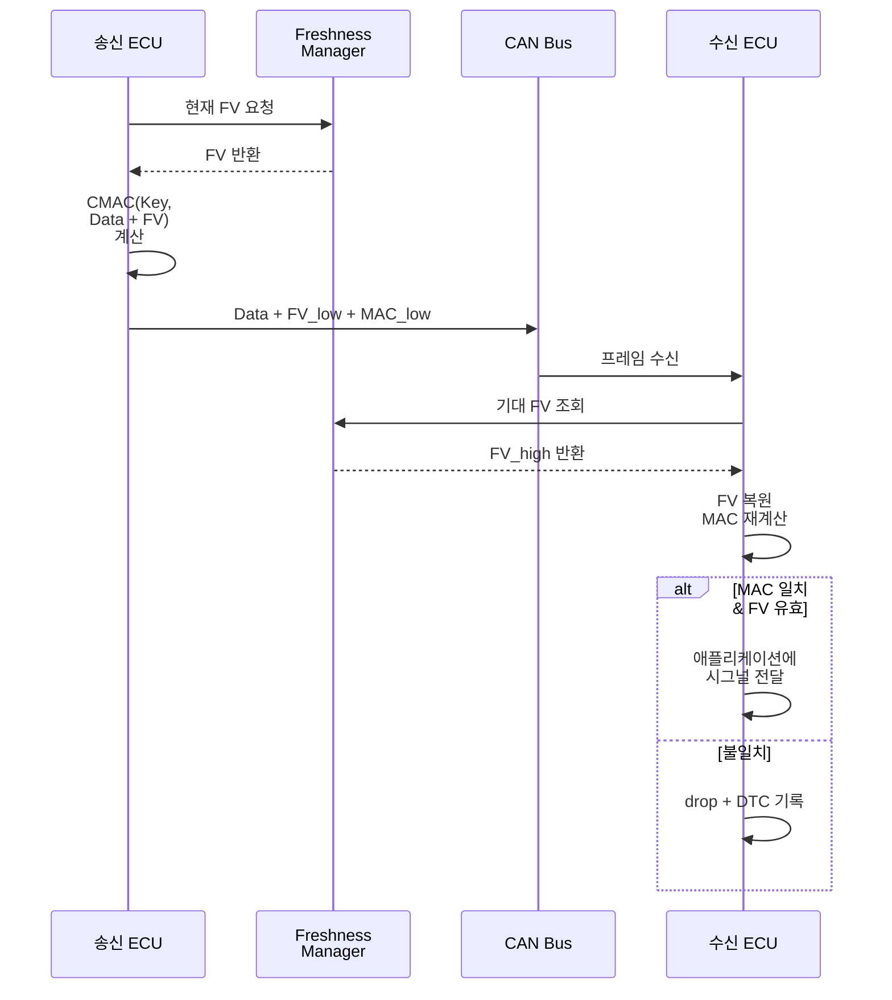
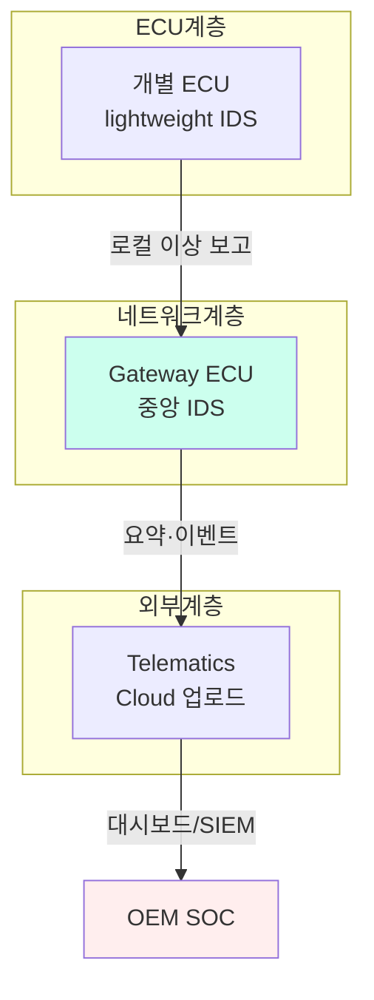

# CH23. CAN 방어 — SecOC·IDS·MAC

앞 챕터에서 본 것처럼 CAN은 설계상 인증이 없다. 그렇다고 프로토콜을 다시 만들 수는 없다. 기존 CAN의 뼈대를 유지하면서 상위에 보안 레이어를 쌓는 접근이 현실적이다. AUTOSAR SecOC가 그 중심에 있고, 여기에 IDS·물리 계층 인증·규제 프레임워크가 함께 작동해야 실전 방어가 성립한다. 이 챕터는 그 조각들을 하나씩 풀어 본다.

## 학습 목표

- AUTOSAR SecOC의 Truncated MAC·Freshness Value 구조를 이해한다
- CAN-IDS의 규칙 기반·ML 기반·Specification 기반 접근을 구별한다
- Voltage fingerprint 같은 물리 계층 인증의 개념을 파악한다
- HSM·SHE 기반 키 관리와 Secure Boot의 연결 관계를 본다
- UN R155, ISO/SAE 21434 등 규제 프레임워크가 설계에 미치는 영향을 이해한다
- 차량 급별·장비별로 어떤 방어 조합이 현실적인지 판단 기준을 익힌다

## 방어의 기본 원칙

방어 설계에 들어가기 전 몇 가지 원칙을 확인하자. 이 원칙들은 SecOC·IDS 구체 기술을 관통한다.

- 최소 권한 원칙은 각 ECU가 필요한 메시지만 주고받도록 화이트리스트를 구성하는 형태로 적용된다
- 심층 방어는 한 계층이 뚫려도 다음 계층이 막도록 SecOC·IDS·Secure Boot를 중첩한다
- 실패의 안전은 공격 탐지 시 차량이 안전한 상태로 degrade되도록 한다. 단순 기능 차단은 오히려 위험할 수 있으므로 안전 상태 정의가 중요하다
- 투명성은 IDS가 탐지한 사건을 로깅하고 추후 포렌식을 가능하게 한다
- 주기적 갱신은 키·펌웨어·IDS 규칙이 모두 해당된다. 한 번 설계해 놓고 방치하는 보안은 장기적으로 실패한다

## SecOC — Secure Onboard Communication

AUTOSAR 4.2부터 표준화된 SecOC(Secure Onboard Communication)는 CAN 메시지에 <strong>인증과 재전송 방지</strong>를 추가하는 계층이다. CAN Classical과 CAN FD 모두에 적용 가능하며, 현재 양산 차량 보안의 사실상 표준이다. 기존 ECU 펌웨어 스택에 보안 모듈을 얹는 방식이라 하드웨어 교체 없이 점진 도입이 가능하다는 장점이 크다.

### Truncated MAC

SecOC의 핵심은 Message Authentication Code, 그 중에서도 <strong>CMAC(Cipher-based MAC with AES-128)</strong> 알고리즘이다. 전체 MAC은 128비트(16바이트)이지만 CAN 페이로드가 최대 8바이트인 점을 고려해 <strong>3~4바이트로 잘라 첨부</strong>하는 전략을 쓴다. 이를 Truncated MAC이라 한다.

- <strong>보안과 공간 트레이드오프</strong>가 핵심이다. MAC 길이가 짧아질수록 우연 충돌 확률이 커지지만 페이로드 공간은 확보된다. 3바이트 MAC이면 우연 통과 확률은 1/2^24로, 공격자의 brute-force를 충분히 어렵게 만든다는 평가다
- <strong>계산 비용</strong>은 걱정거리다. AES-128 CMAC은 저사양 MCU에 부담이 있다. HW crypto accelerator가 없는 환경에서는 OS 지터에 영향을 줄 수 있다

### Freshness Value (FV)

동일 페이로드를 여러 번 보내면 MAC도 동일해져 replay에 취약하다. 이를 막기 위해 MAC 계산 입력에 <strong>Freshness Value(FV)</strong>를 포함시킨다.

- <strong>Counter 기반</strong> 방식에서는 송신마다 증가하는 단조 카운터를 쓴다. 송수신 측이 동기화를 유지해야 한다
- <strong>분산 시간 동기 기반</strong>에서는 Time-sync 메시지로 전체 네트워크가 공유하는 타임스탬프를 쓴다. AUTOSAR Time Sync 모듈과 결합한다

FV 전체는 크지만(예: 32비트) 페이로드에는 하위 일부만 실어 보낸다. 수신 측은 자신이 기억하는 상위 비트와 결합해 완전한 FV를 복원한 뒤 MAC 검증에 사용한다. 이 설계 덕분에 대역폭 부담을 최소화하면서도 장기적 replay 방지를 달성한다.

### Payload 배치

SecOC가 적용된 프레임은 일반적으로 이렇게 구성된다.

```
| Data (n byte) | FV_truncated (2~4 byte) | MAC_truncated (3~4 byte) |
```

원래 8바이트 페이로드 중 상당 부분을 보안 오버헤드가 차지하므로 CAN FD(최대 64바이트)에서 훨씬 실용적이다. 이 때문에 SecOC 본격 도입은 CAN FD 확산과 궤를 같이했다. Classical CAN만 쓰는 차량에서는 핵심 메시지만 선별적으로 SecOC를 적용하는 식으로 절충한다.

### Freshness Manager와 키 관리

SecOC 사양에는 <strong>Freshness Manager</strong>가 FV를 유지·배포하는 역할로 정의된다. Master/Slave 모드로 동작한다.

- <strong>Master</strong>는 전체 네트워크의 기준 FV를 관리하고 Slave에게 배포한다
- <strong>Slave</strong>는 Master가 배포한 FV를 자기 컨텍스트에 맞게 확장한다

키는 보통 <strong>OEM 서명 펌웨어에 사전 주입(pre-shared)</strong> 되는 방식이다. 실차에서 Diffie-Hellman 같은 동적 키 교환은 드물다. 키 롤오버(rollover) 주의가 필요하다. 카운터가 최대값에 도달하면 키를 바꾸거나 상위 비트를 리셋해야 한다. 이를 빼먹으면 공격자가 과거 FV를 재사용할 수 있다. 필드 차량에서 키 교체는 OTA 인프라에 의존하므로 인프라가 없는 구형 플랫폼은 키 수명이 차량 수명과 동일해지는 구조적 위험을 갖는다.

### AUTOSAR Specification의 상세

공식 사양서(SWS_SecOC)는 다음을 규정한다.

- 인증 실패 시 에러 처리는 프레임 drop, DTC 보고, 재시도 정책 등으로 분기된다
- Authentic I-PDU와 Secured I-PDU의 구분은 인증 대상 시그널을 PDU 단위로 지정한다
- 인증 실패 카운터 임계값은 일정 횟수 이상 실패 시 상위 레이어에 알린다

실무에서 SecOC 도입은 "어떤 메시지에 적용할 것인가"부터 시작한다. 모든 PDU에 적용하면 대역폭과 CPU 부담이 과도해지므로, 위협 분석 결과 고위험으로 분류된 메시지(브레이크 커맨드, 조향 각도, 파워트레인 토크 요청 등)만 선별한다. 주행 안전과 직결되지 않는 상태 메시지는 SecOC 없이 가도 무방하다는 판단이 현장의 기본이다. 이 선별 기준은 TARA 문서에 명시적으로 기록된다.

## SecOC 송수신 흐름



## CAN-IDS — Intrusion Detection System

SecOC가 사전 방어(prevention)라면 IDS는 사후 탐지(detection)다. 공격이 이미 진행 중이거나 알려지지 않은 방식으로 들어올 때 이를 알아채는 역할이다. 두 접근은 보완 관계이며, 한쪽이 다른 쪽을 대체하지 못한다.

### 규칙 기반(Rule-based)

가장 단순하고 현장에서 많이 쓰인다.

- <strong>알려진 ID 화이트리스트</strong>는 DBC에 정의된 ID 외 프레임이 나타나면 알람을 울린다
- <strong>주기 범위 체크</strong>는 10ms 주기 메시지가 1ms 간격으로 쏟아지면 주입 의심이다
- <strong>DLC·페이로드 범위</strong> 검사는 정의된 길이·값 범위 밖 시그널에서 위조 가능성을 읽는다

구현이 쉽고 false positive가 낮지만 알려지지 않은 공격은 놓친다. 양산 IDS 대부분이 이 범주에서 출발하며, 양산 안정성이 요구되는 환경에서는 규칙 기반이 여전히 주력이다.

### ML 기반

최근 학계 중심으로 활발한 주제다.

- <strong>LSTM 기반 시퀀스 모델</strong>은 정상 트래픽의 ID 시퀀스를 학습한 뒤 벗어나면 이상으로 판정한다
- <strong>Autoencoder</strong>는 정상 페이로드 패턴을 복원하지 못하면 이상으로 본다
- <strong>주파수 분석</strong>은 각 ID의 inter-arrival time 분포를 모델링한다

연구실 지표는 좋지만 실차 배포 시 데이터 분포 변화(drift)로 false positive가 증가하는 문제가 있다. 차량 전체에 적용하기보다 특정 고위험 버스에 한정해 쓰는 편이 현실적이다. 양산 ECU에 탑재하려면 추론 비용도 밀리초 단위로 줄여야 한다.

### Specification 기반

DBC·ARXML의 시그널 범위·상호 제약을 런타임에 검사한다. 엔진 RPM이 마이너스라거나, 기어가 P인데 속도가 100km/h라거나 하는 <strong>논리적 위배</strong>를 잡는다. ML보다 명시적이고 규칙보다 풍부한 검사가 가능해 실용성이 높다. 설계 시점에 정의된 물리 제약과 상태 전이 규칙을 근거로 하므로 오탐도 적다.

### 설치 위치



- <strong>ECU 내부 IDS</strong>는 리소스 제약 하의 경량 규칙 검사를 담당한다
- <strong>Gateway 중앙 IDS</strong>는 전체 트래픽을 모니터링한다. 가장 일반적 배치다
- <strong>Cloud IDS</strong>는 Telematics로 업로드 후 OEM SOC에서 상관분석한다. OTA 업데이트 결정에도 활용된다

## 대체 인증 방식

### 학계 제안

- <strong>TACAN</strong>은 CAN 프레임의 CRC 영역에 몰래 MAC을 삽입하는 방식이다. 페이로드 공간을 잡아먹지 않는 covert 채널이다
- <strong>vatiCAN</strong>은 MAC을 별도 프레임으로 후속 송신한다. 레거시 수신기와 호환된다
- <strong>LeiA</strong>는 lightweight authentication으로 저사양 ECU를 겨냥했다

모두 재미있지만 OEM 대규모 채택까지 가지 못했다. SecOC가 승자 역할을 했다.

### CAN XL SDT

CAN XL은 <strong>SDT(Simple Data Transport)</strong>와 CiA 611 스펙에서 link layer 인증 옵션을 정의한다. Frame 헤더 확장 필드에 직접 MAC 영역을 두는 방식으로, SecOC처럼 별도 PDU 가공 없이 트랜시버/컨트롤러 레벨에서 인증을 처리할 수 있다. CAN XL의 페이로드가 크기에 여유로운 점이 유리하게 작용한다.

### MACsec과의 비교

이더넷 쪽에는 IEEE 802.1AE MACsec이 있다. 프레임마다 16바이트 ICV(무결성 체크 값)를 추가하지만 이더넷은 MTU가 1500바이트라 오버헤드가 상대적으로 작다. CAN은 페이로드 8바이트에 이런 오버헤드를 녹일 수 없어 MACsec 같은 link-layer 전면 암호화는 불가능하다. SecOC가 <strong>인증에 한정된 절충안</strong>으로 정착한 이유다.

## 물리 계층 인증 — Voltage Fingerprint

각 CAN 트랜시버는 제조 공정의 미세한 차이로 <strong>전기 신호 특성</strong>이 고유하다. Dominant/recessive 전압 레벨의 DC 오프셋, 에지 형태(rise/fall time), 공통 모드 전압이 노드별로 조금씩 다르다. 이를 학습해 송신자를 식별하는 연구가 있다.

- <strong>Viden(2017)</strong>은 여러 ECU의 전압 프로파일을 학습해 송신 ECU를 식별한다. MAC 없이도 스푸핑 탐지가 가능하다
- <strong>Scission(2018)</strong>은 에지 기반 분석으로 추가 정밀도를 확보한다

장점은 기존 ECU 펌웨어 변경 없이 모니터만 추가하면 된다는 점이다. 단점은 온도·노화로 전압 특성이 변해 주기적 재학습이 필요하고, 전용 고속 ADC 하드웨어가 요구된다는 것이다. 현재는 연구 단계에 가까우며 일부 애프터마켓 보안 솔루션이 채택했다.

## 오픈소스와 양산 현실

SecOC의 공식 구현은 대부분 Vector, Elektrobit, ETAS 같은 상용 AUTOSAR Stack 안에 들어 있다. 오픈소스 진영에서는 CANcrypt, OpenCAN-Sec 같은 실험적 구현이 공개돼 있지만 양산 품질에 이르지 못했다. 공부와 프로토타이핑에는 STM32나 ESP32 + Mbed TLS 조합으로 AES-128 CMAC을 직접 구현해 보는 편이 이해에 도움이 된다. 실제로 인증 지연이 얼마나 되는지, FV 동기화가 얼마나 까다로운지 손끝으로 느끼게 된다.

IDS 측은 오픈소스 생태계가 조금 더 활발하다. OpenVAS·Suricata를 차량 네트워크에 적용하려는 시도, LSTM 기반 이상탐지 논문 구현 저장소, 연구용 데이터셋(Car Hacking Dataset)이 공개돼 있다. 연구 주제로 진입하기에 적합한 환경이다.

## 키 관리 인프라

SecOC의 보안은 결국 키의 보안에 달렸다. 키를 어디에 어떻게 저장할지가 실제 설계의 핵심이다.

- <strong>SHE (Secure Hardware Extension)</strong>는 HIS 컨소시엄 표준이다. 저비용 hardware key storage로 마이크로컨트롤러 내장 모듈 형태다
- <strong>EVITA HSM</strong>은 Light/Medium/Full 세 등급으로 나뉜다. Full은 완전한 HSM으로 서명·인증·키 교환을 지원한다
- <strong>Secure Boot와의 결합</strong>은 펌웨어 변조 시 키 접근을 차단한다. Chain of trust로 디바이스 루트키부터 검증한다
- <strong>키 로테이션</strong>은 일정 주기 또는 이벤트(예: 차량 인수) 기준으로 키를 갱신한다. OTA 인프라가 받쳐줘야 한다

## 규제와 표준

자동차 사이버보안은 이제 규제 영역이다.

| 규제/표준 | 내용 |
| --- | --- |
| UN R155 | CSMS(Cyber Security Management System) 의무화. 2024년부터 유럽 신차 인증 필수 |
| UN R156 | Software Update Management System. OTA 거버넌스 |
| ISO/SAE 21434 | 자동차 사이버보안 엔지니어링 라이프사이클 표준 |
| Automotive SPICE | 프로세스 품질과 보안 절차 |

UN R155는 type approval(형식 승인)에 CSMS 입증을 요구한다. 즉 OEM은 위협 분석(TARA), 보안 설계·검증, 사고 대응 체계를 모두 문서화해야 한다. SecOC·IDS는 이 요구를 만족시키기 위한 <strong>기술적 근거</strong>로 제출된다. 규제 적응 비용을 감당하지 못해 일부 군소 OEM은 유럽 시장에서 철수하는 사례도 나왔다.

ISO/SAE 21434는 보안을 기능안전(ISO 26262)처럼 라이프사이클 전체에 걸친 엔지니어링 활동으로 정의한다. 개념 단계 TARA → 설계 단계 Cybersecurity Specification → 구현·통합 검증 → 양산 후 취약점 대응과 폐기까지 단계별 작업 산출물이 정해져 있다. 이 표준 이후 보안은 더 이상 "출시 직전에 점검하는 품목"이 아니라 "기획 단계부터 포함되는 요구사항"이 됐다. 실무 엔지니어 입장에서는 코드 리뷰·설계 리뷰에 보안 체크리스트가 공식적으로 추가된 변화로 느껴질 것이다.

## 언제 무엇을 쓰는가

| 환경 | 권장 방어 |
| --- | --- |
| 경차/저가 라인 | 규칙 기반 IDS + 핵심 메시지에만 SecOC |
| 중상위 세단 | SecOC 전면 적용 + Gateway IDS |
| ADAS/AD 차량 | SecOC + ML-IDS + Voltage fingerprint 실험 도입 |
| 상용 트럭(J1939) | 메시지 수가 많아 SecOC 일부 + 센서 redundancy로 보완 |
| 농기계/ISOBUS | 오프로드 공격 표면 제한적이므로 IDS 위주, 핵심 제어 메시지 SecOC |

## 실전 도입 고려사항

SecOC·IDS를 도입할 때 현장에서 반복적으로 부딪히는 이슈를 몇 가지 정리한다.

- 레거시 ECU와의 혼재가 가장 큰 부담이다. 새 ECU는 SecOC를 지원하지만 기존 ECU는 지원하지 않는다면 해당 메시지는 인증 없이 가야 한다. Gateway에서 변환·필터링하는 Security Gateway 패턴이 흔히 채택된다
- Key provisioning은 공장 단계에서 HSM에 키를 주입하는 복잡한 프로세스를 요구한다. OEM·ECU 공급사·HSM 공급사가 얽히는 부분이며 프로비저닝 오류는 현장 실패의 주범이다
- IDS의 false positive는 운영 자원을 고갈시킨다. 알람이 하루 1만 건 나오면 실제 공격이 묻힌다. 튜닝과 운영 자동화(SIEM 연동)가 필수다
- 규제 대응 문서화는 기술보다 오히려 공수가 많이 든다. 보안 설계 근거, 테스트 결과, 사고 대응 계획을 UN R155 심사자에게 납득시켜야 한다

## 정리

방어는 단일 솔루션이 아니라 <strong>계층 방어(defense in depth)</strong>다. SecOC로 인증을 걸고, IDS로 이상을 탐지하고, HSM으로 키를 지키고, Secure Boot로 펌웨어 무결성을 확보하고, OTA로 취약점을 빠르게 패치하는 조합이 요구된다. UN R155 이후 이 모든 게 규제 의무가 됐다. 전체 그림을 이해한 엔지니어가 특정 계층만 다루더라도 다른 계층과의 접점을 놓치지 않게 된다는 점이 핵심이다.

## 다음 챕터

다음 챕터는 이 스터디의 마지막 장이다. 실전에서 CAN 시스템이 고장났을 때 어디서부터 어떻게 파고들지를 진단 플로우차트와 체크리스트 중심으로 정리한다.

::: tip 핵심 정리
- SecOC는 CMAC 기반 Truncated MAC과 Freshness Value로 인증·재전송 방지를 제공한다
- FV는 Counter 또는 분산 시간 동기 기반이며 Freshness Manager가 관리한다
- CAN-IDS는 규칙·ML·Specification 기반 접근이 있고 Gateway에 주로 배치된다
- CAN XL SDT는 link layer에 인증을 내장하는 차세대 방향이다
- Voltage fingerprint는 하드웨어 특성으로 송신자를 식별하는 물리 계층 방어다
- SHE·EVITA HSM과 Secure Boot는 SecOC 키 보안의 기반이다
- UN R155와 ISO/SAE 21434는 이 모든 방어 설계를 규제 의무로 만들었다
:::
