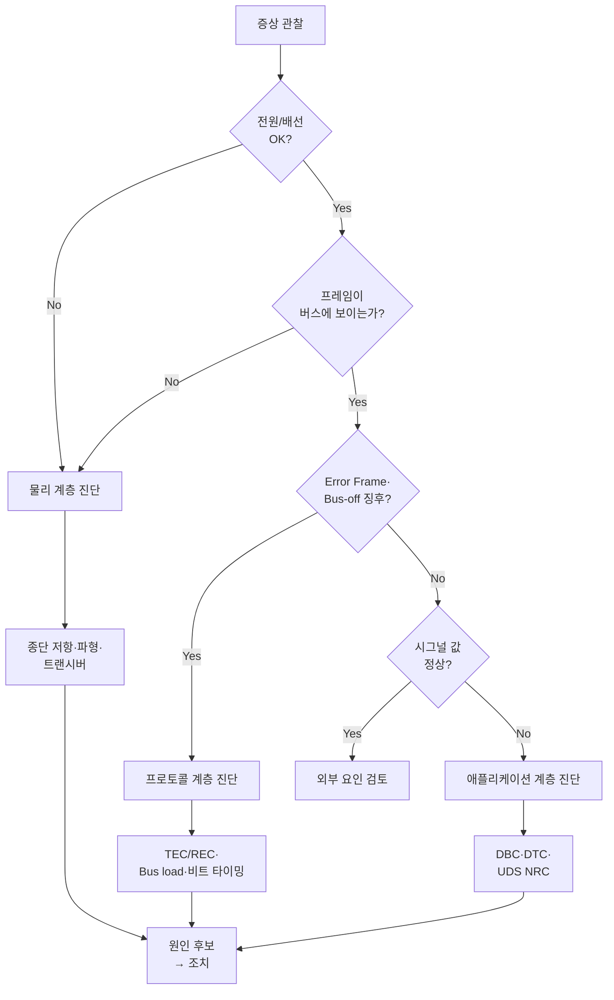
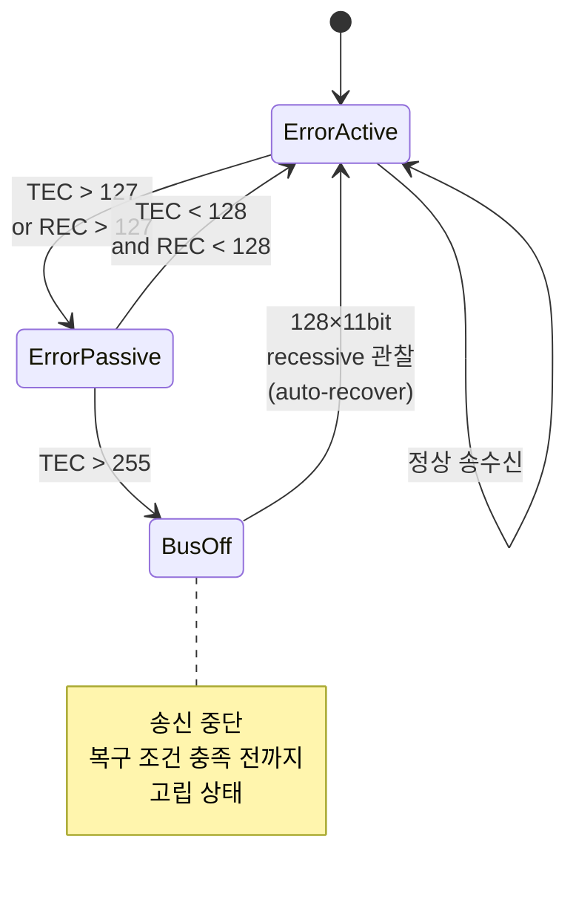

# CH24. 실전 트러블슈팅

실전 트러블슈팅은 지식의 종합시험 같은 장이다. 이전 23개 챕터에서 배운 물리·타이밍·프로토콜·구현·보안 지식이 여기서 한꺼번에 동원된다. 고장 한 건을 제대로 잡으면 그 과정에서 CAN 시스템 전체를 다시 이해하게 된다. 이 챕터는 그 진단 여정을 체계적으로 안내한다.

## 학습 목표

- CAN 이슈를 물리/프로토콜/애플리케이션 3계층으로 나눠 진단하는 프로토콜을 익힌다
- 종단 저항·파형 측정으로 물리 계층 문제를 가려낸다
- Error counter·Bus load 해석으로 프로토콜 계층 원인을 좁힌다
- DTC·UDS NRC 해독과 DBC 해석으로 애플리케이션 계층 문제를 해결한다
- 자주 묻는 필드 이슈 10가지에 대한 전형적 원인과 조치를 안다
- 재현과 증거 고정까지 포함하는 실전 디버깅 흐름을 익힌다

## 진단 3단계 프로토콜

CAN 문제를 만났을 때 "일단 프레임을 봐야지" 하고 바로 candump를 꽂으면 잘못된 결론에 도달하기 쉽다. 다음 순서를 지켜야 한다. 하위 계층이 망가져 있으면 상위 계층 관찰은 의미가 없다.

1. <strong>물리/전기</strong> 계층은 전원이 들어오는지, 배선이 끊기지 않았는지, 파형이 정상인지 본다
2. <strong>프로토콜/Bus</strong> 계층은 프레임이 보이는지, Error counter가 증가하는지, Bus load가 적정한지를 확인한다
3. <strong>애플리케이션/시그널</strong> 계층은 보이는 값이 설계된 범위·의미와 맞는지 검증한다

아래는 계층별 상세 진단 절차다.

## 1단계 — 물리 계층 진단

### 종단 저항 측정

전원을 OFF한 상태에서 CANH-CANL 사이 저항을 멀티미터로 잰다. ISO 11898-2는 양 끝에 120Ω 저항을 각각 설치하므로 건강한 버스의 저항은 병렬로 <strong>60Ω</strong>이 되어야 한다.

- 60Ω은 정상 상태를 뜻한다
- 120Ω이 측정되면 종단 저항이 한쪽에만 있다는 의미다. 나머지 한쪽이 빠졌거나 끊겼다
- 40Ω 이하라면 종단 저항이 세 개 이상 연결된 것으로 흔한 실수다. T-커넥터로 ECU를 추가하면서 자체 종단을 끄지 않으면 발생한다
- 무한대는 배선 단선 또는 커넥터 빠짐이다

### 전압 레벨 체크

전원을 켠 상태에서 CANH와 CANL 전압을 본다.

- Idle(recessive) 상태에서 CANH와 CANL은 모두 약 2.5V여야 한다
- Dominant 상태에서 CANH는 약 3.5V, CANL은 약 1.5V로 차등 2V를 형성한다

Idle에서 양쪽이 각각 2.5V가 아니면 공통 모드 전원 문제다. 접지 불량이면 CANH·CANL이 같은 방향으로 수V씩 들리거나 떨어진다. 차량에서 흔히 "일부 구간에서만 CAN이 이상하다"는 증상이 접지 루프 때문인 경우가 많다.

### 오실로스코프 파형

- <strong>Ringing 심함</strong>은 종단 저항 부족 또는 스터브 과다를 뜻한다. 스터브 길이는 CAN Classic에서 30cm, CAN FD에서 10cm 이하를 목표로 한다
- <strong>비대칭 파형</strong>은 CANH·CANL 중 하나만 제대로 흔들리는 상태로 트랜시버 한쪽 핀 고장 또는 ESD 손상을 의심한다
- <strong>오실레이터 흔들림</strong>은 Bit time이 엇비슷하게 변동하는 현상이다. 일반적으로 MCU의 주발진기 문제다

## 2단계 — 프로토콜 계층 진단

### Error Counter 해석

Linux에서는 `ip -details link show can0`으로 현재 상태를 볼 수 있고, `candump -e any`로 Error Frame을 스트리밍한다.

- Error Passive 원인 상위에는 bit timing 파라미터 오차(샘플 포인트·Prop_Seg), 종단 저항 문제, 트랜시버 고장이 있다
- Bus-off 복구 루프에서 auto-recover 플래그가 켜져 있으면 버스 오프에 빠졌다가 재진입하는 상태를 반복할 수 있다. 복구 전후 ESR(Error Status Register)과 TEC/REC 값을 로그로 남겨 재발 패턴을 확인한다

### Bus Load

점유율이 <strong>40%를 넘으면 경계</strong>, <strong>60%를 넘으면 위험</strong> 신호다. 낮은 우선순위 메시지의 응답 시간이 급격히 늘어난다. CH10의 WCRT(worst-case response time) 계산으로 진짜 문제인지 확인하고, 필요하면 우선순위 재할당이나 CAN FD 전환을 검토한다. 정적 우선순위 설계의 한계가 드러나는 지점이기도 하다.

Bus load 측정에는 Vector/Kvaser 같은 상용 툴이 편리하지만, SocketCAN 기반으로도 직접 계산할 수 있다. candump 로그에서 시간 윈도우 단위로 프레임 수와 각 프레임의 bit 수(DLC·stuff bit 포함)를 적분해 bitrate 대비 비율로 내면 된다. 실무에서는 Bus load가 평균은 낮지만 피크가 높아서 문제가 되는 경우가 자주 있다. 평균값이 아니라 최악 구간(예: 100ms 윈도우 최대값)을 봐야 한다.

### 비트 타이밍

Error Passive가 뜨는데 종단·트랜시버가 멀쩡하면 십중팔구 타이밍이다. CH4·CH5에서 본 것처럼 Sample Point(일반적으로 75~87.5%), SJW, Prop_Seg를 전체 노드에서 일치시켜야 한다. Vector BUSMASTER나 Kvaser CANKing으로 계산기를 돌려 비교한다. 새 ECU를 붙였을 때 "혼자만 bitrate는 같은데 내부 설정이 다른" 케이스가 특히 자주 발생한다.

### Error Active → Passive → Bus-off 상태 흐름

## 3단계 — 애플리케이션 계층 진단

### DTC 해독

OBD-II에서 읽히는 DTC(예: P0420)는 제조사 매뉴얼에 매핑돼 있다. 표준 P0xxx는 공통이고, P1xxx는 제조사 고유다. 차량 정비 매뉴얼 없이 해석하면 오진한다. 일반 스캐너는 숫자만 보여주고 의미를 설명해 주지 못할 수 있으므로 반드시 원본 정비 정보를 참조한다.

### UDS Negative Response Code

진단 요청에 0x7F 응답이 오면 <strong>NRC(Negative Response Code)</strong>를 확인한다.

| NRC | 의미 | 흔한 원인 |
| --- | --- | --- |
| 0x10 | General Reject | 서버가 요청을 일반 거부. 서비스 미지원 의심 |
| 0x11 | Service Not Supported | ECU가 해당 SID를 구현하지 않음 |
| 0x22 | Conditions Not Correct | IG off, 엔진 running 등 조건 미충족 |
| 0x33 | Security Access Denied | Seed-Key 인증 안 받음 |
| 0x78 | Response Pending | 긴 작업 진행 중. 타임아웃 연장 필요 |

### Signal 값 이상

- <strong>DBC endianness</strong>에서 Intel(Little)과 Motorola(Big)를 반대로 설정하면 값이 뒤집혀 나온다
- <strong>factor/offset 실수</strong>는 자주 발생한다. 8비트 raw를 factor 0.5로 쓰는데 1로 설정하면 값이 2배가 된다
- <strong>scaling 오류</strong>는 signed/unsigned 혼동으로 생긴다

이런 문제는 Vector CANalyzer·CSS Electronics asammdf로 로그를 재해석하면 바로 드러난다. 현장에서 "값이 이상하다"는 신고의 70% 이상이 이 범주에 속한다. 특히 다른 업체가 만든 DBC를 받아 연동할 때는 사소한 endian·factor 실수가 반복적으로 터진다. DBC 검증 테스트를 CI에 포함시키는 게 장기적으로 안전하다.

### 진단 세션과 세션 타임아웃

UDS 기반 작업에서 "중간까지는 잘 되다가 갑자기 응답이 안 옴" 증상은 Tester Present(0x3E) 미송신으로 진단 세션이 끊긴 경우가 많다. 기본 S3 타이머(5초)가 만료되면 서버가 Default Session으로 돌아간다. Extended Session이나 Programming Session을 유지하려면 주기적으로 Tester Present를 보내야 한다. 툴에 따라 자동 처리 옵션이 꺼져 있는 경우가 있으므로 먼저 확인한다.

## 간헐 고장 재현 전략

간헐적 고장은 CAN 트러블슈팅에서 가장 까다로운 부류다. 한 번 놓치면 동일 환경을 재구성하기 어렵기 때문이다. 다음 원칙을 지킨다.

- 최초 발생 시 현장을 건드리지 말고 먼저 로그부터 확보한다. 재부팅이나 커넥터 재체결이 원인을 숨길 수 있다
- 장시간(24~72시간) 고주파 캡처를 걸어 둔다. 사전 대비가 없는 재현은 요행에 의존하게 된다
- 환경 변수(온도·진동·습도·전원 노이즈)를 변화시키며 시도한다. 운행 초기·고속 주행·엔진 정지 순간에 집중 발생하는 패턴을 찾는다
- 로그에 타임스탬프를 정밀하게 남기고 다른 데이터(GPS·CAN·오실로스코프)와 시간축을 맞춘다. 상관분석이 결정타가 되는 경우가 많다

## 도구 조합 전략

CH15에서 본 도구들을 계층별로 이렇게 엮는다.

1. <strong>1차 분류</strong>는 오실로스코프로 물리 OK 확인 → candump로 프레임 존재 확인 순서다
2. <strong>장시간 캡처</strong>는 Kvaser Memorator·Vector CANcaseXL로 24시간 이상 로그를 받는다. 간헐적 문제 재현에 필수다
3. <strong>오프라인 분석</strong>은 asammdf·SavvyCAN으로 재생하면서 시그널 그래프를 본다
4. <strong>재현 시도</strong>는 vcan에 로그를 replay해 소프트웨어 단독 재현 가능한지 시험한다
5. <strong>증거 고정</strong>은 python-can으로 특정 조건 필터링 스크립트를 만들어 반복 검증하는 단계다

## 자주 묻는 이슈 FAQ

- "ACK error가 한 노드에서만 발생"하는 경우는 그 노드만 버스에 혼자 있거나, 수신 필터가 과하게 좁아 자기 프레임 외 ACK 대상이 없는 상황이다. 최소 2개 노드가 필요하다
- "장거리 버스에서만 stuff error"가 나면 Prop_Seg가 부족해 신호 전파 지연을 못 감당하는 경우다. SJW도 함께 조정한다
- "엔진 켜면 CAN이 죽음"은 스파크 플러그·얼터네이터발 EMC 노이즈 문제다. 트위스트 페어 품질, 접지 루프, CAN 케이블 분리 배선을 점검한다
- "특정 ID만 씹힘"은 MCU 하드웨어 필터·마스크 설정 실수다. 또는 mailbox 수 초과가 원인일 수 있다
- "python-can에서 프레임이 안 옴"은 bitrate 불일치 또는 SocketCAN 인터페이스 down 상태다. `ip link show`로 확인한다
- "CAN FD BRS 구간에서만 깨짐"은 Data phase sample point와 SSP(Secondary Sample Point) 튜닝 문제다
- "주기 메시지가 가끔 늦음"은 Bus load 40% 초과 또는 낮은 우선순위 ID 때문이다. WCRT 재계산이 필요하다
- "OBD 진단 툴이 ECU를 못 찾음"은 Gateway가 진단 접근을 제한하거나, Tester Present 미송신 상태다
- "OTA 후 Bus-off 반복"은 펌웨어가 잘못된 bitrate로 부팅한 경우다. bootloader fallback이 필수다
- "리셋 후 NM wake-up 실패"는 Partial Network 트랜시버 WUF 패턴 미스매치다. CH17 참고가 필요하다

## 현장 사례 — 실제 원인 분석 스토리

실제 필드에서 마주쳤던 대표적 케이스 세 가지를 간단히 소개한다.

첫째 사례는 한 양산 차량에서 "장시간 주행 후 계기판 속도가 0으로 튀는" 증상이었다. 초기에는 계기판 ECU 문제로 의심했지만 CAN 로그를 24시간 캡처하고 분석한 결과 실제로는 Gateway ECU가 특정 온도 조건에서 Error Passive에 빠진 뒤 속도 메시지를 중계하지 못하는 상황이었다. 원인을 좇아 내려가 보니 Gateway의 bit timing 설정이 다른 ECU와 0.5% 차이 나는 발진기를 썼고, 온도 상승 시 그 오차가 누적돼 샘플 포인트가 어긋나며 오류 카운터가 증가했다. 발진기 교체로 해결했다.

둘째 사례는 농기계 트랙터에서 간헐적으로 ISOBUS UT 응답이 안 오는 문제였다. 파형은 멀쩡하고 Error Frame도 없었다. DBC 해석을 점검해 보니 특정 PGN의 우선순위 할당이 OEM A와 B에서 달라 우선순위가 낮은 쪽에서 Bus load 피크에 묻히는 것으로 드러났다. J1939 표준은 PGN별 priority 권장치를 주지만 OEM은 이를 변경해도 되는데, 그 차이가 실제 문제로 이어진 것이다.

셋째 사례는 OTA 이후 ECU가 Bus-off 반복에 빠지는 증상이었다. 펌웨어 업데이트 과정에서 bitrate 설정 영역이 손상돼 기본값으로 돌아간 것이었는데, 기본값이 해당 버스의 bitrate와 달랐다. Bootloader에서 설정 검증 후 fallback으로 전환하는 로직이 없어서 복구가 안 됐다. 이후 bootloader에 기본 bitrate 테이블과 자동 탐지 로직을 추가했다.

세 사례의 공통 교훈은 명확하다. 물리·프로토콜·애플리케이션 세 계층을 단절적으로 보지 말고 상호작용을 의심하라는 것이다. 그리고 장시간 로그와 환경 변수 기록은 비용이 아니라 투자라는 점이다.

## 트러블슈팅 체크리스트

| 단계 | 항목 | 도구 |
| --- | --- | --- |
| 물리 | CANH-CANL 저항 60Ω 확인 | 멀티미터 |
| 물리 | Idle 전압 2.5V 확인 | 멀티미터 |
| 물리 | 파형 ringing/비대칭 확인 | 오실로스코프 |
| 프로토콜 | TEC/REC 값 로그 | ip link / candump -e |
| 프로토콜 | Bus load 계산 | Vector/Kvaser |
| 프로토콜 | 비트 타이밍 일치 | CANKing 계산기 |
| 애플리케이션 | DBC 해석 | SavvyCAN/CANalyzer |
| 애플리케이션 | DTC/UDS NRC 해석 | 스캐너 + 매뉴얼 |
| 애플리케이션 | Signal scaling/endian | asammdf |

## 스터디 마무리

이 스터디는 CAN을 <strong>전기·타이밍 → 프레임 → 구현 → 진단 → 보안 → 실전 트러블슈팅</strong> 순서로 훑었다. 1~3장에서 차등 신호와 물리 변형을 다뤘고, 4~5장에서 비트 타이밍과 동기화, 6~8장에서 Classical과 CAN FD·XL 프레임 구조, 9~11장에서 오류 처리와 응답 시간 그리고 컨트롤러/트랜시버, 12~17장에서 MCU 드라이버부터 SocketCAN·진단·캘리브레이션·NM까지, 18~21장에서 J1939/ISOBUS와 UDS·XCP 같은 상위 프로토콜, 22~24장에서 보안과 현장 진단을 마쳤다.

여기까지 오면 CAN 스펙과 관련 에코시스템 전반을 훑은 셈이지만, 실무는 한 번의 학습으로 끝나지 않는다. 몇 가지 다음 단계를 제안한다.

### 다음 학습 추천

- [ISOBUS 스터디](/study/isobus/) — J1939 기반 농기계 애플리케이션 계층. CAN 위에서 실질적 기능을 어떻게 구현하는지 구체화
- [스마트농업 스터디](/study/smart-agriculture/) — 차량·농기계를 네트워크·클라우드 시각에서 바라보는 상위 관점
- 차량 이더넷과 TSN도 별도 학습을 권한다. 100BASE-T1·1000BASE-T1, SOME/IP, TSN(Time-Sensitive Networking)은 CAN의 뒷길을 잇는 차세대 차량 네트워크로 CAN FD·XL과 공존하는 구도를 이해하려면 필수다

### 실전 프로젝트 제안

학습을 지식으로 고정시키려면 손을 움직여야 한다. 세 가지 난이도 프로젝트를 제안한다.

1. <strong>Raspberry Pi + MCP2515 HAT로 OBD 대시보드</strong>를 만들어 본다. python-can에 ELM327/OBD-II 표준 PID를 결합해 속도·RPM·수온을 실시간 표시하고, 웹 UI나 작은 LCD에 시각화한다. 물리 + 프로토콜 + 애플리케이션 3계층을 모두 통과하는 입문 프로젝트다
2. <strong>vcan + python-can으로 CAN CI 파이프라인</strong>을 구축해 본다. DBC 기반 시그널 시뮬레이터, replay 테스트, pytest 자동화, GitHub Actions 연동까지 붙이면 실제 보드 없이도 CI에서 회귀 테스트가 도는 환경이 된다
3. <strong>SecOC 샘플 ECU 2개 간 MAC 교환 구현</strong>은 고난도다. STM32 또는 ESP32 두 개와 MCP2515로 CAN 버스 구성 후, AES-128 CMAC + Counter 기반 FV로 SecOC의 축소 모델을 직접 구현해 본다. 보안 장의 이론이 실제 코드에서 어떻게 자리 잡는지 체감할 수 있다

CAN은 1986년의 프로토콜이지만 지금도 모든 차량·농기계·산업 장비의 신경망이다. 앞으로 이더넷과 TSN이 자리를 넓혀도 CAN FD·XL은 저속·제어용으로 수십 년 더 살아남을 것이다. 이 스터디가 그 긴 여정의 튼튼한 출발점이 되기를 바란다.

::: tip 핵심 정리
- CAN 진단은 반드시 물리 → 프로토콜 → 애플리케이션 순서로 좁혀 들어간다
- 종단 저항 60Ω, Idle 전압 2.5V, 정상 파형은 물리 계층의 세 기둥이다
- Error Passive 원인 1순위는 비트 타이밍 오차와 종단 저항 문제다
- Bus load 40% 초과, TEC/REC 로그, Bus-off 복구 패턴을 프로토콜 계층에서 확인한다
- 애플리케이션 문제는 DBC endianness·UDS NRC 해독에서 대부분 잡힌다
- FAQ 10가지는 필드에서 반복되는 전형이며 체크리스트로 기록해 두면 효율적이다
- 스터디 마무리 후 ISOBUS·차량 이더넷·실전 프로젝트로 확장하는 것을 권한다
:::
