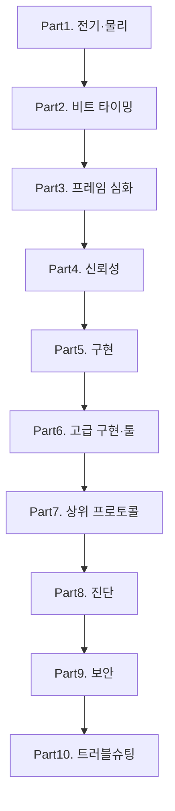

# CAN 통신 심화

[ISOBUS 스터디](/study/isobus/)의 CH1~CH7이 CAN 프로토콜의 입문이었다면, 이 스터디는 그 아래 전기적 특성부터 위로는 차량 진단·보안까지 파고든다. 차량·농기계·산업 임베디드 개발자가 회로·타이밍·드라이버·진단·보안을 한 번에 갖추는 것을 목표로 한다.

::: info 선행 지식
- [ISOBUS 스터디 CH1~CH7](/study/isobus/02-can-intro) — CAN 입문: 통신 기초, 프레임, 중재, 에러, CAN FD 개요
- 이 스터디는 위 입문의 모든 장을 전제로 전기·타이밍·구현·진단·보안 심화로 진행한다
:::

## 학습 로드맵

## 목차

### 전기·물리 심화
1. [차동 신호와 버스 전기](/study/can/01-differential-signal) — CANH/CANL, 공통 모드, 종단 저항, 스터브
2. [파형·계측](/study/can/02-waveform-measurement) — 오실로스코프·로직 분석기, Eye Diagram
3. [물리 variant](/study/can/03-physical-variants) — HS-CAN, LS-CAN, single-wire, 광 절연

### 비트 타이밍
4. [Bit Time 구조](/study/can/04-bit-time) — Sync/Prop/Phase1/Phase2, SJW, TQ
5. [동기화](/study/can/05-synchronization) — Hard Sync, Resync, 샘플 포인트, 오실레이터 편차

### 프레임 심화
6. [Classical CAN 심화](/study/can/06-classical-frame-deep) — Stuff/CRC 계산·Remote·Overload·Error 프레임·중재 엣지케이스
7. [CAN FD 심화](/study/can/07-can-fd-deep) — BRS/ESI, 향상된 CRC, 샘플 포인트 분리
8. [CAN XL 개요](/study/can/08-can-xl) — SDT, PWME, 차량 이더넷·TSN 경계

### 신뢰성
9. [오류 감지·격리](/study/can/09-error-handling) — 5종 오류, TEC/REC, 상태 전이
10. [버스 부하·응답시간](/study/can/10-busload-response-time) — Worst-case response, bus load 계산

### 구현
11. [컨트롤러·트랜시버](/study/can/11-controller-transceiver) — MCP2515, STM32 bxCAN/FDCAN, TJA1043
12. [MCU 드라이버](/study/can/12-mcu-driver) — ISR·FIFO·에러 처리 (C)
13. [SocketCAN 기초](/study/can/13-socketcan-basics) — can-utils, can0, python-can

### 고급 구현과 툴
14. [SocketCAN 고급](/study/can/14-socketcan-advanced) — vcan, cangw, isotp 커널 모듈, FD
15. [하드웨어 툴](/study/can/15-hardware-tools) — Kvaser/Vector/PEAK, CANalyzer
16. [DBC와 시그널 인코딩](/study/can/16-dbc-signals) — cantools, DBC → C

### 상위 프로토콜
17. [Network Management](/study/can/17-network-management) — OSEK NM, AUTOSAR NM, Partial Networking
18. [XCP / CCP](/study/can/18-xcp-ccp) — 캘리브레이션, DAQ, STIM
19. [ISO-TP (ISO 15765-2)](/study/can/19-iso-tp) — SF/FF/CF, Flow Control

### 진단
20. [UDS (ISO 14229)](/study/can/20-uds) — SID, DTC, Security Access, Session
21. [OBD-II (ISO 15031)](/study/can/21-obd2) — Mode 1~9, PID, DTC, ELM327

### 보안
22. [공격 벡터](/study/can/22-attack-vectors) — Bus-off, Spoofing, Replay, 차량 해킹 사례
23. [방어 (SecOC/IDS)](/study/can/23-defense-secoc) — SecOC, CAN-IDS, MAC

### 트러블슈팅
24. [실전 트러블슈팅](/study/can/24-troubleshooting) — 종단 저항·주파수 오차·error passive·DTC 분석

## 관련 자료

::: info 함께 보면 좋은 자료
- [ISOBUS 스터디](/study/isobus/) — CAN 입문 + J1939 + ISOBUS 애플리케이션 계층
- [스마트농업 스터디 CH6. 농기계 통신](/study/smart-agriculture/06-machine-communication) — 상위 레벨 관점
- ISO 11898-1/2 — CAN data link·physical layer
- ISO 14229 — UDS, ISO 15765-2 — ISO-TP, ISO 15031 — OBD
:::
