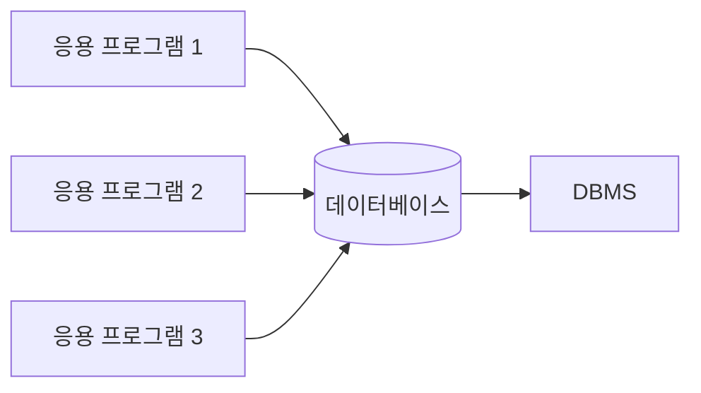
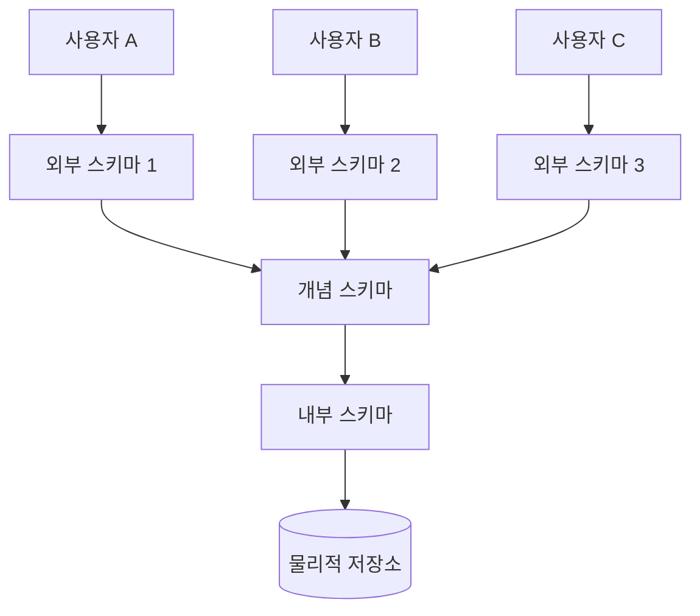

# 데이터베이스란

::: info 학습 목표
- 데이터베이스의 정의와 파일 시스템과의 차이를 설명할 수 있다.
- DBMS의 역할과 주요 DBMS의 특징을 비교할 수 있다.
- 스키마의 3계층 구조(외부/개념/내부)를 이해한다.
- 논리적 독립성과 물리적 독립성의 개념과 중요성을 설명할 수 있다.
:::

---

## 1. 데이터베이스의 정의

데이터베이스(Database)란 여러 사용자와 응용 프로그램이 공유하고 사용할 수 있도록 통합·저장된 <strong>운영</strong>데이터의 집합이다.

### 파일 시스템과의 차이

전통적인 파일 시스템 방식은 각 응용 프로그램이 자신만의 파일을 별도로 관리한다. 이 방식은 다음과 같은 문제를 야기한다.

| 문제 | 설명 |
|------|------|
| 데이터 중복(Redundancy) | 동일한 데이터가 여러 파일에 반복 저장되어 저장 공간을 낭비한다. |
| 데이터 불일치(Inconsistency) | 중복 저장된 데이터를 일부만 수정하면 데이터 간 불일치가 발생한다. |
| 동시 접근 문제(Concurrency) | 여러 프로세스가 동시에 같은 파일을 수정할 경우 데이터 무결성이 깨질 수 있다. |
| 데이터 종속성(Dependency) | 파일 구조가 바뀌면 해당 파일을 사용하는 모든 프로그램을 수정해야 한다. |
| 보안 취약 | 파일 접근 권한이 단순하여 세밀한 접근 제어가 어렵다. |

데이터베이스는 이러한 문제를 해결하기 위해 등장하였다. 데이터를 중앙에서 통합 관리하고, 동시 접근 제어와 일관성 유지를 시스템 차원에서 보장한다.

### 데이터베이스의 특성

- **통합된 데이터(Integrated Data)**: 중복을 최소화하여 통합 관리한다.
- **저장된 데이터(Stored Data)**: 컴퓨터가 접근 가능한 저장 매체에 보관한다.
- **운영 데이터(Operational Data)**: 조직의 업무를 위해 지속적으로 유지·관리되는 데이터다.
- **공유 데이터(Shared Data)**: 여러 사용자와 응용 프로그램이 동시에 사용한다.

---

## 2. DBMS의 역할

DBMS(Database Management System)는 데이터베이스를 생성·관리·운영하는 소프트웨어 시스템이다. 사용자와 데이터베이스 사이에서 중개자 역할을 한다.

### DBMS의 주요 기능

- **데이터 정의(DDL)**: 데이터 구조(스키마)를 정의하고 변경한다.
- **데이터 조작(DML)**: 데이터의 삽입, 수정, 삭제, 검색을 처리한다.
- **데이터 제어(DCL)**: 접근 권한 관리, 동시성 제어, 무결성 유지, 보안을 담당한다.
- **데이터 회복(Recovery)**: 장애 발생 시 데이터를 일관된 상태로 복구한다.

### 주요 DBMS 비교

| DBMS | 유형 | 특징 | 주요 사용처 |
|------|------|------|------------|
| MySQL | 관계형(RDBMS) | 오픈소스, 빠른 읽기 성능, 광범위한 커뮤니티 | 웹 서비스, 중소규모 서비스 |
| PostgreSQL | 관계형(RDBMS) | 오픈소스, 표준 SQL 준수, 고급 기능(JSON, 풀텍스트 검색) | 복잡한 쿼리, 대용량 데이터 |
| Oracle | 관계형(RDBMS) | 상용, 고가용성, 강력한 엔터프라이즈 기능 | 금융, 대기업 시스템 |
| SQL Server | 관계형(RDBMS) | Microsoft 제품, Windows 환경 최적화, BI 도구 통합 | 기업 내부 시스템, .NET 스택 |

---

## 3. 스키마와 3계층 구조

스키마(Schema)란 데이터베이스의 구조와 제약 조건에 대한 <strong>명세</strong>(specification)다. ANSI/SPARC 3계층 스키마 구조는 데이터 독립성을 확보하기 위해 스키마를 세 단계로 분리한다.

### 3계층 스키마

- **외부 스키마(External Schema)**: 개별 사용자나 응용 프로그램의 관점에서 본 데이터 구조다. 전체 데이터베이스 중 자신이 필요한 부분만 정의한 뷰(View)에 해당한다. 여러 개의 외부 스키마가 존재할 수 있다.
- **개념 스키마(Conceptual Schema)**: 데이터베이스 전체의 논리적 구조를 정의한다. 모든 사용자의 관점을 통합한 조직 전체의 데이터베이스 구조이며, 하나만 존재한다.
- **내부 스키마(Internal Schema)**: 데이터베이스의 물리적 저장 구조를 정의한다. 레코드 형식, 인덱스, 파일 조직 방식 등 실제 저장 방법을 기술한다.

### 사상(Mapping)

3계층 사이의 변환은 사상(Mapping)을 통해 이루어진다.

- **외부/개념 사상(External/Conceptual Mapping)**: 외부 스키마와 개념 스키마 사이의 변환을 정의한다. 논리적 독립성을 지원한다.
- **개념/내부 사상(Conceptual/Internal Mapping)**: 개념 스키마와 내부 스키마 사이의 변환을 정의한다. 물리적 독립성을 지원한다.

---

## 4. 데이터 독립성

데이터 독립성(Data Independence)이란 하위 계층의 스키마가 변경되어도 상위 계층의 스키마나 응용 프로그램에 영향을 주지 않는 성질이다.

### 논리적 독립성

개념 스키마가 변경되어도 외부 스키마와 응용 프로그램은 영향을 받지 않는 성질이다. 예를 들어 테이블에 새로운 컬럼을 추가하거나 테이블을 분리하더라도, 기존 사용자의 뷰나 응용 프로그램 코드를 수정할 필요가 없다.

### 물리적 독립성

내부 스키마(물리적 저장 구조)가 변경되어도 개념 스키마와 외부 스키마는 영향을 받지 않는 성질이다. 예를 들어 인덱스를 추가하거나 저장 파일 구조를 변경하더라도, 논리적 데이터 구조나 응용 프로그램에는 영향이 없다.

### 왜 중요한가

| 독립성 종류 | 변경 계층 | 영향을 받지 않는 계층 | 실무 효과 |
|------------|----------|----------------------|----------|
| 논리적 독립성 | 개념 스키마 | 외부 스키마, 응용 프로그램 | 스키마 변경 시 응용 프로그램 수정 비용 최소화 |
| 물리적 독립성 | 내부 스키마 | 개념 스키마, 외부 스키마 | 저장 구조 최적화 시 논리 설계 불변 보장 |

데이터 독립성이 확보되면 시스템 유지보수 비용이 크게 절감된다. 저장 장치 교체, 인덱스 재구성, 테이블 구조 변경과 같은 작업을 응용 프로그램 변경 없이 수행할 수 있기 때문이다.

---

::: tip 핵심 정리
- 데이터베이스는 공유·통합·운영·저장 데이터의 집합으로, 파일 시스템의 중복·불일치·동시 접근 문제를 해결한다.
- DBMS는 데이터 정의(DDL), 조작(DML), 제어(DCL), 회복 기능을 제공하며 MySQL·PostgreSQL·Oracle·SQL Server가 대표적이다.
- 3계층 스키마(외부/개념/내부)는 사용자 뷰, 전체 논리 구조, 물리 저장 구조를 분리하여 관리한다.
- 논리적 독립성은 개념 스키마 변경이 외부 스키마에 영향을 주지 않고, 물리적 독립성은 내부 스키마 변경이 개념 스키마에 영향을 주지 않음을 보장한다.
:::

## 다음 챕터

- 다음 : [관계형 모델](/study/database/02-relational-model)
