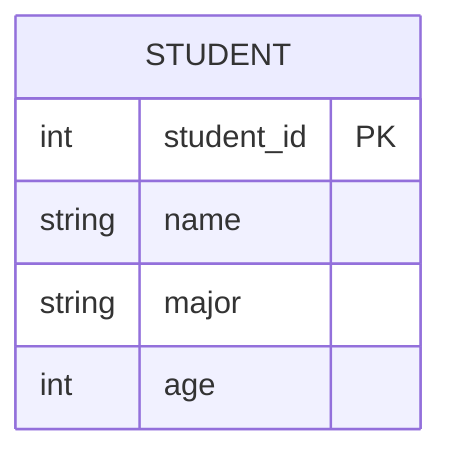
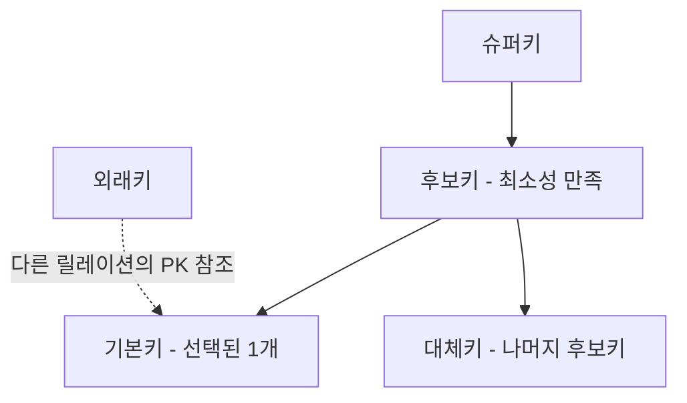
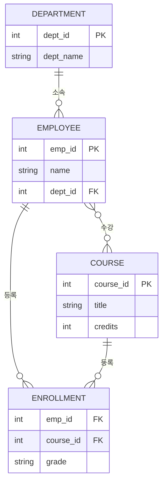

# 관계형 모델

::: info 학습 목표
- 릴레이션의 구성 요소(튜플, 속성, 도메인)와 특성을 설명할 수 있다.
- 슈퍼키, 후보키, 기본키, 대체키, 외래키의 차이를 구분할 수 있다.
- 1:1, 1:N, N:M 관계를 ERD로 표현할 수 있다.
- SELECT, PROJECT, JOIN 등 관계 대수 연산의 의미와 SQL 대응을 이해한다.
:::

---

## 1. 릴레이션(테이블)

관계형 모델(Relational Model)은 데이터를 2차원 테이블 형태로 표현한다. 이 테이블을 <strong>릴레이션</strong>(Relation)이라 한다.

### 기본 용어

| 용어 | 다른 표현 | 설명 |
|------|----------|------|
| 릴레이션(Relation) | 테이블(Table) | 동일한 구조를 가진 튜플의 집합 |
| 튜플(Tuple) | 행(Row), 레코드(Record) | 릴레이션의 각 행. 하나의 개체(entity) 인스턴스를 나타낸다. |
| 속성(Attribute) | 열(Column), 필드(Field) | 릴레이션의 각 열. 데이터의 특성을 나타낸다. |
| 도메인(Domain) | - | 각 속성이 가질 수 있는 원자적(Atomic) 값의 집합 |
| 카디널리티(Cardinality) | - | 릴레이션의 튜플 수 |
| 차수(Degree) | - | 릴레이션의 속성 수 |

### 릴레이션의 특성

- **튜플의 유일성**: 릴레이션 내에 동일한 튜플이 두 개 이상 존재할 수 없다.
- **튜플의 무순서성**: 튜플 간에 순서는 의미가 없다.
- **속성의 무순서성**: 속성 간에 순서는 의미가 없다.
- **속성값의 원자성**: 각 속성값은 더 이상 분해할 수 없는 원자값(Atomic Value)이어야 한다.



위 예시에서 `STUDENT`가 릴레이션이고, `student_id`, `name`, `major`, `age`가 속성이다. 각 학생 한 명의 데이터가 튜플이 된다.

---

## 2. 키(Key)

키(Key)는 릴레이션에서 특정 튜플을 유일하게 식별하거나, 다른 릴레이션과의 연관 관계를 표현하기 위해 사용하는 속성(또는 속성의 집합)이다.

### 키의 종류

**슈퍼키(Super Key)**
튜플을 유일하게 식별할 수 있는 속성 또는 속성의 집합이다. 불필요한 속성이 포함될 수 있다. 예를 들어 `{학번}`, `{학번, 이름}`, `{학번, 이름, 학과}` 모두 슈퍼키가 될 수 있다.

**후보키(Candidate Key)**
슈퍼키 중에서 최소성을 만족하는 키다. 즉, 어떤 속성도 제거하면 유일성이 깨지는 키다. 하나의 릴레이션에 여러 후보키가 존재할 수 있다.

**기본키(Primary Key, PK)**
후보키 중에서 데이터베이스 설계자가 선택한 키다. 기본키는 NULL 값을 가질 수 없고(개체 무결성), 유일해야 한다. 릴레이션당 하나만 지정한다.

**대체키(Alternate Key)**
후보키 중에서 기본키로 선택되지 않은 나머지 키다. UNIQUE 제약으로 구현되는 경우가 많다.

**외래키(Foreign Key, FK)**
다른 릴레이션의 기본키를 참조하는 속성이다. 참조 무결성(Referential Integrity)을 유지하기 위해 사용한다. 외래키의 값은 참조하는 릴레이션의 기본키 값에 존재하거나 NULL이어야 한다.

### 키 간의 관계



---

## 3. 관계(Relationship)

관계(Relationship)는 두 개 이상의 개체(Entity) 사이의 연관성을 나타낸다. 관계의 유형은 두 개체 집합 사이에 존재하는 대응 수(Cardinality Ratio)에 따라 구분한다.

### 관계의 유형

**1:1 (일대일)**
한 개체가 다른 개체와 정확히 하나씩 대응한다. 예: 사람 — 여권 (한 사람은 하나의 여권을 가진다.)

**1:N (일대다)**
한 개체가 여러 개체와 대응한다. 예: 부서 — 직원 (한 부서에 여러 직원이 속한다.)

**N:M (다대다)**
여러 개체가 여러 개체와 대응한다. 예: 학생 — 강좌 (한 학생은 여러 강좌를 수강하고, 한 강좌에는 여러 학생이 수강한다.)

::: tip
N:M 관계는 관계형 데이터베이스에서 직접 구현할 수 없다. 중간에 <strong>연결</strong>테이블(Junction Table)을 두어 두 개의 1:N 관계로 분해한다.
:::

### ERD 예시



### ERD 표기법 (Crow's Foot)

Mermaid erDiagram에서 관계를 표현하는 기호는 다음과 같다.

```
||--||   1 대 1 (양쪽 정확히 하나)
||--o{   1 대 다 (0 포함)
||--|{   1 대 다 (1 이상)
}o--o{   다 대 다

기호 해석:
  ||  정확히 하나 (필수)
  o|  0 또는 하나 (선택)
  |{  하나 이상 (필수, 다수)
  o{  0 또는 다수 (선택, 다수)
```

---

## 4. 관계 대수와 관계 해석

관계 대수(Relational Algebra)는 릴레이션을 처리하기 위한 연산의 집합이다. 절차적 언어로, 원하는 결과를 얻기 위한 연산 과정을 명시한다.

### 기본 연산

**SELECT (σ — 시그마)**
조건을 만족하는 튜플을 선택한다. SQL의 `WHERE` 절에 대응한다.

```
σ(age > 20)(STUDENT)
→ SELECT * FROM STUDENT WHERE age > 20;
```

**PROJECT (π — 파이)**
릴레이션에서 특정 속성만 추출한다. SQL의 `SELECT` 절(컬럼 선택)에 대응한다.

```
π(name, major)(STUDENT)
→ SELECT name, major FROM STUDENT;
```

**JOIN (⋈)**
두 릴레이션을 공통 속성을 기준으로 결합한다. SQL의 `JOIN`에 대응한다.

```
STUDENT ⋈ ENROLLMENT
→ SELECT * FROM STUDENT JOIN ENROLLMENT ON STUDENT.student_id = ENROLLMENT.student_id;
```

**DIVISION (÷)**
한 릴레이션이 다른 릴레이션의 모든 튜플과 연관된 튜플을 반환한다. "모든 X에 대해 Y를 만족하는" 질의에 사용한다.

```
ENROLLMENT ÷ ALL_COURSES
→ 모든 강좌를 수강한 학생을 반환
```

### 집합 연산

두 릴레이션이 같은 속성 집합(합집합 호환)을 가져야 사용할 수 있다.

| 연산 | 기호 | 설명 | SQL |
|------|------|------|-----|
| 합집합 | ∪ | 두 릴레이션의 모든 튜플 (중복 제거) | `UNION` |
| 교집합 | ∩ | 두 릴레이션에 공통으로 존재하는 튜플 | `INTERSECT` |
| 차집합 | − | 첫 번째 릴레이션에만 있는 튜플 | `EXCEPT` / `MINUS` |
| 카티션 프로덕트 | × | 두 릴레이션의 모든 튜플 조합 | `CROSS JOIN` |

### 관계 해석(Relational Calculus)

관계 해석은 비절차적 언어로, 원하는 결과가 무엇인지만 기술하고 방법은 시스템에 맡긴다. 두 종류가 있다.

- **튜플 관계 해석(Tuple Relational Calculus)**: 튜플 변수를 사용하여 결과를 기술한다. SQL의 이론적 기반이 된다.
- **도메인 관계 해석(Domain Relational Calculus)**: 도메인 변수를 사용하여 결과를 기술한다. QBE(Query By Example)의 기반이 된다.

관계 대수와 관계 해석은 표현력이 동등하다. 관계 대수로 표현 가능한 모든 질의는 관계 해석으로도 표현할 수 있고, 그 역도 성립한다.

---

::: tip 핵심 정리
- 릴레이션은 튜플(행)과 속성(열)으로 구성되며, 튜플은 유일하고 원자적인 값을 가진다.
- 기본키(PK)는 튜플을 유일하게 식별하고, 외래키(FK)는 다른 릴레이션의 기본키를 참조하여 참조 무결성을 보장한다.
- 관계 유형은 1:1, 1:N, N:M으로 구분하며, N:M은 연결 테이블로 분해한다.
- 관계 대수(SELECT, PROJECT, JOIN 등)는 SQL의 이론적 기반으로, 관계 해석과 표현력이 동등하다.
:::

## 다음 챕터

- 다음 : [DDL과 DCL](/study/database/03-ddl-dcl)
