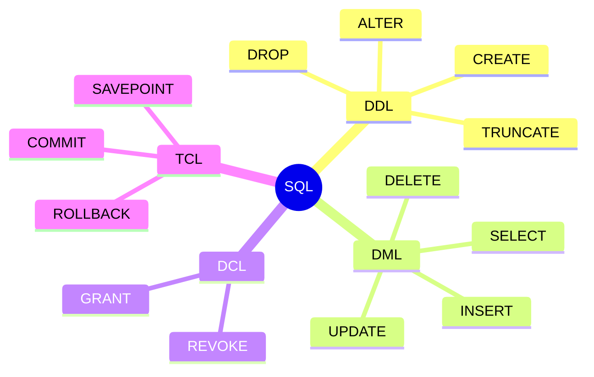
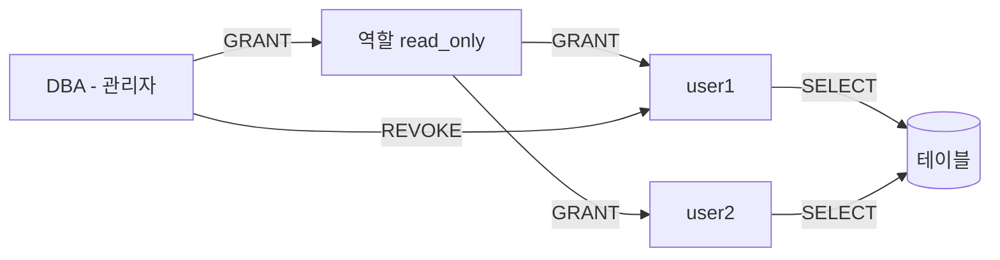

# DDL과 DCL

::: info 학습 목표
- SQL의 4가지 분류(DDL/DML/DCL/TCL)를 구분할 수 있다.
- CREATE, ALTER, DROP, TRUNCATE 문으로 테이블을 정의하고 관리할 수 있다.
- NOT NULL, UNIQUE, PK, FK, CHECK, DEFAULT 제약 조건을 적절히 사용할 수 있다.
- GRANT, REVOKE로 사용자 권한을 부여하고 회수할 수 있다.
:::

---

## 1. SQL 분류

SQL(Structured Query Language)은 관계형 데이터베이스를 다루기 위한 표준 언어다. 기능에 따라 4가지로 분류한다.

| 분류 | 전체 명칭 | 역할 | 주요 명령어 |
|------|----------|------|------------|
| DDL | Data Definition Language | 데이터 구조(스키마) 정의 및 변경 | CREATE, ALTER, DROP, TRUNCATE |
| DML | Data Manipulation Language | 데이터 삽입, 수정, 삭제, 조회 | INSERT, UPDATE, DELETE, SELECT |
| DCL | Data Control Language | 접근 권한 관리 | GRANT, REVOKE |
| TCL | Transaction Control Language | 트랜잭션 제어 | COMMIT, ROLLBACK, SAVEPOINT |



---

## 2. DDL(Data Definition Language)

DDL은 데이터베이스 객체(테이블, 인덱스, 뷰 등)의 구조를 정의하고 변경하는 언어다. DDL 명령은 즉시 커밋되며 롤백이 불가능한 경우가 많다.

### CREATE TABLE

테이블을 생성한다. 컬럼명, 데이터 타입, 제약 조건을 함께 정의한다.

```sql
CREATE TABLE employees (
    emp_id      INT             NOT NULL,
    name        VARCHAR(100)    NOT NULL,
    email       VARCHAR(200)    UNIQUE,
    dept_id     INT,
    hire_date   DATE            DEFAULT CURRENT_DATE,
    salary      DECIMAL(10, 2)  CHECK (salary > 0),
    PRIMARY KEY (emp_id),
    FOREIGN KEY (dept_id) REFERENCES departments(dept_id)
);
```

### ALTER TABLE

기존 테이블의 구조를 변경한다.

```sql
-- 컬럼 추가
ALTER TABLE employees ADD COLUMN phone VARCHAR(20);

-- 컬럼 타입 변경 (MySQL)
ALTER TABLE employees MODIFY COLUMN name VARCHAR(200) NOT NULL;

-- 컬럼 이름 변경 (MySQL)
ALTER TABLE employees RENAME COLUMN phone TO mobile;

-- 컬럼 삭제
ALTER TABLE employees DROP COLUMN mobile;

-- 제약 조건 추가
ALTER TABLE employees ADD CONSTRAINT chk_salary CHECK (salary >= 0);

-- 제약 조건 삭제
ALTER TABLE employees DROP CONSTRAINT chk_salary;
```

### DROP TABLE

테이블과 모든 데이터를 영구적으로 삭제한다. 복구가 불가능하므로 주의해야 한다.

```sql
-- 테이블 삭제
DROP TABLE employees;

-- 테이블이 존재할 때만 삭제 (에러 방지)
DROP TABLE IF EXISTS employees;
```

### TRUNCATE TABLE

테이블의 모든 데이터를 삭제하되 테이블 구조는 유지한다. `DELETE FROM` 보다 빠르며 되돌리기 어렵다.

```sql
TRUNCATE TABLE employees;
```

| 구분 | DROP | TRUNCATE | DELETE |
|------|------|----------|--------|
| 테이블 구조 | 삭제됨 | 유지됨 | 유지됨 |
| 데이터 | 삭제됨 | 전체 삭제 | 조건부 삭제 가능 |
| 롤백 | 불가 | 불가(대부분) | 가능 |
| 속도 | 빠름 | 빠름 | 느림 |

---

## 3. 제약 조건

제약 조건(Constraint)은 테이블에 저장되는 데이터의 무결성을 보장하기 위한 규칙이다. 테이블 생성 시 또는 ALTER TABLE로 추가할 수 있다.

### NOT NULL

해당 컬럼에 NULL 값이 저장되는 것을 허용하지 않는다.

```sql
CREATE TABLE users (
    user_id  INT          NOT NULL,
    username VARCHAR(50)  NOT NULL
);
```

### UNIQUE

해당 컬럼(또는 컬럼 조합)에 중복 값이 저장되는 것을 허용하지 않는다. NULL은 중복으로 처리하지 않는 DBMS가 많다.

```sql
CREATE TABLE users (
    email VARCHAR(200) UNIQUE,
    -- 복합 UNIQUE 제약
    CONSTRAINT uq_name_dept UNIQUE (name, dept_id)
);
```

### PRIMARY KEY

기본키 제약이다. NOT NULL + UNIQUE를 결합한 것이다. 테이블당 하나만 정의할 수 있다.

```sql
CREATE TABLE products (
    product_id INT PRIMARY KEY,
    -- 또는 복합 기본키
    -- PRIMARY KEY (col1, col2)
    name       VARCHAR(100) NOT NULL
);
```

### FOREIGN KEY

외래키 제약이다. 다른 테이블의 기본키(또는 UNIQUE 컬럼)를 참조하여 참조 무결성을 보장한다.

```sql
CREATE TABLE orders (
    order_id   INT PRIMARY KEY,
    customer_id INT,
    FOREIGN KEY (customer_id)
        REFERENCES customers(customer_id)
        ON DELETE CASCADE      -- 부모 행 삭제 시 자식 행도 삭제
        ON UPDATE CASCADE      -- 부모 키 변경 시 자식 키도 변경
);
```

| 옵션 | 설명 |
|------|------|
| `CASCADE` | 부모 변경/삭제 시 자식도 함께 변경/삭제 |
| `SET NULL` | 부모 삭제 시 자식의 FK를 NULL로 설정 |
| `SET DEFAULT` | 부모 삭제 시 자식의 FK를 DEFAULT 값으로 설정 |
| `RESTRICT` | 자식 행이 존재하면 부모 변경/삭제 금지 |
| `NO ACTION` | RESTRICT와 유사 (DBMS마다 다소 차이 있음) |

### CHECK

컬럼 값이 특정 조건을 만족해야 함을 정의한다.

```sql
CREATE TABLE products (
    price    DECIMAL(10, 2) CHECK (price >= 0),
    status   VARCHAR(20)    CHECK (status IN ('ACTIVE', 'INACTIVE', 'DELETED'))
);
```

### DEFAULT

값이 삽입되지 않을 때 사용할 기본값을 지정한다.

```sql
CREATE TABLE logs (
    log_id     INT      PRIMARY KEY,
    created_at DATETIME DEFAULT CURRENT_TIMESTAMP,
    is_deleted BOOLEAN  DEFAULT FALSE
);
```

---

## 4. DCL(Data Control Language)

DCL은 데이터베이스 객체에 대한 접근 권한을 관리하는 언어다. 보안과 접근 제어의 핵심이다.

### GRANT — 권한 부여

```sql
-- 특정 테이블에 SELECT 권한 부여
GRANT SELECT ON employees TO user1;

-- 여러 권한 동시 부여
GRANT SELECT, INSERT, UPDATE ON employees TO user1;

-- 모든 권한 부여
GRANT ALL PRIVILEGES ON employees TO user1;

-- 다른 사용자에게 권한을 재부여(위임)할 수 있는 옵션
GRANT SELECT ON employees TO user1 WITH GRANT OPTION;

-- 데이터베이스 전체에 대한 권한
GRANT SELECT ON DATABASE mydb TO user1;
```

### REVOKE — 권한 회수

```sql
-- 특정 권한 회수
REVOKE INSERT ON employees FROM user1;

-- 모든 권한 회수
REVOKE ALL PRIVILEGES ON employees FROM user1;
```

### 역할(ROLE)

역할(ROLE)은 권한의 집합이다. 여러 사용자에게 동일한 권한 묶음을 일괄 부여·회수할 때 편리하다.

```sql
-- 역할 생성
CREATE ROLE read_only;

-- 역할에 권한 부여
GRANT SELECT ON ALL TABLES IN SCHEMA public TO read_only;

-- 사용자에게 역할 부여
GRANT read_only TO user1;
GRANT read_only TO user2;

-- 역할 회수
REVOKE read_only FROM user1;

-- 역할 삭제
DROP ROLE read_only;
```

### 접근 제어 기본 개념



| 개념 | 설명 |
|------|------|
| 임의적 접근 제어(DAC) | 객체 소유자가 접근 권한을 부여한다. SQL의 GRANT/REVOKE가 이에 해당한다. |
| 강제적 접근 제어(MAC) | 시스템이 보안 등급에 따라 접근을 통제한다. 군사·정부 시스템에서 사용한다. |
| 역할 기반 접근 제어(RBAC) | 역할(ROLE)을 통해 권한을 관리한다. 대부분의 DBMS가 지원한다. |

---

::: tip 핵심 정리
- SQL은 DDL(구조 정의), DML(데이터 조작), DCL(권한 제어), TCL(트랜잭션 제어) 4가지로 분류한다.
- DDL의 CREATE/ALTER/DROP/TRUNCATE로 테이블을 생성·수정·삭제한다. DROP과 TRUNCATE는 롤백이 불가능하다.
- NOT NULL, UNIQUE, PK, FK, CHECK, DEFAULT 제약 조건으로 데이터 무결성을 보장한다.
- GRANT/REVOKE로 권한을 부여·회수하고, ROLE로 권한 묶음을 일괄 관리한다.
:::

## 다음 챕터

- 다음 : [SQL 기초](/study/database/04-sql-basics)
