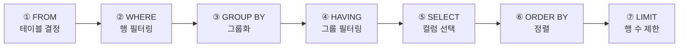
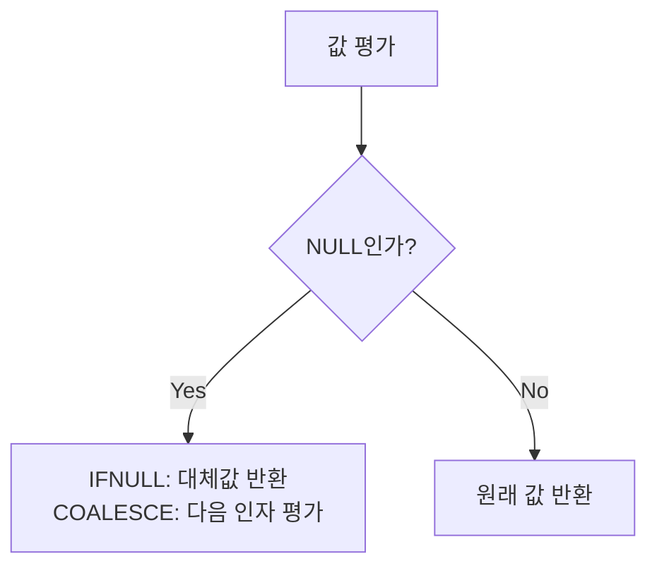

# SQL 기초

::: info 학습 목표
- SELECT 문의 각 절과 실행 순서를 이해한다.
- INSERT, UPDATE, DELETE 문의 문법과 주의사항을 숙지한다.
- ORDER BY, LIMIT, DISTINCT를 활용하여 결과를 정렬하고 제한할 수 있다.
- 문자열·날짜·조건 함수를 SQL 쿼리에 적용할 수 있다.
:::

---

## 1. SELECT 기본

SELECT 문은 데이터베이스에서 원하는 데이터를 조회하는 가장 기본적인 명령이다.

### 기본 문법

```sql
SELECT column1, column2, ...
FROM   table_name
WHERE  condition
ORDER BY column ASC|DESC
LIMIT  n;
```

### SELECT 실행 순서

SQL은 작성 순서와 실행 순서가 다르다. 실행 순서를 이해하면 쿼리 오류를 줄일 수 있다.



SELECT 절의 별칭(alias)은 ORDER BY에서는 사용할 수 있지만, WHERE나 HAVING에서는 사용할 수 없다. FROM이 가장 먼저 처리되기 때문이다.

### 비교 연산자

| 연산자 | 설명 | 예시 |
|--------|------|------|
| `=` | 같다 | `WHERE age = 25` |
| `<>` / `!=` | 같지 않다 | `WHERE status <> 'DELETED'` |
| `>`, `<` | 크다, 작다 | `WHERE salary > 3000` |
| `>=`, `<=` | 크거나 같다, 작거나 같다 | `WHERE age >= 18` |
| `BETWEEN a AND b` | a 이상 b 이하 | `WHERE age BETWEEN 20 AND 30` |
| `IN (...)` | 목록 중 하나 | `WHERE dept IN ('HR', 'IT')` |
| `LIKE` | 패턴 매칭 | `WHERE name LIKE '김%'` |
| `IS NULL` | NULL 여부 | `WHERE phone IS NULL` |
| `IS NOT NULL` | NULL이 아닌지 여부 | `WHERE email IS NOT NULL` |

### LIKE 패턴

| 와일드카드 | 의미 | 예시 |
|-----------|------|------|
| `%` | 0개 이상의 임의 문자 | `'%SQL%'` — SQL 포함하는 모든 값 |
| `_` | 정확히 1개의 임의 문자 | `'_이_'` — 3글자이고 가운데가 '이'인 값 |

### 논리 연산자

```sql
-- AND: 두 조건 모두 참
SELECT * FROM employees WHERE dept = 'IT' AND salary > 5000;

-- OR: 하나 이상 참
SELECT * FROM employees WHERE dept = 'IT' OR dept = 'HR';

-- NOT: 조건 부정
SELECT * FROM employees WHERE NOT dept = 'IT';
```

---

## 2. DML(Data Manipulation Language)

DML은 테이블의 데이터를 삽입, 수정, 삭제하는 언어다. SELECT도 넓은 의미의 DML에 포함되지만, 일반적으로는 INSERT/UPDATE/DELETE를 DML이라 한다.

### INSERT INTO — 데이터 삽입

```sql
-- 단일 행 삽입 (컬럼 명시)
INSERT INTO employees (emp_id, name, dept_id, salary)
VALUES (101, '홍길동', 1, 4000.00);

-- 여러 행 동시 삽입
INSERT INTO employees (emp_id, name, dept_id, salary)
VALUES
    (102, '이순신', 2, 5000.00),
    (103, '강감찬', 1, 4500.00);

-- 다른 테이블에서 조회하여 삽입
INSERT INTO emp_backup
SELECT * FROM employees WHERE hire_date < '2020-01-01';
```

::: tip
컬럼 목록을 생략하면 테이블의 모든 컬럼 순서대로 값을 제공해야 한다. 유지보수를 위해 컬럼 목록을 명시하는 것을 권장한다.
:::

### UPDATE SET — 데이터 수정

```sql
-- 조건에 맞는 행 수정
UPDATE employees
SET    salary = salary * 1.1,
       dept_id = 3
WHERE  emp_id = 101;

-- 다른 테이블을 참조하여 수정 (MySQL)
UPDATE employees e
JOIN   departments d ON e.dept_id = d.dept_id
SET    e.salary = e.salary * 1.05
WHERE  d.dept_name = 'IT';
```

::: tip
WHERE 절을 생략하면 테이블의 <strong>모든</strong> 행이 수정된다. 반드시 WHERE 조건을 확인하고 실행해야 한다.
:::

### DELETE FROM — 데이터 삭제

```sql
-- 조건에 맞는 행 삭제
DELETE FROM employees
WHERE  emp_id = 101;

-- 특정 날짜 이전 데이터 삭제
DELETE FROM logs
WHERE  created_at < '2023-01-01';
```

::: tip
WHERE 절을 생략하면 테이블의 <strong>모든</strong> 행이 삭제된다. TRUNCATE TABLE과 달리 롤백이 가능하지만, 대용량 데이터의 경우 속도가 느리다.
:::

---

## 3. 정렬과 제한

### ORDER BY — 정렬

```sql
-- 단일 컬럼 오름차순 정렬 (ASC는 기본값이므로 생략 가능)
SELECT * FROM employees ORDER BY salary ASC;

-- 내림차순 정렬
SELECT * FROM employees ORDER BY salary DESC;

-- 다중 컬럼 정렬: dept_id 오름차순, 같은 부서 내에서 salary 내림차순
SELECT * FROM employees ORDER BY dept_id ASC, salary DESC;

-- 별칭(alias)으로 정렬
SELECT emp_id, salary * 12 AS annual_salary
FROM   employees
ORDER BY annual_salary DESC;
```

### LIMIT / OFFSET — 결과 수 제한

```sql
-- 상위 10개만 조회
SELECT * FROM employees ORDER BY salary DESC LIMIT 10;

-- 11번째부터 20번째까지 조회 (OFFSET은 건너뛸 행 수)
SELECT * FROM employees ORDER BY salary DESC LIMIT 10 OFFSET 10;

-- 페이지네이션 패턴 (페이지 크기 = 10, page = 3)
-- OFFSET = (page - 1) * page_size = (3 - 1) * 10 = 20
SELECT * FROM employees ORDER BY emp_id LIMIT 10 OFFSET 20;
```

::: tip
OFFSET이 커질수록 쿼리 성능이 저하된다. 대용량 테이블의 페이지네이션에는 커서(Cursor) 기반 페이지네이션을 검토한다.
:::

### DISTINCT — 중복 제거

```sql
-- 중복 값을 제거하고 유일한 dept_id만 조회
SELECT DISTINCT dept_id FROM employees;

-- 여러 컬럼 조합의 중복 제거
SELECT DISTINCT dept_id, job_title FROM employees;
```

---

## 4. 연산자와 함수

### 산술 연산

```sql
SELECT
    salary,
    salary * 12          AS annual_salary,
    salary * 1.1         AS raised_salary,
    salary - 1000        AS adjusted_salary,
    salary / 160         AS hourly_rate
FROM employees;
```

### 문자열 함수

```sql
SELECT
    CONCAT(first_name, ' ', last_name) AS full_name,  -- 문자열 연결
    SUBSTRING(email, 1, 10)            AS email_short, -- 부분 문자열 (시작 인덱스=1)
    LENGTH(name)                       AS name_length, -- 문자열 길이 (바이트)
    CHAR_LENGTH(name)                  AS name_chars,  -- 문자 수
    UPPER(name)                        AS name_upper,  -- 대문자 변환
    LOWER(name)                        AS name_lower,  -- 소문자 변환
    TRIM(name)                         AS name_trim,   -- 앞뒤 공백 제거
    REPLACE(phone, '-', '')            AS phone_clean  -- 문자 치환
FROM employees;
```

### 날짜 함수

```sql
SELECT
    NOW()                              AS current_datetime,   -- 현재 날짜와 시간
    CURDATE()                          AS current_date,       -- 현재 날짜
    DATE_FORMAT(hire_date, '%Y-%m-%d') AS formatted_date,    -- 날짜 포맷 변환
    DATEDIFF(NOW(), hire_date)         AS days_employed,      -- 날짜 차이(일 수)
    DATE_ADD(hire_date, INTERVAL 1 YEAR) AS anniversary       -- 날짜 연산
FROM employees;
```

### 조건 함수

**CASE WHEN**

```sql
-- 단순 CASE
SELECT name,
       CASE dept_id
           WHEN 1 THEN 'Engineering'
           WHEN 2 THEN 'Marketing'
           ELSE 'Other'
       END AS dept_name
FROM employees;

-- 검색 CASE
SELECT name, salary,
       CASE
           WHEN salary >= 8000 THEN 'High'
           WHEN salary >= 5000 THEN 'Medium'
           ELSE 'Low'
       END AS salary_grade
FROM employees;
```

**COALESCE — 첫 번째 비NULL 값 반환**

```sql
-- phone이 NULL이면 mobile, 둘 다 NULL이면 'N/A' 반환
SELECT name, COALESCE(phone, mobile, 'N/A') AS contact
FROM employees;
```

**IFNULL — NULL 대체 (MySQL)**

```sql
-- bonus가 NULL이면 0으로 대체
SELECT name, salary + IFNULL(bonus, 0) AS total_pay
FROM employees;
```



---

::: tip 핵심 정리
- SELECT 실행 순서는 FROM → WHERE → GROUP BY → HAVING → SELECT → ORDER BY → LIMIT이다. 별칭은 ORDER BY에서만 사용 가능하다.
- UPDATE와 DELETE에서 WHERE 절을 생략하면 테이블의 전체 데이터가 변경·삭제된다. 반드시 WHERE 조건을 확인한다.
- LIMIT/OFFSET으로 페이지네이션을 구현하며, 대용량 테이블에서는 커서 기반 방식을 고려한다.
- CASE WHEN으로 조건부 값을 생성하고, COALESCE/IFNULL로 NULL을 안전하게 처리한다.
:::

## 다음 챕터

- 다음 : [JOIN과 서브쿼리](/study/database/05-join-subquery)
