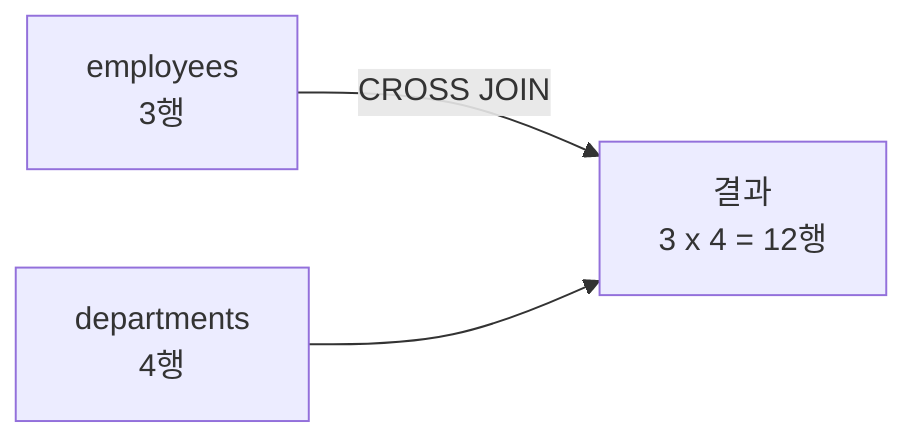
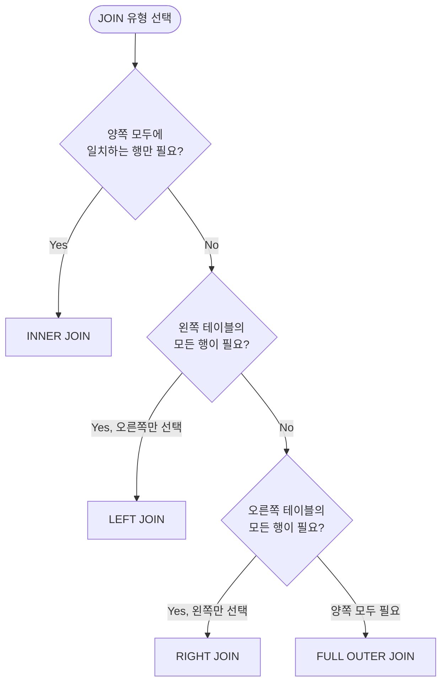

# JOIN과 서브쿼리

::: info 학습 목표
- JOIN의 개념과 카르테시안 곱을 이해한다.
- INNER JOIN, LEFT JOIN, RIGHT JOIN, FULL OUTER JOIN의 차이를 설명할 수 있다.
- 상황에 맞는 JOIN 유형을 선택할 수 있다.
- 스칼라 서브쿼리, 인라인 뷰, 중첩 서브쿼리를 구분하고 작성할 수 있다.
- EXISTS와 IN의 차이를 이해하고 적절히 선택할 수 있다.
:::

---

## 1. JOIN의 개념

### 왜 JOIN이 필요한가

관계형 데이터베이스는 데이터를 여러 테이블에 나눠 저장한다. 중복을 줄이고 무결성을 유지하기 위해서이다. 그런데 실제로 필요한 데이터는 여러 테이블에 흩어져 있다. 직원 이름은 `employees` 테이블에, 소속 부서 이름은 `departments` 테이블에 있을 때, 이 두 정보를 한 번에 조회하려면 <strong>JOIN</strong>이 필요하다.

### 벤 다이어그램 비유

JOIN을 집합 연산으로 이해하면 직관적이다.

```
테이블 A  ●●●|●●●  테이블 B
         공통(교집합)
```

두 테이블에서 어느 부분의 행을 가져올지에 따라 JOIN 유형이 달라진다.

### CROSS JOIN: 카르테시안 곱

`CROSS JOIN`은 두 테이블의 모든 행을 조합한다. A 테이블에 3행, B 테이블에 4행이 있으면 결과는 12행이 된다. 이를 <strong>카르테시안 곱(Cartesian Product)</strong>이라 한다.

```sql
SELECT *
FROM employees
CROSS JOIN departments;
```

실무에서는 의도적으로 사용하는 경우가 드물지만, JOIN 조건을 빠뜨리면 의도치 않게 카르테시안 곱이 발생하므로 주의해야 한다.



---

## 2. JOIN 종류

### 예제 테이블

다음 두 테이블을 기준으로 각 JOIN의 결과를 비교한다.

`employees` 테이블:

| emp_id | emp_name | dept_id |
|--------|----------|---------|
| 1 | 김철수 | 10 |
| 2 | 이영희 | 20 |
| 3 | 박민준 | 30 |
| 4 | 최지아 | NULL |

`departments` 테이블:

| dept_id | dept_name |
|---------|-----------|
| 10 | 개발팀 |
| 20 | 기획팀 |
| 40 | 운영팀 |

### INNER JOIN

두 테이블 모두에 일치하는 행만 반환한다. `dept_id`가 양쪽에 모두 존재하는 행만 포함된다.

```sql
SELECT e.emp_name, d.dept_name
FROM employees e
INNER JOIN departments d ON e.dept_id = d.dept_id;
```

결과:

| emp_name | dept_name |
|----------|-----------|
| 김철수 | 개발팀 |
| 이영희 | 기획팀 |

- 박민준(dept_id=30): `departments`에 30번 없음 → 제외
- 최지아(dept_id=NULL): NULL은 일치 조건 불만족 → 제외
- 운영팀(dept_id=40): `employees`에 40번 없음 → 제외

### LEFT JOIN (LEFT OUTER JOIN)

왼쪽 테이블(FROM 절의 테이블)의 모든 행을 반환하고, 오른쪽에 일치하는 행이 없으면 NULL로 채운다.

```sql
SELECT e.emp_name, d.dept_name
FROM employees e
LEFT JOIN departments d ON e.dept_id = d.dept_id;
```

결과:

| emp_name | dept_name |
|----------|-----------|
| 김철수 | 개발팀 |
| 이영희 | 기획팀 |
| 박민준 | NULL |
| 최지아 | NULL |

### RIGHT JOIN (RIGHT OUTER JOIN)

오른쪽 테이블의 모든 행을 반환하고, 왼쪽에 일치하는 행이 없으면 NULL로 채운다.

```sql
SELECT e.emp_name, d.dept_name
FROM employees e
RIGHT JOIN departments d ON e.dept_id = d.dept_id;
```

결과:

| emp_name | dept_name |
|----------|-----------|
| 김철수 | 개발팀 |
| 이영희 | 기획팀 |
| NULL | 운영팀 |

### FULL OUTER JOIN

양쪽 테이블의 모든 행을 반환한다. 일치하지 않는 쪽은 NULL로 채운다. MySQL은 FULL OUTER JOIN을 지원하지 않으므로 LEFT JOIN과 RIGHT JOIN을 `UNION`으로 결합해 구현한다.

```sql
SELECT e.emp_name, d.dept_name
FROM employees e
LEFT JOIN departments d ON e.dept_id = d.dept_id
UNION
SELECT e.emp_name, d.dept_name
FROM employees e
RIGHT JOIN departments d ON e.dept_id = d.dept_id;
```

결과:

| emp_name | dept_name |
|----------|-----------|
| 김철수 | 개발팀 |
| 이영희 | 기획팀 |
| 박민준 | NULL |
| 최지아 | NULL |
| NULL | 운영팀 |

### JOIN 선택 가이드



### Self JOIN

같은 테이블을 두 번 참조하는 JOIN이다. 조직도처럼 상위 관리자를 같은 테이블에서 찾을 때 사용한다.

```sql
-- 직원과 그 직원의 관리자 이름을 함께 조회
SELECT e.emp_name AS 직원, m.emp_name AS 관리자
FROM employees e
LEFT JOIN employees m ON e.manager_id = m.emp_id;
```

---

## 3. 서브쿼리

<strong>서브쿼리(Subquery)</strong>는 다른 SQL 문 내부에 포함된 SELECT 문이다. 사용 위치에 따라 세 가지로 나뉜다.

### 스칼라 서브쿼리 (SELECT 절)

SELECT 절에 사용하며, 반드시 단일 행 단일 열을 반환해야 한다.

```sql
SELECT
    emp_name,
    dept_id,
    (SELECT dept_name
     FROM departments
     WHERE dept_id = e.dept_id) AS dept_name
FROM employees e;
```

행마다 서브쿼리가 실행되므로 데이터가 많을 때는 성능 주의가 필요하다.

### 인라인 뷰 (FROM 절)

FROM 절에 서브쿼리를 사용해 임시 테이블처럼 활용한다. 반드시 별칭(alias)을 붙여야 한다.

```sql
SELECT sub.dept_id, sub.avg_salary
FROM (
    SELECT dept_id, AVG(salary) AS avg_salary
    FROM employees
    GROUP BY dept_id
) sub
WHERE sub.avg_salary > 5000000;
```

### 중첩 서브쿼리 (WHERE 절)

WHERE 절에 사용해 조건을 동적으로 지정한다. 가장 많이 사용하는 형태이다.

```sql
-- 평균 급여보다 많이 받는 직원 조회
SELECT emp_name, salary
FROM employees
WHERE salary > (SELECT AVG(salary) FROM employees);
```

### EXISTS vs IN

| 구분 | IN | EXISTS |
|------|-----|--------|
| 동작 방식 | 서브쿼리 결과 목록과 비교 | 서브쿼리에서 행이 존재하는지 확인 |
| NULL 처리 | IN 목록에 NULL이 있으면 예상치 못한 결과 | NULL 영향 없음 |
| 성능 | 서브쿼리 결과가 작을 때 유리 | 외부 테이블이 크고 서브쿼리 결과가 클 때 유리 |
| 주로 사용 | 확정된 값 목록 비교 | 관련 행의 존재 여부 확인 |

```sql
-- IN 사용
SELECT emp_name
FROM employees
WHERE dept_id IN (SELECT dept_id FROM departments WHERE dept_name = '개발팀');

-- EXISTS 사용 (같은 결과, 다른 접근)
SELECT emp_name
FROM employees e
WHERE EXISTS (
    SELECT 1
    FROM departments d
    WHERE d.dept_id = e.dept_id AND d.dept_name = '개발팀'
);
```

`NOT IN`에서 서브쿼리 결과에 NULL이 포함되면 전체 결과가 빈 집합이 된다. 이 경우 `NOT EXISTS`를 사용하는 것이 안전하다.

---

## 4. 실습: 직원-부서 조회

다음 테이블 구조를 기준으로 실습 예제를 작성한다.

```sql
-- 테이블 생성
CREATE TABLE departments (
    dept_id   INT PRIMARY KEY,
    dept_name VARCHAR(50) NOT NULL,
    location  VARCHAR(100)
);

CREATE TABLE employees (
    emp_id    INT PRIMARY KEY,
    emp_name  VARCHAR(50) NOT NULL,
    dept_id   INT,
    salary    DECIMAL(10, 2),
    manager_id INT,
    FOREIGN KEY (dept_id) REFERENCES departments(dept_id)
);
```

### 실습 1: 모든 직원과 소속 부서 조회 (부서 없는 직원 포함)

```sql
SELECT
    e.emp_id,
    e.emp_name,
    COALESCE(d.dept_name, '미배정') AS dept_name
FROM employees e
LEFT JOIN departments d ON e.dept_id = d.dept_id;
```

### 실습 2: 직원이 한 명도 없는 부서 조회

```sql
-- NOT EXISTS 활용
SELECT dept_name
FROM departments d
WHERE NOT EXISTS (
    SELECT 1 FROM employees e WHERE e.dept_id = d.dept_id
);

-- LEFT JOIN 활용 (동일 결과)
SELECT d.dept_name
FROM departments d
LEFT JOIN employees e ON d.dept_id = e.dept_id
WHERE e.emp_id IS NULL;
```

### 실습 3: 부서별 최고 급여 직원 조회

```sql
SELECT e.emp_name, e.dept_id, e.salary
FROM employees e
INNER JOIN (
    SELECT dept_id, MAX(salary) AS max_salary
    FROM employees
    GROUP BY dept_id
) m ON e.dept_id = m.dept_id AND e.salary = m.max_salary;
```

### 실습 4: 자신의 부서 평균보다 급여가 높은 직원

```sql
SELECT e.emp_name, e.salary, d.dept_name
FROM employees e
INNER JOIN departments d ON e.dept_id = d.dept_id
WHERE e.salary > (
    SELECT AVG(e2.salary)
    FROM employees e2
    WHERE e2.dept_id = e.dept_id
);
```

---

::: tip 핵심 정리
- INNER JOIN은 양쪽 테이블에 모두 일치하는 행만, LEFT JOIN은 왼쪽 테이블의 모든 행을 반환한다.
- CROSS JOIN은 카르테시안 곱으로, 조건 없이 JOIN하면 의도치 않게 발생한다.
- 서브쿼리는 SELECT 절(스칼라), FROM 절(인라인 뷰), WHERE 절(중첩)에 사용한다.
- NOT IN에 NULL이 포함되면 결과가 빈 집합이 되므로 NOT EXISTS를 사용하는 것이 안전하다.
- EXISTS는 행의 존재 여부만 확인하므로 서브쿼리 결과가 클 때 성능이 유리하다.
:::

## 다음 챕터

- 다음 : [집계와 윈도우 함수](/study/database/06-aggregation-window)
