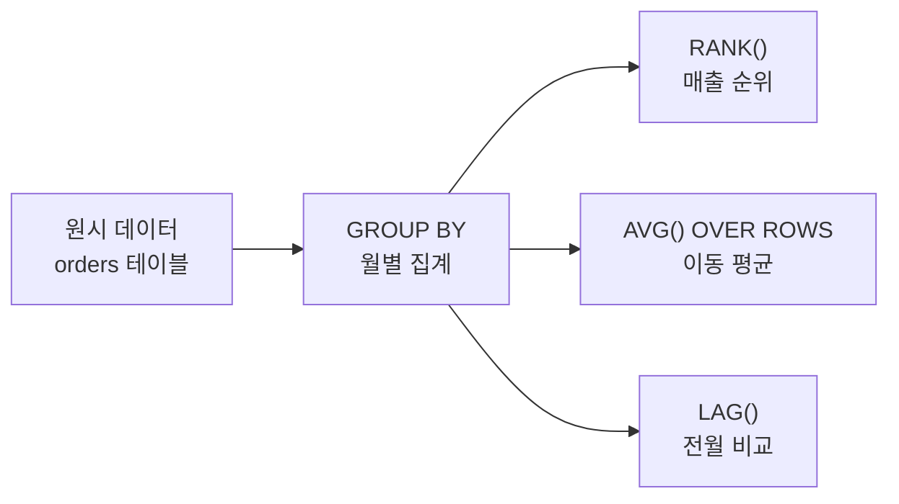

# 집계와 윈도우 함수

::: info 학습 목표
- COUNT, SUM, AVG, MIN, MAX 집계 함수를 올바르게 사용할 수 있다.
- GROUP BY와 HAVING을 활용해 그룹 단위 집계를 수행할 수 있다.
- WHERE와 HAVING의 차이를 이해하고 SQL 실행 순서를 파악한다.
- OVER(PARTITION BY ... ORDER BY ...)를 사용하는 윈도우 함수를 작성할 수 있다.
- ROW_NUMBER, RANK, DENSE_RANK의 차이를 설명하고, LAG/LEAD와 이동평균을 계산할 수 있다.
:::

---

## 1. 집계 함수

<strong>집계 함수(Aggregate Function)</strong>는 여러 행의 값을 하나의 결과로 요약한다.

| 함수 | 설명 |
|------|------|
| COUNT(*) | 전체 행 수 (NULL 포함) |
| COUNT(column) | 해당 컬럼이 NULL이 아닌 행 수 |
| SUM(column) | 합계 |
| AVG(column) | 평균 (NULL 제외) |
| MIN(column) | 최솟값 |
| MAX(column) | 최댓값 |

```sql
SELECT
    COUNT(*)         AS 전체행수,
    COUNT(salary)    AS 급여있는직원수,
    SUM(salary)      AS 급여합계,
    AVG(salary)      AS 급여평균,
    MIN(salary)      AS 최저급여,
    MAX(salary)      AS 최고급여
FROM employees;
```

### NULL 처리 주의사항

집계 함수는 기본적으로 NULL을 무시한다. 단, `COUNT(*)`는 예외이다.

```sql
-- salary가 NULL인 행이 3개 있을 때
COUNT(*)       -- 전체 행 수 (NULL 행도 포함)
COUNT(salary)  -- NULL이 아닌 행 수 (3 적음)
AVG(salary)    -- NULL 제외한 행들의 평균 (NULL을 0으로 보지 않음)
```

NULL을 0으로 처리하려면 `COALESCE`를 사용한다.

```sql
AVG(COALESCE(salary, 0))  -- NULL을 0으로 대체 후 평균
```

---

## 2. GROUP BY와 HAVING

### GROUP BY

특정 컬럼의 값이 같은 행끼리 묶어 그룹을 만든다. 집계 함수는 각 그룹에 적용된다.

```sql
-- 부서별 직원 수와 평균 급여
SELECT
    dept_id,
    COUNT(*)      AS 직원수,
    AVG(salary)   AS 평균급여
FROM employees
GROUP BY dept_id;
```

GROUP BY 절에 없는 컬럼은 SELECT 절에서 집계 함수 없이 사용할 수 없다.

```sql
-- 오류: emp_name은 GROUP BY에 없고 집계 함수도 아님
SELECT dept_id, emp_name, COUNT(*)
FROM employees
GROUP BY dept_id;  -- 오류 발생
```

### HAVING

그룹에 대한 조건을 지정한다. WHERE는 개별 행에 대한 조건, HAVING은 그룹에 대한 조건이다.

```sql
-- 직원이 3명 이상인 부서만 조회
SELECT dept_id, COUNT(*) AS 직원수
FROM employees
GROUP BY dept_id
HAVING COUNT(*) >= 3;
```

### WHERE vs HAVING 비교

| 구분 | WHERE | HAVING |
|------|-------|--------|
| 적용 대상 | 개별 행 | 그룹 |
| 집계 함수 사용 | 불가 | 가능 |
| 실행 순서 | GROUP BY 이전 | GROUP BY 이후 |

### SQL 실행 순서

```
FROM → WHERE → GROUP BY → HAVING → SELECT → ORDER BY → LIMIT
```

```sql
SELECT dept_id, AVG(salary) AS avg_sal   -- 5. SELECT 컬럼 계산
FROM employees                            -- 1. 테이블 접근
WHERE salary > 3000000                    -- 2. 행 필터링
GROUP BY dept_id                          -- 3. 그룹화
HAVING AVG(salary) > 5000000             -- 4. 그룹 필터링
ORDER BY avg_sal DESC                     -- 6. 정렬
LIMIT 5;                                  -- 7. 행 수 제한
```

WHERE 절에서는 아직 그룹이 만들어지지 않았으므로 `AVG(salary)`와 같은 집계 함수를 사용할 수 없다.

---

## 3. 윈도우 함수

<strong>윈도우 함수(Window Function)</strong>는 행을 그룹으로 묶지 않고, 각 행이 자신의 결과를 유지하면서 주변 행들을 참조하는 함수이다.

```sql
함수명() OVER (
    PARTITION BY 그룹기준컬럼
    ORDER BY 정렬기준컬럼
    ROWS BETWEEN 시작 AND 끝
)
```

### GROUP BY와의 차이

```sql
-- GROUP BY: 부서별로 행이 합쳐짐 (결과 행 수 = 부서 수)
SELECT dept_id, AVG(salary)
FROM employees
GROUP BY dept_id;

-- 윈도우 함수: 원래 행 수 유지하면서 부서 평균을 각 행에 표시
SELECT emp_name, dept_id, salary,
       AVG(salary) OVER (PARTITION BY dept_id) AS dept_avg
FROM employees;
```

### ROW_NUMBER, RANK, DENSE_RANK

세 함수 모두 순위를 매기지만 동점 처리 방식이 다르다.

```sql
SELECT
    emp_name,
    salary,
    ROW_NUMBER() OVER (ORDER BY salary DESC) AS row_num,
    RANK()       OVER (ORDER BY salary DESC) AS rnk,
    DENSE_RANK() OVER (ORDER BY salary DESC) AS dense_rnk
FROM employees;
```

급여가 900, 800, 800, 700인 경우:

| emp_name | salary | ROW_NUMBER | RANK | DENSE_RANK |
|----------|--------|-----------|------|-----------|
| A | 900 | 1 | 1 | 1 |
| B | 800 | 2 | 2 | 2 |
| C | 800 | 3 | 2 | 2 |
| D | 700 | 4 | 4 | 3 |

- `ROW_NUMBER`: 동점도 서로 다른 번호 (순서는 비결정적)
- `RANK`: 동점이면 같은 순위, 다음 순위를 건너뜀 (2, 2, 4)
- `DENSE_RANK`: 동점이면 같은 순위, 다음 순위를 건너뛰지 않음 (2, 2, 3)

### LAG / LEAD

이전 행(`LAG`)과 다음 행(`LEAD`)의 값을 현재 행에서 참조한다.

```sql
SELECT
    order_date,
    amount,
    LAG(amount, 1, 0)  OVER (ORDER BY order_date) AS prev_amount,
    LEAD(amount, 1, 0) OVER (ORDER BY order_date) AS next_amount,
    amount - LAG(amount, 1, 0) OVER (ORDER BY order_date) AS mom_diff
FROM orders;
```

`LAG(컬럼, 오프셋, 기본값)`: 오프셋 이전 행의 값. 없으면 기본값 반환.

### SUM / AVG OVER

집계 함수에 OVER를 붙이면 윈도우 함수가 된다.

```sql
-- 누적 합계 (Running Total)
SELECT
    order_date,
    amount,
    SUM(amount) OVER (ORDER BY order_date) AS running_total
FROM orders;

-- 부서별 급여 합계를 각 행에 표시
SELECT
    emp_name,
    dept_id,
    salary,
    SUM(salary) OVER (PARTITION BY dept_id) AS dept_total
FROM employees;
```

### ROWS BETWEEN

윈도우 범위를 직접 지정한다.

```sql
-- 3행 이동 평균 (현재 행 포함, 앞 2행)
SELECT
    order_date,
    amount,
    AVG(amount) OVER (
        ORDER BY order_date
        ROWS BETWEEN 2 PRECEDING AND CURRENT ROW
    ) AS moving_avg_3
FROM orders;
```

주요 범위 키워드:

| 키워드 | 의미 |
|--------|------|
| UNBOUNDED PRECEDING | 파티션의 첫 번째 행 |
| N PRECEDING | 현재 행에서 N행 앞 |
| CURRENT ROW | 현재 행 |
| N FOLLOWING | 현재 행에서 N행 뒤 |
| UNBOUNDED FOLLOWING | 파티션의 마지막 행 |

---

## 4. 실습: 매출 분석

```sql
-- 주문 테이블 예시
CREATE TABLE orders (
    order_id   INT PRIMARY KEY,
    order_date DATE,
    customer_id INT,
    amount     DECIMAL(12, 2)
);
```

### 실습 1: 월별 매출 합계

```sql
SELECT
    DATE_FORMAT(order_date, '%Y-%m') AS month,
    COUNT(*)                          AS order_cnt,
    SUM(amount)                       AS total_amount,
    AVG(amount)                       AS avg_amount
FROM orders
GROUP BY DATE_FORMAT(order_date, '%Y-%m')
ORDER BY month;
```

### 실습 2: 월별 매출 순위

```sql
SELECT
    month,
    total_amount,
    RANK() OVER (ORDER BY total_amount DESC) AS sales_rank
FROM (
    SELECT
        DATE_FORMAT(order_date, '%Y-%m') AS month,
        SUM(amount) AS total_amount
    FROM orders
    GROUP BY DATE_FORMAT(order_date, '%Y-%m')
) monthly;
```

### 실습 3: 3개월 이동 평균

```sql
SELECT
    month,
    total_amount,
    AVG(total_amount) OVER (
        ORDER BY month
        ROWS BETWEEN 2 PRECEDING AND CURRENT ROW
    ) AS moving_avg_3m
FROM (
    SELECT
        DATE_FORMAT(order_date, '%Y-%m') AS month,
        SUM(amount) AS total_amount
    FROM orders
    GROUP BY DATE_FORMAT(order_date, '%Y-%m')
) monthly
ORDER BY month;
```

### 실습 4: 전월 대비 증감률

```sql
SELECT
    month,
    total_amount,
    LAG(total_amount) OVER (ORDER BY month)  AS prev_month,
    ROUND(
        (total_amount - LAG(total_amount) OVER (ORDER BY month))
        / LAG(total_amount) OVER (ORDER BY month) * 100,
    2) AS growth_rate
FROM (
    SELECT
        DATE_FORMAT(order_date, '%Y-%m') AS month,
        SUM(amount) AS total_amount
    FROM orders
    GROUP BY DATE_FORMAT(order_date, '%Y-%m')
) monthly
ORDER BY month;
```



---

::: tip 핵심 정리
- 집계 함수(COUNT/SUM/AVG/MIN/MAX)는 NULL을 무시한다. `COUNT(*)`만 NULL 포함이다.
- WHERE는 행 필터링(GROUP BY 전), HAVING은 그룹 필터링(GROUP BY 후)에 사용한다.
- SQL 실행 순서: FROM → WHERE → GROUP BY → HAVING → SELECT → ORDER BY → LIMIT
- 윈도우 함수는 행을 합치지 않고 원래 행 수를 유지하면서 집계 결과를 각 행에 붙인다.
- RANK는 동점 시 다음 순위를 건너뛰고, DENSE_RANK는 건너뛰지 않는다.
- LAG/LEAD로 이전/다음 행을 참조하고, ROWS BETWEEN으로 이동 평균을 계산한다.
:::

## 다음 챕터

- 다음 : [데이터베이스 객체](/study/database/07-db-objects)
