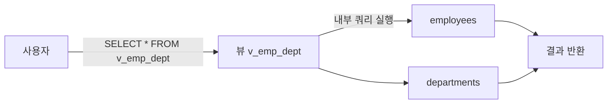
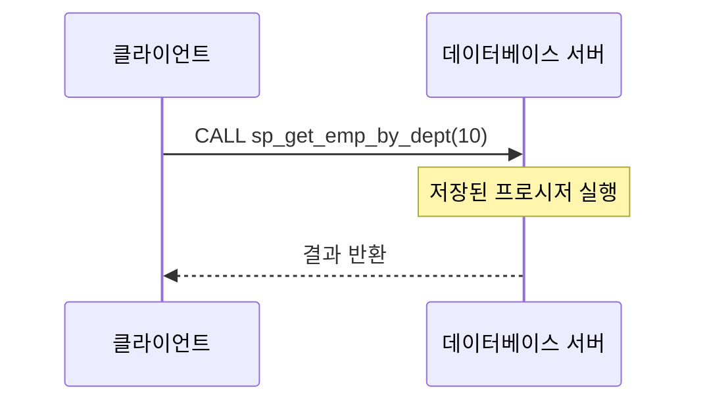
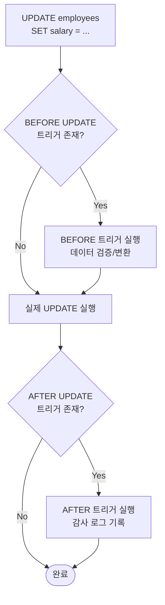

# 데이터베이스 객체

::: info 학습 목표
- 뷰(VIEW)의 개념, 생성 방법, 장단점을 설명할 수 있다.
- 저장 프로시저를 작성하고 IN/OUT 매개변수를 활용할 수 있다.
- 트리거의 동작 원리와 BEFORE/AFTER의 차이를 이해한다.
- 시퀀스, 시노님, 사용자 정의 함수의 역할을 간략히 설명할 수 있다.
:::

---

## 1. 뷰(VIEW)

### 가상 테이블

<strong>뷰(VIEW)</strong>는 하나 이상의 테이블에 대한 SELECT 쿼리를 저장해 둔 가상의 테이블이다. 실제 데이터를 저장하지 않고, 뷰를 조회할 때마다 정의된 쿼리가 실행된다.



### CREATE VIEW 문법

```sql
CREATE VIEW v_emp_dept AS
SELECT
    e.emp_id,
    e.emp_name,
    e.salary,
    d.dept_name
FROM employees e
LEFT JOIN departments d ON e.dept_id = d.dept_id;

-- 뷰 사용
SELECT * FROM v_emp_dept WHERE dept_name = '개발팀';

-- 뷰 수정
CREATE OR REPLACE VIEW v_emp_dept AS
SELECT ...;

-- 뷰 삭제
DROP VIEW v_emp_dept;
```

### 뷰의 장점

- <strong>보안</strong>: 민감한 컬럼(급여, 주민번호 등)을 제외한 뷰를 사용자에게 제공해 직접 테이블 접근을 차단한다.
- <strong>편의성</strong>: 복잡한 JOIN 쿼리를 뷰로 정의해두면 사용자는 단순한 SELECT만 작성하면 된다.
- <strong>독립성</strong>: 테이블 구조가 바뀌어도 뷰 정의만 수정하면 기존 쿼리를 유지할 수 있다.

### 뷰의 단점

- 뷰는 실행 시점에 쿼리가 다시 실행되므로, 복잡한 뷰는 성능이 저하될 수 있다.
- 일부 DBMS에서는 뷰에 대한 인덱스를 바로 활용하지 못한다.

### 업데이트 가능 뷰 조건

뷰를 통해 INSERT/UPDATE/DELETE를 수행하려면 다음 조건을 모두 만족해야 한다.

- 단일 테이블을 기반으로 한다.
- DISTINCT, GROUP BY, HAVING, 집계 함수를 사용하지 않는다.
- 서브쿼리를 포함하지 않는다.
- 모든 NOT NULL 컬럼이 뷰에 포함된다.

---

## 2. 저장 프로시저(Stored Procedure)

### 개념

<strong>저장 프로시저</strong>는 서버에 미리 저장해 둔 SQL 문의 묶음이다. 클라이언트가 프로시저 이름만 호출하면 서버에서 실행된다.



### CREATE PROCEDURE 문법

```sql
DELIMITER $$

CREATE PROCEDURE sp_get_emp_by_dept (
    IN  p_dept_id   INT,
    OUT p_emp_count INT
)
BEGIN
    -- 해당 부서 직원 목록 조회
    SELECT emp_id, emp_name, salary
    FROM employees
    WHERE dept_id = p_dept_id;

    -- 직원 수를 OUT 매개변수에 저장
    SELECT COUNT(*) INTO p_emp_count
    FROM employees
    WHERE dept_id = p_dept_id;
END$$

DELIMITER ;
```

### 매개변수 유형

| 유형 | 방향 | 설명 |
|------|------|------|
| IN | 호출자 → 프로시저 | 입력값. 프로시저 내에서 변경해도 호출자에 반영 안 됨 |
| OUT | 프로시저 → 호출자 | 출력값. 초기값은 NULL |
| INOUT | 양방향 | 입력값으로 받아 수정 후 반환 |

```sql
-- 프로시저 호출
CALL sp_get_emp_by_dept(10, @cnt);
SELECT @cnt;  -- OUT 매개변수 확인
```

### 저장 프로시저의 장점

- <strong>네트워크 비용 절감</strong>: 여러 SQL 문을 하나의 호출로 실행해 네트워크 왕복을 줄인다.
- <strong>재사용성</strong>: 공통 로직을 프로시저로 정의해 여러 애플리케이션에서 재사용한다.
- <strong>보안</strong>: 직접 테이블 접근 없이 프로시저를 통해서만 데이터를 처리하도록 제한할 수 있다.
- <strong>성능</strong>: 최초 실행 시 컴파일된 실행 계획이 캐시되어 이후 호출이 빠르다.

---

## 3. 트리거(Trigger)

### 개념

<strong>트리거</strong>는 테이블에서 특정 이벤트(INSERT, UPDATE, DELETE)가 발생할 때 자동으로 실행되는 프로시저이다. 명시적으로 호출하지 않아도 이벤트가 발생하면 자동 실행된다.

### BEFORE vs AFTER

| 구분 | BEFORE | AFTER |
|------|--------|-------|
| 실행 시점 | 이벤트 실행 전 | 이벤트 실행 후 |
| 주요 용도 | 데이터 검증, 변환 | 감사 로그, 연관 테이블 갱신 |
| NEW/OLD 수정 | 가능 (값 변경 가능) | 불가 |

트리거 안에서 `NEW`는 INSERT/UPDATE 후의 새 값, `OLD`는 UPDATE/DELETE 전의 기존 값을 참조한다.

### 감사 로그 예제

```sql
-- 감사 로그 테이블
CREATE TABLE salary_audit_log (
    log_id     INT AUTO_INCREMENT PRIMARY KEY,
    emp_id     INT,
    old_salary DECIMAL(10, 2),
    new_salary DECIMAL(10, 2),
    changed_at DATETIME DEFAULT CURRENT_TIMESTAMP,
    changed_by VARCHAR(50)
);

-- 급여 변경 시 자동으로 로그 기록
DELIMITER $$

CREATE TRIGGER trg_salary_update
AFTER UPDATE ON employees
FOR EACH ROW
BEGIN
    IF OLD.salary <> NEW.salary THEN
        INSERT INTO salary_audit_log (emp_id, old_salary, new_salary, changed_by)
        VALUES (NEW.emp_id, OLD.salary, NEW.salary, USER());
    END IF;
END$$

DELIMITER ;
```

### 트리거 주의사항

- <strong>디버깅 어려움</strong>: 명시적 호출이 아니므로 어디서 실행됐는지 추적이 어렵다.
- <strong>성능</strong>: 모든 해당 이벤트마다 실행되므로 대량 DML 시 성능 저하가 생긴다.
- <strong>연쇄 트리거</strong>: 트리거가 또 다른 트리거를 실행하면 예측하기 어려운 동작이 발생할 수 있다.
- <strong>이식성</strong>: 트리거 문법은 DBMS마다 다르므로 이식성이 낮다.



---

## 4. 기타 객체

### 시퀀스(SEQUENCE)

<strong>시퀀스</strong>는 고유한 숫자 값을 자동으로 생성하는 객체이다. 주로 기본키 값을 자동 증가시키는 데 사용한다.

```sql
-- Oracle / PostgreSQL
CREATE SEQUENCE seq_emp_id
    START WITH 1
    INCREMENT BY 1
    NOCACHE;

SELECT seq_emp_id.NEXTVAL FROM DUAL;  -- Oracle
SELECT nextval('seq_emp_id');         -- PostgreSQL
```

MySQL에서는 `AUTO_INCREMENT` 속성이 시퀀스의 역할을 대신한다.

```sql
CREATE TABLE employees (
    emp_id INT AUTO_INCREMENT PRIMARY KEY,
    ...
);
```

### 시노님(SYNONYM)

<strong>시노님</strong>은 다른 객체(테이블, 뷰 등)에 별명을 붙이는 객체이다. Oracle에서 주로 사용한다. 스키마가 다른 테이블에 짧은 이름으로 접근하거나, 실제 객체 이름을 숨길 때 활용한다.

```sql
-- Oracle
CREATE SYNONYM emp FOR hr.employees;
SELECT * FROM emp;  -- hr.employees를 조회
```

### 사용자 정의 함수(FUNCTION)

<strong>사용자 정의 함수(UDF, User Defined Function)</strong>는 저장 프로시저와 비슷하지만 반드시 값을 반환하며, SELECT 문 안에서 직접 사용할 수 있다.

```sql
DELIMITER $$

CREATE FUNCTION fn_annual_salary(p_monthly DECIMAL(10,2))
RETURNS DECIMAL(12,2)
DETERMINISTIC
BEGIN
    RETURN p_monthly * 12;
END$$

DELIMITER ;

-- 함수 사용 (SELECT 절에서 바로 호출 가능)
SELECT emp_name, salary, fn_annual_salary(salary) AS annual_salary
FROM employees;
```

| 구분 | 저장 프로시저 | 사용자 정의 함수 |
|------|------------|--------------|
| 반환값 | 0개 이상 (OUT 매개변수) | 반드시 1개 |
| SELECT 절 사용 | 불가 | 가능 |
| CALL 호출 | CALL 필요 | SELECT 절에서 직접 호출 |
| 트랜잭션 제어 | 가능 (COMMIT, ROLLBACK) | 불가 (일부 DBMS) |

---

::: tip 핵심 정리
- VIEW는 가상 테이블로 보안·편의성 목적으로 사용하며, 복잡한 뷰는 성능 저하가 있을 수 있다.
- 저장 프로시저는 서버에 저장된 SQL 묶음으로, IN/OUT/INOUT 매개변수를 지원한다.
- 트리거는 DML 이벤트 발생 시 자동 실행되며, BEFORE는 데이터 검증, AFTER는 감사 로그에 주로 사용한다.
- 트리거는 디버깅이 어렵고 성능에 영향을 주므로 남용에 주의한다.
- 시퀀스는 자동 증가 번호 생성, 시노님은 객체 별명, UDF는 SELECT 절에서 사용 가능한 함수이다.
:::

## 다음 챕터

- 다음 : [정규화](/study/database/08-normalization)
