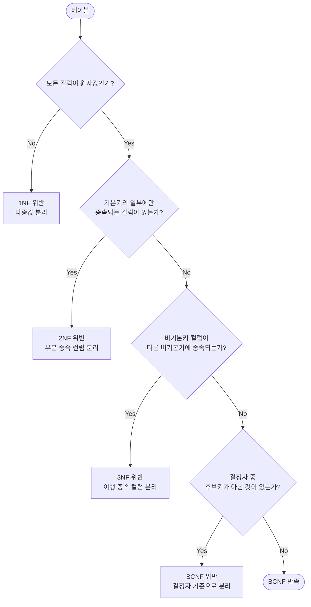

# 정규화

::: info 학습 목표
- 삽입 이상, 갱신 이상, 삭제 이상의 개념과 발생 원인을 설명할 수 있다.
- 함수적 종속(완전/부분/이행)을 정의하고 예시를 들 수 있다.
- 1NF, 2NF, 3NF, BCNF의 조건을 설명하고 테이블을 분해할 수 있다.
- 반정규화가 필요한 상황과 주요 기법을 설명할 수 있다.
:::

---

## 1. 이상 현상(Anomaly)

### 왜 이상 현상이 발생하는가

데이터가 중복되거나 구조가 잘못 설계된 테이블에서는 데이터를 조작할 때 의도치 않은 문제가 발생한다. 이를 <strong>이상 현상(Anomaly)</strong>이라 한다.

### 예시 테이블: 학생-수강

다음과 같이 학생 정보와 수강 정보를 하나의 테이블에 저장했다고 가정한다.

| 학번 | 학생명 | 학과 | 학과사무실 | 과목코드 | 성적 |
|------|--------|------|-----------|---------|------|
| 100 | 김철수 | 컴퓨터공학 | 공학관 301 | CS101 | A |
| 100 | 김철수 | 컴퓨터공학 | 공학관 301 | CS201 | B |
| 200 | 이영희 | 전자공학 | 공학관 201 | EE101 | A |

기본키: (학번, 과목코드)

### 삽입 이상 (Insertion Anomaly)

아직 수강 신청을 하지 않은 신입생을 등록하려면 과목코드가 없어 INSERT를 할 수 없다. 기본키(학번, 과목코드)에서 과목코드가 NULL이 되기 때문이다.

### 갱신 이상 (Update Anomaly)

컴퓨터공학과 사무실 위치가 변경됐을 때, 김철수가 수강하는 모든 행을 변경해야 한다. 하나라도 빠뜨리면 같은 학생이 서로 다른 학과사무실을 가지는 데이터 불일치가 발생한다.

### 삭제 이상 (Deletion Anomaly)

이영희가 EE101 수강을 취소해 해당 행을 삭제하면, 이영희의 학생 정보(학과, 학과사무실)도 함께 사라진다.

### 이상 현상의 원인

이상 현상의 근본 원인은 하나의 테이블에 <strong>서로 다른 주제의 데이터가 뒤섞여</strong> 있기 때문이다. 학생 정보와 수강 정보는 분리되어야 한다.

---

## 2. 함수적 종속(Functional Dependency)

### 정의

"X의 값이 결정되면 Y의 값이 유일하게 결정된다"는 관계를 X가 Y를 <strong>함수적으로 결정</strong>한다고 하며, `X → Y`로 표기한다. X를 <strong>결정자(Determinant)</strong>, Y를 <strong>종속자(Dependent)</strong>라 한다.

위 테이블에서:
- `학번 → 학생명, 학과, 학과사무실` (학번이 결정되면 학생명 등이 유일하게 결정됨)
- `학과 → 학과사무실` (학과가 결정되면 사무실이 유일하게 결정됨)
- `(학번, 과목코드) → 성적` (두 값 모두 알아야 성적이 결정됨)

### 완전 함수 종속 (Full Functional Dependency)

기본키 전체에 종속되는 경우이다. 기본키의 일부에만 종속되지 않는다.

- `(학번, 과목코드) → 성적`: 두 값 모두 필요 → <strong>완전 함수 종속</strong>

### 부분 함수 종속 (Partial Functional Dependency)

기본키의 일부에만 종속되는 경우이다.

- `학번 → 학생명`: 기본키 (학번, 과목코드) 중 학번만으로 결정 → <strong>부분 함수 종속</strong>

### 이행 함수 종속 (Transitive Functional Dependency)

`X → Y`이고 `Y → Z`일 때, `X → Z`가 성립하는 경우이다.

- `학번 → 학과` 이고 `학과 → 학과사무실` → 결국 `학번 → 학과사무실`: <strong>이행 함수 종속</strong>

---

## 3. 정규형 단계

같은 예시 테이블을 단계별로 분해해 정규화 과정을 확인한다.

### 비정규형 테이블 (시작)

| 학번 | 학생명 | 수강과목목록 |
|------|--------|------------|
| 100 | 김철수 | CS101, CS201 |
| 200 | 이영희 | EE101 |

`수강과목목록` 컬럼에 여러 값이 하나의 셀에 들어 있다.

### 1NF (제1정규형): 원자값

<strong>모든 컬럼의 값이 원자값(더 이상 분리되지 않는 단일 값)이어야 한다.</strong>

1NF 적용: 다중값 컬럼을 행으로 분리한다.

| 학번 | 학생명 | 학과 | 학과사무실 | 과목코드 | 성적 |
|------|--------|------|-----------|---------|------|
| 100 | 김철수 | 컴퓨터공학 | 공학관 301 | CS101 | A |
| 100 | 김철수 | 컴퓨터공학 | 공학관 301 | CS201 | B |
| 200 | 이영희 | 전자공학 | 공학관 201 | EE101 | A |

1NF는 만족하지만 이상 현상은 여전히 존재한다.

### 2NF (제2정규형): 부분 함수 종속 제거

<strong>1NF를 만족하고, 기본키가 아닌 모든 컬럼이 기본키 전체에 완전 함수 종속이어야 한다.</strong>

기본키 (학번, 과목코드)에서:
- `학번 → 학생명, 학과, 학과사무실`: 부분 종속 → 분리
- `(학번, 과목코드) → 성적`: 완전 종속 → 유지

2NF 적용: 부분 종속 컬럼을 별도 테이블로 분리한다.

학생 테이블 (기본키: 학번):

| 학번 | 학생명 | 학과 | 학과사무실 |
|------|--------|------|-----------|
| 100 | 김철수 | 컴퓨터공학 | 공학관 301 |
| 200 | 이영희 | 전자공학 | 공학관 201 |

수강 테이블 (기본키: 학번, 과목코드):

| 학번 | 과목코드 | 성적 |
|------|---------|------|
| 100 | CS101 | A |
| 100 | CS201 | B |
| 200 | EE101 | A |

삽입/삭제 이상은 해결됐지만 학생 테이블의 이행 종속이 남아 있다.

### 3NF (제3정규형): 이행 함수 종속 제거

<strong>2NF를 만족하고, 기본키가 아닌 컬럼이 다른 비기본키 컬럼에 종속되지 않아야 한다.</strong>

학생 테이블에서:
- `학번 → 학과 → 학과사무실`: 이행 종속 → 분리

3NF 적용:

학생 테이블 (기본키: 학번):

| 학번 | 학생명 | 학과 |
|------|--------|------|
| 100 | 김철수 | 컴퓨터공학 |
| 200 | 이영희 | 전자공학 |

학과 테이블 (기본키: 학과):

| 학과 | 학과사무실 |
|------|-----------|
| 컴퓨터공학 | 공학관 301 |
| 전자공학 | 공학관 201 |

### BCNF (Boyce-Codd 정규형)

<strong>3NF를 만족하고, 모든 결정자가 후보키이어야 한다.</strong>

3NF를 만족해도 결정자이지만 후보키가 아닌 컬럼이 있으면 BCNF를 위반한다.

예시: 교수-과목 테이블 (학생 한 명이 과목당 한 교수에게만 수강)

| 학번 | 과목명 | 교수 |
|------|--------|------|
| 100 | 데이터베이스 | 김교수 |
| 200 | 데이터베이스 | 김교수 |
| 100 | 알고리즘 | 이교수 |

- 후보키: (학번, 과목명), (학번, 교수)
- `교수 → 과목명`: 교수가 결정자이지만 교수 단독으로는 후보키가 아님 → BCNF 위반

BCNF 적용:

수강 테이블:

| 학번 | 교수 |
|------|------|
| 100 | 김교수 |
| 200 | 김교수 |
| 100 | 이교수 |

교수-과목 테이블:

| 교수 | 과목명 |
|------|--------|
| 김교수 | 데이터베이스 |
| 이교수 | 알고리즘 |

### 정규형 판별 흐름



---

## 4. 반정규화

### 왜 정규화를 깨야 하는가

정규화를 완벽하게 적용하면 테이블이 잘게 쪼개지고, 데이터를 조회할 때마다 여러 JOIN이 필요해진다. 테이블 수가 늘어날수록 JOIN 비용이 증가해 읽기 성능이 저하될 수 있다.

<strong>반정규화(Denormalization)</strong>는 성능 향상을 위해 의도적으로 정규화 규칙을 일부 위반해 중복을 허용하는 기법이다.

### 성능 vs 무결성 트레이드오프

| 관점 | 정규화 | 반정규화 |
|------|--------|---------|
| 중복 | 최소화 | 허용 |
| 갱신 성능 | 좋음 (한 곳만 수정) | 나쁨 (중복된 곳 모두 수정) |
| 조회 성능 | 나쁨 (JOIN 많음) | 좋음 (JOIN 감소) |
| 데이터 무결성 | 높음 | 낮음 (불일치 가능성) |
| 적합한 상황 | OLTP (잦은 수정) | OLAP (읽기 위주, 대용량) |

### 대표 반정규화 기법

**테이블 병합**

자주 함께 조회되는 두 테이블을 하나로 합친다.

```sql
-- 정규화: 두 테이블 JOIN 필요
SELECT e.emp_name, d.dept_name
FROM employees e JOIN departments d ON e.dept_id = d.dept_id;

-- 반정규화: dept_name 컬럼을 employees에 직접 추가
SELECT emp_name, dept_name FROM employees;
```

**컬럼 중복(파생 컬럼)**

자주 사용하는 집계값이나 계산값을 미리 저장해 두는 컬럼을 추가한다.

```sql
-- 반정규화: 부서 테이블에 직원 수를 직접 저장
ALTER TABLE departments ADD COLUMN emp_count INT DEFAULT 0;

-- employees INSERT/UPDATE/DELETE 시 트리거로 emp_count 동기화
```

**테이블 분할 (파티셔닝)**

데이터가 너무 많은 테이블을 수직(컬럼) 또는 수평(행)으로 분리해 각 테이블의 크기를 줄인다.

---

::: tip 핵심 정리
- 이상 현상(삽입/갱신/삭제)은 중복과 구조 문제에서 발생하며, 정규화로 해소한다.
- 함수적 종속: X → Y. 완전 종속(기본키 전체), 부분 종속(기본키 일부), 이행 종속(비기본키 경유).
- 1NF: 원자값, 2NF: 부분 종속 제거, 3NF: 이행 종속 제거, BCNF: 모든 결정자가 후보키.
- 반정규화는 읽기 성능 향상을 위해 중복을 허용하며, 무결성 관리 비용이 늘어난다.
- OLTP(잦은 수정)에는 정규화, OLAP(읽기 위주)에는 반정규화가 유리하다.
:::

## 다음 챕터

- 다음 : [데이터 모델링](/study/database/09-data-modeling)
