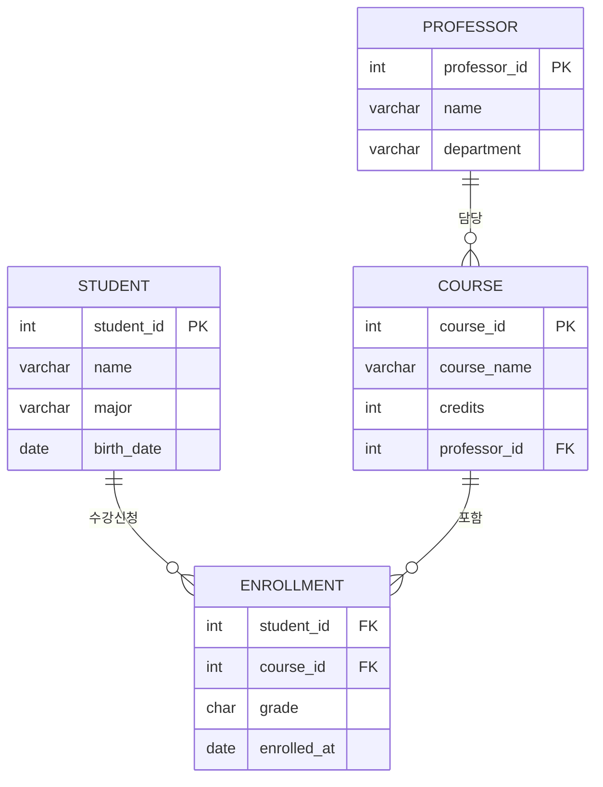
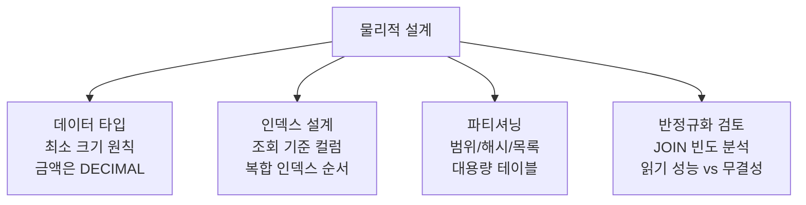

# 데이터 모델링

::: info 학습 목표
- 데이터베이스 설계 4단계를 순서대로 설명할 수 있다.
- 엔터티, 속성, 관계를 도출해 ERD를 작성할 수 있다.
- ERD를 릴레이션 스키마로 변환하는 규칙(1:1, 1:N, N:M)을 적용할 수 있다.
- 데이터 타입 선택, 인덱스 설계 등 물리적 설계의 고려사항을 설명할 수 있다.
:::

---

## 1. 데이터베이스 설계 4단계

데이터베이스를 설계하는 과정은 요구사항에서 실제 테이블까지 4단계를 거친다.


| 단계 | 산출물 | 도구/표기법 |
|------|--------|------------|
| 요구사항 분석 | 요구사항 명세서 | 인터뷰, 설문, 문서 분석 |
| 개념적 설계 | ERD | Chen 표기, IE 표기 |
| 논리적 설계 | 릴레이션 스키마 | 정규화 |
| 물리적 설계 | DDL 스크립트 | DBMS 종속적 최적화 |

### 1단계: 요구사항 분석

시스템에서 다루어야 할 데이터와 처리 방식을 파악한다.

- 어떤 데이터를 저장해야 하는가?
- 데이터 간에 어떤 관계가 있는가?
- 어떤 조회와 처리가 자주 발생하는가?

이 단계에서 엔터티 후보, 속성 후보, 관계 후보를 도출한다.

---

## 2. 개념적 설계

### 핵심 개념

- <strong>엔터티(Entity)</strong>: 독립적으로 존재하는 사물이나 개념. 테이블의 원형. 예: 학생, 강좌, 교수
- <strong>속성(Attribute)</strong>: 엔터티의 특성. 컬럼의 원형. 예: 학생의 학번, 이름, 학과
- <strong>관계(Relationship)</strong>: 엔터티 간의 연관. 예: 학생이 강좌를 수강한다

### 엔터티 도출 기준

요구사항 문서에서 명사를 추출하면 엔터티 후보가 된다. 이 중 독립적으로 관리할 필요가 있는 것이 엔터티이다.

```
요구사항: "학생은 여러 강좌를 수강할 수 있고, 각 강좌는 교수 한 명이 담당한다."

엔터티 후보: 학생, 강좌, 교수
관계 후보: 수강(학생-강좌), 담당(교수-강좌)
```

### ERD 표기법

**Chen 표기**: 엔터티는 사각형, 속성은 타원, 관계는 마름모로 표현한다. 학술적 문서에서 많이 사용한다.

**IE(Information Engineering) 표기**: 실무에서 주로 사용하는 표기법으로, Crow's Foot 기호로 관계의 기수성(Cardinality)을 표현한다.

### Mermaid erDiagram 예시

다음은 학교 수강 시스템의 ERD이다.



### 기수성(Cardinality)

엔터티 간 관계에서 몇 개의 인스턴스가 대응되는지를 나타낸다.

| 기수성 | 설명 | 예시 |
|--------|------|------|
| 1:1 | 한 인스턴스가 정확히 하나에 대응 | 직원 : 사원증 |
| 1:N | 한 인스턴스가 여러 개에 대응 | 부서 : 직원 |
| N:M | 양쪽 모두 여러 개에 대응 | 학생 : 강좌 |

---

## 3. 논리적 설계

개념적 설계에서 만든 ERD를 실제 테이블 구조(릴레이션 스키마)로 변환한다.

### 1:1 관계 변환

두 엔터티 중 어느 한쪽에 상대방의 기본키를 외래키로 추가한다. 주로 접근 빈도가 낮은 쪽에 외래키를 둔다.

```sql
-- 직원(1) : 사원증(1)
-- EMPLOYEE 테이블에 ID_CARD_ID 외래키 추가 (또는 반대 방향)
CREATE TABLE employee (
    emp_id     INT PRIMARY KEY,
    emp_name   VARCHAR(50),
    id_card_id INT UNIQUE,  -- 1:1이므로 UNIQUE 제약 추가
    FOREIGN KEY (id_card_id) REFERENCES id_card(card_id)
);
```

### 1:N 관계 변환

N 쪽 엔터티에 1 쪽의 기본키를 외래키로 추가한다.

```sql
-- 부서(1) : 직원(N)
-- EMPLOYEE(N) 쪽에 DEPT_ID 외래키 추가
CREATE TABLE department (dept_id INT PRIMARY KEY, dept_name VARCHAR(50));

CREATE TABLE employee (
    emp_id  INT PRIMARY KEY,
    emp_name VARCHAR(50),
    dept_id INT,
    FOREIGN KEY (dept_id) REFERENCES department(dept_id)
);
```

### N:M 관계 변환

N:M 관계는 직접 표현할 수 없으므로, 별도의 <strong>교차 테이블(Junction Table)</strong>을 생성한다. 교차 테이블의 기본키는 두 엔터티의 기본키를 합성한 복합키이다.

```sql
-- 학생(N) : 강좌(M) → 수강(교차 테이블)
CREATE TABLE student (student_id INT PRIMARY KEY, name VARCHAR(50));
CREATE TABLE course  (course_id  INT PRIMARY KEY, course_name VARCHAR(100));

CREATE TABLE enrollment (
    student_id INT,
    course_id  INT,
    grade      CHAR(2),
    enrolled_at DATE,
    PRIMARY KEY (student_id, course_id),
    FOREIGN KEY (student_id) REFERENCES student(student_id),
    FOREIGN KEY (course_id)  REFERENCES course(course_id)
);
```

### 정규화 적용

변환된 릴레이션 스키마에 정규화를 적용해 이상 현상을 제거한다. 8장에서 학습한 1NF → BCNF 과정을 거친다.

---

## 4. 물리적 설계

논리적 설계 결과를 특정 DBMS에 최적화된 실제 테이블로 구현한다.

### 데이터 타입 선택

```sql
CREATE TABLE order_item (
    item_id     INT          NOT NULL,       -- 정수 ID
    order_id    BIGINT       NOT NULL,       -- 대용량 ID는 BIGINT
    product_name VARCHAR(200) NOT NULL,      -- 가변 문자열
    price       DECIMAL(12, 2) NOT NULL,     -- 금액은 DECIMAL (부동소수점 오차 방지)
    quantity    SMALLINT     NOT NULL,       -- 작은 범위 정수는 SMALLINT
    ordered_at  DATETIME     NOT NULL,       -- 날짜+시간
    is_deleted  TINYINT(1)   DEFAULT 0,      -- 논리 삭제 플래그
    memo        TEXT,                        -- 길이 제한 없는 텍스트
    PRIMARY KEY (item_id)
);
```

| 데이터 유형 | 권장 타입 | 주의사항 |
|------------|----------|---------|
| 금액 | DECIMAL(p, s) | FLOAT/DOUBLE은 부동소수점 오차 발생 |
| 날짜+시간 | DATETIME / TIMESTAMP | TIMESTAMP는 2038년 문제 있음 |
| 짧은 코드 | CHAR(n) | 길이 고정이면 CHAR가 VARCHAR보다 빠름 |
| 긴 텍스트 | TEXT / CLOB | 인덱스 앞부분만 지원 |
| 바이너리 | BLOB | 파일은 파일시스템 저장 후 경로만 DB에 권장 |

### 인덱스 설계

```sql
-- WHERE 절에 자주 사용되는 컬럼
CREATE INDEX idx_emp_dept ON employees(dept_id);

-- 복합 인덱스: 선택도 높은 컬럼을 앞에
CREATE INDEX idx_order_date_status ON orders(order_date, status);

-- 커버링 인덱스: SELECT 컬럼까지 인덱스에 포함
CREATE INDEX idx_covering ON employees(dept_id, emp_name, salary);
```

인덱스는 조회 성능을 높이지만 INSERT/UPDATE/DELETE 시 인덱스 갱신 비용이 발생한다. 모든 컬럼에 인덱스를 만드는 것은 오히려 성능을 저하시킨다.

### 파티셔닝

대용량 테이블을 여러 파티션으로 나눠 관리 및 조회 성능을 개선한다.

```sql
-- 연도별 범위 파티셔닝
CREATE TABLE orders (
    order_id   BIGINT,
    order_date DATE,
    amount     DECIMAL(12, 2)
)
PARTITION BY RANGE (YEAR(order_date)) (
    PARTITION p2023 VALUES LESS THAN (2024),
    PARTITION p2024 VALUES LESS THAN (2025),
    PARTITION p2025 VALUES LESS THAN (2026),
    PARTITION pmax  VALUES LESS THAN MAXVALUE
);
```

### 성능 고려사항 요약



---

::: tip 핵심 정리
- 설계 4단계: 요구사항 분석 → 개념적 설계(ERD) → 논리적 설계(릴레이션 변환) → 물리적 설계(DDL).
- 엔터티는 명사에서 도출, 관계는 동사로 표현한다. 기수성(1:1, 1:N, N:M)을 명확히 한다.
- 1:N 관계는 N 쪽에 외래키 추가, N:M 관계는 교차 테이블을 생성한다.
- 금액에는 DECIMAL, 날짜+시간에는 DATETIME을 사용한다.
- 인덱스는 조회 성능을 높이지만 DML 비용이 증가하므로 신중히 설계한다.
:::

## 다음 챕터

- 다음 : [스토리지 엔진](/study/database/10-storage-engine)
