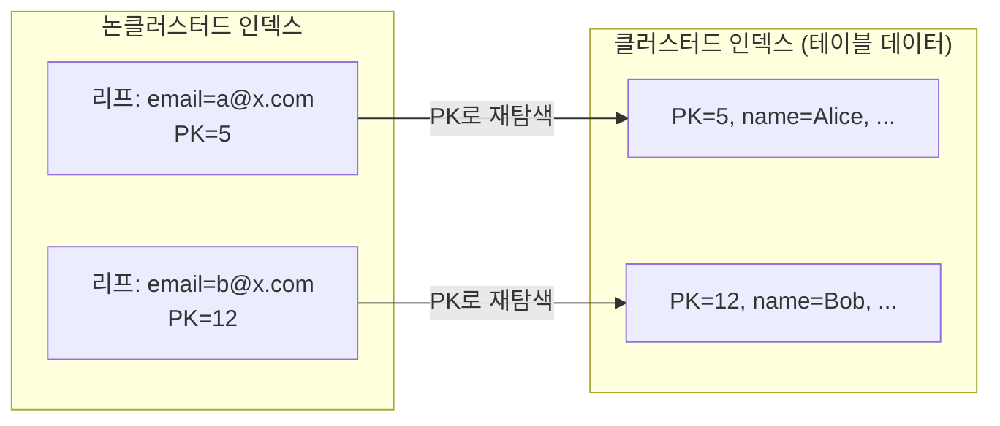
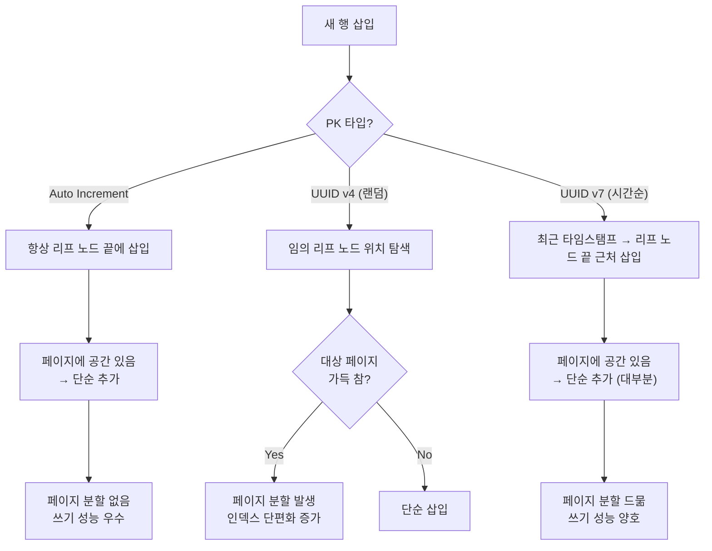

# 스토리지 엔진

::: info 학습 목표
- 데이터베이스가 디스크에 데이터를 저장하는 단위(페이지)와 그 이유를 설명할 수 있다.
- B-Tree와 B+Tree의 구조적 차이를 비교하고, DB가 B+Tree를 선택하는 이유를 설명할 수 있다.
- 클러스터드 인덱스와 논클러스터드 인덱스의 차이를 설명하고, InnoDB와 MyISAM을 비교할 수 있다.
- 해시 인덱스의 동작 원리와 한계, 적합한 사용 사례를 설명할 수 있다.
:::

## 1. 페이지(Page)와 디스크 I/O

### 페이지란 무엇인가

데이터베이스는 데이터를 디스크에 저장하고 읽어올 때 <strong>행(row)</strong> 단위가 아니라 <strong>페이지(page)</strong> 단위로 처리한다. 페이지는 디스크 I/O의 최소 단위이며, DBMS마다 크기가 다르다.

| DBMS | 기본 페이지 크기 |
|------|----------------|
| MySQL InnoDB | 16 KB |
| PostgreSQL | 8 KB |
| SQL Server | 8 KB |
| Oracle | 8 KB (기본) |

### 왜 페이지 단위인가

디스크는 HDD든 SSD든 특정 크기의 블록 단위로 읽고 쓰는 물리적 특성을 갖는다. 운영체제와 하드웨어는 보통 4 KB 단위의 블록으로 I/O를 처리한다. 행 하나가 50바이트라도, 디스크에서 그 행을 읽으려면 해당 행이 속한 블록 전체를 메모리에 올려야 한다.

DBMS는 이 특성을 활용한다. 어차피 블록 하나를 읽어야 한다면, 그 블록 안에 가능한 한 많은 관련 데이터를 채워 넣어 한 번의 I/O로 여러 행을 가져올 수 있게 설계한다. 이것이 페이지 단위 저장의 핵심 이유다.

### 디스크 I/O가 성능의 병목인 이유

CPU와 메모리의 처리 속도는 나노초(ns) 단위인 반면, 디스크 I/O는 밀리초(ms) 단위다. 이 차이는 수십만 배에 달한다.

```
메모리 접근:    ~100 ns
SSD 랜덤 I/O:  ~100 µs  (메모리 대비 약 1,000배 느림)
HDD 랜덤 I/O:  ~10 ms   (메모리 대비 약 100,000배 느림)
```

DB 성능 최적화의 핵심은 결국 디스크 I/O 횟수를 줄이는 것이다. 인덱스, 버퍼 풀(Buffer Pool), 페이지 캐시 등 모든 최적화 기법은 이 목표를 향한다.

### 버퍼 풀(Buffer Pool)

DBMS는 메모리 안에 버퍼 풀을 운영하여 최근에 읽은 페이지를 캐싱한다. 같은 페이지를 다시 요청하면 디스크를 읽지 않고 메모리에서 바로 반환한다. InnoDB의 `innodb_buffer_pool_size` 설정이 이에 해당하며, 가용 메모리의 70~80%를 할당하는 것이 일반적이다.

그렇다면 수만 개의 페이지 중에서 원하는 데이터가 담긴 페이지를 어떻게 빠르게 찾을까? 이 문제를 해결하는 것이 인덱스 자료구조다.

## 2. B-Tree와 B+Tree

### B-Tree 구조

B-Tree(Balanced Tree)는 모든 리프 노드가 같은 깊이를 유지하는 균형 트리다. 각 노드는 여러 개의 키(key)와 자식 포인터를 가진다.

- <strong>루트 노드(Root Node)</strong>: 트리의 시작점. 유일하게 하나만 존재한다.
- <strong>내부 노드(Internal Node)</strong>: 루트와 리프 사이의 중간 노드. 키와 자식 포인터를 갖는다.
- <strong>리프 노드(Leaf Node)</strong>: 트리의 말단. 실제 데이터 또는 데이터 포인터를 갖는다.

B-Tree에서는 내부 노드에도 데이터(레코드)가 저장된다. 키를 찾으면 그 자리에서 데이터를 바로 반환할 수 있다.

### B+Tree 구조

B+Tree는 B-Tree를 변형한 구조다. 핵심 차이는 두 가지다.

1. <strong>리프 노드에만 데이터가 저장된다.</strong> 내부 노드는 키와 포인터만 갖고, 실제 레코드는 오직 리프 노드에만 있다.
2. <strong>리프 노드끼리 연결 리스트(Linked List)로 연결된다.</strong> 인접한 리프 노드를 순서대로 순회할 수 있다.

```
                        [  30  |  70  ]                    ← 루트 노드 (키만)
                       /       |       \
              [10|20]       [40|50]       [80|90]           ← 내부 노드 (키만)
             /   |   \     /   |   \     /   |   \
           [10] [20] [29] [40] [50] [69] [80] [90] [99]    ← 리프 노드 (키+데이터)
            ↔    ↔    ↔    ↔    ↔    ↔    ↔    ↔    ↔
                    리프 노드끼리 연결 리스트로 연결
```

핵심: 내부 노드에는 키만 저장하고, 리프 노드에 실제 데이터가 있다. 리프 노드끼리 양방향으로 연결되어 있어 범위 검색 시 트리를 다시 탐색할 필요 없이 리프만 순회하면 된다.

### 왜 DB는 B+Tree를 선택하는가

| 비교 항목 | B-Tree | B+Tree |
|----------|--------|--------|
| 데이터 위치 | 내부 노드 + 리프 노드 | 리프 노드만 |
| 범위 검색 | 트리를 다시 순회해야 함 | 리프 연결 리스트 순회(빠름) |
| 노드당 키 수 | 데이터가 같이 있어 키 수 적음 | 키만 저장하여 키 수 많음(트리 높이 낮음) |
| 순서 탐색 | 비효율적 | 매우 효율적 |

`BETWEEN`, `ORDER BY`, `LIKE 'prefix%'` 같은 범위 쿼리가 잦은 DB 환경에서 B+Tree는 압도적으로 유리하다. 내부 노드에 키만 저장하므로 한 페이지에 더 많은 키를 담을 수 있고, 트리 높이가 낮아 탐색 횟수(= 디스크 I/O 횟수)가 줄어든다.

B+Tree가 인덱스의 자료구조라면, 이 인덱스를 실제 테이블 데이터와 어떻게 연결하는지가 다음 질문이다. 이 연결 방식에 따라 클러스터드 인덱스와 논클러스터드 인덱스로 나뉜다.

## 3. 클러스터드 vs 논클러스터드 인덱스

### 클러스터드 인덱스(Clustered Index)

클러스터드 인덱스는 테이블 데이터 자체가 인덱스 키 순서대로 물리적으로 정렬되어 저장되는 구조다. 인덱스의 리프 노드가 실제 데이터 행(row)이다.

- 테이블당 <strong>반드시 하나만</strong> 존재할 수 있다.
- InnoDB에서 PK(Primary Key)가 자동으로 클러스터드 인덱스가 된다.
- PK로 조회 시 리프 노드에 도달하면 추가 I/O 없이 데이터를 바로 읽을 수 있다.
- PK가 없으면 InnoDB는 내부적으로 숨겨진 `ROW_ID`를 클러스터드 인덱스로 사용한다.

### 논클러스터드 인덱스(Non-Clustered Index)

논클러스터드 인덱스는 데이터와 별도로 존재하는 인덱스 구조다. 리프 노드에 데이터 자체가 아니라 데이터를 가리키는 포인터(또는 PK 값)가 저장된다.

- 테이블당 여러 개 생성할 수 있다.
- 인덱스 탐색 후 다시 실제 데이터 행을 찾는 추가 I/O가 발생한다(InnoDB에서는 PK로 클러스터드 인덱스를 한 번 더 탐색).



### InnoDB vs MyISAM 비교

| 항목 | InnoDB | MyISAM |
|------|--------|--------|
| 클러스터드 인덱스 | PK = 클러스터드 인덱스 | 없음(힙 파일 구조) |
| 논클러스터드 인덱스 리프 | PK 값 저장 | 물리적 행 주소(포인터) 저장 |
| 트랜잭션 지원 | 지원(ACID) | 미지원 |
| 행 수준 잠금 | 지원 | 테이블 수준 잠금 |
| 외래 키 | 지원 | 미지원 |
| 풀텍스트 검색 | 지원(5.6+) | 지원 |

현재 MySQL 기본 엔진은 InnoDB이며, MyISAM은 레거시 용도로만 사용된다.

B+Tree 인덱스가 대부분의 상황에서 최선이지만, 특수한 경우에는 다른 인덱스 구조가 더 효율적일 수 있다.

## 4. 해시 인덱스

### 동작 원리

해시 인덱스는 키 값에 해시 함수를 적용하여 버킷(bucket) 번호를 계산하고, 해당 버킷에 직접 접근하는 방식이다.

```
hash("Alice") → 버킷 42 → 데이터 포인터
hash("Bob")   → 버킷 17 → 데이터 포인터
```

검색 시 해시 함수 계산 한 번으로 버킷 위치를 바로 알 수 있으므로 이론적으로 O(1) 조회가 가능하다.

### 한계

| 한계 | 설명 |
|------|------|
| 범위 검색 불가 | 해시 값은 순서 정보가 없으므로 `BETWEEN`, `>`, `<` 연산자 사용 불가 |
| 정렬 불가 | `ORDER BY` 처리 불가 |
| 부분 일치 불가 | `LIKE 'prefix%'` 같은 패턴 검색 불가 |
| 해시 충돌 | 서로 다른 키가 같은 버킷에 매핑되면 성능 저하 |
| 다중 컬럼 인덱스 제한 | 복합 키 일부만으로는 검색 불가 |

### 사용 사례

- MySQL MEMORY 스토리지 엔진의 기본 인덱스 타입
- InnoDB의 <strong>적응형 해시 인덱스(Adaptive Hash Index)</strong>: 자주 접근하는 B+Tree 페이지에 대해 내부적으로 자동 생성하는 캐시용 해시 인덱스
- 동등 비교(`=`) 조건만 사용하는 키-값 조회에 최적

```sql
-- MEMORY 엔진에서 해시 인덱스 명시적 사용
CREATE TABLE session_cache (
    session_id VARCHAR(64) NOT NULL,
    user_data  TEXT,
    INDEX USING HASH (session_id)
) ENGINE = MEMORY;
```

인덱스 구조를 이해했으니, 마지막으로 PK 타입 선택이 클러스터드 인덱스 성능에 어떤 영향을 미치는지 살펴본다.

## 5. PK 타입 선택: Auto Increment vs UUID

### Auto Increment (BIGINT)

순차적으로 증가하는 정수를 PK로 사용한다. InnoDB 클러스터드 인덱스 구조에서 새 행은 항상 B+Tree 리프의 가장 오른쪽(끝)에 삽입된다. 현재 마지막 페이지에 공간이 남아 있으면 단순히 행을 추가하면 되므로 페이지 분할이 거의 발생하지 않는다.

| 구분 | 내용 |
|------|------|
| 장점 | 삽입 성능 우수, 인덱스 단편화 최소, 저장 공간 효율(8 bytes) |
| 단점 | 단일 DB에 종속(분산 환경에서 충돌 가능), PK 값으로 레코드 수 추측 가능(보안 이슈) |

클러스터드 인덱스와의 관계: PK가 순차 증가이므로 새 행이 항상 리프 노드의 끝에 추가된다. 기존 노드를 건드리지 않아 I/O가 최소화된다.

### UUID (CHAR(36) / BINARY(16))

UUID v4는 128비트 랜덤 값이다. 새 행이 삽입될 때 B+Tree 리프의 임의 위치를 대상으로 하므로 해당 페이지가 이미 꽉 찬 경우 페이지 분할이 발생한다. 빈번한 페이지 분할은 쓰기 성능 저하와 인덱스 단편화를 야기한다.

UUID v7은 타임스탬프 접두사(48 bits) + 랜덤 접미사 구조로, 생성 시각 순으로 정렬된다. 삽입 패턴이 Auto Increment와 유사해 페이지 분할이 크게 줄어든다.



### 비교 테이블

| 항목 | Auto Increment | UUID v4 | UUID v7 |
|------|---------------|---------|---------|
| 삽입 순서 | 순차 | 랜덤 | 시간순 |
| 페이지 분할 | 거의 없음 | 빈번 | 드묾 |
| 저장 공간 | 8 bytes | 36 bytes(CHAR) / 16 bytes(BINARY) | 16 bytes(BINARY) |
| 분산 환경 | 충돌 위험 | 충돌 없음 | 충돌 없음 |
| PK 노출 위험 | 있음(추측 가능) | 없음 | 없음 |
| 정렬 가능 여부 | 가능 | 불가 | 가능(시간순) |

### 실무 선택 기준

- 단일 DB 환경: Auto Increment를 권장한다. 삽입 성능과 저장 효율이 가장 좋다.
- 분산 환경(여러 DB 노드에서 PK 생성): UUID v7 또는 Snowflake ID를 사용한다. UUID v7은 시간순 정렬이 가능해 InnoDB 클러스터드 인덱스와 궁합이 좋다.
- 보안(PK 노출 방지): UUID를 PK로 쓰거나, Auto Increment PK는 내부용으로 유지하고 외부 노출용 별도 컬럼(UUID, 해시 ID 등)을 추가하는 방식을 선택한다.

::: tip 핵심 정리
- 데이터베이스는 행이 아닌 페이지(8~16 KB) 단위로 디스크 I/O를 수행하며, 디스크 I/O 횟수를 줄이는 것이 성능 최적화의 핵심이다.
- B+Tree는 리프 노드에만 데이터를 저장하고 리프 노드끼리 연결 리스트로 연결하여 범위 검색을 효율적으로 처리한다.
- 클러스터드 인덱스(InnoDB의 PK)는 데이터 자체가 정렬 저장되며 테이블당 1개, 논클러스터드 인덱스는 별도 구조로 여러 개 생성 가능하다.
- 해시 인덱스는 동등 비교에서 O(1) 성능을 제공하지만 범위 검색과 정렬이 불가능하다.
:::

## 다음 챕터

- 다음 : [트랜잭션과 동시성](/study/database/11-transaction)
