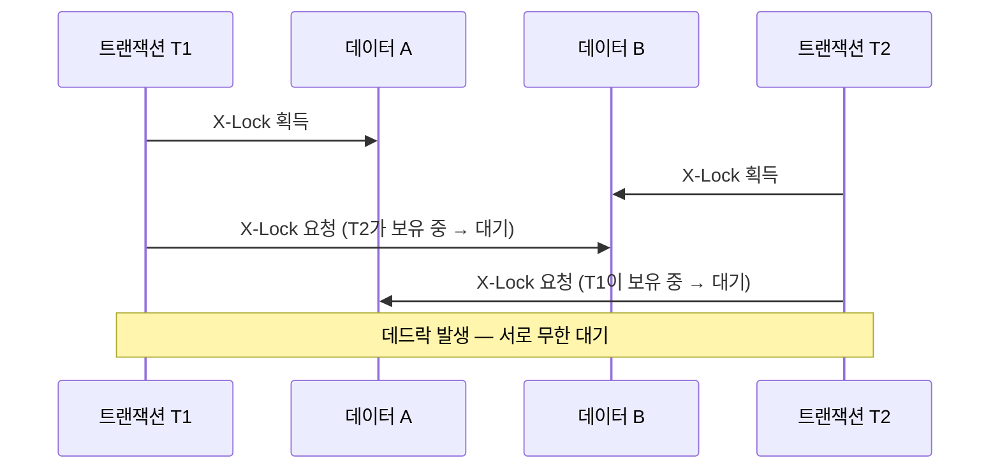
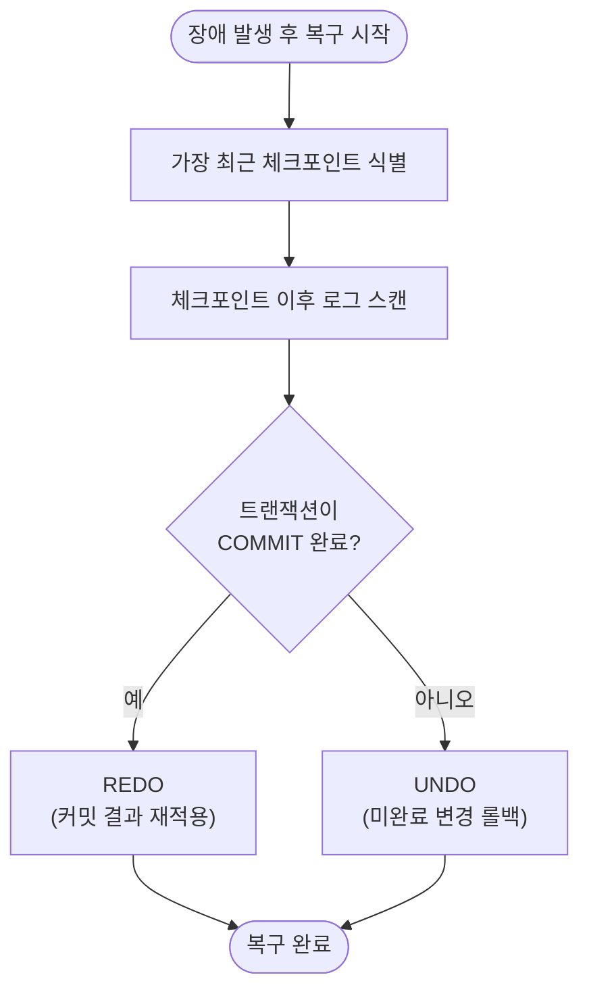
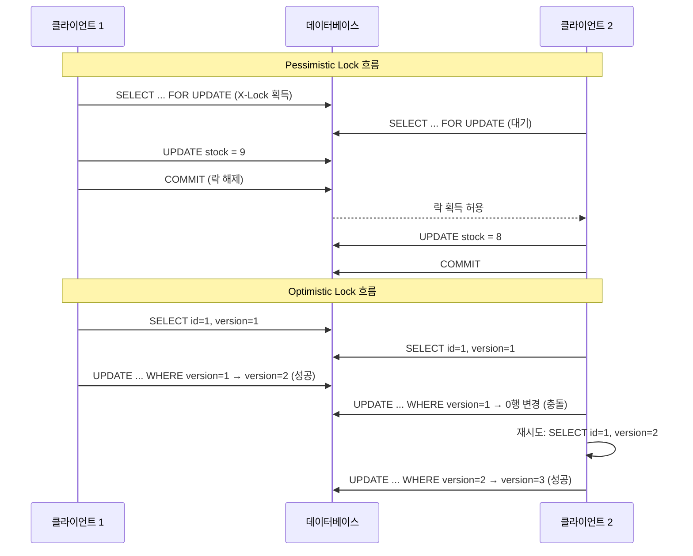
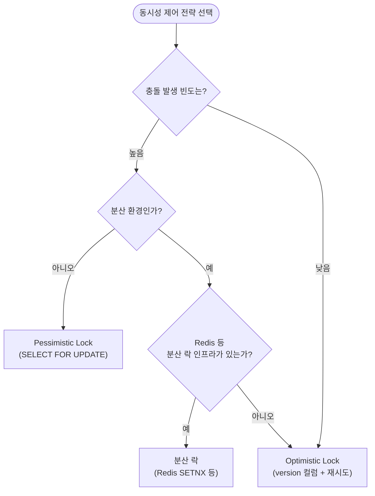

# 트랜잭션과 동시성

::: info 학습 목표
- 트랜잭션의 정의와 ACID 특성 4가지를 설명할 수 있다.
- 격리 수준 4단계와 각 수준에서 발생하는 이상 현상(Dirty Read, Non-Repeatable Read, Phantom Read)을 구분할 수 있다.
- 로킹, 2PL, MVCC의 동작 원리와 데드락 해결 방법을 설명할 수 있다.
- REDO/UNDO, WAL, 체크포인트를 이용한 회복 기법을 설명할 수 있다.
:::

---

## 1. 트랜잭션과 ACID

### 트랜잭션이란

트랜잭션(Transaction)은 데이터베이스에서 하나의 <strong>논리적 작업 단위</strong>로 취급되는 연산의 집합이다. 계좌 이체를 예로 들면, "A 계좌에서 10만 원 차감 + B 계좌에 10만 원 추가"는 두 개의 SQL이지만 반드시 함께 성공하거나 함께 실패해야 하는 하나의 트랜잭션이다.

### ACID 특성

| 특성 | 영문 | 설명 |
|------|------|------|
| 원자성 | Atomicity | 트랜잭션의 모든 연산은 전부 실행되거나 전혀 실행되지 않아야 한다. |
| 일관성 | Consistency | 트랜잭션 실행 전후에 데이터베이스는 항상 일관된 상태를 유지해야 한다. |
| 격리성 | Isolation | 동시에 실행되는 트랜잭션은 서로 간섭하지 않아야 한다. |
| 지속성 | Durability | 커밋된 트랜잭션의 결과는 장애가 발생해도 영구적으로 보존되어야 한다. |

### COMMIT / ROLLBACK / SAVEPOINT

```sql
START TRANSACTION;

UPDATE accounts SET balance = balance - 100000 WHERE id = 1;
SAVEPOINT after_debit;          -- 중간 저장점

UPDATE accounts SET balance = balance + 100000 WHERE id = 2;

-- 두 번째 UPDATE가 실패하면
ROLLBACK TO SAVEPOINT after_debit;   -- after_debit 시점으로만 롤백

-- 모든 작업이 성공하면
COMMIT;
```

- `COMMIT`: 트랜잭션의 모든 변경을 영구 반영한다.
- `ROLLBACK`: 트랜잭션의 모든 변경을 취소하고 이전 상태로 되돌린다.
- `SAVEPOINT`: 트랜잭션 내에 중간 복귀 지점을 설정한다.

---

## 2. 격리 수준

### 이상 현상(Anomalies)

동시에 여러 트랜잭션이 실행될 때 격리가 불완전하면 다음 세 가지 이상 현상이 발생할 수 있다.

| 이상 현상 | 설명 |
|----------|------|
| <strong>Dirty Read</strong> | 아직 커밋되지 않은 다른 트랜잭션의 변경 데이터를 읽는다. |
| <strong>Non-Repeatable Read</strong> | 같은 트랜잭션 내에서 같은 행을 두 번 읽었는데 결과가 달라진다(중간에 다른 트랜잭션이 수정·커밋). |
| <strong>Phantom Read</strong> | 같은 트랜잭션 내에서 같은 조건으로 두 번 조회했는데 행의 개수가 달라진다(중간에 다른 트랜잭션이 삽입·삭제·커밋). |

### 격리 수준 4단계

SQL 표준은 격리 수준을 4단계로 정의한다.

| 격리 수준 | Dirty Read | Non-Repeatable Read | Phantom Read |
|----------|-----------|---------------------|-------------|
| READ UNCOMMITTED | 발생 | 발생 | 발생 |
| READ COMMITTED | 방지 | 발생 | 발생 |
| REPEATABLE READ | 방지 | 방지 | 발생(MySQL InnoDB는 MVCC로 방지) |
| SERIALIZABLE | 방지 | 방지 | 방지 |

- <strong>READ UNCOMMITTED</strong>: 커밋되지 않은 데이터도 읽는다. 성능은 가장 높지만 데이터 정합성이 가장 낮다.
- <strong>READ COMMITTED</strong>: 커밋된 데이터만 읽는다. Oracle, PostgreSQL의 기본값.
- <strong>REPEATABLE READ</strong>: 트랜잭션 시작 시점의 스냅샷을 기준으로 읽는다. MySQL InnoDB의 기본값.
- <strong>SERIALIZABLE</strong>: 트랜잭션을 순차적으로 실행한 것과 동일한 결과를 보장한다. 가장 안전하지만 성능 비용이 크다.

---

## 3. 병행 제어 기법

### 로킹(Locking)

로킹은 데이터 항목에 잠금(Lock)을 걸어 동시 접근을 제어하는 기법이다.

- <strong>공유 락(Shared Lock, S-Lock)</strong>: 읽기용 잠금. 여러 트랜잭션이 동시에 S-Lock을 획득할 수 있다.
- <strong>배타 락(Exclusive Lock, X-Lock)</strong>: 쓰기용 잠금. X-Lock을 보유한 동안 다른 트랜잭션은 S-Lock도 X-Lock도 획득할 수 없다.

| 요청 락 \ 보유 락 | S-Lock | X-Lock |
|----------------|--------|--------|
| S-Lock | 허용 | 대기 |
| X-Lock | 대기 | 대기 |

### 2단계 로킹(2PL, Two-Phase Locking)

2PL 프로토콜은 트랜잭션의 락 획득과 해제를 두 단계로 구분한다.

1. <strong>확장 단계(Growing Phase)</strong>: 락을 획득만 하고 해제하지 않는다.
2. <strong>수축 단계(Shrinking Phase)</strong>: 락을 해제만 하고 새로 획득하지 않는다.

2PL을 준수하면 직렬 가능성(Serializability)을 보장할 수 있다. 단, 데드락이 발생할 수 있다.

### 타임스탬프 기법

각 트랜잭션에 고유한 타임스탬프를 부여하고, 오래된 트랜잭션이 우선권을 갖도록 충돌을 해결한다. 락을 사용하지 않아 데드락이 없지만, 트랜잭션이 자주 롤백될 수 있다.

### 낙관적 기법(Optimistic Concurrency Control)

충돌이 드물다는 가정 하에 락 없이 진행하고, 커밋 직전 검증(Validation) 단계에서 충돌을 감지한다. 충돌 감지 시 롤백한다. 읽기 중심의 워크로드에 효율적이다.

### MVCC(Multi-Version Concurrency Control)

MVCC는 데이터의 여러 버전을 동시에 유지하여 읽기와 쓰기가 서로 블로킹하지 않도록 하는 기법이다.

- 트랜잭션 시작 시 스냅샷(Snapshot)을 생성한다.
- 읽기 시 자신의 스냅샷 기준으로 커밋된 최신 버전을 읽는다.
- 쓰기 시 새로운 버전을 생성하며, 기존 버전은 다른 트랜잭션을 위해 일정 시간 보존된다.
- 읽기가 쓰기를 블로킹하지 않고, 쓰기가 읽기를 블로킹하지 않는다.

InnoDB는 MVCC를 언두 로그(Undo Log)로 구현한다. 각 행에 변경 이력을 연결 리스트 형태로 보관한다.

### 데드락(Deadlock)

데드락은 두 개 이상의 트랜잭션이 서로 상대방이 보유한 락을 기다리며 무한 대기하는 상태다.



데드락 발생 4가지 필요 조건(Coffman 조건): 상호 배제, 점유 대기, 비선점, 순환 대기. 이 중 하나를 깨면 데드락을 방지할 수 있다.

데드락 해결 알고리즘:

| 알고리즘 | 설명 |
|---------|------|
| <strong>Wait-Die</strong> | 오래된 트랜잭션은 기다리고(Wait), 젊은 트랜잭션은 롤백(Die). 선점 없음. |
| <strong>Wound-Wait</strong> | 오래된 트랜잭션이 젊은 트랜잭션을 강제 롤백(Wound), 젊은 트랜잭션은 기다림(Wait). |
| 데드락 탐지 후 롤백 | 대기 그래프(Wait-for Graph)에서 사이클을 탐지하면 비용이 낮은 트랜잭션을 희생(victim)으로 선택해 롤백. |

---

## 4. 회복 기법

### REDO와 UNDO

| 기법 | 대상 | 목적 |
|------|------|------|
| <strong>REDO</strong>(재실행) | 커밋된 트랜잭션 | 장애 전 커밋이 완료되었으나 디스크에 반영되지 않은 변경을 재적용한다. |
| <strong>UNDO</strong>(취소) | 미커밋 트랜잭션 | 장애 시점에 아직 커밋되지 않은 트랜잭션의 변경을 롤백하여 원상 복구한다. |

### WAL(Write-Ahead Logging)

WAL 원칙은 실제 데이터 페이지를 디스크에 쓰기 전에 반드시 로그를 먼저 디스크에 기록한다는 규칙이다.

```
로그 기록(디스크) → 데이터 변경(버퍼) → 데이터 플러시(디스크)
```

WAL이 보장하는 것:
- 로그가 먼저 안전하게 보존되므로 장애 후 REDO/UNDO로 복구가 가능하다.
- 데이터 페이지는 랜덤 I/O이지만 로그는 순차 I/O이므로 성능도 우수하다.

### 체크포인트(Checkpoint)

장애 후 복구 시 처음부터 모든 로그를 재처리하면 시간이 너무 오래 걸린다. 체크포인트는 주기적으로 버퍼의 모든 더티 페이지를 디스크에 강제 기록하고 그 시점을 로그에 표시한다. 복구 시 가장 최근 체크포인트 이후의 로그만 처리하면 된다.

### 회복 판단 흐름



---

## 5. 애플리케이션 레벨 락: Optimistic vs Pessimistic

CH11 §3의 병행 제어는 DBMS 내부 메커니즘이다. 실무에서는 애플리케이션 코드에서도 동시성을 제어해야 한다. 대표적인 두 가지 전략이 낙관적 락과 비관적 락이다.

### Pessimistic Lock (비관적 락)

"충돌이 자주 발생할 것"이라고 가정하고 데이터를 읽는 시점에 미리 락을 건다.

- `SELECT FOR UPDATE`로 행에 배타적 락을 건다.
- 다른 트랜잭션은 락이 풀릴 때까지 대기한다.
- 장점: 충돌을 원천 차단하여 데이터 정합성이 높다.
- 단점: 대기 시간 발생, 데드락 위험, 처리량 저하.

```sql
-- 비관적 락 예제: 락을 걸고 재고를 차감한다
START TRANSACTION;
SELECT * FROM products WHERE id = 1 FOR UPDATE;
UPDATE products SET stock = stock - 1 WHERE id = 1;
COMMIT;
```

### Optimistic Lock (낙관적 락)

"충돌이 드물 것"이라고 가정하고 락 없이 진행한 뒤, 커밋 시점에 충돌 여부를 검증한다.

- `version` 컬럼(또는 `updated_at`)을 사용한다.
- `UPDATE` 시 `version`을 조건에 포함한다. 변경되었으면 실패 → 재시도.
- JPA에서는 `@Version` 어노테이션으로 자동 처리한다.
- 장점: 락 없이 동작하여 처리량이 높다.
- 단점: 충돌 시 재시도 로직이 필요하고, 충돌이 빈번하면 오히려 비효율적이다.

```sql
-- 낙관적 락 예제: version이 일치할 때만 업데이트한다
UPDATE products
SET stock = stock - 1, version = version + 1
WHERE id = 1 AND version = 1;
-- 영향받은 행이 0이면 충돌 → 애플리케이션에서 재시도
```

### 두 방식의 흐름 비교



### 선택 기준

| 상황 | 권장 전략 |
|------|----------|
| 재고 차감, 좌석 예약 등 충돌 빈도가 높은 경우 | Pessimistic Lock |
| 게시글 수정, 프로필 변경 등 충돌 빈도가 낮은 경우 | Optimistic Lock |
| 분산 환경에서 DB 락 사용이 어려운 경우 | Optimistic Lock |
| 트랜잭션 시간이 길어 락 보유 시간이 긴 경우 | Optimistic Lock |



---

::: tip 핵심 정리
- 트랜잭션은 논리적 작업 단위이며 ACID(원자성, 일관성, 격리성, 지속성)를 보장해야 한다.
- 격리 수준은 READ UNCOMMITTED < READ COMMITTED < REPEATABLE READ < SERIALIZABLE 순으로 높아지며, 높을수록 이상 현상은 줄고 성능 비용은 커진다.
- MVCC는 데이터 버전 관리로 읽기와 쓰기 간 블로킹을 제거하며, InnoDB는 언두 로그로 구현한다.
- WAL은 로그를 데이터보다 먼저 디스크에 기록하는 원칙으로, REDO/UNDO 기반 회복의 근거가 된다.
:::

## 다음 챕터

- 다음 : [실행 계획](/study/database/12-execution-plan)
