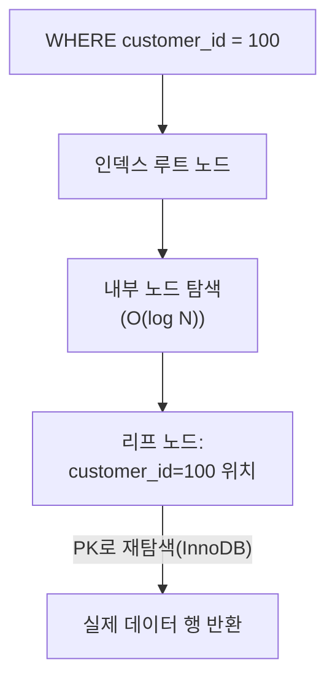
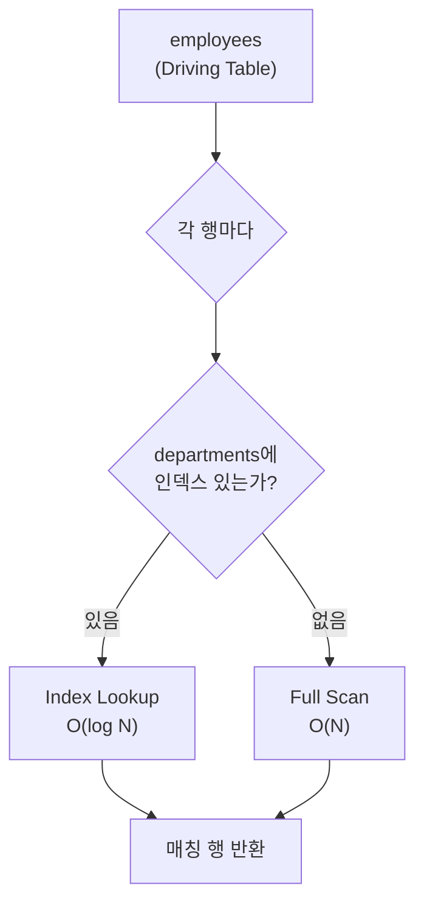
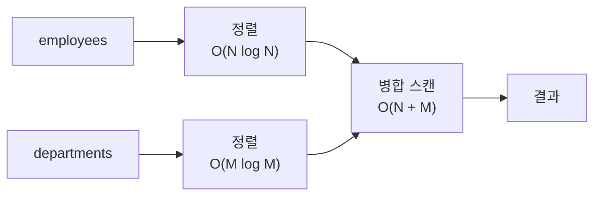
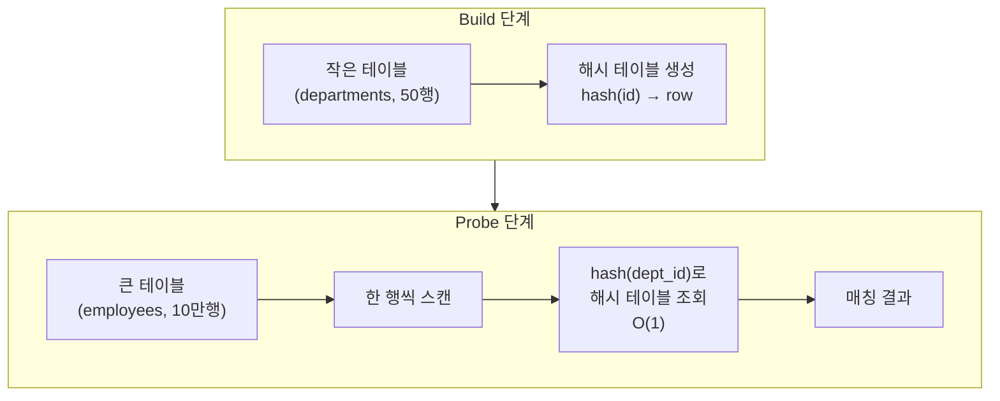
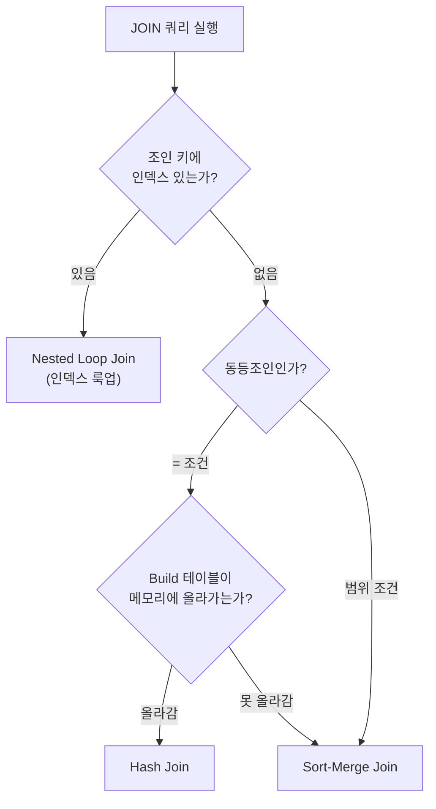

# 실행 계획

::: info 학습 목표
- 규칙 기반 옵티마이저(RBO)와 비용 기반 옵티마이저(CBO)의 차이를 설명할 수 있다.
- EXPLAIN 결과의 주요 컬럼(type, key, rows, Extra)을 해석할 수 있다.
- 접근 방법(ALL, index, range, ref, eq_ref, const)의 성능 차이를 설명할 수 있다.
- 인덱스 추가 전후 EXPLAIN 결과 변화를 분석할 수 있다.
:::

---

## 1. 옵티마이저

### 옵티마이저란

옵티마이저(Query Optimizer)는 SQL 쿼리를 받아 실제 실행 계획(Execution Plan)을 결정하는 DBMS 내부 컴포넌트다. 같은 결과를 반환하는 여러 실행 방법 중에서 비용이 가장 낮은 방법을 선택한다.

### 규칙 기반 옵티마이저(RBO)

규칙 기반 옵티마이저(Rule-Based Optimizer)는 미리 정해진 우선순위 규칙에 따라 실행 계획을 선택한다. 통계 정보를 사용하지 않고 규칙만으로 판단하므로 단순하지만 데이터 분포를 반영하지 못한다. 오래된 Oracle 버전에서 사용했으며 현재는 거의 쓰이지 않는다.

### 비용 기반 옵티마이저(CBO)

비용 기반 옵티마이저(Cost-Based Optimizer)는 통계 정보를 활용하여 각 실행 방법의 예상 비용(디스크 I/O, CPU 연산량 등)을 계산하고 비용이 최소인 계획을 선택한다. MySQL, PostgreSQL, Oracle 최신 버전 모두 CBO를 사용한다.

옵티마이저가 사용하는 주요 통계 정보:

| 통계 항목 | 설명 |
|----------|------|
| <strong>카디널리티(Cardinality)</strong> | 컬럼의 고유값 수. 높을수록 인덱스 효율이 높다. |
| <strong>선택도(Selectivity)</strong> | 조건을 만족하는 행의 비율. 낮을수록 인덱스가 유리하다. |
| 테이블 행 수 | 전체 데이터 규모 추정 기반 |
| 인덱스 깊이 | B+Tree 높이로 탐색 비용 추정 |

MySQL에서는 `ANALYZE TABLE` 명령으로 통계 정보를 갱신할 수 있다.

### 옵티마이저가 하는 일

- <strong>조인 순서 결정</strong>: 여러 테이블을 조인할 때 어떤 테이블을 먼저 읽을지 결정한다.
- <strong>인덱스 선택</strong>: 여러 인덱스 중 어떤 인덱스를 사용할지 결정한다.
- <strong>접근 방법 결정</strong>: 풀 테이블 스캔, 인덱스 스캔, 인덱스 룩업 등 데이터 접근 방법을 선택한다.

---

## 2. EXPLAIN 읽기

### EXPLAIN 사용법

```sql
EXPLAIN SELECT * FROM orders WHERE customer_id = 100;
```

`EXPLAIN` 앞에 붙이면 쿼리를 실행하지 않고 실행 계획만 출력한다.

### 주요 컬럼 설명

| 컬럼 | 설명 |
|------|------|
| `id` | SELECT 식별자. 서브쿼리가 있으면 각기 다른 id를 가진다. |
| `select_type` | SELECT의 유형. SIMPLE(단순 쿼리), PRIMARY(최외곽), SUBQUERY, DERIVED 등 |
| `table` | 접근하는 테이블 이름 |
| `type` | 접근 방법(Access Type). 성능에 가장 직접적인 영향을 미치는 컬럼 |
| `possible_keys` | 사용 가능한 인덱스 목록 |
| `key` | 실제로 선택된 인덱스 |
| `key_len` | 사용된 인덱스의 바이트 수 |
| `rows` | 옵티마이저가 예상하는 검사 행 수(실제 수가 아닌 추정치) |
| `filtered` | rows 중 WHERE 조건을 통과할 것으로 예상되는 비율(%) |
| `Extra` | 추가 정보. Using index, Using filesort, Using temporary 등 |

### type 컬럼 성능 순서

```
const > eq_ref > ref > range > index > ALL
(빠름 ←————————————————————————→ 느림)
```

| type 값 | 설명 |
|---------|------|
| `const` | PK 또는 UNIQUE 인덱스를 상수값으로 정확히 1행 조회. 가장 빠름. |
| `eq_ref` | 조인에서 드리븐 테이블을 PK/UNIQUE 인덱스로 1행씩 조회. |
| `ref` | 비고유(Non-Unique) 인덱스를 이용한 동등 조회. 여러 행이 반환될 수 있음. |
| `range` | 인덱스를 이용한 범위 스캔(BETWEEN, >, <, IN 등). |
| `index` | 인덱스 전체 스캔. 풀 테이블 스캔보다 낫지만 인덱스가 크면 느릴 수 있음. |
| `ALL` | 풀 테이블 스캔. 인덱스를 전혀 사용하지 않음. 가장 느림. |

### Extra 컬럼 주요 값

| Extra 값 | 설명 |
|----------|------|
| `Using index` | 인덱스만으로 쿼리 완성(커버링 인덱스). 테이블 접근 없음. 매우 좋음. |
| `Using where` | 스토리지 엔진에서 읽은 행에 MySQL이 추가 WHERE 필터링을 적용함. |
| `Using filesort` | 인덱스를 사용하지 못하고 별도 정렬 처리가 필요함. 성능에 나쁜 신호. |
| `Using temporary` | 임시 테이블 사용(GROUP BY, DISTINCT 등). 성능에 나쁜 신호. |
| `Using index condition` | 인덱스 컨디션 푸시다운(ICP) 적용. 스토리지 엔진 수준에서 필터링. |

---

## 3. 접근 방법(Access Type)

### Full Table Scan (ALL)

테이블의 모든 페이지를 처음부터 끝까지 순차적으로 읽는다. 인덱스가 없거나 옵티마이저가 인덱스보다 풀 스캔이 낫다고 판단할 때 발생한다.


풀 스캔이 나쁜 이유: 테이블이 클수록 읽어야 할 페이지가 선형으로 증가한다. 1억 건 테이블에서 조건에 맞는 10건을 찾으려 해도 모든 페이지를 읽어야 한다.

### Index Scan (index)

인덱스 트리 전체를 순회한다. 테이블 전체를 읽는 것보다 인덱스가 작아서 빠를 수 있지만, 본질적으로 전체 스캔이므로 데이터가 많으면 느리다.

### Range Scan (range)

인덱스에서 특정 범위에 해당하는 리프 노드 구간만 스캔한다. `BETWEEN`, `>`, `<`, `IN`, `LIKE 'prefix%'` 조건에서 발생한다. 범위가 좁을수록 효율적이다.

### Index Lookup (ref, eq_ref, const)



동등 조건(`=`)으로 인덱스를 탐색하여 정확한 위치로 직접 이동한다. 트리 높이만큼만 I/O가 발생하므로 매우 효율적이다.

### 왜 ALL이 나쁜가

단순 성능 문제를 넘어, 풀 테이블 스캔은 많은 페이지를 버퍼 풀에 올리므로 다른 쿼리가 사용하던 캐시를 밀어낼 수 있다. 동시 요청이 많은 운영 환경에서 ALL 타입 쿼리 하나가 전체 DB 성능을 저하시킬 수 있다.

---

## 4. 실습: EXPLAIN으로 쿼리 분석

### 테스트 환경 준비

```sql
-- 테스트 테이블 생성
CREATE TABLE orders (
    id          INT          NOT NULL AUTO_INCREMENT,
    customer_id INT          NOT NULL,
    status      VARCHAR(20)  NOT NULL,
    amount      DECIMAL(10,2) NOT NULL,
    created_at  DATETIME     NOT NULL,
    PRIMARY KEY (id)
);

-- 샘플 데이터 삽입 (10만 건)
INSERT INTO orders (customer_id, status, amount, created_at)
SELECT
    FLOOR(RAND() * 10000) + 1,
    ELT(FLOOR(RAND() * 3) + 1, 'PENDING', 'DONE', 'CANCELLED'),
    ROUND(RAND() * 100000, 2),
    NOW() - INTERVAL FLOOR(RAND() * 365) DAY
FROM information_schema.columns c1
CROSS JOIN information_schema.columns c2
LIMIT 100000;
```

### 인덱스 없는 상태에서 EXPLAIN

```sql
EXPLAIN SELECT * FROM orders WHERE customer_id = 42;
```

```
+----+-------------+--------+------+---------------+------+------+-------+
| id | select_type | table  | type | possible_keys | key  | rows | Extra |
+----+-------------+--------+------+---------------+------+------+-------+
|  1 | SIMPLE      | orders | ALL  | NULL          | NULL | 99856|Using where|
+----+-------------+--------+------+---------------+------+------+-------+
```

`type = ALL`, `key = NULL`: 인덱스 없이 약 10만 행 전체를 스캔한다.

### 인덱스 추가

```sql
CREATE INDEX idx_customer_id ON orders (customer_id);
```

### 인덱스 추가 후 EXPLAIN

```sql
EXPLAIN SELECT * FROM orders WHERE customer_id = 42;
```

```
+----+-------------+--------+------+-----------------+-----------------+------+-------+
| id | select_type | table  | type | possible_keys   | key             | rows | Extra |
+----+-------------+--------+------+-----------------+-----------------+------+-------+
|  1 | SIMPLE      | orders | ref  | idx_customer_id | idx_customer_id |   10 |       |
+----+-------------+--------+------+-----------------+-----------------+------+-------+
```

`type = ref`, `key = idx_customer_id`: 인덱스를 사용하여 약 10건만 읽는다.

### 전후 비교

| 항목 | 인덱스 없음 | 인덱스 있음 |
|------|-----------|-----------|
| type | ALL | ref |
| 예상 rows | 99,856 | 10 |
| 사용 인덱스 | NULL | idx_customer_id |
| 디스크 I/O | 전체 페이지 스캔 | 트리 탐색 + 소수 페이지 |

---

## 5. 물리적 조인 알고리즘

옵티마이저는 JOIN을 실행할 때 세 가지 알고리즘 중 하나를 선택한다. 관계 대수의 조인(세타조인, 자연조인 등)이 "무엇을 결합하는가"라면, 물리적 조인 알고리즘은 "어떻게 결합하는가"에 해당한다.

### Nested Loop Join (중첩 반복)

바깥 테이블(Driving Table)의 각 행마다 안쪽 테이블(Driven Table)을 탐색한다. 이중 for문과 같은 원리다.

```
employees (10행) × departments (5행)

for each row in employees:         -- 바깥: 10번 반복
    for each row in departments:   -- 안쪽: 매번 5번 반복
        if employees.dept_id = departments.id:
            결과에 추가

→ 총 비교 횟수: 10 × 5 = 50회
```

안쪽 테이블에 인덱스가 있으면 매번 풀 스캔 대신 인덱스 룩업(O(log N))으로 대체할 수 있다. 이를 <strong>Index Nested Loop Join</strong>이라 한다.

```
Index Nested Loop:

for each row in employees:         -- 바깥: 10번 반복
    index_lookup(departments.id)   -- 안쪽: O(log 5) ≈ 3회
        if 매치: 결과에 추가

→ 총 비교 횟수: 10 × 3 = 30회 (풀 스캔 50회보다 적음)
```



**EXPLAIN에서의 표시**: `type: eq_ref` 또는 `type: ref` + `Extra: Using join buffer`가 아닌 경우

**적합한 상황**:
- 한쪽 테이블이 작을 때 (바깥 테이블)
- 안쪽 테이블에 조인 키 인덱스가 있을 때
- MySQL InnoDB는 대부분의 조인에서 이 방식을 기본으로 사용한다

---

### Sort-Merge Join (정렬 병합)

두 테이블을 조인 키로 각각 정렬한 뒤, 양쪽을 동시에 순차 스캔하며 매칭한다. 두 줄로 나란히 서 있는 학생 명단을 이름순으로 대조하는 것과 같다.

```
1단계 — 정렬:
  employees:   [1, 3, 5, 7, 9]     ← dept_id 기준 정렬
  departments: [1, 2, 3, 5, 7, 9]  ← id 기준 정렬

2단계 — 병합:
  포인터 A → employees[0] = 1
  포인터 B → departments[0] = 1  → 매치! 결과 추가
  포인터 A → employees[1] = 3
  포인터 B → departments[1] = 2  → 2 < 3, B 전진
  포인터 B → departments[2] = 3  → 매치! 결과 추가
  ...

→ 정렬 후 한 번의 스캔으로 완료 (각 포인터는 앞으로만 이동)
```



**EXPLAIN에서의 표시**: PostgreSQL에서 `Merge Join`, MySQL에서는 직접 지원하지 않음 (ORDER BY 후 Nested Loop로 처리)

**적합한 상황**:
- 대용량 테이블 양쪽 모두 인덱스가 없을 때
- 조인 키로 이미 정렬되어 있을 때 (인덱스 스캔 순서와 일치)
- 범위 조인(θ-Join)에서도 사용 가능
- PostgreSQL, Oracle에서 주로 사용

---

### Hash Join (해시)

작은 쪽 테이블로 메모리에 해시 테이블을 만들고(Build), 큰 쪽 테이블을 스캔하며 해시 테이블에서 매칭한다(Probe).

```
예시: employees(10만 행) JOIN departments(50행) ON dept_id = id

1단계 — Build: 작은 테이블(departments)로 해시 테이블 생성
  hash(1) → {id:1, name:"영업부"}
  hash(2) → {id:2, name:"개발부"}
  hash(3) → {id:3, name:"인사부"}
  ...
  → 메모리에 50개 엔트리 생성

2단계 — Probe: 큰 테이블(employees)을 한 행씩 스캔
  for each row in employees:
      key = hash(row.dept_id)
      해시 테이블에서 key 검색 → O(1) 매칭
      매치되면 결과에 추가

→ 총 비교: 해시 테이블 생성 O(50) + 프로브 O(100,000) = O(100,050)
   (Nested Loop라면 100,000 × 50 = 5,000,000회)
```



**EXPLAIN에서의 표시**: `Hash Join` (MySQL 8.0.18+, PostgreSQL)

**적합한 상황**:
- 대용량 테이블 간 동등조인(`=`)
- 조인 키에 인덱스가 없을 때
- 한쪽 테이블이 메모리에 올라갈 수 있을 때

**제약**:
- 동등조인(`=`)에서만 사용 가능 (범위 비교 `>`, `<` 불가)
- Build 테이블이 메모리를 초과하면 디스크로 스필(Spill)이 발생하여 느려진다

---

### 세 알고리즘 비교

| 항목 | Nested Loop | Sort-Merge | Hash Join |
|------|------------|------------|-----------|
| 시간 복잡도 | O(N × M) | O(N log N + M log M) | O(N + M) |
| 인덱스 필요 | 있으면 매우 유리 | 불필요 | 불필요 |
| 조인 조건 | 모든 조건 가능 | 모든 조건 가능 | 동등조인(`=`)만 |
| 메모리 | 적게 사용 | 정렬 버퍼 필요 | 해시 테이블 메모리 필요 |
| 적합한 규모 | 소량 또는 인덱스 있을 때 | 대량 + 이미 정렬 | 대량 + 인덱스 없음 |
| MySQL | 기본 사용 | 미지원 | 8.0.18+ 지원 |
| PostgreSQL | 지원 | 지원 | 지원 |

### 옵티마이저의 선택 기준



실제로는 옵티마이저가 통계 정보(행 수, 카디널리티, 메모리 크기)를 바탕으로 각 알고리즘의 예상 비용을 계산하여 가장 저렴한 방법을 선택한다. EXPLAIN 결과에서 어떤 알고리즘이 선택되었는지 확인할 수 있다.

---

::: tip 핵심 정리
- CBO는 카디널리티, 선택도, 행 수 등 통계 정보를 바탕으로 최저 비용의 실행 계획을 선택한다.
- EXPLAIN의 `type` 컬럼에서 `const > eq_ref > ref > range > index > ALL` 순으로 성능이 좋으며, `ALL`은 풀 테이블 스캔이다.
- `Extra: Using index`는 커버링 인덱스, `Using filesort`/`Using temporary`는 성능 경고 신호다.
- 인덱스 추가 전후 EXPLAIN을 비교하면 `type`이 ALL에서 ref로 변하고 `rows`가 극적으로 감소한다.
- 물리적 조인 알고리즘: Nested Loop(인덱스 있을 때), Hash Join(대용량 동등조인), Sort-Merge(대용량 정렬 데이터).
- 옵티마이저가 인덱스 유무, 테이블 크기, 조인 조건을 보고 알고리즘을 자동 선택한다.
:::

## 다음 챕터

- 다음 : [인덱스 전략](/study/database/13-index-strategy)
