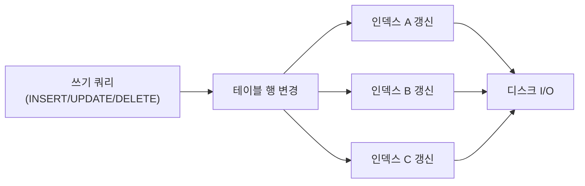
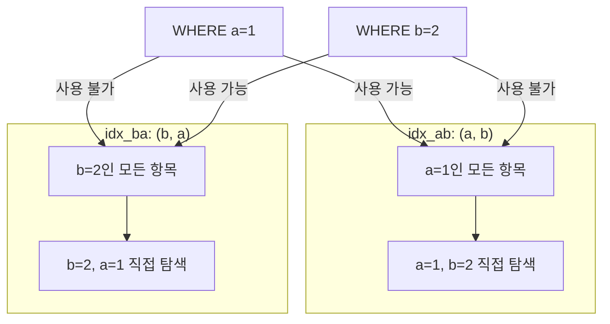

# 인덱스 전략

::: info 학습 목표
- 인덱스가 빠른 이유와 인덱스 유지 비용(쓰기 오버헤드)을 설명할 수 있다.
- 복합 인덱스의 최좌선 접두사(Leftmost Prefix) 규칙을 이해하고 컬럼 순서 선택 근거를 설명할 수 있다.
- 커버링 인덱스의 동작 원리와 EXPLAIN에서 확인 방법을 설명할 수 있다.
- 인덱스 설계 원칙과 주요 안티패턴을 설명할 수 있다.
:::

---

## 1. 인덱스 기본 원리

### 왜 인덱스가 빠른가

인덱스가 없는 테이블에서 특정 행을 찾으려면 처음부터 끝까지 모든 행을 확인해야 한다(Full Table Scan, O(N)). B+Tree 인덱스를 사용하면 트리 높이만큼만 노드를 이동하여 원하는 위치를 찾는다.

```
테이블 행 수(N)    트리 높이(≈ log_m N, m = 차수)
1,000             ~3
100,000           ~4
10,000,000        ~5
1,000,000,000     ~6
```

페이지 하나에 수백 개의 키를 저장하는 B+Tree는 실제로 수백만 건 테이블도 3~5번의 페이지 읽기로 탐색을 완료한다. 이것이 인덱스의 핵심 이점이다.

### 인덱스의 비용

인덱스는 공짜가 아니다. 다음과 같은 비용이 따른다.

| 작업 | 인덱스 없음 | 인덱스 있음 |
|------|-----------|-----------|
| INSERT | 테이블에만 쓰기 | 테이블 + 모든 인덱스 갱신 |
| UPDATE(인덱스 컬럼) | 테이블만 수정 | 인덱스 삭제 후 재삽입 |
| DELETE | 테이블에서만 삭제 | 테이블 + 인덱스에서 모두 삭제 |
| 저장 공간 | 테이블만 | 테이블 + 인덱스 파일 |

인덱스가 많을수록 쓰기 성능은 저하된다. 읽기 빈도가 높고 쓰기 빈도가 낮은 컬럼에 인덱스를 만드는 것이 합리적이다.

### 무조건 만드는 게 정답이 아닌 이유



인덱스가 10개인 테이블에 INSERT 하나를 실행하면 내부적으로 최대 11번의 B+Tree 갱신이 발생한다. 이커머스처럼 주문이 초당 수천 건씩 들어오는 환경에서 과도한 인덱스는 오히려 심각한 성능 문제를 유발한다.

---

## 2. 복합 인덱스(Composite Index)

### 복합 인덱스란

두 개 이상의 컬럼을 조합하여 만드는 인덱스다.

```sql
-- (last_name, first_name) 복합 인덱스
CREATE INDEX idx_name ON employees (last_name, first_name);
```

B+Tree는 첫 번째 키로 정렬한 뒤, 같은 첫 번째 키 안에서 두 번째 키로 정렬하는 방식으로 저장된다.

### 최좌선 접두사(Leftmost Prefix) 규칙

복합 인덱스 `(a, b, c)`는 다음 조건에서 인덱스를 사용할 수 있다.

| WHERE 조건 | 인덱스 사용 여부 |
|-----------|----------------|
| `WHERE a = 1` | 사용(a만 사용) |
| `WHERE a = 1 AND b = 2` | 사용(a, b 사용) |
| `WHERE a = 1 AND b = 2 AND c = 3` | 사용(a, b, c 모두 사용) |
| `WHERE b = 2` | 미사용(a가 없으므로) |
| `WHERE b = 2 AND c = 3` | 미사용(a가 없으므로) |
| `WHERE a = 1 AND c = 3` | 부분 사용(a만 사용, c는 인덱스 범위 내 필터링) |
| `WHERE a = 1 AND b > 2 AND c = 3` | 부분 사용(a, b까지만, c는 미사용) |

범위 조건(>, <, BETWEEN, LIKE) 이후의 컬럼은 인덱스를 활용하지 못한다.

### (a, b) vs (b, a) 차이

`WHERE a = 1 AND b = 2` 쿼리에서 두 인덱스 모두 사용 가능하다. 그러나 `WHERE a = 1`만 있는 쿼리는 `(a, b)` 인덱스만 사용할 수 있고, `WHERE b = 2`만 있는 쿼리는 `(b, a)` 인덱스만 사용할 수 있다.



실무 원칙: <strong>더 자주 단독으로 사용되는 컬럼을 앞에</strong> 배치한다.

---

## 3. 커버링 인덱스

### 커버링 인덱스란

커버링 인덱스(Covering Index)는 쿼리에서 필요한 모든 컬럼이 인덱스 안에 포함되어, 테이블 데이터에 접근하지 않고 인덱스만으로 쿼리를 완성할 수 있는 인덱스다.

### 일반 인덱스 vs 커버링 인덱스

```sql
-- 테이블: orders(id PK, customer_id, status, amount, created_at)
-- 인덱스: idx_customer_id ON (customer_id)

-- 일반 인덱스 조회: customer_id로 인덱스 탐색 후 테이블 접근하여 amount를 읽어야 함
SELECT amount FROM orders WHERE customer_id = 100;

-- 커버링 인덱스 조회: 인덱스에 customer_id와 amount가 모두 있으면 테이블 접근 불필요
-- idx_covering: (customer_id, amount)
SELECT amount FROM orders WHERE customer_id = 100;
```

커버링 인덱스를 적용하면:

1. 인덱스 트리를 탐색하여 `customer_id = 100`인 리프 노드 위치를 찾는다.
2. 리프 노드에 `amount` 값이 이미 있으므로 테이블을 읽지 않고 바로 반환한다.
3. 랜덤 I/O(테이블 접근)가 없으므로 성능이 크게 향상된다.

### EXPLAIN에서 확인

```sql
EXPLAIN SELECT amount FROM orders WHERE customer_id = 100;
```

```
+------+-------------+--------+------+------------------+------------------+------+---------------+
| type | possible_keys| key    | rows | Extra                                                   |
+------+-------------+--------+------+----------------------------------------------+----------+
| ref  | idx_covering | idx_covering | 10 | Using index                              |
+------+-------------+--------+------+------------------+------------------+------+---------------+
```

`Extra: Using index`가 표시되면 커버링 인덱스가 적용된 것이다. 테이블을 전혀 읽지 않는다.

### 커버링 인덱스 적용 기준

- SELECT 컬럼이 적고 WHERE 컬럼과 함께 인덱스로 묶을 수 있을 때
- 조회 빈도가 매우 높은 쿼리
- 테이블이 커서 랜덤 I/O 비용이 클 때

---

## 4. 인덱스 설계 원칙

### 좋은 인덱스를 만드는 원칙

| 원칙 | 설명 |
|------|------|
| <strong>카디널리티 높은 컬럼 우선</strong> | 고유값이 많은 컬럼(예: 이메일, 주문번호)일수록 인덱스 효율이 높다. 성별(M/F)처럼 카디널리티가 2인 컬럼은 효율이 매우 낮다. |
| <strong>범위 조건 컬럼은 뒤에</strong> | 범위 조건(>, <, BETWEEN) 이후 컬럼은 인덱스 효과가 없으므로, 범위 조건 컬럼은 복합 인덱스의 마지막에 배치한다. |
| <strong>자주 사용하는 쿼리 기준 설계</strong> | 인덱스는 특정 쿼리 패턴을 위해 설계된다. 슬로우 쿼리 로그와 EXPLAIN을 분석하여 실제 실행되는 쿼리를 기준으로 만든다. |
| <strong>동등 조건 → 범위 조건 → 정렬 컬럼 순서</strong> | WHERE 동등 조건 컬럼 → WHERE 범위 조건 컬럼 → ORDER BY 컬럼 순으로 복합 인덱스를 구성하면 가장 많은 절을 인덱스로 처리할 수 있다. |

### 실제 설계 예시

```sql
-- 쿼리: WHERE dept_id = 5 AND salary > 50000 ORDER BY hire_date
-- 최적 인덱스: (dept_id, salary, hire_date)
-- 이유: dept_id 동등 조건 → salary 범위 조건 → hire_date 정렬

CREATE INDEX idx_dept_salary_hire
    ON employees (dept_id, salary, hire_date);
```

### 안티패턴

| 안티패턴 | 문제 |
|---------|------|
| <strong>과도한 인덱스</strong> | 인덱스 수가 많을수록 쓰기(INSERT/UPDATE/DELETE) 성능이 저하된다. |
| <strong>사용되지 않는 인덱스</strong> | 공간을 차지하고 쓰기 비용은 발생하지만 읽기 성능에 기여하지 않는다. `sys.schema_unused_indexes`(MySQL 8.0+)로 확인 가능. |
| <strong>낮은 카디널리티 컬럼 단독 인덱스</strong> | `WHERE status IN ('ACTIVE', 'INACTIVE')` 같이 선택도가 50%인 컬럼은 풀 스캔보다 오히려 느릴 수 있다. |
| <strong>인덱스 컬럼에 함수 적용</strong> | `WHERE YEAR(created_at) = 2025`는 인덱스를 사용하지 못한다. `WHERE created_at BETWEEN '2025-01-01' AND '2025-12-31'`로 작성해야 한다. |
| <strong>묵시적 형변환</strong> | `WHERE phone = 01012345678` (phone이 VARCHAR인데 숫자로 비교)는 인덱스를 사용하지 못한다. 타입을 일치시켜야 한다. |

### 불필요한 인덱스 탐지

```sql
-- MySQL 8.0+: 사용되지 않는 인덱스 조회
SELECT * FROM sys.schema_unused_indexes
WHERE object_schema = 'mydb';

-- 인덱스별 사용 통계 확인
SELECT * FROM sys.schema_index_statistics
WHERE table_schema = 'mydb'
ORDER BY rows_selected DESC;
```

---

::: tip 핵심 정리
- B+Tree 인덱스는 O(log N) 탐색을 가능하게 하지만, 쓰기 시 모든 인덱스를 갱신해야 하는 오버헤드가 발생한다.
- 복합 인덱스는 최좌선 접두사 규칙을 따르며, 동등 조건 컬럼 → 범위 조건 컬럼 순으로 설계한다.
- 커버링 인덱스는 인덱스만으로 쿼리를 완성하여 테이블 랜덤 I/O를 제거하며, EXPLAIN Extra에 `Using index`로 표시된다.
- 카디널리티가 높은 컬럼을 앞에 배치하고, 사용되지 않는 인덱스와 과도한 인덱스는 안티패턴이다.
:::

## 다음 챕터

- 다음 : [쿼리 튜닝](/study/database/14-query-tuning)
