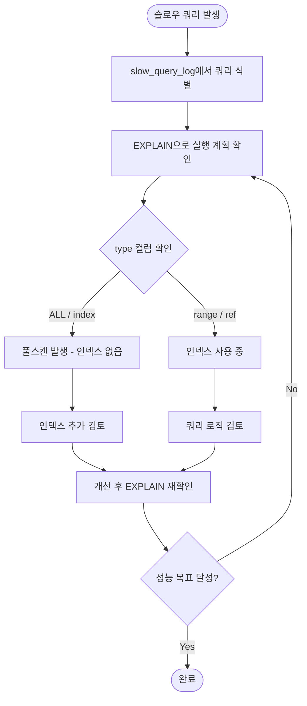
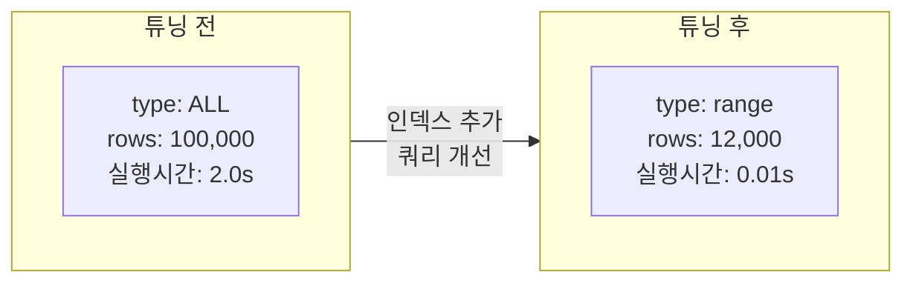

# 쿼리 튜닝

::: info 학습 목표
- 슬로우 쿼리 로그를 설정하고 느린 쿼리를 식별하는 방법을 이해한다.
- EXPLAIN 결과를 해석해 쿼리 실행 계획을 분석할 수 있다.
- 자주 발생하는 쿼리 안티패턴과 그 개선 방법을 설명할 수 있다.
- 인덱스, 조인 순서, 배치 처리 등 실질적인 튜닝 기법을 적용할 수 있다.
- 튜닝 전후의 EXPLAIN 결과를 비교해 성능 개선 효과를 확인할 수 있다.
:::

---

## 1. 슬로우 쿼리 분석

### slow_query_log 설정

MySQL은 지정한 시간보다 오래 걸리는 쿼리를 슬로우 쿼리 로그에 기록한다. 기본적으로 비활성화되어 있으므로 직접 설정해야 한다.

```sql
-- 슬로우 쿼리 로그 활성화
SET GLOBAL slow_query_log = 'ON';

-- 슬로우 쿼리 기준 시간 설정 (초 단위, 기본 10초)
SET GLOBAL long_query_time = 1;

-- 로그 파일 경로 확인
SHOW VARIABLES LIKE 'slow_query_log_file';

-- 인덱스를 사용하지 않는 쿼리도 기록
SET GLOBAL log_queries_not_using_indexes = 'ON';
```

운영 환경에서는 `my.cnf`(my.ini)에 영구 설정한다.

```ini
[mysqld]
slow_query_log = 1
slow_query_log_file = /var/log/mysql/slow.log
long_query_time = 1
log_queries_not_using_indexes = 1
```

`mysqldumpslow` 도구로 슬로우 쿼리 로그를 요약해 볼 수 있다.

```bash
# 실행 시간 기준 상위 10개 슬로우 쿼리
mysqldumpslow -s t -t 10 /var/log/mysql/slow.log
```

### 슬로우 쿼리 분석 순서

슬로우 쿼리를 발견한 뒤 개선까지의 흐름은 다음과 같다.



### EXPLAIN 핵심 컬럼

| 컬럼 | 의미 |
|------|------|
| `type` | 접근 방식. `ALL`(풀스캔) < `index` < `range` < `ref` < `eq_ref` < `const` 순으로 성능 좋음 |
| `key` | 실제로 사용된 인덱스. NULL이면 인덱스 미사용 |
| `rows` | 옵티마이저가 스캔할 것으로 예상하는 행 수 |
| `Extra` | `Using index`(커버링 인덱스), `Using filesort`(정렬 비용 발생), `Using temporary`(임시 테이블 사용) |

```sql
EXPLAIN
SELECT order_id, total_amount
FROM orders
WHERE customer_id = 100 AND status = 'COMPLETED';
```

---

## 2. 쿼리 안티패턴

### SELECT * (불필요한 컬럼 조회)

`SELECT *`는 필요하지 않은 컬럼까지 모두 가져온다. 네트워크 대역폭과 메모리를 낭비하며, 커버링 인덱스를 활용할 수 없게 만든다.

```sql
-- 안티패턴: 모든 컬럼 조회
SELECT * FROM orders WHERE customer_id = 100;

-- 개선: 필요한 컬럼만 명시
SELECT order_id, order_date, total_amount
FROM orders
WHERE customer_id = 100;
```

### 함수로 컬럼 감싸기

WHERE 절에서 컬럼에 함수를 적용하면 인덱스를 사용할 수 없다. 옵티마이저는 함수 결과를 미리 알 수 없어 모든 행에 함수를 적용하는 풀스캔을 수행한다.

```sql
-- 안티패턴: 컬럼에 함수 적용 → 인덱스 무력화
SELECT * FROM orders WHERE YEAR(order_date) = 2024;

-- 개선: 범위 조건으로 변환
SELECT * FROM orders
WHERE order_date >= '2024-01-01' AND order_date < '2025-01-01';
```

```sql
-- 안티패턴: 컬럼을 연산에 포함
SELECT * FROM products WHERE price * 1.1 > 10000;

-- 개선: 상수 쪽을 연산
SELECT * FROM products WHERE price > 9090.91;
```

### 암시적 타입 변환

컬럼 타입과 비교값의 타입이 다르면 MySQL이 내부적으로 타입 변환을 수행한다. 이 과정에서 인덱스가 무력화된다.

```sql
-- 안티패턴: phone_number가 VARCHAR인데 숫자와 비교
SELECT * FROM users WHERE phone_number = 01012345678;

-- 개선: 타입을 일치시킴
SELECT * FROM users WHERE phone_number = '01012345678';
```

### OR 남용

OR 조건은 옵티마이저가 인덱스를 효율적으로 사용하기 어렵게 만든다. 여러 인덱스를 병합(index merge)하는 비용이 발생하거나 풀스캔으로 처리된다.

```sql
-- 안티패턴: OR로 여러 컬럼 조건
SELECT * FROM orders WHERE customer_id = 100 OR status = 'COMPLETED';

-- 개선: UNION ALL로 분리 (각각 인덱스 활용)
SELECT * FROM orders WHERE customer_id = 100
UNION ALL
SELECT * FROM orders WHERE status = 'COMPLETED' AND customer_id != 100;
```

같은 컬럼의 OR는 `IN`으로 대체하면 인덱스를 정상 사용한다.

```sql
-- 안티패턴
SELECT * FROM orders WHERE status = 'PENDING' OR status = 'PROCESSING';

-- 개선
SELECT * FROM orders WHERE status IN ('PENDING', 'PROCESSING');
```

### 서브쿼리 과용

WHERE 절의 서브쿼리는 외부 쿼리의 각 행마다 반복 실행(상관 서브쿼리)되는 경우가 많아 성능이 나쁘다.

```sql
-- 안티패턴: 상관 서브쿼리 (행마다 서브쿼리 실행)
SELECT emp_name, salary
FROM employees e
WHERE salary > (
    SELECT AVG(salary) FROM employees WHERE dept_id = e.dept_id
);

-- 개선: 조인으로 변환 (한 번만 집계)
SELECT e.emp_name, e.salary
FROM employees e
INNER JOIN (
    SELECT dept_id, AVG(salary) AS avg_salary
    FROM employees
    GROUP BY dept_id
) dept_avg ON e.dept_id = dept_avg.dept_id
WHERE e.salary > dept_avg.avg_salary;
```

---

## 3. 개선 기법

### 인덱스 활용

WHERE 절, JOIN 조건, ORDER BY, GROUP BY에 사용되는 컬럼에 인덱스를 추가한다. 복합 인덱스는 컬럼 순서가 중요하다 — 카디널리티가 높은 컬럼을 앞에 두고, 쿼리의 WHERE 절 순서와 맞춰야 한다.

```sql
-- 복합 인덱스: customer_id 조건 후 order_date 범위 검색에 최적화
CREATE INDEX idx_orders_customer_date ON orders(customer_id, order_date);

-- 커버링 인덱스: 쿼리에 필요한 모든 컬럼을 인덱스에 포함
CREATE INDEX idx_orders_covering ON orders(customer_id, order_date, total_amount);
```

### 조인 순서 최적화

MySQL 옵티마이저가 조인 순서를 자동으로 결정하지만, 힌트로 강제할 수 있다. 일반적으로 결과 행 수가 적은 테이블(드라이빙 테이블)을 먼저 처리하는 것이 유리하다.

```sql
-- STRAIGHT_JOIN: 작성 순서대로 조인 강제
SELECT STRAIGHT_JOIN e.emp_name, d.dept_name
FROM employees e
INNER JOIN departments d ON e.dept_id = d.dept_id
WHERE e.salary > 5000000;
```

### 서브쿼리 → 조인 변환

```sql
-- 서브쿼리 방식
SELECT order_id FROM orders
WHERE customer_id IN (
    SELECT customer_id FROM customers WHERE grade = 'VIP'
);

-- 조인 방식 (일반적으로 더 빠름)
SELECT o.order_id
FROM orders o
INNER JOIN customers c ON o.customer_id = c.customer_id
WHERE c.grade = 'VIP';
```

### LIMIT 활용

페이징 처리 시 `LIMIT`으로 처리 행 수를 줄인다. 단, 오프셋이 커지면(LIMIT 100000, 10) 성능이 떨어지므로 커서 기반 페이징을 사용한다.

```sql
-- 오프셋 기반 (오프셋이 크면 느림)
SELECT * FROM orders ORDER BY order_id LIMIT 100000, 10;

-- 커서 기반 (항상 빠름)
SELECT * FROM orders
WHERE order_id > 100000  -- 이전 페이지의 마지막 order_id
ORDER BY order_id
LIMIT 10;
```

### 배치 처리

대량 UPDATE/DELETE는 한 번에 처리하면 락 경합과 언두 로그가 과도하게 증가한다. 소규모로 나눠 처리한다.

```sql
-- 안티패턴: 한 번에 대량 삭제
DELETE FROM logs WHERE created_at < '2023-01-01';

-- 개선: 배치로 나눠 삭제
DELETE FROM logs WHERE created_at < '2023-01-01' LIMIT 1000;
-- 위 쿼리를 애플리케이션에서 반복 실행
```

### 캐시 활용

| 캐시 유형 | 설명 |
|-----------|------|
| 쿼리 캐시 | MySQL 8.0에서 제거됨. 이전 버전에서는 동일 쿼리의 결과를 메모리에 캐시했으나 쓰기 시 무효화 비용이 커서 실효성 낮음 |
| InnoDB 버퍼 풀 | 자주 접근하는 데이터 페이지와 인덱스를 메모리에 캐시. `innodb_buffer_pool_size`를 서버 메모리의 70~80%로 설정 권장 |
| 애플리케이션 캐시 | Redis, Memcached를 사용해 빈번한 쿼리 결과를 애플리케이션 레벨에서 캐시. DB 부하를 근본적으로 줄임 |

---

## 4. 실습: 튜닝 전후 비교

10만 건의 주문 데이터에서 월별 매출을 집계하는 쿼리를 튜닝한다.

### 테이블 구조

```sql
CREATE TABLE orders (
    order_id      INT PRIMARY KEY AUTO_INCREMENT,
    customer_id   INT NOT NULL,
    order_date    DATETIME NOT NULL,
    status        VARCHAR(20) NOT NULL,
    total_amount  DECIMAL(12, 2) NOT NULL
);

-- 10만 건 데이터 생성 (예시)
-- INSERT INTO orders ... (생략)
```

### 튜닝 전 쿼리

```sql
-- 2024년 월별 매출 집계
SELECT
    YEAR(order_date)  AS year,
    MONTH(order_date) AS month,
    SUM(total_amount) AS revenue
FROM orders
WHERE YEAR(order_date) = 2024
  AND status = 'COMPLETED'
GROUP BY YEAR(order_date), MONTH(order_date)
ORDER BY month;
```

### 튜닝 전 EXPLAIN 결과

| id | select_type | table | type | key | rows | Extra |
|----|-------------|-------|------|-----|------|-------|
| 1 | SIMPLE | orders | <strong>ALL</strong> | NULL | 100,000 | Using where; Using filesort |

- `type: ALL` → 풀스캔
- `key: NULL` → 인덱스 미사용
- 실행 시간 약 2초

### 원인 분석

`YEAR(order_date) = 2024` 조건이 컬럼에 함수를 적용해 인덱스를 무력화한다. `status` 컬럼도 인덱스가 없어 풀스캔이 발생한다.

### 튜닝 적용

```sql
-- 1단계: 복합 인덱스 추가
CREATE INDEX idx_orders_status_date
    ON orders(status, order_date);

-- 2단계: 쿼리 개선 (함수 제거 → 범위 조건으로 변환)
SELECT
    YEAR(order_date)  AS year,
    MONTH(order_date) AS month,
    SUM(total_amount) AS revenue
FROM orders
WHERE order_date >= '2024-01-01'
  AND order_date <  '2025-01-01'
  AND status = 'COMPLETED'
GROUP BY YEAR(order_date), MONTH(order_date)
ORDER BY month;
```

### 튜닝 후 EXPLAIN 결과

| id | select_type | table | type | key | rows | Extra |
|----|-------------|-------|------|-----|------|-------|
| 1 | SIMPLE | orders | <strong>range</strong> | idx_orders_status_date | 12,000 | Using index condition; Using filesort |

- `type: range` → 인덱스 범위 스캔
- `key: idx_orders_status_date` → 인덱스 사용
- `rows: 12,000` → 스캔 행 수 88% 감소
- 실행 시간 약 0.01초

### 튜닝 전후 비교



---

::: tip 핵심 정리
- 슬로우 쿼리 분석 순서: 로그 식별 → EXPLAIN → 원인 파악 → 개선 → 재확인
- 컬럼에 함수를 적용하거나 타입 불일치가 발생하면 인덱스가 무력화된다.
- `SELECT *` 대신 필요한 컬럼만 명시하고, 상관 서브쿼리는 조인으로 변환한다.
- 복합 인덱스 컬럼 순서는 카디널리티와 쿼리의 WHERE 절 순서를 고려한다.
- 대량 DML은 배치로 나눠 처리해 락 경합과 언두 로그 증가를 억제한다.
:::

## 다음 챕터

- 다음 : [운영과 보안](/study/database/15-operation-security)
