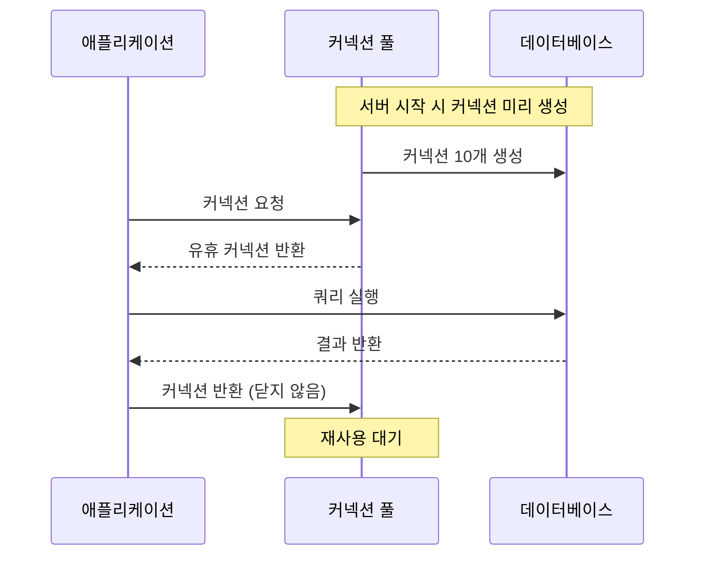
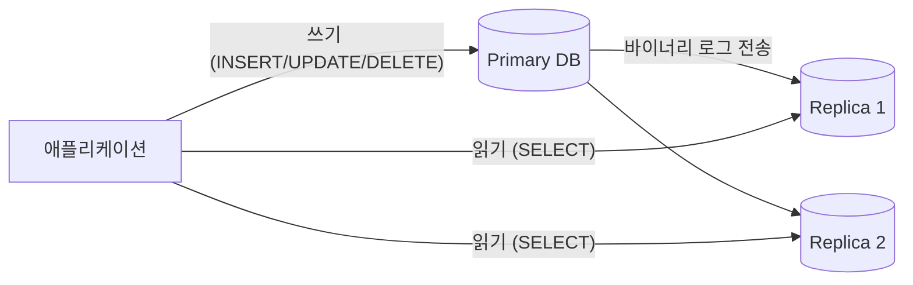

# 운영과 보안

::: info 학습 목표
- 커넥션 풀의 원리와 HikariCP 설정 방법을 이해한다.
- 수평/수직 파티셔닝의 종류와 파티션 프루닝 개념을 설명할 수 있다.
- Master-Replica 구조에서 읽기 분산과 복제 지연 문제를 이해한다.
- SQL 인젝션 원리와 PreparedStatement를 이용한 방어 방법을 적용할 수 있다.
- 최소 권한 원칙, 감사 로그, 암호화 등 DB 보안의 핵심 요소를 설명할 수 있다.
:::

---

## 1. 커넥션 풀

### DB 커넥션 생성 비용

애플리케이션이 DB에 연결할 때는 TCP 핸드셰이크, 인증, 세션 초기화 등 여러 단계가 필요하다. 매 요청마다 커넥션을 새로 생성하면 수십~수백 ms의 오버헤드가 발생해 응답 시간이 급격히 늘어난다.

```
커넥션 생성 비용 = TCP 연결 + 인증 + 세션 초기화 ≈ 20~100ms
일반 쿼리 실행 시간 ≈ 1~5ms
→ 커넥션 생성이 쿼리보다 10~100배 비쌀 수 있음
```

### 풀링 원리

커넥션 풀은 미리 커넥션을 생성해 두고 요청이 들어오면 재사용하며, 사용이 끝나면 풀에 반환하는 방식이다.



### HikariCP 설정

Spring Boot의 기본 커넥션 풀인 HikariCP의 핵심 설정이다.

```yaml
spring:
  datasource:
    hikari:
      maximum-pool-size: 10       # 최대 커넥션 수
      minimum-idle: 5             # 최소 유휴 커넥션 수
      connection-timeout: 30000   # 커넥션 획득 대기 시간 (ms)
      idle-timeout: 600000        # 유휴 커넥션 유지 시간 (ms)
      max-lifetime: 1800000       # 커넥션 최대 수명 (ms)
      keepalive-time: 60000       # DB가 커넥션을 끊지 않도록 유지 쿼리 주기
```

`connection-timeout`이 초과하면 `SQLTimeoutException`이 발생한다. 이 값이 너무 짧으면 순간적인 트래픽 급증에 취약해지고, 너무 길면 사용자가 오랫동안 응답을 기다린다.

### 적정 풀 사이즈 공식

HikariCP 공식 문서에서 권장하는 공식이다.

```
pool_size = Tn x (Cm - 1) + 1

Tn = 최대 스레드 수
Cm = 하나의 요청에서 동시에 필요한 최대 커넥션 수 (보통 1~2)
```

예를 들어 스레드 10개, 요청당 커넥션 1개이면 `10 x (1 - 1) + 1 = 1`이지만, 실제로는 여유분과 트랜잭션 중 대기 시간을 고려해 CPU 코어 수 x 2 + SSD 수 정도를 권장한다. 과도하게 많은 커넥션은 DB 서버의 컨텍스트 스위칭 비용을 증가시킨다.

---

## 2. 파티셔닝

### 수평 파티셔닝

하나의 테이블을 행(row) 단위로 나눠 여러 파티션에 저장한다. 물리적으로 분리되어 있지만 논리적으로는 하나의 테이블처럼 조회된다.

**Range 파티셔닝** — 컬럼 값의 범위에 따라 파티션을 나눈다. 날짜 기반 데이터에 가장 많이 사용한다.

```sql
CREATE TABLE orders (
    order_id    INT NOT NULL,
    order_date  DATE NOT NULL,
    total_amount DECIMAL(12, 2)
)
PARTITION BY RANGE (YEAR(order_date)) (
    PARTITION p2022 VALUES LESS THAN (2023),
    PARTITION p2023 VALUES LESS THAN (2024),
    PARTITION p2024 VALUES LESS THAN (2025),
    PARTITION p_future VALUES LESS THAN MAXVALUE
);
```

**List 파티셔닝** — 컬럼 값의 목록에 따라 파티션을 나눈다.

```sql
PARTITION BY LIST (region_code) (
    PARTITION p_seoul   VALUES IN (1, 2),
    PARTITION p_busan   VALUES IN (3, 4),
    PARTITION p_others  VALUES IN (5, 6, 7)
);
```

**Hash 파티셔닝** — 컬럼 값의 해시로 파티션을 균등하게 분배한다. 특정 범위나 목록이 없는 경우에 사용한다.

```sql
PARTITION BY HASH (customer_id) PARTITIONS 4;
```

### 수직 파티셔닝

테이블을 컬럼(column) 단위로 분리한다. 자주 조회하는 컬럼과 드물게 사용하는 대용량 컬럼(BLOB, TEXT)을 분리해 I/O 효율을 높인다.

```sql
-- 원본 테이블
-- users(id, name, email, profile_image MEDIUMBLOB, bio TEXT)

-- 수직 파티셔닝 후
CREATE TABLE users (id INT, name VARCHAR(100), email VARCHAR(200));
CREATE TABLE users_detail (user_id INT, profile_image MEDIUMBLOB, bio TEXT);
```

### 파티션 프루닝

WHERE 조건이 파티션 키를 포함하면 옵티마이저가 관련 파티션만 스캔한다. 이를 <strong>파티션 프루닝(Partition Pruning)</strong>이라 한다.

```sql
-- 2024년 데이터만 조회 → p2024 파티션만 스캔
SELECT * FROM orders WHERE order_date >= '2024-01-01' AND order_date < '2025-01-01';

EXPLAIN PARTITIONS SELECT ...;
-- partitions 컬럼에서 p2024만 표시되면 프루닝 동작 확인
```

### 언제 파티셔닝을 쓰는가

| 상황 | 파티셔닝 적합 여부 |
|------|-------------------|
| 수천만 건 이상의 대용량 테이블 | 적합 |
| 날짜 기반으로 오래된 데이터를 주기적으로 삭제 | 적합 (파티션 DROP으로 빠르게 삭제) |
| 테이블이 수십만 건 이하 | 불필요 (인덱스로 충분) |
| 파티션 키가 아닌 컬럼 위주 조회 | 부적합 (프루닝 불가) |

---

## 3. 레플리카

### Master-Replica 구조

<strong>Primary(Master)</strong>는 쓰기(INSERT, UPDATE, DELETE)를 처리하고, <strong>Replica(Slave)</strong>는 읽기(SELECT)를 처리한다. 읽기가 쓰기보다 압도적으로 많은 서비스에서 DB 부하를 분산하는 데 효과적이다.



### 복제 방식

| 방식 | 설명 | 특징 |
|------|------|------|
| 비동기 복제 | Primary는 커밋 후 즉시 응답. Replica는 나중에 반영 | 성능 최고, 데이터 손실 가능 |
| 반동기 복제 | Primary는 최소 1개의 Replica가 수신 확인 후 응답 | 성능과 안정성의 균형 |
| 동기 복제 | 모든 Replica가 반영을 확인해야 커밋 완료 | 데이터 무결성 최고, 성능 저하 |

### 복제 지연 문제

비동기/반동기 복제에서 Primary의 변경이 Replica에 아직 반영되지 않은 상태를 <strong>복제 지연(Replication Lag)</strong>이라 한다.

```sql
-- Replica에서 복제 지연 확인
SHOW REPLICA STATUS\G
-- Seconds_Behind_Source: 0  → 지연 없음
-- Seconds_Behind_Source: 5  → 5초 지연
```

복제 지연으로 인한 읽기 불일치를 방지하는 방법이다.

- 방금 작성한 데이터를 읽어야 하는 경우 Primary에서 읽도록 라우팅
- 캐시(Redis)를 활용해 Replica 읽기 전에 캐시 조회
- 동기 복제 또는 반동기 복제 사용

---

## 4. DB 보안

### 접근 제어 — 최소 권한 원칙

사용자에게는 업무에 필요한 최소한의 권한만 부여한다.

```sql
-- 읽기 전용 사용자 생성
CREATE USER 'readonly_user'@'%' IDENTIFIED BY 'strong_password';
GRANT SELECT ON mydb.* TO 'readonly_user'@'%';

-- 애플리케이션 전용 사용자 (특정 DB, 특정 권한만)
CREATE USER 'app_user'@'192.168.1.%' IDENTIFIED BY 'app_password';
GRANT SELECT, INSERT, UPDATE, DELETE ON mydb.* TO 'app_user'@'192.168.1.%';
-- DDL 권한(CREATE, DROP, ALTER)은 부여하지 않음

-- 권한 즉시 적용
FLUSH PRIVILEGES;
```

### SQL 인젝션

사용자 입력을 SQL 문에 직접 삽입할 때 발생한다. 공격자가 입력에 SQL 구문을 삽입해 인증 우회, 데이터 탈취, 삭제 등을 수행한다.

```sql
-- 취약한 코드 (Java 예시)
String query = "SELECT * FROM users WHERE name = '" + userName + "'";
-- userName = "' OR '1'='1" 이면 모든 사용자 반환
-- userName = "'; DROP TABLE users; --" 이면 테이블 삭제
```

<strong>PreparedStatement</strong>를 사용하면 입력값이 SQL 구조가 아닌 데이터로만 처리되어 인젝션이 불가능하다.

```java
// 안전한 코드 (PreparedStatement 사용)
String query = "SELECT * FROM users WHERE name = ?";
PreparedStatement pstmt = conn.prepareStatement(query);
pstmt.setString(1, userName);  // 입력값이 바인딩 파라미터로 처리됨
ResultSet rs = pstmt.executeQuery();
```

JPA/Hibernate의 파라미터 바인딩(`@Query("... WHERE name = :name")`)도 내부적으로 PreparedStatement를 사용한다.

### 감사 로그

누가 언제 어떤 데이터에 접근했는지 기록한다. MySQL Enterprise Audit 플러그인 또는 일반 버전의 `general_log`를 활용한다.

```sql
-- general_log 활성화 (모든 쿼리 기록, 성능 영향 있음)
SET GLOBAL general_log = 'ON';
SET GLOBAL general_log_file = '/var/log/mysql/general.log';

-- 특정 이벤트만 기록하는 트리거 방식 (애플리케이션 레벨 감사)
CREATE TABLE audit_log (
    log_id      INT AUTO_INCREMENT PRIMARY KEY,
    user_name   VARCHAR(100),
    action      VARCHAR(50),
    table_name  VARCHAR(100),
    record_id   INT,
    changed_at  DATETIME DEFAULT CURRENT_TIMESTAMP
);
```

### 암호화

| 방식 | 설명 | 적용 대상 |
|------|------|-----------|
| TDE (Transparent Data Encryption) | 데이터 파일을 디스크에 저장할 때 자동 암호화 | 파일 시스템 탈취 방어 |
| 컬럼 암호화 | 특정 컬럼 값을 암호화해 저장 | 주민번호, 카드번호 등 민감 정보 |
| 전송 암호화 | DB-애플리케이션 간 통신을 TLS/SSL로 암호화 | 네트워크 도청 방어 |

```sql
-- MySQL TDE 활성화 (InnoDB)
ALTER TABLE users ENCRYPTION = 'Y';

-- 컬럼 암호화 예시 (AES)
INSERT INTO users (name, ssn)
VALUES ('홍길동', AES_ENCRYPT('920101-1234567', 'encryption_key'));

-- 복호화 조회
SELECT name, AES_DECRYPT(ssn, 'encryption_key') AS ssn FROM users;
```

실제 운영 환경에서는 키를 DB 서버에 직접 저장하지 않고 AWS KMS, HashiCorp Vault 같은 키 관리 서비스를 사용한다.

---

::: tip 핵심 정리
- 커넥션 풀은 커넥션을 재사용해 생성 비용을 줄인다. `maximum-pool-size`는 CPU 코어 수와 요청 패턴에 맞게 설정한다.
- Range 파티셔닝은 날짜 기반 대용량 테이블 관리에 효과적이며, WHERE 절에 파티션 키가 있어야 프루닝이 동작한다.
- Replica는 읽기 부하를 분산하지만 복제 지연이 발생할 수 있어, 방금 쓴 데이터를 즉시 읽어야 하는 경우 Primary로 라우팅한다.
- SQL 인젝션 방어의 핵심은 PreparedStatement의 파라미터 바인딩이다.
- 사용자에게는 최소 권한만 부여하고, 민감 데이터는 TDE 또는 컬럼 암호화로 보호한다.
:::

## 다음 챕터

- 다음 : [분산 데이터베이스](/study/database/16-distributed-db)
