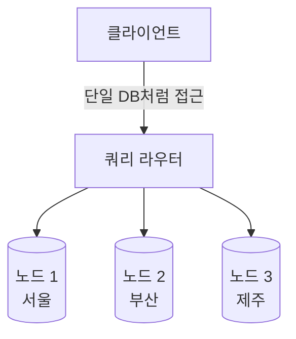
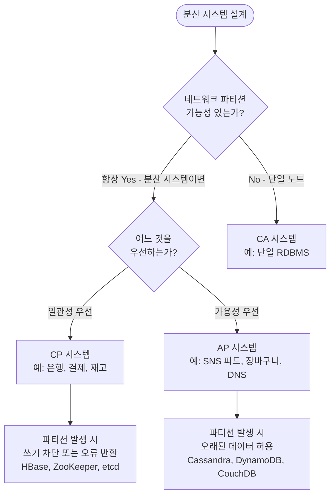
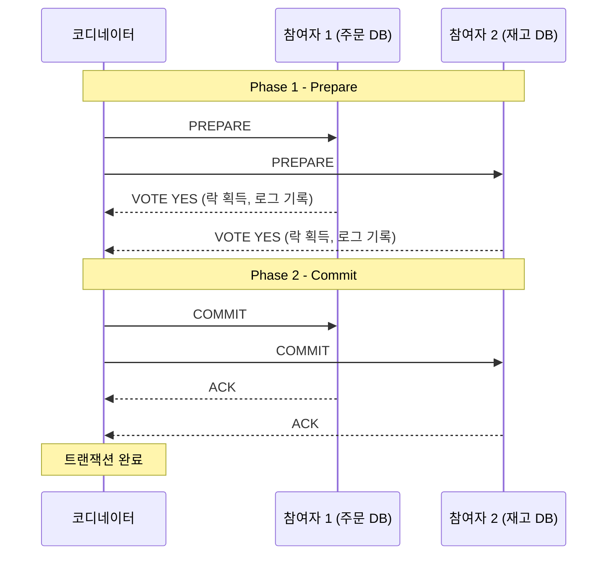
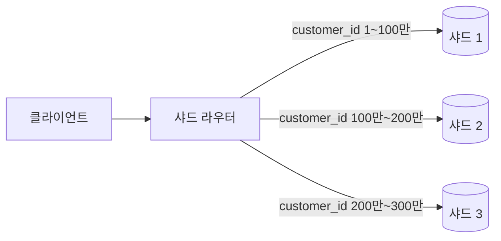

# 분산 데이터베이스

::: info 학습 목표
- 분산 데이터베이스의 개념과 다섯 가지 투명성을 설명할 수 있다.
- CAP 정리에서 세 가지 속성의 의미와 트레이드오프를 이해한다.
- 2PC의 두 단계 흐름과 코디네이터 장애 문제를 설명할 수 있다.
- Range, Hash, Directory 샤딩의 차이와 샤딩 키 선택 기준을 설명할 수 있다.
:::

---

## 1. 분산 데이터베이스 개념

### 정의

<strong>분산 데이터베이스(Distributed Database)</strong>는 물리적으로 여러 노드(서버)에 데이터를 분산해 저장하고 관리하는 시스템이다. 사용자에게는 단일 데이터베이스처럼 보이지만, 실제로는 네트워크로 연결된 여러 서버에 데이터가 나뉘어 있다.



### 투명성 (Transparency)

분산 DB에서 <strong>투명성</strong>이란 분산된 구조를 사용자가 인식하지 않아도 되도록 시스템이 숨겨주는 특성이다.

| 투명성 종류 | 설명 |
|------------|------|
| 위치 투명성 | 데이터가 어느 노드에 있는지 알 필요 없이 접근 가능 |
| 분할 투명성 | 테이블이 여러 파티션으로 나뉘어 있어도 하나처럼 조회 가능 |
| 복제 투명성 | 데이터가 여러 노드에 복제되어 있어도 단일 복사본처럼 접근 가능 |
| 병행 투명성 | 여러 사용자가 동시에 접근해도 직렬 실행처럼 결과가 보장됨 |
| 장애 투명성 | 일부 노드에 장애가 발생해도 전체 시스템은 계속 동작 |

### 장점과 단점

| 구분 | 내용 |
|------|------|
| 장점 | 수평 확장(scale-out)으로 대용량 처리, 지리적 분산으로 가용성 향상, 장애 격리 |
| 단점 | 분산 트랜잭션의 복잡성, 데이터 일관성 유지 어려움, 네트워크 지연, 운영 복잡도 증가 |

---

## 2. CAP 정리

### 세 가지 속성

<strong>CAP 정리</strong>는 분산 시스템이 동시에 세 가지 속성을 모두 보장할 수 없다는 이론이다. 2000년 에릭 브루어(Eric Brewer)가 제시했다.

| 속성 | 영문 | 설명 |
|------|------|------|
| 일관성 | Consistency | 모든 노드가 같은 시점에 동일한 데이터를 반환한다. 읽기는 항상 최신 쓰기 결과를 반환한다 |
| 가용성 | Availability | 모든 요청은 (오류 없이) 응답을 받는다. 노드 일부가 다운돼도 서비스는 계속된다 |
| 파티션 내성 | Partition Tolerance | 노드 간 네트워크 분리(파티션)가 발생해도 시스템이 동작을 계속한다 |

### 왜 셋 다 불가능한가

네트워크 분리(파티션)는 분산 시스템에서 현실적으로 항상 발생할 수 있다. 파티션이 발생했을 때 시스템은 두 가지 선택만 할 수 있다.

- 일관성 선택 → 분리된 노드의 응답을 거부 → 가용성 포기
- 가용성 선택 → 오래된 데이터로 응답 → 일관성 포기

따라서 실제로는 P(파티션 내성)는 필수이고, C(일관성)와 A(가용성) 사이에서 선택하는 구조이다.

### 선택 가이드



---

## 3. 2PC (Two-Phase Commit)

### 분산 트랜잭션의 문제

단일 DB에서는 트랜잭션 원자성(ACID의 A)을 DB 엔진이 보장한다. 하지만 여러 DB 노드에 걸친 트랜잭션에서는 노드 A에는 커밋됐지만 노드 B에서 실패하는 상황이 발생할 수 있다.

### 2PC 흐름

<strong>2PC(Two-Phase Commit)</strong>는 <strong>코디네이터(Coordinator)</strong>와 여러 <strong>참여자(Participant)</strong>로 구성된다.

**Phase 1 — Prepare(Vote) 단계**

코디네이터가 모든 참여자에게 "커밋할 수 있는가?"를 묻는다. 각 참여자는 트랜잭션을 준비(데이터 락 획득, 로그 기록)하고 Yes 또는 No로 응답한다.

**Phase 2 — Commit/Abort 단계**

모든 참여자가 Yes이면 코디네이터는 Commit 명령을 전송하고, 하나라도 No이면 Abort 명령을 전송한다.



### 코디네이터 장애 문제

Phase 1 이후 모든 참여자가 Yes를 응답했지만 Phase 2 전에 코디네이터가 장애를 겪으면, 참여자들은 락을 잡은 채로 무한 대기 상태에 빠진다. 이를 <strong>블로킹 문제(Blocking Problem)</strong>라 한다.

이를 해결하기 위한 대안으로 3PC(Three-Phase Commit), Paxos, Raft 같은 합의 알고리즘이 사용된다.

---

## 4. 샤딩 (Sharding)

### 샤딩이란

<strong>샤딩(Sharding)</strong>은 수평 파티셔닝의 분산 버전이다. 파티셔닝은 같은 DB 서버 내에서 테이블을 분할하지만, 샤딩은 데이터를 아예 다른 DB 서버(샤드)에 분산 저장한다.



### 샤딩 키 선택 기준

샤딩 키는 데이터를 어느 샤드에 저장할지 결정하는 컬럼이다. 잘못 선택하면 특정 샤드에 데이터가 몰리는 <strong>핫스팟(Hotspot)</strong>이 발생한다.

좋은 샤딩 키의 조건이다.

- 높은 카디널리티 — 다양한 값을 가져 데이터가 균등하게 분산
- 쿼리 패턴과 일치 — 자주 사용하는 WHERE 조건에 포함
- 불변성 — 값이 자주 변경되지 않음 (변경 시 샤드 이동 필요)

### Range Sharding

샤딩 키의 범위에 따라 샤드를 결정한다.

```
customer_id 1 ~ 1,000,000    → 샤드 1
customer_id 1,000,001 ~ 2,000,000 → 샤드 2
```

- 장점: 범위 쿼리 효율적, 구현 단순
- 단점: 신규 데이터가 특정 샤드에 집중될 수 있음 (최신 날짜 샤드에 쏠림)

### Hash Sharding

샤딩 키를 해시 함수로 처리해 샤드 번호를 결정한다.

```
shard_number = hash(customer_id) % 샤드 수
```

- 장점: 데이터가 균등하게 분산됨
- 단점: 범위 쿼리 불가, 샤드 수 변경 시 대부분의 데이터 이동 필요

### Directory Sharding

별도의 룩업 테이블(디렉토리)에서 샤딩 키와 샤드의 매핑을 관리한다.

```
룩업 테이블:
customer_id 1~500    → 샤드 1
customer_id 501~1000 → 샤드 2
...
```

- 장점: 샤드 매핑을 유연하게 변경 가능
- 단점: 룩업 테이블이 단일 장애점(SPOF)이 될 수 있음, 추가 조회 비용

### 리밸런싱 문제

샤드를 추가하거나 제거할 때 기존 데이터를 새 샤드로 이동시켜야 한다. Hash Sharding에서 샤드를 4개에서 5개로 늘리면 `hash(key) % 4`와 `hash(key) % 5`의 결과가 달라져 거의 모든 데이터를 이동해야 한다.

이 문제를 완화하기 위해 <strong>Consistent Hashing(일관된 해싱)</strong>을 사용한다. 가상 노드(Virtual Node)를 링 구조에 배치해 샤드를 추가/제거할 때 이동하는 데이터를 최소화한다.

---

::: tip 핵심 정리
- 분산 DB의 다섯 가지 투명성: 위치, 분할, 복제, 병행, 장애 투명성.
- CAP 정리: P(파티션 내성)는 필수이므로 실제로는 C(일관성)와 A(가용성) 중 선택. 은행은 CP, SNS는 AP.
- 2PC Phase 1(Prepare/Vote) → Phase 2(Commit/Abort). 코디네이터 장애 시 참여자가 블로킹 상태에 빠지는 것이 약점.
- 샤딩 키는 카디널리티가 높고 불변하며 쿼리 패턴과 일치해야 한다.
- Hash Sharding은 균등 분산에 유리하지만 샤드 수 변경 시 Consistent Hashing이 필요하다.
:::

## 다음 챕터

- 다음 : [데이터 웨어하우스](/study/database/17-data-warehouse)
