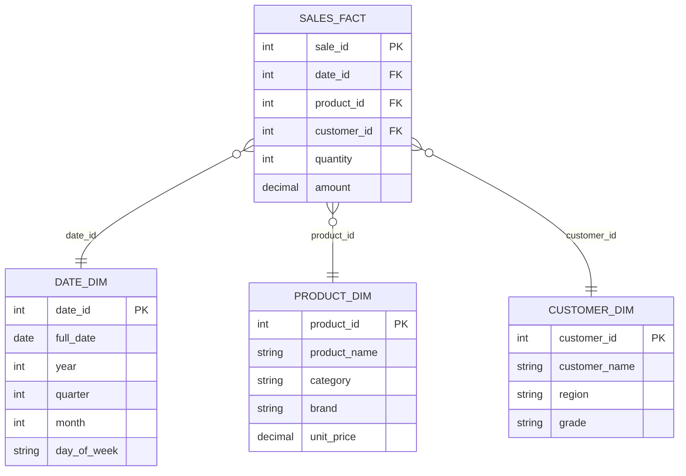
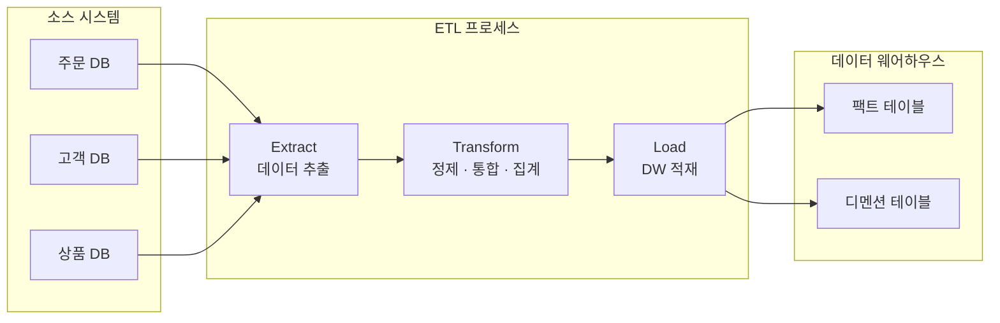
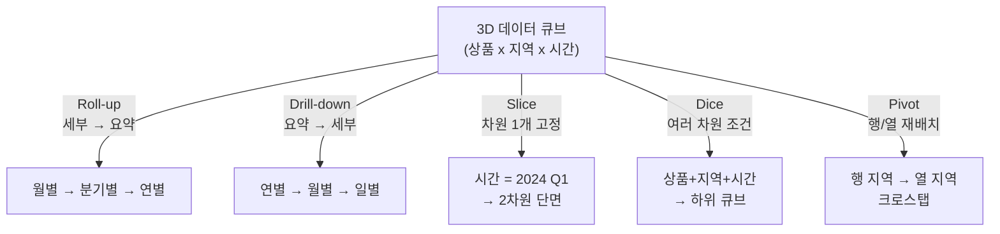

# 데이터 웨어하우스

::: info 학습 목표
- OLTP와 OLAP의 목적과 특성 차이를 설명할 수 있다.
- Star 스키마와 Snowflake 스키마의 구조와 팩트/디멘션 테이블의 역할을 이해한다.
- ETL 파이프라인의 각 단계와 CDC 개념을 설명할 수 있다.
- Roll-up, Drill-down, Slice, Dice, Pivot 연산의 의미와 차이를 설명할 수 있다.
:::

---

## 1. OLTP vs OLAP

### 비교

| 구분 | OLTP (Online Transaction Processing) | OLAP (Online Analytical Processing) |
|------|--------------------------------------|--------------------------------------|
| 목적 | 일상적인 트랜잭션 처리 | 대규모 데이터 분석 |
| 데이터 | 현재 운영 데이터 (최신 상태) | 이력 데이터 (수년치 축적) |
| 쿼리 유형 | 단순 INSERT/UPDATE/SELECT (소량 행) | 복잡한 집계, 조인, 집합 연산 (수백만 행) |
| 정규화 | 높음 (중복 최소화) | 낮음 (읽기 최적화, 역정규화) |
| 응답 시간 | 수 ms | 수 초 ~ 수 분 |
| 동시 사용자 | 수천 ~ 수만 명 | 수십 ~ 수백 명 |
| 예시 | 주문 처리, 결제, 재고 관리 | 매출 분석, 고객 행동 분석, 경영 리포트 |

### 왜 같은 DB로 둘 다 하면 안 되는가

OLAP 쿼리는 수백만 건 이상의 데이터를 스캔하며 CPU와 I/O를 대량 소비한다. 같은 DB에서 OLTP와 OLAP을 함께 실행하면 다음 문제가 발생한다.

- OLAP 쿼리가 테이블 락 또는 공유 락을 오래 유지해 OLTP 트랜잭션이 대기 상태에 빠짐
- OLAP의 풀스캔이 버퍼 풀의 OLTP용 캐시 데이터를 밀어내 캐시 히트율 급락
- 실시간 서비스 응답 시간이 증가해 사용자 경험 저하

이 때문에 운영 DB(OLTP)와 분석 DB(OLAP/DW)를 분리하는 것이 일반적이다.

---

## 2. 데이터 웨어하우스 구조

### 팩트 테이블과 디멘션 테이블

<strong>팩트 테이블(Fact Table)</strong>은 분석 대상인 측정값(Measure)과 디멘션 테이블을 참조하는 FK의 집합이다. 행 수가 매우 많고 자주 집계된다.

<strong>디멘션 테이블(Dimension Table)</strong>은 팩트를 설명하는 속성(Attribute)과 계층(Hierarchy) 정보를 담는다. 팩트 테이블보다 행 수가 적고 잘 변하지 않는다.

```
팩트 테이블 예시 (sales_fact):
- sale_id (PK)
- date_id (FK → date_dim)
- product_id (FK → product_dim)
- customer_id (FK → customer_dim)
- quantity (측정값)
- amount (측정값)

디멘션 테이블 예시 (date_dim):
- date_id (PK)
- date, year, quarter, month, day_of_week
```

### Star 스키마

팩트 테이블이 중심에 있고 디멘션 테이블이 방사형으로 연결된 구조이다. 쿼리가 단순하고 직관적이며 조인 횟수가 적어 분석 성능이 좋다.



### Snowflake 스키마

Star 스키마에서 디멘션 테이블을 추가로 정규화한 구조이다. 예를 들어 `product_dim`의 `category`를 별도 `category_dim`으로 분리한다. 데이터 중복은 줄어들지만 조인이 많아져 쿼리가 복잡해진다.

| 비교 | Star 스키마 | Snowflake 스키마 |
|------|------------|-----------------|
| 정규화 수준 | 낮음 (디멘션 비정규화) | 높음 (디멘션 정규화) |
| 쿼리 복잡도 | 낮음 | 높음 (다단계 조인) |
| 저장 공간 | 많이 사용 | 절약 |
| 쿼리 성능 | 빠름 | 상대적으로 느림 |

실무에서는 대부분 Star 스키마를 선호한다.

---

## 3. ETL (Extract-Transform-Load)

### ETL 개념

<strong>ETL</strong>은 운영 시스템(OLTP DB, 로그, 외부 API 등)에서 데이터를 추출하고, 분석에 적합한 형태로 변환하며, 데이터 웨어하우스에 적재하는 과정이다.

**Extract (추출)** — 소스 시스템에서 데이터를 읽는다. 전체 추출(Full Extract) 또는 변경분만 추출(Incremental Extract)을 사용한다.

**Transform (변환)** — 데이터를 정제, 통합, 집계한다. 중복 제거, 결측값 처리, 코드 변환(예: 'M' → '남성'), 여러 소스 통합, 집계 계산 등이 포함된다.

**Load (적재)** — 변환된 데이터를 DW에 저장한다. 전체 교체(Full Load) 또는 증분 추가(Incremental Load) 방식이 있다.

### ETL 파이프라인



### CDC (Change Data Capture)

<strong>CDC</strong>는 소스 DB의 변경 사항(INSERT, UPDATE, DELETE)만 실시간 또는 주기적으로 감지해 ETL에 활용하는 기법이다. 전체 테이블을 매번 읽지 않으므로 소스 시스템 부하가 낮고 지연 시간이 짧다.

MySQL에서는 바이너리 로그(binlog)를 활용한 CDC가 일반적이다. Debezium 같은 오픈소스 툴이 binlog를 읽어 Kafka로 변경 이벤트를 스트리밍한다.

```
[MySQL binlog] → [Debezium] → [Kafka] → [ETL 소비자] → [DW]
```

---

## 4. OLAP 연산

OLAP에서는 다차원 데이터 큐브를 다양한 각도로 분석하는 연산을 사용한다. 온라인 쇼핑몰의 매출 데이터(상품, 지역, 시간 차원)를 예로 든다.

### Roll-up (합산/상위 집계)

데이터를 상위 계층으로 집계한다. 세부 수준에서 요약 수준으로 올라간다.

```
일별 매출 → 월별 매출 → 분기별 매출 → 연별 매출
도시별 매출 → 지역별 매출 → 전국 매출
```

```sql
-- 일별 → 월별 Roll-up
SELECT YEAR(sale_date), MONTH(sale_date), SUM(amount)
FROM sales_fact
GROUP BY YEAR(sale_date), MONTH(sale_date);
```

### Drill-down (하위 상세)

Roll-up의 반대. 상위 집계에서 세부 데이터로 내려간다.

```
연별 매출 → 분기별 → 월별 → 일별
전국 매출 → 지역별 → 도시별 → 구별
```

### Slice (한 차원 고정)

여러 차원 중 하나의 차원을 특정 값으로 고정해 2차원 단면을 추출한다.

```
전체 매출 데이터(상품 x 지역 x 시간) 중
시간 차원 = "2024년 1분기"로 고정
→ 2024년 1분기의 상품 x 지역 매출표
```

```sql
SELECT product_id, region, SUM(amount)
FROM sales_fact
WHERE year = 2024 AND quarter = 1
GROUP BY product_id, region;
```

### Dice (여러 차원 조건)

Slice가 하나의 차원을 고정하는 반면, Dice는 여러 차원에 조건을 적용해 더 작은 하위 큐브를 추출한다.

```
상품 = "전자제품"
지역 = "서울, 부산"
시간 = "2024년 1~3분기"
→ 위 세 조건을 모두 만족하는 데이터
```

```sql
SELECT product_id, region, quarter, SUM(amount)
FROM sales_fact
WHERE category = '전자제품'
  AND region IN ('서울', '부산')
  AND year = 2024 AND quarter IN (1, 2, 3)
GROUP BY product_id, region, quarter;
```

### Pivot (축 회전)

행과 열의 축을 바꿔 데이터를 재배치한다. 행으로 나열된 데이터를 열로 펼치거나 그 반대를 수행해 가독성 높은 크로스탭 형태로 만든다.

```
Pivot 전:
region  | quarter | amount
서울    | Q1      | 100
서울    | Q2      | 150
부산    | Q1      | 80
부산    | Q2      | 90

Pivot 후:
region  | Q1  | Q2
서울    | 100 | 150
부산    | 80  | 90
```

```sql
-- MySQL에서 CASE WHEN으로 Pivot 구현
SELECT region,
    SUM(CASE WHEN quarter = 1 THEN amount ELSE 0 END) AS Q1,
    SUM(CASE WHEN quarter = 2 THEN amount ELSE 0 END) AS Q2,
    SUM(CASE WHEN quarter = 3 THEN amount ELSE 0 END) AS Q3,
    SUM(CASE WHEN quarter = 4 THEN amount ELSE 0 END) AS Q4
FROM sales_fact
WHERE year = 2024
GROUP BY region;
```

### OLAP 연산 요약



---

::: tip 핵심 정리
- OLTP는 빠른 트랜잭션 처리, OLAP는 대용량 분석이 목적이다. 같은 DB에서 병행하면 OLTP 성능이 저하된다.
- Star 스키마는 팩트 테이블(측정값 + FK)과 디멘션 테이블(속성, 계층)로 구성되며, 단순한 구조로 조회 성능이 좋다.
- ETL은 Extract(추출) → Transform(변환) → Load(적재) 순서로 진행하며, CDC는 변경분만 실시간으로 감지한다.
- OLAP 연산: Roll-up(상위 집계), Drill-down(하위 상세), Slice(1차원 고정), Dice(다차원 조건), Pivot(축 회전).
:::
