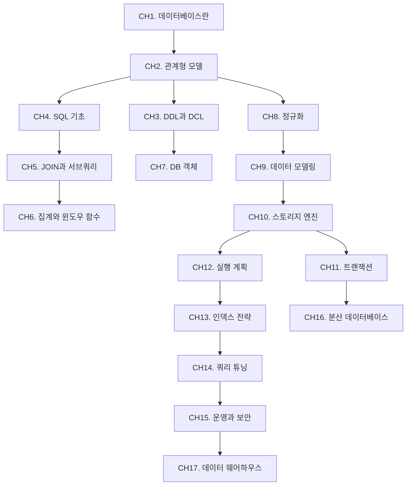

# 데이터베이스

관계형 데이터베이스를 중심으로, SQL 기초부터 내부 구조, 튜닝, 분산 데이터베이스까지 체계적으로 학습한다. 정보처리기사 출제 범위를 모두 포함하며, 실무 관점의 튜닝과 운영까지 다룬다.

## 학습 로드맵

## 목차

### 기초
1. [데이터베이스란](/study/database/01-what-is-database) — 정의, DBMS, 스키마, 데이터 독립성
2. [관계형 모델](/study/database/02-relational-model) — 테이블/키/관계, ERD, 관계 대수

### SQL
3. [DDL과 DCL](/study/database/03-ddl-dcl) — CREATE/ALTER/DROP, GRANT/REVOKE
4. [SQL 기초](/study/database/04-sql-basics) — SELECT, WHERE, ORDER BY, DML
5. [JOIN과 서브쿼리](/study/database/05-join-subquery) — INNER/LEFT/RIGHT JOIN, 서브쿼리
6. [집계와 윈도우 함수](/study/database/06-aggregation-window) — GROUP BY, HAVING, ROW_NUMBER
7. [데이터베이스 객체](/study/database/07-db-objects) — VIEW, 저장 프로시저, 트리거, 시퀀스

### 설계
8. [정규화](/study/database/08-normalization) — 이상 현상, 함수적 종속, 1NF~BCNF, 반정규화
9. [데이터 모델링](/study/database/09-data-modeling) — 설계 4단계, 논리/물리 모델, ERD 실무

### 내부 구조
10. [스토리지 엔진](/study/database/10-storage-engine) — 페이지, B-Tree, 해시 인덱스, 클러스터드
11. [트랜잭션과 동시성](/study/database/11-transaction) — ACID, 격리 수준, MVCC, 병행 제어, 회복
12. [실행 계획](/study/database/12-execution-plan) — EXPLAIN, 옵티마이저, 스캔 방식

### 튜닝
13. [인덱스 전략](/study/database/13-index-strategy) — 복합 인덱스, 커버링 인덱스, 설계 원칙
14. [쿼리 튜닝](/study/database/14-query-tuning) — 슬로우 쿼리, 안티패턴, 개선 사례

### 운영과 확장
15. [운영과 보안](/study/database/15-operation-security) — 커넥션 풀, 파티셔닝, 접근 제어
16. [분산 데이터베이스](/study/database/16-distributed-db) — 2PC, CAP 정리, 샤딩, 복제
17. [데이터 웨어하우스](/study/database/17-data-warehouse) — OLTP vs OLAP, Star 스키마, ETL
