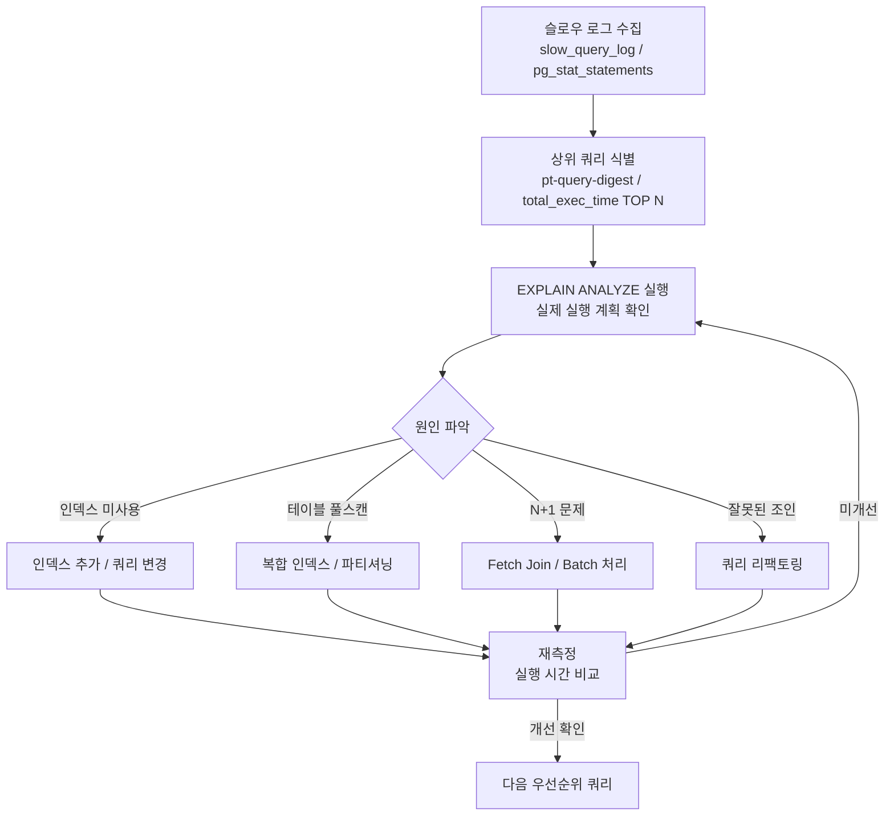

# 슬로우 쿼리 진단

::: info 학습 목표
- 슬로우 쿼리의 정의와 시스템에 미치는 영향을 이해한다.
- MySQL 슬로우 쿼리 로그를 설정하고 pt-query-digest로 분석한다.
- PostgreSQL pg_stat_statements로 상위 병목 쿼리를 식별한다.
- 수집 → 식별 → EXPLAIN → 개선 → 재측정의 진단 프로세스를 따른다.
:::

---

## 1. 슬로우 쿼리란

### 정의

슬로우 쿼리(Slow Query)는 설정된 임계값(long_query_time)을 초과하는 쿼리를 말한다. MySQL의 기본값은 10초이지만 실제 운영 환경에서는 1초 또는 0.5초로 낮추는 것이 일반적이다.

단순히 "느린 쿼리"가 아니라 **일정 기준을 넘겨 로그에 기록된 쿼리**를 지칭하며, 이 기준을 낮출수록 더 많은 쿼리가 수집된다.

### 왜 위험한가

**테일 레이턴시(tail latency) 문제**

p99, p999 레이턴시는 평균 레이턴시보다 훨씬 크게 나타난다. 예를 들어 평균 응답시간이 50ms라도 상위 1% 요청이 5초를 소요한다면, 트래픽이 몰릴 때 그 1%가 전체 사용자 경험을 망가뜨린다.

**커넥션 점유 문제**

DB 커넥션은 제한된 자원이다. 슬로우 쿼리가 실행되는 동안 해당 커넥션은 점유 상태가 유지된다. 동시에 여러 슬로우 쿼리가 발생하면 커넥션 풀이 고갈되고, 새 요청이 커넥션을 획득하지 못해 타임아웃이 발생한다.


**Lock 경합 문제**

슬로우 쿼리가 테이블이나 행 락을 오래 잡고 있으면, 다른 트랜잭션이 블로킹되어 연쇄적인 지연이 발생한다.

---

## 2. MySQL 슬로우 쿼리 로그

### 설정

`my.cnf` 또는 런타임에서 설정한다.

```sql
-- 런타임 설정
SET GLOBAL slow_query_log = 'ON';
SET GLOBAL long_query_time = 1;          -- 1초 초과 쿼리 기록
SET GLOBAL log_queries_not_using_indexes = 'ON';  -- 인덱스 미사용 쿼리도 기록
SET GLOBAL slow_query_log_file = '/var/log/mysql/slow.log';
```

```ini
# my.cnf
[mysqld]
slow_query_log = 1
long_query_time = 1
log_queries_not_using_indexes = 1
slow_query_log_file = /var/log/mysql/slow.log
```

`log_queries_not_using_indexes`는 실행 시간과 무관하게 인덱스를 사용하지 않는 쿼리를 모두 기록한다. 초기 진단 시 활성화하면 인덱스 누락 쿼리를 빠르게 발견할 수 있다.

### pt-query-digest로 분석

Percona Toolkit의 pt-query-digest는 슬로우 쿼리 로그를 집계하여 우선순위를 매겨준다.

```bash
# 기본 분석
pt-query-digest /var/log/mysql/slow.log

# 최근 1시간 로그만 분석
pt-query-digest --since 3600 /var/log/mysql/slow.log

# 상위 10개 쿼리만 출력
pt-query-digest --limit 10 /var/log/mysql/slow.log
```

**실제 출력 예시**

```
# Profile
# Rank Query ID           Response time  Calls  R/Call  V/M   Item
# ==== ================== ============== ====== ======= ===== ====
#    1 0xA9E4D1B2C3F5E6A7  128.3231 42.3%   1523  0.0842  0.14  SELECT orders
#    2 0xB1C2D3E4F5A6B7C8   87.1092 28.7%    342  0.2547  0.31  SELECT products
#    3 0xC2D3E4F5A6B7C8D9   45.2341 14.9%   4821  0.0094  0.05  UPDATE user_sessions
```

각 컬럼의 의미는 다음과 같다.

| 컬럼 | 설명 |
|------|------|
| Rank | 총 응답 시간 기준 순위 |
| Response time | 해당 쿼리 패턴의 누적 실행 시간 및 비율 |
| Calls | 해당 기간 동안의 총 실행 횟수 |
| R/Call | 호출당 평균 응답 시간 (초) |
| V/M | 분산/평균 비율 (높을수록 실행 시간 편차가 크다) |

**해석 포인트**

- Response time 비율이 높은 쿼리를 먼저 최적화한다.
- Calls가 많은데 R/Call이 낮더라도 누적 시간이 크면 우선순위가 높다.
- V/M이 높은 쿼리는 특정 파라미터 값에서만 느린 경우가 많다.

---

## 3. PostgreSQL pg_stat_statements

### 설치

`pg_stat_statements`는 PostgreSQL 내장 확장이다. `postgresql.conf`에 다음을 추가하고 재시작한다.

```ini
# postgresql.conf
shared_preload_libraries = 'pg_stat_statements'
pg_stat_statements.max = 10000
pg_stat_statements.track = all
```

```sql
-- 확장 활성화 (데이터베이스별 1회)
CREATE EXTENSION IF NOT EXISTS pg_stat_statements;
```

### 핵심 쿼리

**total_exec_time 기준 TOP 10 쿼리**

```sql
SELECT
    round(total_exec_time::numeric, 2)   AS total_exec_ms,
    round(mean_exec_time::numeric, 2)    AS mean_exec_ms,
    round(stddev_exec_time::numeric, 2)  AS stddev_exec_ms,
    calls,
    round((total_exec_time / sum(total_exec_time) OVER () * 100)::numeric, 2) AS pct,
    query
FROM pg_stat_statements
ORDER BY total_exec_time DESC
LIMIT 10;
```

**I/O 병목 쿼리 식별**

```sql
SELECT
    calls,
    round(mean_exec_time::numeric, 2) AS mean_exec_ms,
    shared_blks_hit,
    shared_blks_read,
    round(shared_blks_read::numeric / nullif(calls, 0), 2) AS blks_read_per_call,
    query
FROM pg_stat_statements
WHERE shared_blks_read > 0
ORDER BY blks_read_per_call DESC
LIMIT 10;
```

### mean_exec_time 해석

`mean_exec_time`은 단순 평균이므로 편차가 큰 쿼리를 잡아내지 못할 수 있다. `stddev_exec_time`을 함께 확인한다.

- `mean_exec_time`이 낮아도 `calls`가 매우 크면 `total_exec_time`이 크다.
- `stddev_exec_time / mean_exec_time`(CV) 값이 크면 특정 입력값에서만 느린 쿼리다.
- `shared_blks_read`가 큰 쿼리는 캐시 히트율이 낮아 디스크 I/O가 병목이다.

통계를 초기화하려면 아래를 실행한다.

```sql
SELECT pg_stat_statements_reset();
```

---

## 4. 진단 프로세스

슬로우 쿼리 진단은 일회성이 아닌 반복 사이클로 운영해야 한다.



### 각 단계별 체크포인트

**1단계 - 수집**
- MySQL: `slow_query_log=ON`, `long_query_time` 1초 이하
- PostgreSQL: `pg_stat_statements` 활성화, 최소 1주일 수집

**2단계 - 식별**
- pt-query-digest Response time 상위 5개
- pg_stat_statements total_exec_time 상위 10개
- 호출 빈도 × 평균 시간의 곱으로 재정렬

**3단계 - EXPLAIN ANALYZE**

[데이터베이스 CH12 실행 계획](/study/database/12-execution-plan)에서 EXPLAIN 기초를 다룬다. EXPLAIN만으로는 예측값이고, EXPLAIN ANALYZE를 실행해야 실제 row 수와 실행 시간을 확인할 수 있다.

```sql
-- MySQL
EXPLAIN ANALYZE SELECT * FROM orders WHERE user_id = 1 AND status = 'PENDING';

-- PostgreSQL
EXPLAIN (ANALYZE, BUFFERS, FORMAT TEXT) 
SELECT * FROM orders WHERE user_id = 1 AND status = 'PENDING';
```

**4단계 - 원인 파악**

| 실행 계획 패턴 | 의심 원인 |
|---------------|----------|
| Full Table Scan / Seq Scan | 인덱스 없음, 인덱스 미사용 |
| Nested Loop + 큰 rows | N+1 또는 인덱스 없는 조인 |
| Hash Join + 큰 메모리 | 집계/조인 대상 데이터 과다 |
| Bitmap Heap Scan + 많은 블록 | 선택도 낮은 인덱스 |

**5단계 - 재측정**

개선 전후 `total_exec_time` 또는 평균 응답 시간을 비교한다. 단일 수치보다 p95, p99를 기준으로 판단한다.

---

::: tip 핵심 정리
- 슬로우 쿼리는 테일 레이턴시와 커넥션 점유를 통해 서비스 전체에 영향을 준다.
- MySQL은 `slow_query_log` + pt-query-digest, PostgreSQL은 `pg_stat_statements`로 병목 쿼리를 식별한다.
- pt-query-digest의 Response time 비율, pg_stat_statements의 total_exec_time 기준으로 우선순위를 정한다.
- 진단은 수집 → 식별 → EXPLAIN ANALYZE → 원인 파악 → 개선 → 재측정 사이클을 반복한다.
:::

## 다음 챕터

- 다음 : [인덱스가 안 타는 경우](/study/db-optimization/02-index-not-used)
