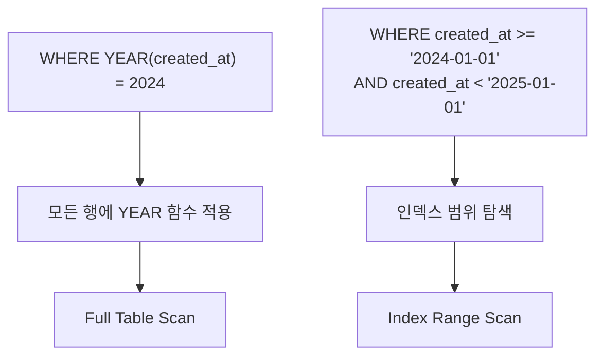
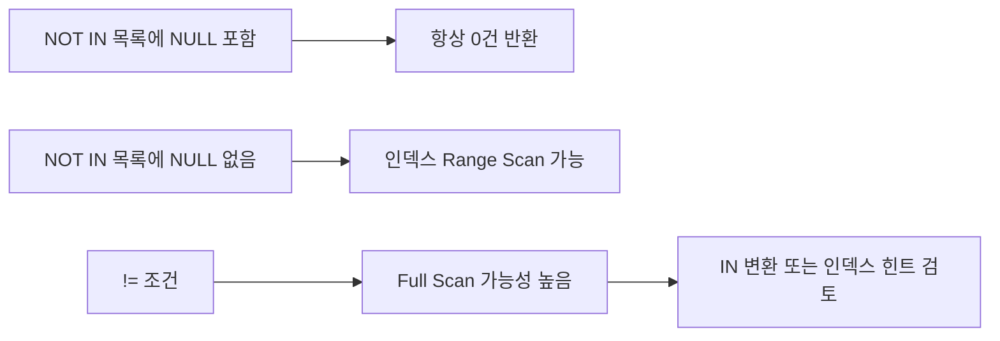

# 인덱스가 안 타는 경우

::: info 학습 목표
- 인덱스가 무력화되는 4가지 주요 패턴을 이해한다.
- 함수/연산이 적용된 컬럼에서 함수 인덱스 또는 조건 변환으로 해결한다.
- 묵시적 타입 변환을 SHOW WARNINGS로 탐지하고 타입 일치로 방지한다.
- NOT IN, !=, IS NULL의 인덱스 영향을 파악하고 대안을 적용한다.
- LIKE 선행 와일드카드를 pg_trgm GIN 또는 Full-Text Search로 대체한다.
:::

---

## 1. 컬럼에 함수/연산 적용

### 문제 패턴

WHERE 절에서 인덱스가 걸린 컬럼에 함수나 연산을 적용하면, 옵티마이저가 인덱스를 활용하지 못하고 전체 행을 스캔한다.

```sql
-- 인덱스: created_at에 인덱스 존재
-- 인덱스를 타지 않는다
SELECT * FROM orders WHERE YEAR(created_at) = 2024;
SELECT * FROM orders WHERE DATE(created_at) = '2024-01-01';

-- 인덱스: price에 인덱스 존재
-- 인덱스를 타지 않는다
SELECT * FROM products WHERE price + 100 > 500;
SELECT * FROM products WHERE price * 1.1 > 1000;
```

B-Tree 인덱스는 컬럼의 원본 값으로 정렬되어 있다. 함수를 적용하면 인덱스에 저장된 값과 비교 대상이 달라지므로 인덱스 탐색이 불가능하다.



### 해결책 1 - 조건 변환

함수를 제거하고 범위 조건으로 변환한다.

```sql
-- YEAR(created_at) = 2024 → 범위 조건으로 변환
SELECT * FROM orders
WHERE created_at >= '2024-01-01' AND created_at < '2025-01-01';

-- price + 100 > 500 → 상수를 이동
SELECT * FROM products WHERE price > 400;
```

### 해결책 2 - 함수 인덱스

조건 변환이 불가능한 경우, 함수 인덱스(Function-Based Index)를 생성한다.

```sql
-- MySQL 8.0+ 함수 인덱스
ALTER TABLE orders ADD INDEX idx_year_created ((YEAR(created_at)));

-- PostgreSQL 함수 인덱스
CREATE INDEX idx_year_created ON orders (EXTRACT(YEAR FROM created_at));
CREATE INDEX idx_lower_email ON users (LOWER(email));
```

함수 인덱스를 사용하려면 WHERE 절의 표현식이 인덱스 정의와 정확히 일치해야 한다.

---

## 2. 묵시적 타입 변환

### 문제 패턴

컬럼 타입과 비교값의 타입이 다르면 MySQL이 자동으로 타입을 변환한다. 이때 컬럼 값이 변환되면 인덱스를 사용하지 못한다.

```sql
-- phone 컬럼이 VARCHAR인 경우
-- 숫자로 비교 → VARCHAR 컬럼 전체를 INT로 변환 → Full Scan
SELECT * FROM users WHERE phone = 01012345678;

-- id 컬럼이 INT인 경우
-- 문자열로 비교 → INT를 문자열로 변환 → Full Scan
SELECT * FROM orders WHERE id = '1001';
```

**규칙**: MySQL은 숫자 ↔ 문자열 비교 시 문자열을 숫자로 변환한다. VARCHAR 컬럼에 숫자 리터럴을 넣으면 VARCHAR 컬럼의 모든 값이 숫자로 변환되어 인덱스가 무력화된다.

### SHOW WARNINGS로 확인

```sql
EXPLAIN SELECT * FROM users WHERE phone = 01012345678;
SHOW WARNINGS;
```

출력 예시:
```
Level  | Code | Message
Warning| 1292 | Incorrect integer value: '010-1234-5678' for column 'phone' at row 1
Note   | 1003 | /* select ... */ select ... where (convert(`phone`, double) = 1.012345678e10)
```

Note에서 `convert(phone, double)`이 보이면 컬럼 전체에 변환 함수가 적용된 것이므로 인덱스 스캔이 불가능하다.

### 해결책 - 타입 일치

```sql
-- 올바른 방법: 문자열 리터럴 사용
SELECT * FROM users WHERE phone = '01012345678';

-- ORM 사용 시 파라미터 타입 명시 (MyBatis 예시)
-- #{phone, jdbcType=VARCHAR}
```

애플리케이션 레이어에서 파라미터 바인딩 타입을 컬럼 타입과 일치시키는 것이 근본 해결책이다.

---

## 3. NOT IN, !=, IS NULL

### NOT IN에 NULL 포함 시 전체 FALSE

`NOT IN` 목록에 NULL이 포함되면 예상치 못한 결과가 나온다.

```sql
-- status_list에 NULL이 포함된 경우
SELECT * FROM orders WHERE status NOT IN ('CANCELED', NULL, 'DELETED');
-- 결과: 0건 (항상 빈 결과)
```

`NOT IN (a, b, NULL)`은 내부적으로 `value != a AND value != b AND value != NULL`로 처리된다. `value != NULL`은 항상 UNKNOWN이므로 전체 조건이 FALSE가 된다.

**NOT EXISTS 대안**

```sql
-- NOT IN 대신 NOT EXISTS 사용
SELECT * FROM orders o
WHERE NOT EXISTS (
    SELECT 1 FROM canceled_orders c WHERE c.order_id = o.id
);
```

### LEFT JOIN ... WHERE IS NULL 패턴

```sql
-- 특정 조건을 만족하지 않는 행을 찾을 때
SELECT o.*
FROM orders o
LEFT JOIN order_items oi ON o.id = oi.order_id
WHERE oi.id IS NULL;   -- 주문 아이템이 없는 주문
```

이 패턴은 Anti-Join으로, NOT IN이나 NOT EXISTS보다 옵티마이저가 최적화하기 유리한 경우가 있다.

### != 와 인덱스

`!=`(또는 `<>`)은 B-Tree 인덱스에서 범위 탐색이 불가능하므로 Full Scan으로 처리된다. 전체 행의 대부분을 반환하는 조건이기 때문이다.

```sql
-- 인덱스를 타지 않거나 효율이 낮다
SELECT * FROM orders WHERE status != 'CANCELED';

-- 대안: IN으로 변환
SELECT * FROM orders WHERE status IN ('PENDING', 'PROCESSING', 'COMPLETED');
```

선택도가 높은 경우(전체의 5% 이하), 옵티마이저가 인덱스를 사용할 수도 있다. EXPLAIN으로 실제 실행 계획을 확인한다.



---

## 4. LIKE 선행 와일드카드

### 인덱스를 타지 못하는 이유

```sql
-- 인덱스 사용 불가: 선행 와일드카드
SELECT * FROM products WHERE name LIKE '%keyword%';
SELECT * FROM products WHERE name LIKE '%keyword';

-- 인덱스 사용 가능: 후행 와일드카드
SELECT * FROM products WHERE name LIKE 'keyword%';
```

B-Tree 인덱스는 접두사(prefix) 기반으로 정렬된다. `'keyword%'`는 `'keyword'`로 시작하는 범위를 탐색할 수 있지만, `'%keyword'`는 시작점을 알 수 없으므로 전체를 스캔해야 한다.

### 대안 1 - PostgreSQL pg_trgm GIN 인덱스

[LIKE 검색 최적화 포스트](/posts/database/2025-09-30-likesearch)에서 pg_trgm GIN 인덱스를 상세히 다룬다.

```sql
-- 확장 설치
CREATE EXTENSION IF NOT EXISTS pg_trgm;

-- GIN 인덱스 생성
CREATE INDEX idx_products_name_trgm ON products USING GIN (name gin_trgm_ops);

-- 이제 LIKE '%keyword%' 쿼리도 인덱스를 사용한다
SELECT * FROM products WHERE name LIKE '%keyword%';
SELECT * FROM products WHERE name ILIKE '%keyword%';  -- 대소문자 무시
```

pg_trgm은 문자열을 3-gram으로 분해하여 GIN 인덱스에 저장한다. 검색어도 동일하게 3-gram으로 분해한 후 교집합을 찾는 방식이다.

### 대안 2 - MySQL Full-Text Search

```sql
-- Full-Text 인덱스 생성
ALTER TABLE products ADD FULLTEXT INDEX ft_name (name);

-- MATCH ... AGAINST 사용
SELECT * FROM products
WHERE MATCH(name) AGAINST('keyword' IN BOOLEAN MODE);

-- 부분 일치
SELECT * FROM products
WHERE MATCH(name) AGAINST('+key*' IN BOOLEAN MODE);
```

Full-Text Search는 형태소 분석을 지원하며, 한국어는 별도 플러그인(n-gram parser) 설정이 필요하다.

```sql
-- MySQL n-gram parser (한국어 지원)
ALTER TABLE products ADD FULLTEXT INDEX ft_name (name) WITH PARSER ngram;
SET GLOBAL innodb_ft_min_token_size = 2;
SET GLOBAL ngram_token_size = 2;
```

### 복합 인덱스와 LIKE 전략

[데이터베이스 CH13 인덱스 전략](/study/database/13-index-strategy)에서 복합 인덱스 기초를 다룬다.

LIKE를 복합 인덱스와 함께 사용할 때는 LIKE 컬럼을 인덱스 마지막에 배치한다.

```sql
-- (category, name) 복합 인덱스
-- category = 'ELECTRONICS' 조건으로 먼저 범위를 좁힌 후 name LIKE 'Apple%' 탐색
SELECT * FROM products
WHERE category = 'ELECTRONICS' AND name LIKE 'Apple%';
```

---

::: tip 핵심 정리
- WHERE 절의 인덱스 컬럼에 함수/연산을 적용하면 인덱스가 무력화된다. 조건을 변환하거나 함수 인덱스를 생성한다.
- VARCHAR 컬럼에 숫자 리터럴 비교 시 묵시적 타입 변환이 발생한다. SHOW WARNINGS로 탐지하고 타입을 일치시킨다.
- NOT IN 목록에 NULL이 포함되면 항상 0건을 반환한다. NOT EXISTS 또는 LEFT JOIN ... WHERE IS NULL을 사용한다.
- LIKE '%keyword%'는 B-Tree 인덱스를 사용할 수 없다. PostgreSQL은 pg_trgm GIN, MySQL은 Full-Text Search로 대체한다.
:::

## 다음 챕터

- 다음 : [N+1 쿼리 문제](/study/db-optimization/03-n-plus-one)
