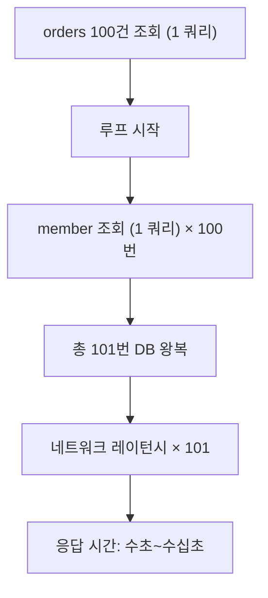
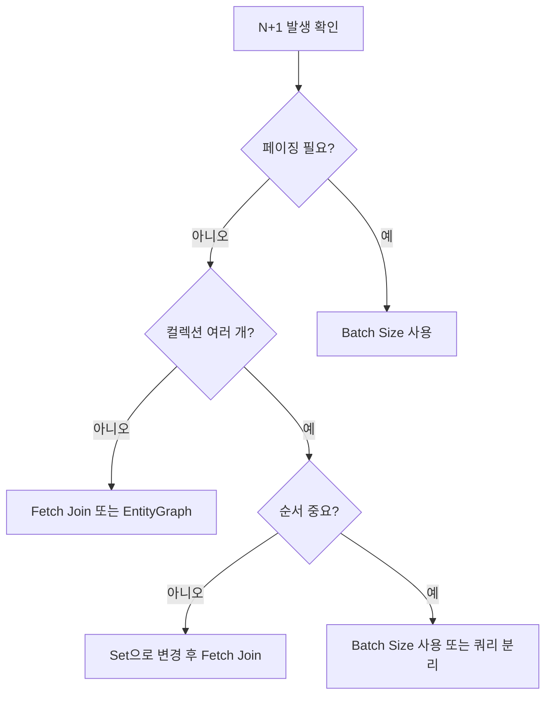

# N+1 쿼리 문제

::: info 학습 목표
- N+1 문제의 발생 원리와 치명적인 이유를 이해한다.
- Fetch Join, EntityGraph, Batch Size 세 가지 해결 전략의 장단점을 비교한다.
- Spring Data JPA에서 각 전략을 실제 코드로 적용한다.
- MultipleBagFetchException, 카테시안 곱, 페이징 제한 등 주의사항을 파악한다.
:::

---

## 1. N+1 문제란

### 정의

N+1 문제는 **부모 엔티티를 1번 조회한 후, 각 부모의 연관 엔티티를 N번 추가 조회**하는 패턴이다.

```java
// Order → Member (ManyToOne, LAZY)
List<Order> orders = orderRepository.findAll();  // 1번 쿼리

for (Order order : orders) {
    // orders가 100건이면 여기서 100번 쿼리 발생
    System.out.println(order.getMember().getName());
}
```

실제로 실행되는 SQL은 다음과 같다.

```sql
-- 1번: 전체 주문 조회
SELECT * FROM orders;

-- N번: 각 주문의 회원 조회 (orders 결과 수만큼 반복)
SELECT * FROM members WHERE id = 1;
SELECT * FROM members WHERE id = 2;
SELECT * FROM members WHERE id = 3;
-- ... 100번 반복
```

### 왜 치명적인가



단순히 쿼리 수가 많은 것이 아니라 **DB 왕복(round-trip)이 N번 발생**한다는 것이 핵심이다.

- 로컬 환경(레이턴시 0.1ms)에서는 100번 왕복 = 10ms
- 클라우드 환경(레이턴시 2ms)에서는 100번 왕복 = 200ms
- 로드가 있는 환경(레이턴시 10ms)에서는 100번 왕복 = 1000ms = 1초

N이 커질수록(데이터 증가) 선형적으로 느려지며, 커넥션 풀도 그만큼 오래 점유한다.

---

## 2. 해결 전략 비교

### 전략별 장단점

| 전략 | 발생 쿼리 수 | 페이징 | 컬렉션 여러 개 | 주의사항 |
|------|------------|--------|--------------|---------|
| Fetch Join (JPQL) | 1 | 불가 (컬렉션) | 불가 (2개 이상) | 카테시안 곱, DISTINCT 필요 |
| @EntityGraph | 1 | 불가 (컬렉션) | 불가 (2개 이상) | Fetch Join과 동일한 제약 |
| Batch Size | 1 + N/배치크기 | 가능 | 가능 | IN 절 크기 제한 |

### Fetch Join

JPQL에서 JOIN FETCH를 사용하면 연관 엔티티를 한 번의 쿼리로 가져온다.

```sql
-- 생성되는 SQL
SELECT o.*, m.*
FROM orders o
INNER JOIN members m ON o.member_id = m.id;
```

**특징**

- 1번의 쿼리로 부모 + 연관 엔티티를 함께 로드한다.
- 컬렉션(OneToMany) fetch join 시 카테시안 곱이 발생하므로 DISTINCT가 필요하다.
- 컬렉션 fetch join과 페이징을 함께 사용하면 HibernateJpaDialect가 메모리에서 페이징을 수행하여 위험하다.

### @EntityGraph

`@EntityGraph`는 JPA 표준으로, Spring Data JPA 메서드에 쉽게 적용할 수 있다.

**특징**

- 코드 가독성이 높다.
- 내부적으로 Fetch Join과 동일하게 동작한다.
- 동일한 페이징 제약이 있다.

### Batch Size

연관 엔티티를 IN 절로 묶어서 조회한다.

```sql
-- Batch Size 100 설정 시
-- 1번: 주문 조회
SELECT * FROM orders LIMIT 20;

-- 2번: 20명의 member를 IN 절로 한 번에 조회
SELECT * FROM members WHERE id IN (1, 2, 3, ..., 20);
```

**특징**

- 페이징과 함께 사용할 수 있다.
- 컬렉션이 여러 개여도 각각 IN 절로 처리되어 MultipleBagFetchException이 발생하지 않는다.
- 쿼리 수는 `1 + ceil(N / batch_size)`개이다.

---

## 3. 실전 코드 패턴

### Fetch Join - @Query + JOIN FETCH

```java
@Repository
public interface OrderRepository extends JpaRepository<Order, Long> {

    // 단건 연관: Member fetch join
    @Query("SELECT o FROM Order o JOIN FETCH o.member WHERE o.id = :id")
    Optional<Order> findByIdWithMember(@Param("id") Long id);

    // 컬렉션 fetch join + DISTINCT
    @Query("SELECT DISTINCT o FROM Order o JOIN FETCH o.orderItems WHERE o.status = :status")
    List<Order> findAllWithItemsByStatus(@Param("status") OrderStatus status);
}
```

```java
// 서비스 레이어 사용
@Transactional(readOnly = true)
public List<OrderResponse> getOrdersByStatus(OrderStatus status) {
    List<Order> orders = orderRepository.findAllWithItemsByStatus(status);
    return orders.stream()
        .map(OrderResponse::from)
        .collect(Collectors.toList());
}
```

### @EntityGraph

```java
@Repository
public interface OrderRepository extends JpaRepository<Order, Long> {

    // 단일 연관 엔티티
    @EntityGraph(attributePaths = {"member"})
    List<Order> findByStatus(OrderStatus status);

    // 중첩 연관 엔티티
    @EntityGraph(attributePaths = {"member", "orderItems", "orderItems.product"})
    Optional<Order> findWithAllById(Long id);
}
```

```java
// Named EntityGraph 방식 (엔티티에 정의)
@Entity
@NamedEntityGraph(
    name = "Order.withMember",
    attributeNodes = @NamedAttributeNode("member")
)
public class Order {
    // ...
}

// Repository에서 참조
@EntityGraph("Order.withMember")
List<Order> findByCreatedAtBetween(LocalDateTime from, LocalDateTime to);
```

### Batch Size 설정

**전역 설정 (application.yml)**

```yaml
spring:
  jpa:
    properties:
      hibernate:
        default_batch_fetch_size: 100
```

**엔티티 개별 설정**

```java
@Entity
public class Order {

    @BatchSize(size = 100)
    @OneToMany(mappedBy = "order", fetch = FetchType.LAZY)
    private List<OrderItem> orderItems = new ArrayList<>();

    @BatchSize(size = 50)
    @ManyToOne(fetch = FetchType.LAZY)
    @JoinColumn(name = "member_id")
    private Member member;
}
```

**페이징과 함께 사용하는 패턴**

```java
@Repository
public interface OrderRepository extends JpaRepository<Order, Long> {

    // Batch Size 적용 상태에서 페이징 가능
    Page<Order> findByStatus(OrderStatus status, Pageable pageable);
}
```

```java
@Transactional(readOnly = true)
public Page<OrderResponse> getOrders(OrderStatus status, int page, int size) {
    Pageable pageable = PageRequest.of(page, size, Sort.by("createdAt").descending());
    Page<Order> orderPage = orderRepository.findByStatus(status, pageable);

    // 페이지의 Order들에 대해 orderItems를 IN 절로 일괄 조회 (Batch Size 동작)
    return orderPage.map(OrderResponse::from);
}
```

---

## 4. 주의사항

### MultipleBagFetchException

컬렉션(List) 타입 연관 엔티티를 2개 이상 동시에 fetch join하면 예외가 발생한다.

```java
// 잘못된 예시: List 타입 컬렉션 2개를 동시에 fetch join
@Query("SELECT o FROM Order o JOIN FETCH o.orderItems JOIN FETCH o.payments")
List<Order> findAllWithItemsAndPayments();
// → org.hibernate.loader.MultipleBagFetchException 발생
```

**해결책 1 - Set 타입 사용**

```java
@OneToMany(mappedBy = "order")
private Set<OrderItem> orderItems = new HashSet<>();  // List → Set

@OneToMany(mappedBy = "order")
private Set<Payment> payments = new HashSet<>();
```

Set은 중복을 허용하지 않으므로 카테시안 곱의 중복 행이 자연스럽게 제거된다. 단, 순서가 보장되지 않는다.

**해결책 2 - 쿼리 분리 + Batch Size**

```java
// fetch join은 하나의 컬렉션에만 적용
@Query("SELECT DISTINCT o FROM Order o JOIN FETCH o.orderItems WHERE o.id IN :ids")
List<Order> findWithItemsByIds(@Param("ids") List<Long> ids);

// payments는 Batch Size로 처리
```

### 카테시안 곱 주의

OneToMany fetch join 시 조인 결과로 카테시안 곱이 발생한다.

```sql
-- Order 1건에 OrderItem 3건이면 조인 결과는 3행
SELECT o.*, oi.*
FROM orders o
INNER JOIN order_items oi ON o.id = oi.order_id
WHERE o.id = 1;
-- → 3행 반환 (같은 order가 3번 반복)
```

JPQL에서 `DISTINCT`를 사용하거나, 결과를 `Set`에 담으면 엔티티 수준에서 중복이 제거된다.

```java
@Query("SELECT DISTINCT o FROM Order o JOIN FETCH o.orderItems")
List<Order> findAllWithItems();
```

### IN 절 최대 개수 제한

Batch Size 사용 시 IN 절에 포함되는 ID 수가 DBMS 제한을 초과하면 안 된다.

| DBMS | IN 절 제한 |
|------|----------|
| MySQL | 제한 없음 (단, 쿼리 길이 max_allowed_packet 이하) |
| PostgreSQL | 제한 없음 (단, 성능상 수백~수천이 적절) |
| Oracle | 1,000개 |

Oracle을 사용하는 경우 `default_batch_fetch_size`를 1,000 이하로 설정해야 한다. 실제로는 100~500 사이가 성능과 안전성 면에서 균형이 맞다.



---

::: tip 핵심 정리
- N+1 문제는 부모 1번 조회 후 연관 엔티티를 N번 추가 조회하는 패턴으로, DB 왕복 비용이 선형적으로 증가한다.
- Fetch Join과 EntityGraph는 1번의 쿼리로 해결하지만 컬렉션 페이징과 함께 사용할 수 없다.
- Batch Size는 IN 절로 묶어 처리하며, 페이징과 컬렉션 여러 개에 모두 사용할 수 있다.
- List 타입 컬렉션 2개 이상을 동시에 fetch join하면 MultipleBagFetchException이 발생한다. Set으로 변경하거나 쿼리를 분리한다.
:::

## 다음 챕터

- 다음 : [쿼리 리팩토링](/study/db-optimization/04-query-refactoring)
