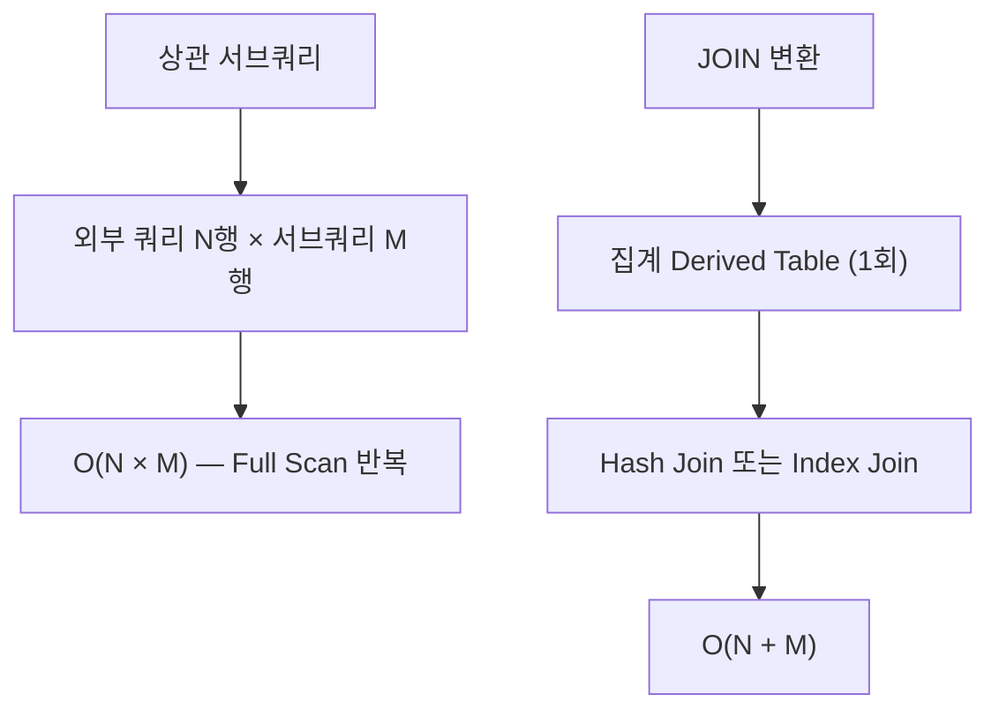
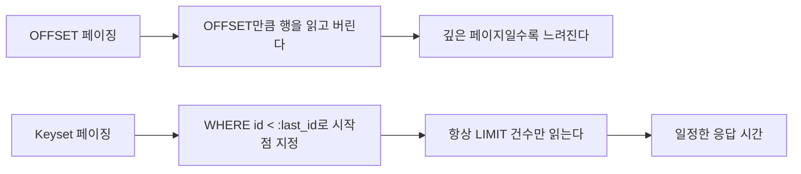
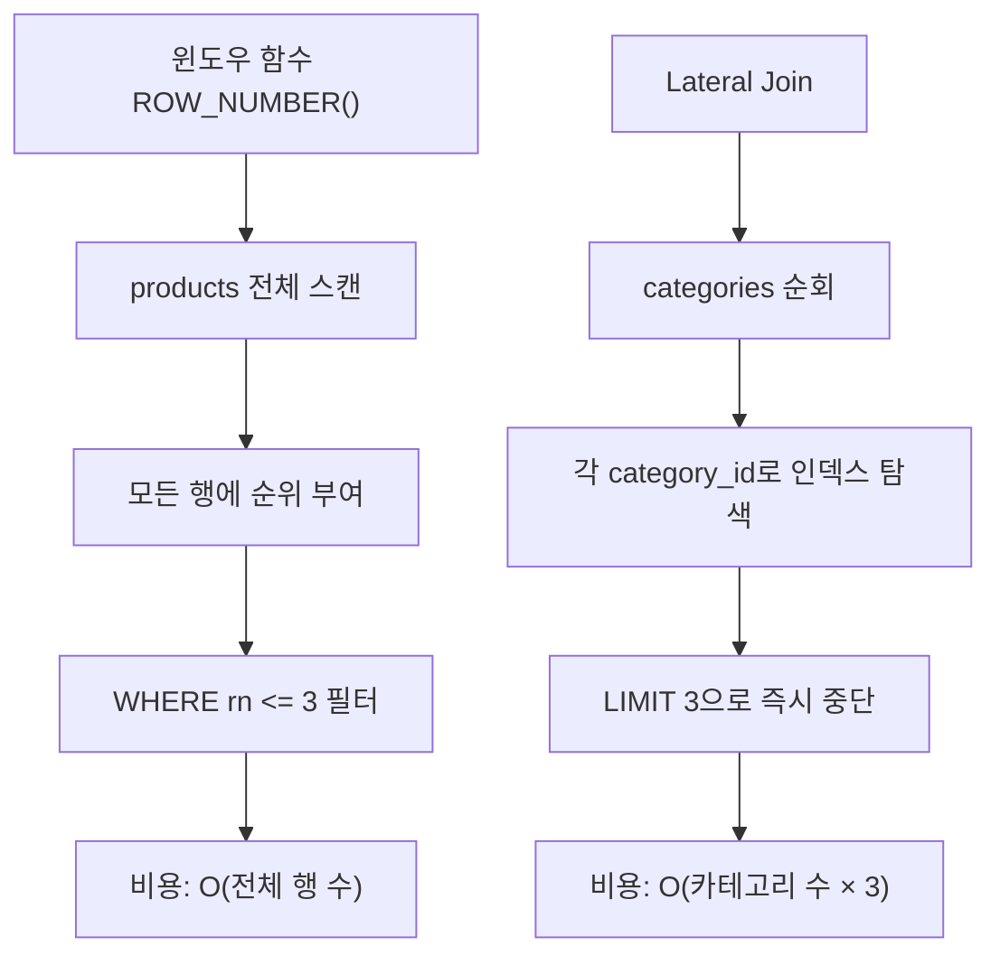

# 쿼리 리팩토링

::: info 학습 목표
- 상관 서브쿼리를 JOIN으로 변환하여 Hash Join을 활용한다.
- OFFSET 페이징이 느린 이유를 이해하고 Keyset 페이징으로 대체한다.
- Covering Index를 설계하여 Index Only Scan을 달성한다.
- Lateral Join으로 Top-N 행별 쿼리를 효율적으로 처리한다.
:::

---

## 1. 서브쿼리 → JOIN 변환

### 상관 서브쿼리의 문제

상관 서브쿼리(Correlated Subquery)는 외부 쿼리의 각 행에 대해 서브쿼리를 반복 실행한다. 시간 복잡도는 O(N × M)이다.

```sql
-- 상관 서브쿼리: 각 상품에 대해 서브쿼리를 반복 실행
SELECT p.id, p.name, p.price
FROM products p
WHERE p.price > (
    SELECT AVG(price)
    FROM products
    WHERE category_id = p.category_id   -- 외부 쿼리의 p.category_id 참조
);
```

실행 계획에서 다음과 같이 나타난다.

```
-> Filter: (p.price > (select #2))
    -> Table scan on p  (rows: 50000)
        -> Select #2 (correlated)
            -> Aggregate: avg(price)
                -> Index lookup on products using idx_category
```

50,000개 상품이 있고 카테고리가 100개라면 서브쿼리가 최대 50,000번 실행된다.

### JOIN으로 변환

```sql
-- JOIN + 집계로 변환: 카테고리별 평균을 1번만 계산
SELECT p.id, p.name, p.price
FROM products p
INNER JOIN (
    SELECT category_id, AVG(price) AS avg_price
    FROM products
    GROUP BY category_id
) cat_avg ON p.category_id = cat_avg.category_id
WHERE p.price > cat_avg.avg_price;
```

서브쿼리를 Derived Table로 먼저 집계한 후 JOIN한다. 집계는 1번만 실행되므로 O(N + M)이다.

**EXPLAIN 비교**

```sql
-- 변환 전 실행 계획
EXPLAIN SELECT p.id, p.name, p.price FROM products p
WHERE p.price > (SELECT AVG(price) FROM products WHERE category_id = p.category_id);
-- type: ALL, Extra: Using where; Correlated subquery

-- 변환 후 실행 계획
EXPLAIN SELECT p.id, p.name, p.price FROM products p
INNER JOIN (SELECT category_id, AVG(price) avg_price FROM products GROUP BY category_id) a
ON p.category_id = a.category_id WHERE p.price > a.avg_price;
-- type: ref, Extra: Using index, Hash Join
```



---

## 2. OFFSET 페이징 vs Keyset 페이징

### OFFSET이 깊은 페이지에서 느린 이유

```sql
-- 10,000번째 페이지 (페이지당 10건)
SELECT * FROM orders ORDER BY created_at DESC LIMIT 10 OFFSET 100000;
```

OFFSET은 결과를 건너뛰는 것이 아니라 **앞의 행을 모두 읽은 후 버리는** 방식이다. OFFSET 100,000은 100,000개 행을 스캔한 후 그 중 10개만 반환한다.

```
실행 비용 ∝ OFFSET + LIMIT
OFFSET 0    → 10행 읽기
OFFSET 1000 → 1,010행 읽기
OFFSET 100000 → 100,010행 읽기
```

인덱스가 있어도 인덱스를 100,010번 탐색해야 하므로 페이지 번호가 커질수록 선형적으로 느려진다.

### Keyset(Seek) 페이징

마지막으로 읽은 행의 기준값을 다음 페이지의 시작점으로 사용한다.

```sql
-- 첫 번째 페이지
SELECT id, title, created_at
FROM posts
ORDER BY id DESC
LIMIT 10;
-- 마지막 행의 id = 9991

-- 두 번째 페이지: 마지막 id보다 작은 값부터
SELECT id, title, created_at
FROM posts
WHERE id < 9991        -- :last_id 파라미터
ORDER BY id DESC
LIMIT 10;
```

`WHERE id < :last_id`는 인덱스 Range Scan으로 처리되므로 항상 10건만 읽는다. 페이지 번호와 무관하게 일정한 성능을 보인다.

**벤치마크 비교**

| 조건 | OFFSET 방식 | Keyset 방식 |
|------|------------|------------|
| 1페이지 (offset 0) | ~1ms | ~1ms |
| 100페이지 (offset 990) | ~5ms | ~1ms |
| 1,000페이지 (offset 9,990) | ~50ms | ~1ms |
| 10,000페이지 (offset 99,990) | ~500ms | ~1ms |

**단점**

- 임의 페이지 점프가 불가능하다. "5페이지로 이동" 같은 기능을 구현할 수 없다.
- 정렬 기준 컬럼이 고유해야 한다. 고유하지 않으면 복합 키를 사용한다.

```sql
-- created_at이 중복 가능한 경우: (created_at, id) 복합 커서 사용
SELECT id, title, created_at
FROM posts
WHERE (created_at, id) < (:last_created_at, :last_id)
ORDER BY created_at DESC, id DESC
LIMIT 10;
```



---

## 3. Covering Index 활용

### Index Only Scan 원리

일반적인 인덱스 조회는 두 단계로 진행된다.

1. 인덱스에서 조건에 맞는 행의 위치(Primary Key 또는 ROWID) 탐색
2. 실제 테이블(Heap)에서 해당 행을 읽어 나머지 컬럼 조회

Covering Index는 **SELECT 절에 필요한 컬럼까지 인덱스에 포함**시켜 2단계(테이블 접근)를 제거한다.

```sql
-- 인덱스: (user_id, status)만 있는 경우
SELECT id, user_id, status, created_at
FROM orders
WHERE user_id = 100 AND status = 'PENDING';
-- → 인덱스로 (user_id, status) 조건 탐색 후 테이블에서 id, created_at을 별도 조회

-- Covering Index: (user_id, status, created_at, id) 생성
CREATE INDEX idx_orders_covering ON orders (user_id, status, created_at, id);
-- → 인덱스만으로 모든 컬럼 반환 가능 (Index Only Scan)
```

### EXPLAIN으로 확인

```sql
EXPLAIN SELECT id, user_id, status, created_at
FROM orders
WHERE user_id = 100 AND status = 'PENDING';
```

**MySQL 출력 (Extra 컬럼)**

```
Extra: Using index          -- Index Only Scan (테이블 미접근)
Extra: Using where          -- 테이블 접근 후 WHERE 필터
Extra: Using index condition -- ICP(Index Condition Pushdown) 적용
```

**PostgreSQL 출력**

```
Index Only Scan using idx_orders_covering on orders  (cost=0.43..4.45 rows=1)
  Index Cond: ((user_id = 100) AND (status = 'PENDING'))
  Heap Fetches: 0    -- 0이면 완전한 Index Only Scan
```

### 설계 원칙

1. WHERE 조건 컬럼을 인덱스 앞쪽에 배치한다.
2. ORDER BY 컬럼을 그 다음에 배치한다.
3. SELECT 컬럼을 마지막에 추가한다.

```sql
-- 쿼리 패턴
SELECT id, total_price, created_at
FROM orders
WHERE user_id = ? AND status = ?
ORDER BY created_at DESC;

-- Covering Index 설계: (조건) + (정렬) + (SELECT)
CREATE INDEX idx_orders_cov ON orders (user_id, status, created_at DESC, id, total_price);
```

**단점**

- 인덱스 크기가 증가한다. 많은 컬럼을 포함할수록 인덱스 파일이 커진다.
- INSERT/UPDATE 성능이 저하된다. 인덱스 유지 비용이 늘어난다.
- 쓰기가 잦은 테이블에는 신중하게 적용해야 한다.

---

## 4. Lateral Join

### 활용 시나리오

각 카테고리별 최신 상품 3개를 조회하는 쿼리를 예로 든다.

```sql
-- 방법 1: 서브쿼리 (비효율)
SELECT * FROM products p
WHERE p.id IN (
    SELECT id FROM products
    WHERE category_id = p.category_id
    ORDER BY created_at DESC
    LIMIT 3
);
-- → 상관 서브쿼리로 카테고리마다 반복 실행

-- 방법 2: 윈도우 함수
SELECT * FROM (
    SELECT *, ROW_NUMBER() OVER (PARTITION BY category_id ORDER BY created_at DESC) AS rn
    FROM products
) ranked
WHERE rn <= 3;
-- → 전체 테이블 스캔 후 윈도우 함수 적용
```

### Lateral Join 사용

```sql
-- PostgreSQL Lateral Join
SELECT c.id AS category_id, c.name AS category_name, p.*
FROM categories c
CROSS JOIN LATERAL (
    SELECT id, name, price, created_at
    FROM products
    WHERE category_id = c.id
    ORDER BY created_at DESC
    LIMIT 3
) p;
```

LATERAL은 서브쿼리가 외부 테이블(categories)의 각 행을 참조할 수 있게 한다. 각 카테고리에 대해 서브쿼리가 실행되지만, 서브쿼리 내부에서 인덱스를 활용한 LIMIT으로 3건만 읽는다.

**MySQL에서의 Lateral Join**

```sql
-- MySQL 8.0.14+
SELECT c.id, c.name, p.*
FROM categories c
JOIN LATERAL (
    SELECT id, name, price
    FROM products
    WHERE category_id = c.id
    ORDER BY created_at DESC
    LIMIT 3
) p ON TRUE;
```

### 윈도우 함수 대비 성능 이점

[Lateral Join 포스트](/posts/database/2025-04-20-leteraljoin)에서 실측 벤치마크(0.273ms vs 1.170ms)를 다룬다.

윈도우 함수는 파티션 내 모든 행에 순위를 매긴 후 필터링한다. 반면 Lateral Join은 각 파티션(카테고리)에서 인덱스로 TOP-N만 읽는다.



**성능이 유리한 경우**

- 파티션(그룹) 수가 많고 각 파티션에서 소수의 행만 필요할 때
- 파티션 키 + 정렬 키로 구성된 복합 인덱스가 존재할 때

[데이터베이스 CH12 실행 계획](/study/database/12-execution-plan)에서 물리적 조인 알고리즘(Hash Join, Nested Loop Join, Merge Join)의 비용 모델을 다룬다.

---

::: tip 핵심 정리
- 상관 서브쿼리는 O(N × M) 비용이 발생한다. Derived Table + JOIN으로 변환하면 Hash Join이 적용되어 O(N + M)이 된다.
- OFFSET 페이징은 깊은 페이지일수록 선형적으로 느려진다. Keyset 방식(WHERE id < :last_id)으로 교체하면 항상 일정한 성능을 보인다.
- Covering Index는 SELECT 컬럼까지 인덱스에 포함시켜 테이블 접근을 제거한다. EXPLAIN Extra에서 Using index로 확인한다.
- Lateral Join은 각 그룹에서 TOP-N을 인덱스로 읽어 윈도우 함수보다 효율적이다. 복합 인덱스가 있을 때 특히 유리하다.
:::

## 다음 챕터

- 다음 : [Soft Delete와 아카이빙](/study/db-optimization/05-soft-delete)
