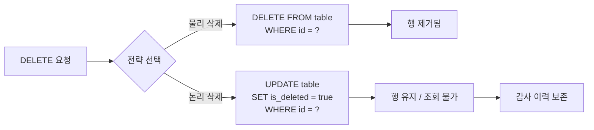
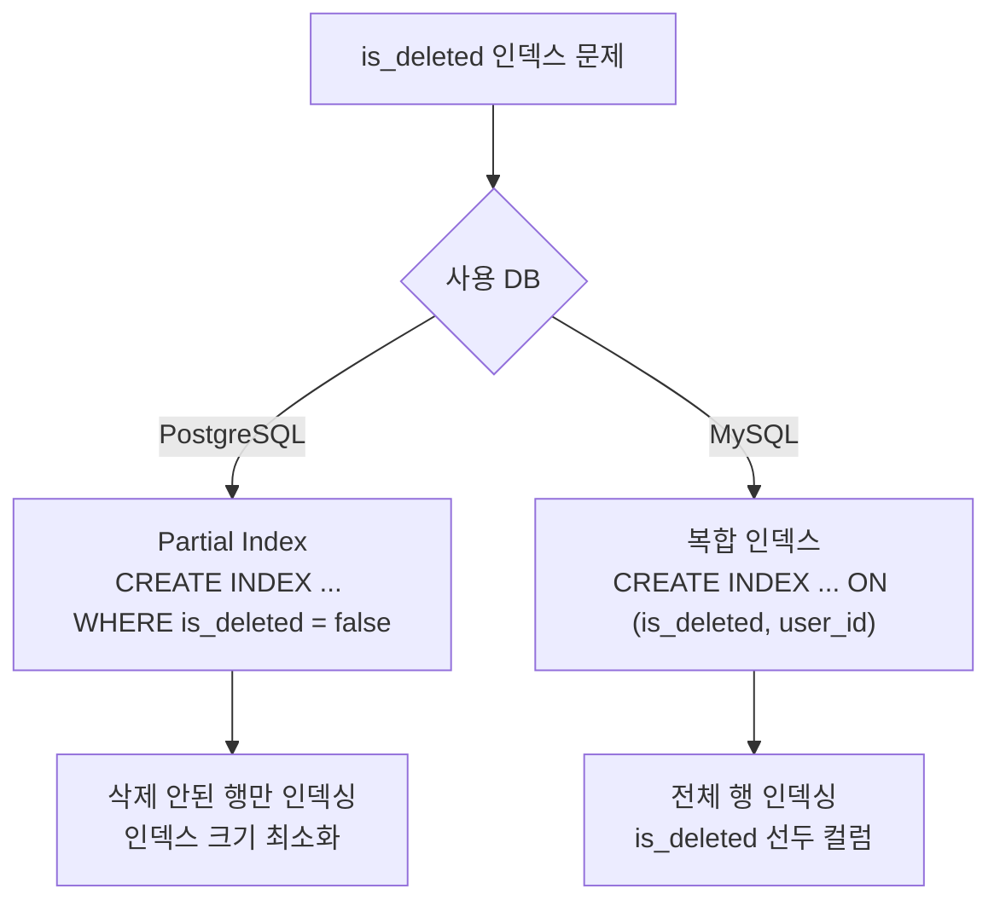
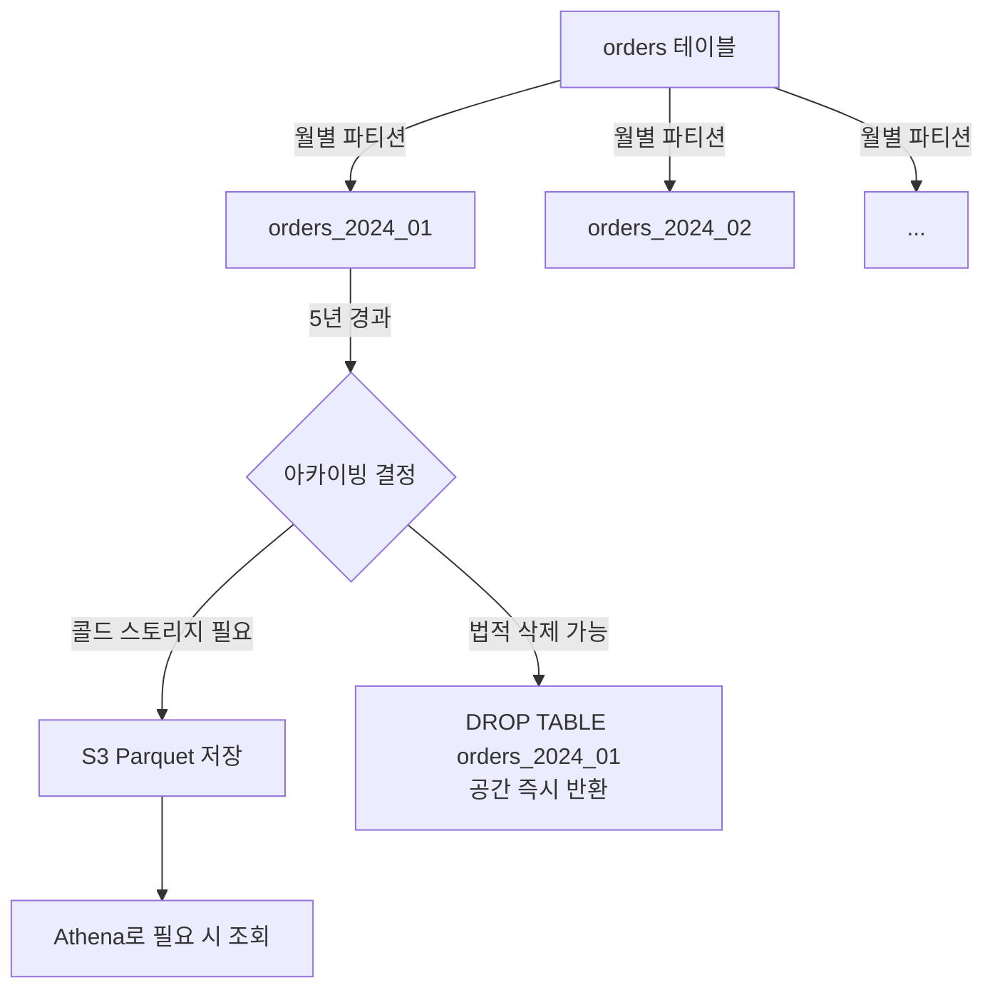

# Soft Delete와 아카이빙

::: info 학습 목표
- 물리 삭제와 논리 삭제의 차이와 각각의 적합한 사용 상황을 설명할 수 있다.
- is_deleted 컬럼이 인덱스 성능에 미치는 영향과 Partial Index 해결 방식을 설명할 수 있다.
- JPA에서 @SQLDelete와 @Where 어노테이션으로 Soft Delete를 자동화할 수 있다.
- 파티션 기반 아카이빙의 동작 방식과 DROP PARTITION의 이점을 설명할 수 있다.
:::

---

## 1. Soft Delete란

### 물리 삭제 vs 논리 삭제

데이터를 "삭제"하는 방법은 크게 두 가지다.

**물리 삭제(Hard Delete)**는 `DELETE` 문으로 행을 DB에서 완전히 제거한다.

```sql
DELETE FROM orders WHERE id = 42;
```

**논리 삭제(Soft Delete)**는 행을 실제로 지우지 않고, 삭제 여부를 나타내는 컬럼 값만 변경한다.

```sql
UPDATE orders SET is_deleted = true, deleted_at = NOW() WHERE id = 42;
```

### 감사 추적 장점

논리 삭제를 사용하면 다음과 같은 이점을 얻는다.

- 삭제된 데이터를 언제든 복구할 수 있다.
- `deleted_at`, `deleted_by` 컬럼으로 누가 언제 삭제했는지 추적이 가능하다.
- 규제 준수(금융, 의료) 환경에서 감사 이력을 유지해야 할 때 필수적으로 활용된다.

### is_deleted 필터 문제

논리 삭제의 핵심 문제는 모든 SELECT 쿼리에 `WHERE is_deleted = false` 조건이 필요하다는 점이다.

```sql
-- 모든 쿼리에 조건을 빠뜨리면 삭제된 데이터가 노출된다
SELECT * FROM orders WHERE user_id = 100;                        -- 위험
SELECT * FROM orders WHERE user_id = 100 AND is_deleted = false; -- 올바름
```

이 조건을 빠뜨리면 삭제된 데이터가 조회 결과에 포함되는 버그가 발생한다. 조건 누락은 실수하기 쉬우므로, ORM 레벨에서 자동화하는 방법이 권장된다.



---

## 2. 인덱스 영향

### 카디널리티 문제

인덱스의 효율은 카디널리티(Cardinality), 즉 컬럼이 가질 수 있는 고유 값의 수에 크게 의존한다. `is_deleted` 컬럼은 `true` 또는 `false` 두 가지 값만 가지므로 카디널리티가 2에 불과하다.

실무 환경에서 삭제된 데이터 비율은 보통 1~5% 수준이다. 즉 전체 행의 95~99%가 `is_deleted = false`다. DB 옵티마이저는 이렇게 선택도가 낮은 컬럼에 인덱스가 있어도 인덱스를 타지 않고 풀 스캔을 선택할 가능성이 높다.

```sql
-- 이 인덱스는 is_deleted의 카디널리티가 낮아 효과가 거의 없다
CREATE INDEX idx_orders_deleted ON orders(is_deleted, user_id);

-- 옵티마이저가 풀 스캔을 선택할 수 있다
EXPLAIN SELECT * FROM orders WHERE is_deleted = false AND user_id = 100;
```

### PostgreSQL Partial Index

PostgreSQL은 특정 조건을 만족하는 행만 인덱싱하는 Partial Index를 지원한다.

```sql
-- is_deleted = false인 행만 인덱싱
CREATE INDEX idx_orders_active_user ON orders(user_id)
WHERE is_deleted = false;
```

이 인덱스는 삭제되지 않은 행만 포함하므로 크기가 작고 선택도가 높다. `WHERE is_deleted = false AND user_id = ?` 쿼리를 매우 효율적으로 처리한다.

### MySQL 대안: 복합 인덱스

MySQL은 Partial Index를 지원하지 않는다. 대신 `(is_deleted, user_id)` 복합 인덱스를 사용한다.

```sql
CREATE INDEX idx_orders_deleted_user ON orders(is_deleted, user_id);
```

`is_deleted` 값으로 먼저 필터링한 뒤 `user_id`로 범위를 좁히는 방식이다. PostgreSQL Partial Index에 비해 인덱스 크기는 크지만, 없는 것보다는 쿼리 성능이 향상된다.



---

## 3. JPA에서의 자동화

### @SQLDelete + @Where 조합

JPA에서 엔티티에 `@SQLDelete`와 `@Where` 어노테이션을 사용하면, 삭제 조건 추가를 자동화할 수 있다.

```java
@Entity
@Table(name = "orders")
@SQLDelete(sql = "UPDATE orders SET is_deleted = true, deleted_at = NOW() WHERE id = ?")
@Where(clause = "is_deleted = false")
public class Order {

    @Id
    @GeneratedValue(strategy = GenerationType.IDENTITY)
    private Long id;

    private Long userId;

    @Column(name = "is_deleted")
    private boolean deleted = false;

    private LocalDateTime deletedAt;
}
```

- `@SQLDelete`: `repository.delete(order)` 호출 시 실제 DELETE 대신 지정한 UPDATE 문이 실행된다.
- `@Where`: 이 엔티티를 조회하는 모든 JPQL/HQL에 자동으로 `is_deleted = false` 조건이 추가된다.

### deleteAll() 벌크 쿼리 미적용 주의

`@SQLDelete`는 단건 삭제에만 적용된다. `deleteAll()` 또는 `@Modifying @Query`로 실행하는 벌크 DELETE는 `@SQLDelete`를 거치지 않고 실제 DELETE가 실행된다.

```java
// @SQLDelete 적용됨 (단건 삭제)
orderRepository.delete(order);

// @SQLDelete 미적용 (벌크 삭제) - 실제 DELETE 실행됨
orderRepository.deleteAll(orders); // 주의 필요

// 벌크 논리 삭제는 별도 쿼리를 작성해야 한다
@Modifying
@Query("UPDATE Order o SET o.deleted = true, o.deletedAt = :now WHERE o.id IN :ids")
void softDeleteByIds(@Param("ids") List<Long> ids, @Param("now") LocalDateTime now);
```

### 글로벌 필터 패턴

Hibernate Filter를 사용하면 `@Where`보다 유연하게 조건을 제어할 수 있다. 필터를 활성화/비활성화할 수 있어 관리자 기능처럼 삭제된 데이터도 조회해야 하는 경우에 유용하다.

```java
@Entity
@FilterDef(name = "deletedFilter", parameters = @ParamDef(name = "isDeleted", type = Boolean.class))
@Filter(name = "deletedFilter", condition = "is_deleted = :isDeleted")
public class Order { ... }

// 필터 활성화 (삭제된 데이터 제외)
Session session = entityManager.unwrap(Session.class);
session.enableFilter("deletedFilter").setParameter("isDeleted", false);
```

---

## 4. 파티션 기반 아카이빙

### 오래된 데이터 이관 전략

논리 삭제 데이터가 누적되면 테이블 크기가 계속 커진다. 조회 성능 저하와 인덱스 비대화를 막기 위해 오래된 데이터를 별도 저장소로 이관하는 아카이빙이 필요하다.

일반적인 이관 방법은 배치 잡으로 오래된 데이터를 아카이브 테이블에 INSERT하고 원본에서 DELETE하는 것이다.

```sql
-- 아카이브 테이블 생성
CREATE TABLE orders_archive LIKE orders;

-- 6개월 이상 된 논리 삭제 데이터 이관
INSERT INTO orders_archive
SELECT * FROM orders
WHERE is_deleted = true AND deleted_at < NOW() - INTERVAL '6 months';

DELETE FROM orders
WHERE is_deleted = true AND deleted_at < NOW() - INTERVAL '6 months';
```

### DROP PARTITION으로 공간 즉시 회수

파티션 테이블을 사용하면 아카이빙을 훨씬 효율적으로 처리할 수 있다. DELETE는 각 행을 하나씩 처리해 느리고 디스크 공간도 즉시 반환되지 않는다. 반면 DROP PARTITION은 파티션 전체를 O(1)로 삭제하며 공간을 즉시 회수한다.

```sql
-- 날짜 기반 파티셔닝으로 orders 테이블 생성 (PostgreSQL)
CREATE TABLE orders (
    id          BIGINT NOT NULL,
    user_id     BIGINT NOT NULL,
    created_at  TIMESTAMP NOT NULL,
    is_deleted  BOOLEAN DEFAULT false
) PARTITION BY RANGE (created_at);

CREATE TABLE orders_2023 PARTITION OF orders
    FOR VALUES FROM ('2023-01-01') TO ('2024-01-01');

CREATE TABLE orders_2024 PARTITION OF orders
    FOR VALUES FROM ('2024-01-01') TO ('2025-01-01');

-- 2023년 데이터 전체를 O(1)로 제거 (공간 즉시 반환)
DROP TABLE orders_2023;
```

### 실무 사례: 주문 이력 아카이빙

대형 이커머스에서 주문 이력은 법적 보존 기간(보통 5년) 이후 아카이빙 대상이 된다. 아래는 실무에서 사용하는 파티션 기반 아카이빙 흐름이다.



파티션 없이 배치 DELETE를 사용하면 수억 건 삭제 시 테이블 락, 복제 지연, I/O 과부하가 발생할 수 있다. 파티션 기반 설계가 아카이빙을 안전하고 빠르게 만든다.

---

::: tip 핵심 정리
- Soft Delete는 `is_deleted` 컬럼으로 논리적 삭제를 표현하며 감사 추적, 복구가 가능하다. 모든 쿼리에 필터 조건 추가가 필수다.
- `is_deleted`의 카디널리티는 2로 매우 낮다. PostgreSQL Partial Index, MySQL 복합 인덱스로 해결한다.
- JPA에서 `@SQLDelete` + `@Where`로 단건 삭제를 자동화한다. 벌크 삭제는 별도 쿼리가 필요하다.
- 파티션 기반 아카이빙은 `DROP PARTITION`으로 공간을 O(1)에 즉시 회수할 수 있어 대용량 테이블에 유리하다.
:::

## 다음 챕터

[데이터베이스 CH8 정규화](/study/database/08-normalization)에서 이상 현상과 테이블 설계 기초를 다룬다.

- 다음 : [반정규화 실전](/study/db-optimization/06-denormalization)
