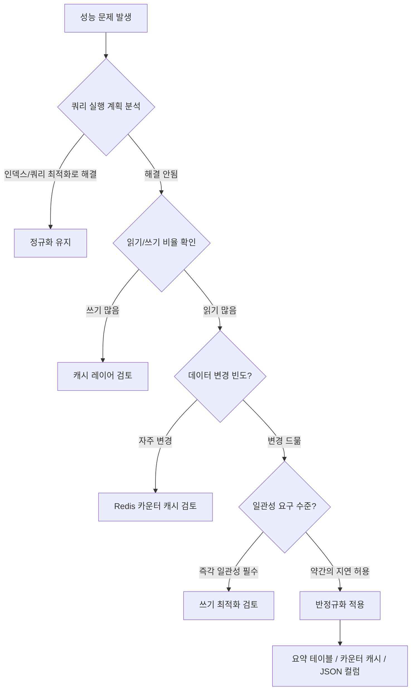
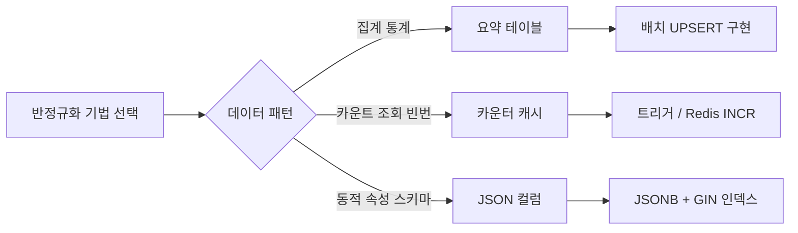

# 반정규화 실전

::: info 학습 목표
- 요약 테이블(Summary Table)의 개념과 UPSERT 패턴을 구현할 수 있다.
- 카운터 캐시의 동시성 문제와 Redis INCR 대안을 설명할 수 있다.
- PostgreSQL JSONB + GIN 인덱스를 활용한 동적 속성 저장 방식을 이해한다.
- 읽기/쓰기 비율, 변경 빈도, 일관성 요구 수준을 기준으로 반정규화 적용 여부를 판단할 수 있다.
:::

---

## 1. 요약 테이블(Summary Table)

### 집계 쿼리의 비용

대용량 테이블에서 매번 집계 쿼리를 실행하면 성능 문제가 발생한다.

```sql
-- 매 요청마다 수억 건 orders를 스캔해 집계 (느림)
SELECT
    DATE(created_at) AS order_date,
    COUNT(*) AS order_count,
    SUM(amount) AS total_amount
FROM orders
WHERE created_at >= '2024-01-01'
GROUP BY DATE(created_at);
```

트래픽이 높은 서비스에서 이 쿼리를 실시간으로 실행하면 DB에 큰 부하가 발생한다.

### daily_order_stats 예시

배치 잡으로 미리 집계 결과를 별도 테이블에 저장해두면 조회가 밀리초 단위로 줄어든다.

```sql
-- 요약 테이블 생성
CREATE TABLE daily_order_stats (
    order_date   DATE PRIMARY KEY,
    order_count  INT NOT NULL DEFAULT 0,
    total_amount BIGINT NOT NULL DEFAULT 0,
    updated_at   TIMESTAMP NOT NULL DEFAULT NOW()
);

-- 매일 자정 배치로 전일 집계 데이터 UPSERT
INSERT INTO daily_order_stats (order_date, order_count, total_amount, updated_at)
SELECT
    DATE(created_at) AS order_date,
    COUNT(*) AS order_count,
    SUM(amount) AS total_amount,
    NOW()
FROM orders
WHERE DATE(created_at) = CURRENT_DATE - INTERVAL '1 day'
GROUP BY DATE(created_at)
ON CONFLICT (order_date) DO UPDATE SET
    order_count  = EXCLUDED.order_count,
    total_amount = EXCLUDED.total_amount,
    updated_at   = EXCLUDED.updated_at;
```

### UPSERT 패턴

`ON CONFLICT ... DO UPDATE`(PostgreSQL) 또는 `INSERT ... ON DUPLICATE KEY UPDATE`(MySQL)을 사용하면 데이터가 없으면 INSERT, 있으면 UPDATE를 원자적으로 처리한다.

| 구분 | 장점 | 단점 |
|------|------|------|
| 요약 테이블 | 조회 속도 밀리초 단위 | 실시간 정확도 하락 (배치 주기만큼 지연) |
| 실시간 집계 | 항상 최신 데이터 | 대용량 테이블에서 집계 비용 높음 |

요약 테이블은 통계 대시보드처럼 약간의 지연이 허용되는 곳에 적합하다. 정확한 실시간 수치가 필요하면 실시간 집계 또는 카운터 캐시를 사용한다.

---

## 2. 카운터 캐시(Counter Cache)

### posts.comment_count 예시

댓글 수를 조회할 때마다 집계 쿼리를 실행하는 대신, 게시물 테이블에 `comment_count` 컬럼을 두고 댓글 변경 시마다 갱신하는 방식이다.

```sql
-- 정규화 방식: 매번 집계 (느림)
SELECT COUNT(*) FROM comments WHERE post_id = 42;

-- 카운터 캐시 방식: 미리 저장된 값 조회 (빠름)
SELECT comment_count FROM posts WHERE id = 42;
```

### 트리거 vs 애플리케이션 레벨 업데이트

카운터를 동기화하는 방법은 두 가지다.

```sql
-- DB 트리거 방식 (PostgreSQL)
CREATE OR REPLACE FUNCTION update_comment_count()
RETURNS TRIGGER AS $$
BEGIN
    IF TG_OP = 'INSERT' THEN
        UPDATE posts SET comment_count = comment_count + 1 WHERE id = NEW.post_id;
    ELSIF TG_OP = 'DELETE' THEN
        UPDATE posts SET comment_count = comment_count - 1 WHERE id = OLD.post_id;
    END IF;
    RETURN NULL;
END;
$$ LANGUAGE plpgsql;

CREATE TRIGGER trg_comment_count
AFTER INSERT OR DELETE ON comments
FOR EACH ROW EXECUTE FUNCTION update_comment_count();
```

```java
// 애플리케이션 레벨 업데이트 (Spring)
@Transactional
public Comment addComment(Long postId, String content) {
    Comment comment = commentRepository.save(new Comment(postId, content));
    postRepository.incrementCommentCount(postId); // UPDATE posts SET comment_count = comment_count + 1
    return comment;
}
```

트리거는 DB에서 보장하므로 누락 위험이 없지만, 숨겨진 동작으로 인해 디버깅이 어렵다. 애플리케이션 레벨은 코드가 명시적이나 여러 서비스에서 댓글을 추가하는 경우 누락 가능성이 있다.

### 동시성 문제(Race Condition)

동시에 여러 요청이 `comment_count`를 갱신하면 Race Condition이 발생할 수 있다.

```sql
-- 두 트랜잭션이 동시에 실행되면 1만 증가할 수 있다
-- TX1: SELECT comment_count → 10, TX2: SELECT comment_count → 10
-- TX1: UPDATE SET comment_count = 11
-- TX2: UPDATE SET comment_count = 11  -- 11이 되어야 하지만 여전히 11

-- 해결: 원자적 INCREMENT 사용
UPDATE posts SET comment_count = comment_count + 1 WHERE id = ?;
```

`comment_count = comment_count + 1` 방식은 DB 레벨에서 원자적으로 처리되어 Race Condition을 방지한다.

### Redis INCR 대안

높은 동시성이 요구되는 경우 Redis의 `INCR` 명령어가 더 효율적이다.

```
# Redis INCR은 단일 명령으로 원자적 증가 보장
INCR post:42:comment_count
```

Redis는 단일 스레드 모델로 `INCR`이 원자적으로 동작한다. 배치로 DB에 주기적으로 동기화하는 패턴과 함께 사용하면 DB 부하를 크게 줄일 수 있다.

---

## 3. JSON 컬럼 활용

### 동적 속성 저장

전자상거래 서비스에서 상품 카테고리마다 속성이 다르다. 의류는 색상, 사이즈가 필요하고, 전자기기는 배터리 용량, 해상도가 필요하다. 이를 정규 테이블로 모델링하면 카테고리마다 별도 테이블이 필요하거나 EAV(Entity-Attribute-Value) 패턴을 사용해야 한다.

PostgreSQL JSONB 컬럼을 사용하면 동적 속성을 유연하게 저장할 수 있다.

```sql
CREATE TABLE products (
    id         BIGINT PRIMARY KEY,
    name       VARCHAR(200) NOT NULL,
    category   VARCHAR(50) NOT NULL,
    price      BIGINT NOT NULL,
    attributes JSONB
);

-- 의류 상품
INSERT INTO products VALUES (1, '반팔티', 'clothing', 29000,
    '{"color": "white", "sizes": ["S", "M", "L"], "material": "cotton"}');

-- 전자기기 상품
INSERT INTO products VALUES (2, '스마트폰', 'electronics', 990000,
    '{"battery": "5000mAh", "storage": "256GB", "os": "Android"}');
```

### PostgreSQL JSONB + GIN 인덱스

JSONB는 이진 형태로 저장되어 JSON보다 조회가 빠르다. GIN(Generalized Inverted Index) 인덱스를 사용하면 JSONB 컬럼 내부 값으로 빠르게 검색할 수 있다.

```sql
-- GIN 인덱스 생성
CREATE INDEX idx_products_attributes ON products USING GIN(attributes);

-- 특정 색상 상품 검색 (GIN 인덱스 활용)
SELECT * FROM products WHERE attributes @> '{"color": "white"}';

-- JSON 경로로 특정 필드 조회
SELECT name, attributes->>'battery' AS battery FROM products
WHERE category = 'electronics';
```

### EAV 패턴 대비 장점

EAV 패턴은 (entity_id, attribute_name, attribute_value) 형태로 동적 속성을 저장하는 방식이다.

| 구분 | EAV 패턴 | JSONB 컬럼 |
|------|----------|-----------|
| 조회 쿼리 | 여러 행 조인 필요, 복잡 | 단일 컬럼 조회, 단순 |
| 인덱스 | 개별 속성 인덱싱 어려움 | GIN 인덱스로 전체 검색 |
| 스키마 변경 | 불필요 (속성 추가 자유) | 불필요 (속성 추가 자유) |
| 성능 | 피벗 쿼리로 느림 | JSONB 직접 접근으로 빠름 |

### 단점: FK 제약 불가, 타입 검증 불가

JSONB 컬럼의 한계도 명확하다.

- FK(외래 키) 제약을 걸 수 없어 참조 무결성이 보장되지 않는다.
- 컬럼 레벨의 NOT NULL, CHECK 제약을 속성별로 설정할 수 없다.
- JSONB 내부 값의 타입이 런타임에 결정되어 예상치 못한 타입이 저장될 수 있다.
- 복잡한 분석 쿼리 작성이 어렵다.

중요한 비즈니스 속성은 정규 컬럼으로, 카테고리별 확장 속성은 JSONB로 저장하는 혼합 전략이 일반적이다.

---

## 4. 반정규화 판단 기준

### 언제 깨야 하는가

반정규화는 성능 문제가 실제로 발생했을 때 도입한다. 사전에 성능을 예측해 미리 도입하면 복잡성만 높아지고 실익이 없다.

반정규화 적용 여부를 판단하는 세 가지 기준이다.

**읽기/쓰기 비율**: 읽기가 압도적으로 많으면(예: 100:1) 중복 저장으로 쓰기 비용이 늘어도 전체 성능이 향상된다. 쓰기가 잦으면 중복 데이터 동기화 비용이 이익을 상쇄한다.

**데이터 변경 빈도**: 자주 변경되는 데이터를 반정규화하면 동기화 오버헤드가 크다. 변경이 드문 데이터(상품명, 카테고리 등)는 반정규화 효과가 크다.

**일관성 요구 수준**: 결제, 재고처럼 즉각적인 일관성이 필요한 데이터는 반정규화를 피한다. 통계, 집계처럼 약간의 지연이 허용되는 데이터에 적합하다.

### 반정규화 판단 플로우





---

::: tip 핵심 정리
- 요약 테이블은 집계 결과를 배치로 미리 저장해 조회를 밀리초 단위로 단축한다. 실시간 정확도는 포기한다.
- 카운터 캐시는 `comment_count = comment_count + 1` 원자적 UPDATE로 Race Condition을 방지한다. 높은 동시성에는 Redis INCR을 사용한다.
- PostgreSQL JSONB + GIN 인덱스는 동적 속성 저장에 EAV보다 효율적이나 FK 제약과 타입 검증이 불가하다.
- 반정규화는 읽기 비율이 높고, 변경 빈도가 낮고, 지연 일관성이 허용될 때 적용한다. 성능 문제가 실제 발생한 후 도입한다.
:::

## 다음 챕터

[데이터베이스 CH8 정규화](/study/database/08-normalization)에서 정규화 이론과 반정규화 기초를 다룬다.

- 다음 : [캐시 전략과 Redis](/study/db-optimization/07-cache-redis)
