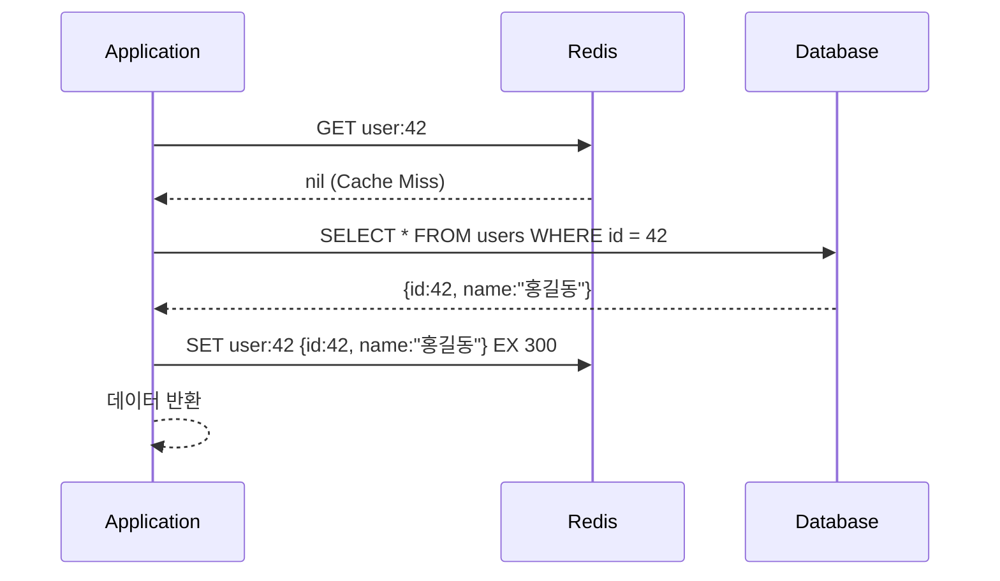
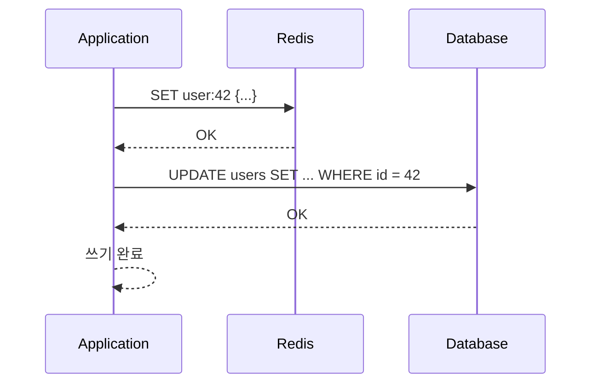
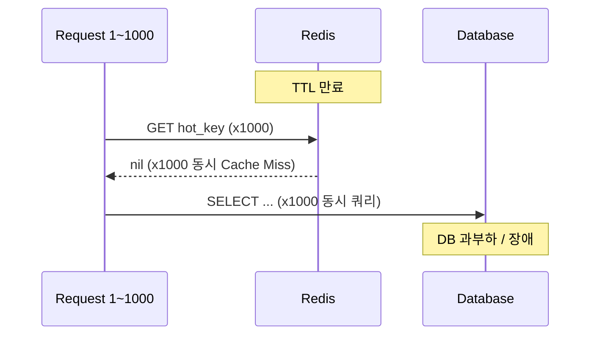
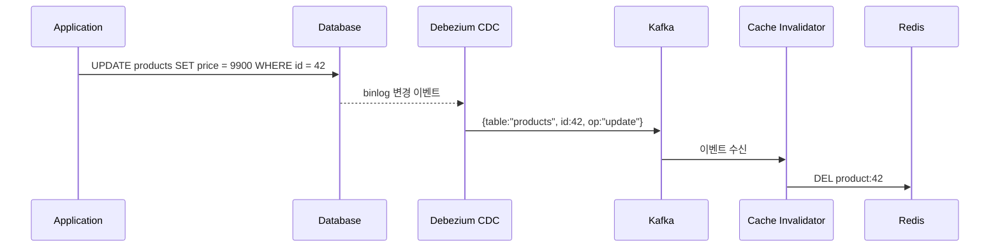
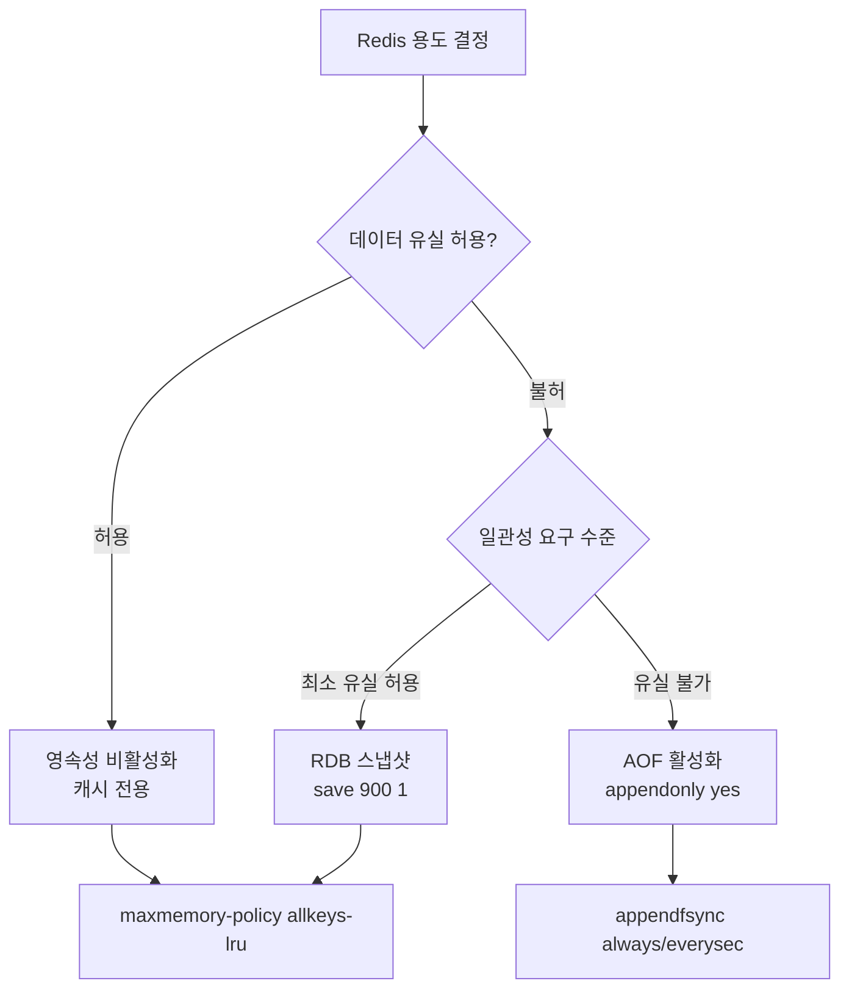

# 캐시 전략과 Redis

::: info 학습 목표
- Cache-Aside, Write-Through, Write-Behind 패턴의 동작 방식과 적합한 사용 상황을 설명할 수 있다.
- 캐시 스탬피드 문제와 SET NX, TTL 지터를 활용한 해결 방법을 설명할 수 있다.
- Tag-based Invalidation과 Event-Driven 무효화 방식을 비교할 수 있다.
- Redis Eviction Policy와 영속성 옵션의 차이를 설명할 수 있다.
:::

---

## 1. 캐시 패턴

### Cache-Aside (Lazy Loading)

캐시를 직접 관리하는 가장 일반적인 패턴이다. 애플리케이션이 캐시와 DB를 모두 알고 있다.



```java
public User getUser(Long userId) {
    String cacheKey = "user:" + userId;
    User cached = redis.get(cacheKey, User.class);
    if (cached != null) {
        return cached; // Cache Hit
    }
    User user = userRepository.findById(userId).orElseThrow();
    redis.set(cacheKey, user, Duration.ofSeconds(300));
    return user;
}
```

Cache Miss 시 DB를 조회하고 결과를 캐시에 저장한다. 실제로 필요한 데이터만 캐싱되어 메모리 효율이 좋다. 단, 최초 조회 시 항상 DB를 거치는 지연이 발생한다.

### Write-Through

데이터를 쓸 때 캐시와 DB를 동기적으로 모두 갱신한다.



```java
public User updateUser(Long userId, UpdateRequest req) {
    User user = userRepository.save(req.toEntity(userId)); // DB 업데이트
    redis.set("user:" + userId, user, Duration.ofSeconds(300)); // 캐시 동기 갱신
    return user;
}
```

캐시와 DB가 항상 동기화되어 Cache Miss가 발생하지 않는다. 단, 모든 쓰기 작업에서 캐시와 DB를 순차적으로 처리해야 해 쓰기 지연이 늘어난다.

### Write-Behind (Write-Back)

쓰기를 캐시에만 즉시 반영하고, DB 업데이트는 비동기로 나중에 처리한다.

```java
// 캐시에만 즉시 반영
redis.set("user:" + userId, user);
// DB 업데이트는 이벤트 큐에 적재 후 비동기 처리
eventQueue.publish(new UserUpdateEvent(userId, user));
```

쓰기 응답이 매우 빠르고 DB 부하가 줄어든다. 단, 캐시가 장애 나면 DB에 반영되지 않은 데이터가 유실될 수 있다. 로그, 클릭 수 집계처럼 일부 유실이 허용되는 경우에 적합하다.

### 패턴 비교

| 패턴 | 읽기 성능 | 쓰기 성능 | 일관성 | 데이터 유실 위험 |
|------|----------|----------|--------|-----------------|
| Cache-Aside | Cache Hit 빠름 | 보통 | 높음 | 없음 |
| Write-Through | 항상 빠름 | 느림 (동기 쓰기) | 높음 | 없음 |
| Write-Behind | 항상 빠름 | 빠름 (비동기) | 낮음 | 있음 |

---

## 2. 캐시 스탬피드(Thundering Herd)

### 문제 정의

인기 있는 캐시 키의 TTL이 만료되는 순간, 동시에 수천 개의 요청이 Cache Miss를 경험하고 모두 DB로 직접 쿼리를 보내는 현상이다. 순간적으로 DB에 극심한 부하가 걸려 서비스 장애로 이어질 수 있다.



### 해결 1: SET NX 분산 락

첫 번째 요청만 DB를 조회하고 나머지는 대기하도록 분산 락을 사용한다.

```java
public Object getWithLock(String key) {
    Object cached = redis.get(key);
    if (cached != null) return cached;

    // NX: Not eXists - 키가 없을 때만 SET 성공
    boolean locked = redis.setIfAbsent("lock:" + key, "1", Duration.ofSeconds(5));
    if (locked) {
        try {
            Object value = db.query(key);
            redis.set(key, value, Duration.ofSeconds(300));
            return value;
        } finally {
            redis.delete("lock:" + key);
        }
    } else {
        // 락 획득 실패: 짧은 대기 후 캐시 재조회
        Thread.sleep(50);
        return redis.get(key);
    }
}
```

### 해결 2: 확률적 조기 갱신 (Probabilistic Early Recomputation)

TTL이 완전히 만료되기 전에 확률적으로 미리 갱신해 만료 시점의 동시 Cache Miss를 예방한다.

```java
public Object getWithEarlyRecompute(String key, long ttlSeconds) {
    ValueWithTTL entry = redis.getWithTTL(key);
    if (entry == null) return recompute(key, ttlSeconds);

    long remainingTTL = entry.getTTL();
    // 남은 TTL이 전체 TTL의 10% 이하면 확률적으로 갱신
    double probability = 1.0 - (remainingTTL / (double) ttlSeconds);
    if (Math.random() < probability * 0.1) {
        return recompute(key, ttlSeconds); // 미리 갱신
    }
    return entry.getValue();
}
```

### 해결 3: TTL 지터(Jitter)

같은 시점에 생성된 다수의 캐시 키 TTL이 동시에 만료되지 않도록 ±30초 범위의 랜덤 값을 더한다.

```java
// 고정 TTL: 모든 키가 동시에 만료됨
redis.set(key, value, Duration.ofSeconds(300));

// 지터 적용: 270~330초 범위로 분산
long jitter = (long) (Math.random() * 60) - 30; // -30 ~ +30
redis.set(key, value, Duration.ofSeconds(300 + jitter));
```

---

## 3. 캐시 무효화

### Tag-based Invalidation

데이터 변경 시 관련 캐시 키를 태그로 그룹화해 일괄 삭제하는 방식이다.

```java
// 캐시 저장 시 태그 연결
cacheManager.set("product:42", product, tags: ["product", "category:electronics"]);

// 특정 태그의 모든 캐시 무효화
cacheManager.invalidateByTag("category:electronics");
```

Redis에서는 Set 자료구조로 태그별 키 목록을 관리한다.

```
SADD tag:category:electronics "product:42" "product:100" "product:201"
SMEMBERS tag:category:electronics → ["product:42", "product:100", "product:201"]
# 전자기기 카테고리 업데이트 시 해당 키 전체 삭제
```

### Event-Driven 무효화 (Debezium CDC)

Debezium 같은 CDC(Change Data Capture) 도구로 DB 변경 이벤트를 캡처해 캐시를 자동으로 무효화한다.



DB 변경이 발생하면 자동으로 캐시가 무효화되어 애플리케이션 코드에서 수동으로 캐시를 삭제할 필요가 없다.

### TTL 전략 가이드

데이터 특성에 따라 TTL을 다르게 설정한다.

| 데이터 유형 | 변경 빈도 | 권장 TTL |
|------------|----------|---------|
| 실시간 재고, 가격 | 자주 변경 | 30초 ~ 5분 |
| 상품 정보, 사용자 프로필 | 변경 드묾 | 1시간 ~ 24시간 |
| 세션 | 활동 기반 | 슬라이딩 만료 (활동 시 TTL 초기화) |
| 통계, 집계 | 배치 갱신 | 배치 주기 (1시간 ~ 1일) |

세션의 슬라이딩 만료는 Redis `EXPIRE` 명령어로 구현한다.

```
# 요청마다 TTL 초기화 (슬라이딩 만료)
EXPIRE session:abc123 1800
```

---

## 4. Redis 운영 주의사항

### 히트율(Hit Rate)

캐시 히트율이 95% 미만이면 캐시의 효과가 의문스럽다.

```
# Redis INFO 명령어로 히트율 확인
INFO stats
keyspace_hits: 9500000
keyspace_misses: 500000
# 히트율 = 9500000 / (9500000 + 500000) = 95%
```

히트율이 낮은 경우 캐시 키 설계나 TTL 전략을 재검토해야 한다.

### Eviction Policy

메모리가 한계에 달하면 Redis는 Eviction Policy에 따라 키를 자동으로 제거한다.

| 정책 | 설명 | 적합한 상황 |
|------|------|------------|
| `allkeys-lru` | 모든 키 중 최근에 가장 덜 사용된 키 제거 | 일반 캐시 용도 |
| `volatile-lru` | TTL이 설정된 키 중 LRU 제거 | 일부 키는 영구 보존 필요 |
| `allkeys-lfu` | 사용 빈도가 가장 낮은 키 제거 | 인기 데이터 보존 중요 |
| `noeviction` | 제거 안함, 쓰기 오류 반환 | 데이터 유실 절대 불가 |

캐시 용도로 사용 시 `allkeys-lru`가 일반적으로 권장된다.

```
# redis.conf 설정
maxmemory 4gb
maxmemory-policy allkeys-lru
```

### 영속성(RDB/AOF)

Redis는 기본적으로 인메모리 DB라 재시작 시 데이터가 사라진다. 영속성이 필요하면 두 가지 방법을 사용한다.

**RDB (Redis Database Snapshot)**: 주기적으로 전체 데이터를 스냅샷으로 저장한다. 재시작 속도가 빠르나 마지막 스냅샷 이후 변경 데이터가 유실된다.

**AOF (Append Only File)**: 모든 쓰기 명령어를 로그로 기록한다. 데이터 유실이 최소화되나 재시작 시 로그 전체를 재생해야 해 속도가 느리다.

순수 캐시 용도라면 영속성 설정을 끄고 메모리 용량에만 집중하는 것이 일반적이다. 세션, 랭킹처럼 유실이 문제가 되면 AOF를 활성화한다.



---

::: tip 핵심 정리
- Cache-Aside는 가장 일반적인 패턴으로 Cache Miss 시 DB 조회 후 캐시에 저장한다. Write-Through는 쓰기 시 동기 갱신, Write-Behind는 비동기 갱신이다.
- 캐시 스탬피드는 TTL 만료 시 대량 동시 DB 조회로 DB 부하가 폭증하는 현상이다. SET NX 분산 락, 확률적 조기 갱신, TTL 지터로 해결한다.
- 데이터 변경 빈도에 따라 TTL을 차별화한다. 세션은 슬라이딩 만료를 사용한다.
- 히트율 95% 미만은 캐시 효과가 의심스럽다. `allkeys-lru` 정책과 함께 maxmemory를 반드시 설정한다.
:::

## 다음 챕터

- 다음 : [커넥션 관리](/study/db-optimization/08-connection-pool)
