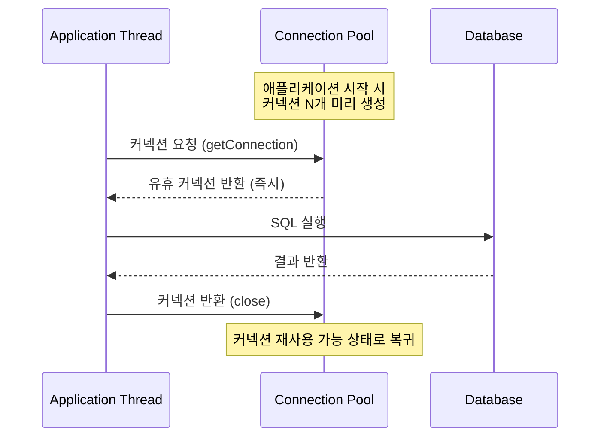
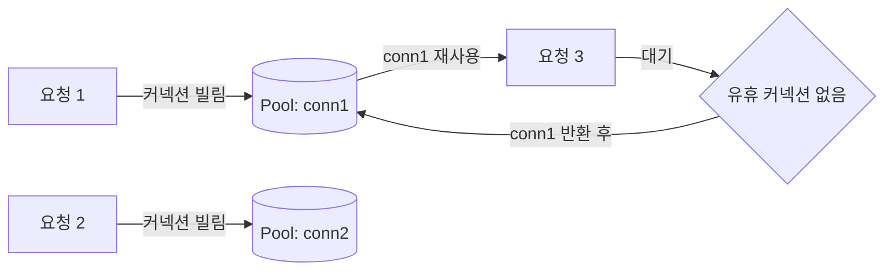
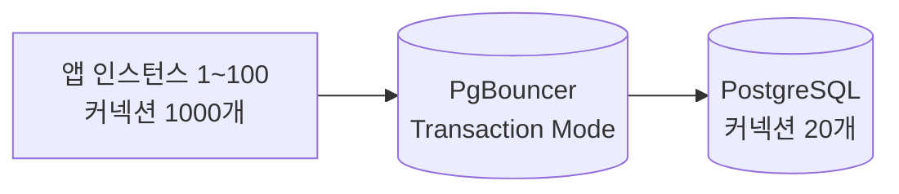
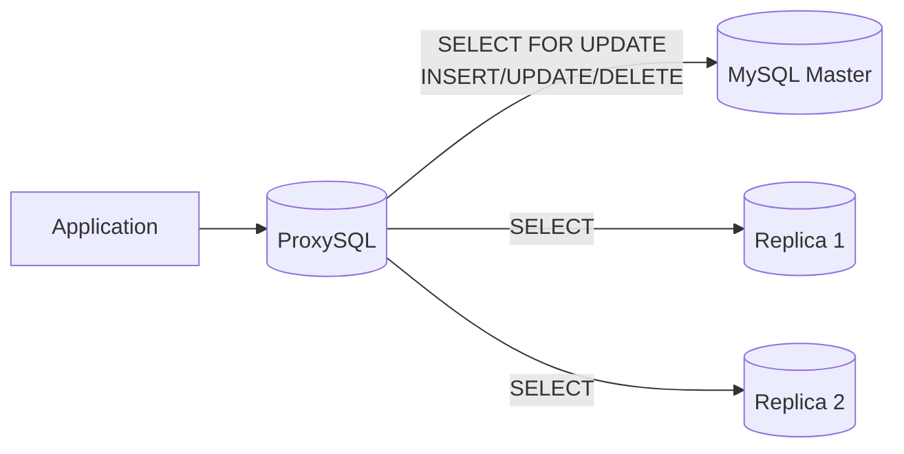

# 커넥션 관리

::: info 학습 목표
- DB 커넥션 생성 비용과 커넥션 풀의 동작 원리를 설명할 수 있다.
- HikariCP 공식 사이징 공식을 적용해 최적 풀 크기를 계산할 수 있다.
- leakDetectionThreshold로 커넥션 누수를 탐지하는 방법을 이해한다.
- PgBouncer와 ProxySQL의 역할과 필요한 상황을 설명할 수 있다.
:::

---

## 1. 커넥션 풀 원리

### DB 커넥션 생성 비용

애플리케이션이 DB에 요청할 때마다 새로운 커넥션을 생성하면 다음 과정이 매번 반복된다.

1. TCP 3-way 핸드셰이크 (네트워크 왕복)
2. TLS 핸드셰이크 (암호화 사용 시)
3. DB 인증 (사용자명/비밀번호 검증)
4. 세션 초기화 (타임존, 인코딩 등)

이 과정은 수십~수백 밀리초가 소요된다. 요청마다 이를 반복하면 응답 지연이 심각해진다.

### 풀링: 미리 생성 → 재사용 → 반환

커넥션 풀은 커넥션을 미리 생성해두고 요청 시 빌려주고, 사용 후 반환받아 재사용하는 방식이다.



커넥션을 재사용하면 생성 비용이 한 번만 발생하므로 응답 속도가 극적으로 향상된다.



---

## 2. HikariCP 최적 설정

### 공식 사이징 공식

HikariCP 공식 문서에서 제안하는 커넥션 풀 크기 공식이다.

```
connections = (core_count * 2) + effective_spindle_count
```

- `core_count`: 서버 CPU 코어 수
- `effective_spindle_count`: 스토리지 스핀들 수 (SSD면 1, HDD면 실제 디스크 수)

4코어 서버에 SSD 사용 시 계산 예시:

```
connections = (4 * 2) + 1 = 9 ≈ 약 10개
```

이 공식은 직관에 반해 작은 값을 권장한다. DB는 I/O 바운드 작업이고, 커넥션 수가 많아지면 컨텍스트 스위칭 오버헤드가 증가해 오히려 성능이 저하된다.

### 2048 → 96개로 줄여서 응답 100ms → 2ms (50배) 사례

실제 성능 개선 사례에서 커넥션 수를 크게 줄인 것이 오히려 성능을 극적으로 향상시킨 경우가 있다. 커넥션 2048개를 96개로 줄였을 때 평균 응답 시간이 100ms에서 2ms로 50배 개선됐다. 원인은 DB 서버의 스레드 컨텍스트 스위칭 오버헤드였다.

### YAML 설정 예시

Spring Boot에서 HikariCP 설정이다.

```yaml
spring:
  datasource:
    hikari:
      # 최대 풀 크기 (공식: core * 2 + spindle)
      maximum-pool-size: 10
      # 최소 유휴 커넥션 수 (성능 중시 시 maximum과 동일하게 설정)
      minimum-idle: 10
      # 커넥션 획득 대기 최대 시간 (ms) - 초과 시 SQLException
      connection-timeout: 30000
      # 커넥션 최대 유지 시간 (ms) - DB 타임아웃보다 짧게 설정
      max-lifetime: 1800000
      # 유휴 커넥션 유지 시간 (ms)
      idle-timeout: 600000
      # 커넥션 누수 탐지 임계값 (ms) - 0이면 비활성화
      leak-detection-threshold: 5000
```

`max-lifetime`은 DB 서버의 `wait_timeout`(MySQL)이나 `tcp_keepalives_idle`(PostgreSQL)보다 짧게 설정해야 DB가 먼저 커넥션을 끊는 상황을 방지한다.

---

## 3. 커넥션 누수 탐지

### leakDetectionThreshold 설정

커넥션을 빌려간 스레드가 설정된 시간 내에 반환하지 않으면 HikariCP가 경고 로그를 출력한다.

```yaml
hikari:
  leak-detection-threshold: 5000  # 5초 이상 미반환 시 경고
```

```
WARN  com.zaxxer.hikari.pool.ProxyLeakTask - Connection leak detection triggered for
      com.zaxxer.hikari.pool.HikariProxyConnection@1234abcd on thread http-nio-8080-exec-3,
      stack trace follows
      java.lang.Exception: Apparent connection leak detected
        at com.example.UserService.getUsers(UserService.java:42)  ← 누수 발생 위치
        at ...
```

스택 트레이스에서 누수가 발생한 코드 위치를 정확히 찾을 수 있다.

### 커넥션 누수 원인과 해결

```java
// 누수 원인 1: try-finally 없이 직접 커넥션 사용
Connection conn = dataSource.getConnection();
// 예외 발생 시 conn.close()가 호출되지 않아 누수
conn.close();

// 올바른 방법: try-with-resources로 자동 반환
try (Connection conn = dataSource.getConnection()) {
    // 예외 발생해도 conn.close() 자동 호출
}

// 누수 원인 2: @Transactional 없이 EntityManager 직접 사용
// 트랜잭션 범위 밖에서 EntityManager를 장시간 유지하면 커넥션이 묶임
```

### tcpKeepAlive

DB와 애플리케이션 서버 사이에 방화벽이 있으면 장기간 유휴 커넥션이 방화벽에 의해 강제로 끊길 수 있다. tcpKeepAlive 설정으로 주기적으로 패킷을 전송해 커넥션을 유지한다.

```yaml
spring:
  datasource:
    url: jdbc:postgresql://localhost:5432/mydb?tcpKeepAlive=true
```

### 마이크로서비스 커넥션 계산

마이크로서비스 환경에서는 각 인스턴스가 독립적으로 커넥션 풀을 관리하므로 전체 DB 커넥션 수에 주의해야 한다.

```
전체 DB 커넥션 = 인스턴스 수 × 커넥션 풀 크기

예시:
- 서비스 A: 인스턴스 10개 × 풀 10개 = 100 커넥션
- 서비스 B: 인스턴스 5개 × 풀 10개 = 50 커넥션
- 서비스 C: 인스턴스 20개 × 풀 10개 = 200 커넥션
- 총합: 350 커넥션
```

PostgreSQL의 기본 `max_connections`는 100이다. 마이크로서비스 환경에서는 이 한계를 쉽게 초과하므로 PgBouncer 같은 커넥션 풀러가 필요하다.

---

## 4. PgBouncer / ProxySQL

### PgBouncer Transaction 모드

PgBouncer는 PostgreSQL 전용 커넥션 풀러다. 애플리케이션과 DB 사이에 위치해 수천 개의 앱 커넥션을 소수의 실제 DB 커넥션으로 다중화한다.



Transaction 모드는 트랜잭션 단위로 실제 DB 커넥션을 할당한다. 트랜잭션이 끝나면 커넥션을 즉시 반환하므로 다중화 효율이 가장 높다.

```ini
# pgbouncer.ini
[databases]
mydb = host=localhost port=5432 dbname=mydb

[pgbouncer]
pool_mode = transaction
max_client_conn = 1000    # 앱 측 최대 커넥션
default_pool_size = 20    # DB 측 실제 커넥션
```

Transaction 모드에서는 SET, PREPARE 같은 세션 레벨 명령어를 사용할 수 없다는 제약이 있다.

### ProxySQL 읽기 분산

ProxySQL은 MySQL용 프록시 서버로 읽기 쿼리를 레플리카로 자동 분산하는 기능이 핵심이다.

```sql
-- ProxySQL 읽기 분산 규칙 설정
INSERT INTO mysql_query_rules (rule_id, active, match_pattern, destination_hostgroup)
VALUES
    (1, 1, '^SELECT.*FOR UPDATE', 10), -- 쓰기 마스터로
    (2, 1, '^SELECT',            20);  -- 읽기 레플리카로
```



### 커넥션 풀러가 필요한 상황

| 상황 | 이유 | 권장 솔루션 |
|------|------|------------|
| Serverless (Lambda, Cloud Run) | 함수 인스턴스 수가 수천 개로 급증 | PgBouncer, RDS Proxy |
| PHP (Apache MPM Prefork) | 프로세스마다 커넥션 풀 불가 | PgBouncer |
| 마이크로서비스 다수 인스턴스 | 총 커넥션이 DB 한계 초과 | PgBouncer, ProxySQL |
| MySQL 읽기 트래픽 분산 필요 | 레플리카로 SELECT 자동 라우팅 | ProxySQL |

Serverless 환경에서는 함수 인스턴스가 수천 개로 늘어날 수 있어 각 인스턴스가 커넥션을 최소 1개라도 유지하면 DB 커넥션 한계를 즉시 초과한다. AWS RDS Proxy나 PgBouncer를 반드시 앞에 배치해야 한다.

---

::: tip 핵심 정리
- DB 커넥션 생성은 TCP 핸드셰이크, 인증 등 수십~수백ms가 소요된다. 커넥션 풀로 미리 생성해 재사용한다.
- HikariCP 최적 풀 크기 공식: `(core_count * 2) + effective_spindle_count`. 4코어 SSD 서버는 약 10개다. 풀 크기를 줄이면 응답 시간이 극적으로 개선될 수 있다.
- `leak-detection-threshold` 설정으로 미반환 커넥션의 발생 위치를 스택 트레이스로 확인한다.
- 마이크로서비스 환경에서 총 커넥션 수(인스턴스 × 풀)가 DB 한계를 초과하면 PgBouncer를 앞단에 배치한다.
:::

## 다음 챕터

[데이터베이스 CH15 운영과 보안](/study/database/15-operation-security)에서 커넥션 풀 기초를 다룬다.

- 다음 : [DB 마이그레이션](/study/db-optimization/09-migration)
