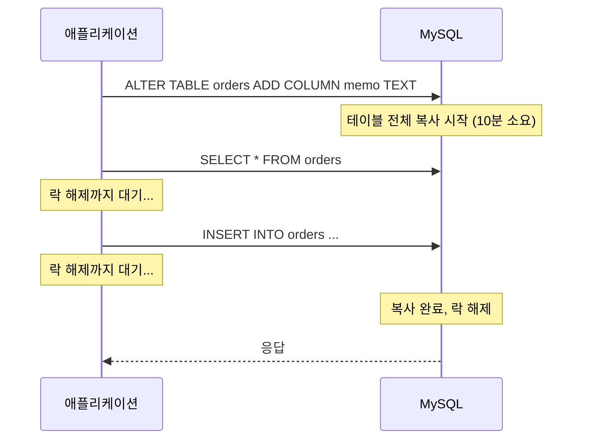
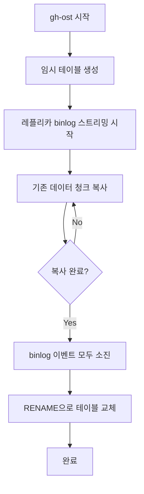
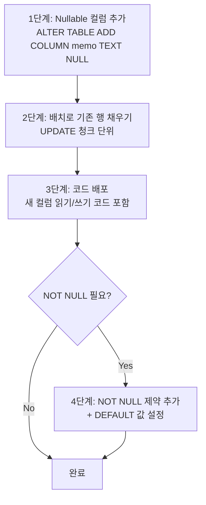
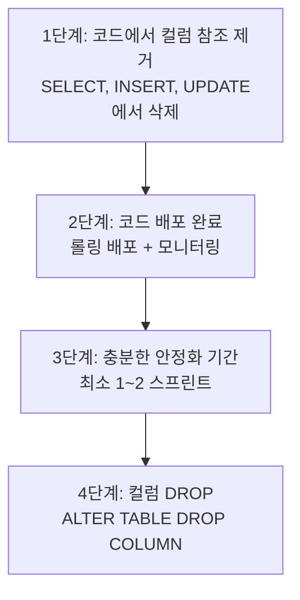

# DB 마이그레이션

::: info 학습 목표
- Flyway와 Liquibase의 차이를 이해하고 적절한 도구를 선택한다.
- 대형 테이블 ALTER 시 발생하는 테이블 락 문제와 Zero-Downtime DDL 도구를 학습한다.
- 컬럼 추가/삭제를 안전하게 수행하는 단계별 순서를 익힌다.
- 마이그레이션 롤백 전략과 실전 주의사항을 파악한다.
:::

---

## 1. 마이그레이션 도구

### Flyway vs Liquibase

스키마 마이그레이션 도구는 SQL 변경 이력을 버전으로 관리하여 환경 간 일관성을 보장한다. 두 도구 모두 동일한 목적을 수행하지만 철학과 사용 방식이 다르다.

| 항목 | Flyway | Liquibase |
|------|--------|-----------|
| 변경 정의 방식 | SQL 파일 또는 Java 클래스 | SQL, XML, YAML, JSON |
| 롤백 지원 | 유료 플랜(Teams 이상)에서만 지원 | 오픈소스에서도 rollback 태그 제공 |
| Spring Boot 통합 | `spring-boot-starter` 자동 설정 | `spring-boot-starter` 자동 설정 |
| 체크섬 검증 | 기존 파일 수정 시 오류 발생 | 변경 감지 후 경고 처리 |
| 실무 선호도 | 단순 SQL 위주 프로젝트에서 선호 | 복잡한 롤백, 다중 DB 지원이 필요한 경우 선호 |
| 학습 비용 | 낮음 | 중간 (XML/YAML 포맷 학습 필요) |

실무에서는 Flyway가 더 널리 쓰인다. Spring Boot Auto-configure가 기본 포함되어 있고, SQL 파일만으로 대부분의 요구사항을 충족하기 때문이다.

### Flyway 파일명 규칙

Flyway는 파일명에 따라 실행 순서와 유형을 결정한다.

```
V{version}__{description}.sql     -- 버전 마이그레이션 (한 번만 실행)
R__{description}.sql              -- 반복 마이그레이션 (내용 변경 시 재실행)
U{version}__{description}.sql     -- Undo 마이그레이션 (Teams 플랜)
```

예시:

```
V1__init.sql
V2__add_users_table.sql
V3__add_email_index.sql
V20240101120000__add_created_at_column.sql   -- 타임스탬프 방식
```

버전 구분자는 `__` (언더스코어 두 개)이다. 한 개만 쓰면 파싱 오류가 발생한다.

```sql
-- V3__add_email_index.sql
CREATE INDEX CONCURRENTLY idx_users_email ON users(email);
```

```yaml
# application.yml (Spring Boot)
spring:
  flyway:
    enabled: true
    locations: classpath:db/migration
    baseline-on-migrate: false   # 기존 DB에 처음 적용할 때만 true
```

### Liquibase 예시

```xml
<!-- db/changelog/003-add-email-index.xml -->
<databaseChangeLog>
  <changeSet id="003" author="team">
    <createIndex tableName="users" indexName="idx_users_email">
      <column name="email"/>
    </createIndex>
    <rollback>
      <dropIndex tableName="users" indexName="idx_users_email"/>
    </rollback>
  </changeSet>
</databaseChangeLog>
```

Liquibase는 `rollback` 블록을 명시적으로 작성할 수 있어 복잡한 롤백 시나리오에 유리하다.

---

## 2. Zero-Downtime DDL

### 대형 테이블 ALTER의 테이블 락 문제

수천만 건 이상의 테이블에 `ALTER TABLE`을 실행하면 스키마 변경이 완료될 때까지 테이블 전체에 락이 걸린다. MySQL 기본 DDL은 메타데이터 락(MDL)을 획득하고 테이블을 복사하기 때문에, 변경 완료 전까지 모든 DML이 대기 상태가 된다.



### pt-online-schema-change (pt-osc)

Percona Toolkit의 pt-osc는 트리거 기반으로 동작한다.

동작 원리:
1. 새 구조의 임시 테이블(`_orders_new`)을 생성한다.
2. 원본 테이블에 INSERT/UPDATE/DELETE 트리거를 설치하여 변경사항을 임시 테이블에 동기화한다.
3. 원본 데이터를 청크 단위로 임시 테이블에 복사한다.
4. 복사 완료 후 원본 테이블과 임시 테이블을 RENAME으로 교체한다.
5. 트리거를 제거하고 구 테이블을 삭제한다.

```bash
pt-online-schema-change \
  --alter "ADD COLUMN memo TEXT" \
  --host=localhost \
  --user=root \
  --password=secret \
  --chunk-size=1000 \
  --max-load="Threads_running=50" \
  --critical-load="Threads_running=100" \
  --execute \
  D=mydb,t=orders
```

| 장점 | 단점 |
|------|------|
| 오랜 검증, 광범위한 사용 사례 | 트리거 오버헤드로 쓰기 성능 저하 |
| MySQL 5.5 이상 모두 지원 | 트리거가 이미 존재하는 테이블은 사용 불가 |
| 상대적으로 설정이 간단 | RENAME 시 짧은 락 발생 |

### gh-ost (GitHub)

gh-ost는 트리거 없이 MySQL binlog 스트림을 직접 파싱하여 변경사항을 동기화한다. GitHub이 수억 건 테이블을 운영하면서 개발하고 검증한 도구다.

동작 원리:
1. 임시 테이블(`_orders_gho`)을 생성한다.
2. MySQL 레플리카에 연결하여 binlog를 스트리밍으로 읽는다.
3. binlog에서 원본 테이블에 대한 변경 이벤트를 파싱하여 임시 테이블에 적용한다.
4. 원본 데이터를 청크 단위로 복사한다.
5. 두 테이블이 동기화되면 RENAME으로 교체한다.

```bash
gh-ost \
  --user="root" \
  --password="secret" \
  --host=replica.db.internal \
  --database="mydb" \
  --table="orders" \
  --alter="ADD COLUMN memo TEXT" \
  --allow-on-master \
  --execute
```



| 장점 | 단점 |
|------|------|
| 트리거 없음, 쓰기 부하 없음 | binlog ROW 포맷 필수 |
| 실행 중 일시 중지/재개 가능 | 설정 복잡도 높음 |
| 부하 기반 자동 속도 조절 | MySQL 5.7+ 권장 |
| GitHub 프로덕션 검증 완료 | 레플리카 연결 필요 (또는 --allow-on-master) |

실무에서는 쓰기가 많은 테이블, 트리거가 이미 존재하는 테이블, 부하 조절이 중요한 환경에서 gh-ost를 선호한다.

---

## 3. 컬럼 추가/삭제 안전 순서

무중단 배포 환경에서 컬럼 추가/삭제는 반드시 단계를 나누어 진행해야 한다. 코드와 DB 스키마는 항상 한 단계씩 차이나도 정상 동작해야 한다.

### 컬럼 추가 순서



단계별 설명:

**1단계 — Nullable 컬럼 추가**

```sql
ALTER TABLE orders ADD COLUMN memo TEXT NULL;
-- gh-ost 또는 pt-osc 사용 권장 (대형 테이블인 경우)
```

NULL을 허용하면 기존 행을 수정하지 않아도 되므로 즉시 완료된다. (MySQL InnoDB는 NULL 허용 컬럼 추가 시 fast path를 사용한다.)

**2단계 — 배치로 기존 행 채우기**

```sql
-- 청크 단위 업데이트로 트랜잭션 부하 분산
UPDATE orders
SET memo = ''
WHERE id BETWEEN 1 AND 10000
  AND memo IS NULL;
-- 다음 청크로 반복
```

**3단계 — 코드 배포**

새 컬럼을 읽고 쓰는 코드를 배포한다. 이 시점에서 기존 행에도 값이 채워져 있으므로 NOT NULL 조건에 안전하다.

**4단계 — NOT NULL 제약 추가 (필요 시)**

```sql
ALTER TABLE orders ALTER COLUMN memo SET NOT NULL;
-- 또는
ALTER TABLE orders MODIFY COLUMN memo TEXT NOT NULL DEFAULT '';
```

### 컬럼 삭제 순서

컬럼 삭제는 추가보다 더 신중하게 진행해야 한다. 코드가 해당 컬럼을 참조하는 상태에서 컬럼을 먼저 삭제하면 즉시 오류가 발생한다.



```sql
-- 4단계: 컬럼 삭제
ALTER TABLE orders DROP COLUMN legacy_field;
```

---

## 4. 실전 주의사항

### 롤백 전략

Flyway 오픈소스는 자동 롤백을 지원하지 않는다. 롤백 스크립트를 별도로 준비해야 한다.

```
db/migration/
  V10__add_memo_column.sql         -- 정방향 마이그레이션
  V10__add_memo_column.undo.sql    -- 수동 롤백 스크립트 (관리용)
```

롤백 스크립트 예시:

```sql
-- V10__add_memo_column.undo.sql (Flyway Teams 또는 수동 실행)
ALTER TABLE orders DROP COLUMN memo;
```

롤백이 불가능한 마이그레이션도 있다. 컬럼 삭제, 테이블 삭제, 데이터 타입 축소 등은 데이터 손실이 발생하므로 실행 전 백업이 필수다.

### 마이그레이션 테스트

프로덕션에 바로 적용하지 않는다. 반드시 스테이징 환경에서 먼저 검증한다.

```bash
# 스테이징 DB에서 실행 시간 측정
time gh-ost \
  --host=staging.db.internal \
  --table="orders" \
  --alter="ADD COLUMN memo TEXT" \
  --execute
# 예상 실행 시간 파악 후 프로덕션 적용
```

검증 항목:
- 실행 시간 측정 (데이터 볼륨이 비슷한 스테이징 환경 필수)
- 마이그레이션 전후 Row 수 비교
- 애플리케이션 동작 검증 (통합 테스트)
- 롤백 스크립트 실행 가능 여부 확인

### 큰 테이블 배치 업데이트 시 트랜잭션 분할

수백만 건 UPDATE를 하나의 트랜잭션으로 실행하면 언두 로그가 폭발적으로 증가하고 락 범위가 넓어진다.

```sql
-- 잘못된 방식: 단일 트랜잭션으로 전체 업데이트
UPDATE orders SET status = 'archived' WHERE created_at < '2020-01-01';
-- 수백만 건이면 수 분간 락 유지, 언두 로그 폭증

-- 올바른 방식: 청크 단위 분할
DO $$
DECLARE
  batch_size INT := 5000;
  offset_val INT := 0;
  affected   INT;
BEGIN
  LOOP
    UPDATE orders
    SET status = 'archived'
    WHERE id IN (
      SELECT id FROM orders
      WHERE created_at < '2020-01-01'
        AND status != 'archived'
      LIMIT batch_size
    );
    GET DIAGNOSTICS affected = ROW_COUNT;
    EXIT WHEN affected = 0;
    PERFORM pg_sleep(0.1);  -- I/O 부하 조절
  END LOOP;
END $$;
```

청크 크기는 5,000~10,000 건이 일반적이다. 너무 작으면 오버헤드가, 너무 크면 락 경합이 증가한다.

::: tip 핵심 정리
- Flyway는 SQL 파일 기반으로 단순하고, Liquibase는 롤백과 다중 DB 지원이 강점이다.
- 대형 테이블 ALTER에는 pt-osc(트리거 기반) 또는 gh-ost(binlog 기반)를 사용한다.
- 컬럼 추가는 Nullable 먼저 → 배치 채우기 → 코드 배포 → NOT NULL 순서로 진행한다.
- 컬럼 삭제는 코드에서 참조 제거 → 배포 → 안정화 → DROP 순서를 지킨다.
- 대량 UPDATE는 반드시 청크로 분할하여 트랜잭션 크기를 제어한다.
:::

## 다음 챕터

다음 챕터에서는 DB 운영 시 모니터링해야 할 핵심 지표와 Prometheus/Grafana 구성 방법을 학습한다.

[모니터링 지표](/study/db-optimization/10-monitoring)
