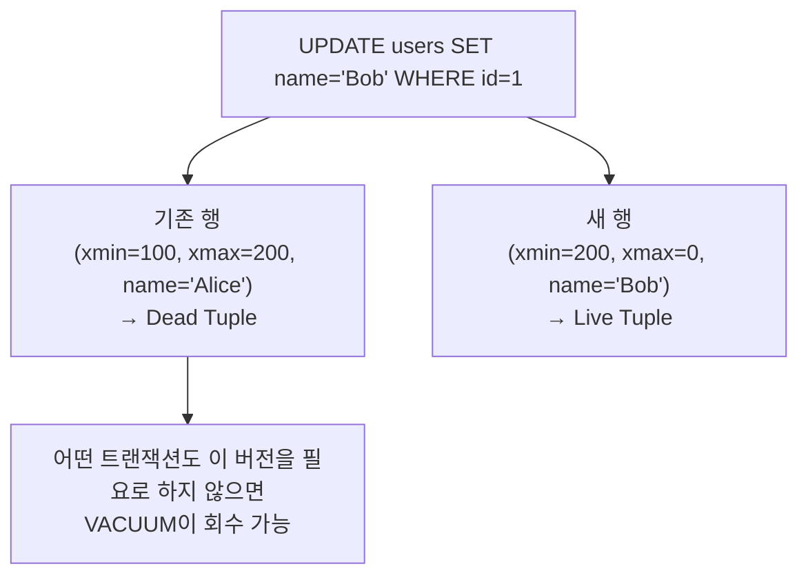
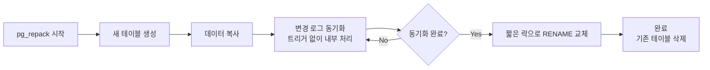
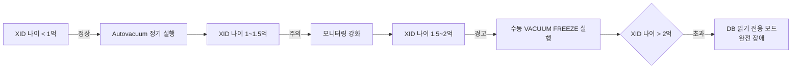

# PostgreSQL 운영

::: info 학습 목표
- MVCC 구조에서 Dead Tuple이 발생하는 원리를 이해한다.
- VACUUM과 VACUUM FULL의 차이를 파악하고 상황에 맞게 선택한다.
- Autovacuum 기본값의 한계를 이해하고 대형 테이블에 맞게 튜닝한다.
- pg_repack으로 락 없이 테이블을 재구성하는 방법을 익힌다.
- Transaction ID Wraparound 위험을 사전에 감지하고 대응한다.
:::

---

> MVCC 기초 개념은 [데이터베이스 CH11 트랜잭션](/study/database/11-transaction)에서 다룬다.

---

## 1. Dead Tuple과 VACUUM

### MVCC에서 Dead Tuple이 발생하는 원리

PostgreSQL은 MVCC(Multi-Version Concurrency Control) 방식으로 동시성을 처리한다. 트랜잭션이 행을 UPDATE하거나 DELETE할 때 기존 행을 제자리에서 변경하지 않는다. 대신 새 버전의 행을 삽입하고 기존 행에 삭제 표시(xmax)를 남긴다.



이렇게 남겨진 구버전 행을 Dead Tuple이라고 한다. Dead Tuple은 디스크 공간을 차지하고 순차 스캔 속도를 저하시킨다.

### pg_stat_user_tables로 Dead Tuple 확인

```sql
SELECT
    schemaname,
    relname AS table_name,
    n_live_tup,
    n_dead_tup,
    round(n_dead_tup * 100.0 / NULLIF(n_live_tup + n_dead_tup, 0), 2) AS dead_ratio_pct,
    last_autovacuum,
    last_vacuum
FROM pg_stat_user_tables
WHERE n_dead_tup > 0
ORDER BY n_dead_tup DESC
LIMIT 20;
```

`dead_ratio_pct`가 10% 이상이면 VACUUM이 충분히 실행되지 않는다는 신호다.

### VACUUM vs VACUUM FULL

| 항목 | VACUUM | VACUUM FULL |
|------|--------|-------------|
| 동작 방식 | Dead Tuple 표시를 재사용 가능으로 변경 | 테이블을 새 파일로 완전 재작성 |
| 락 수준 | ShareUpdateExclusiveLock (DML 가능) | ACCESS EXCLUSIVE (모든 접근 차단) |
| 디스크 반환 | OS에 반환하지 않음 (재사용만 가능) | OS에 완전 반환 |
| 실행 시간 | 빠름 | 느림 (테이블 크기에 비례) |
| 서비스 영향 | 없음 | 실행 중 테이블 접근 불가 |
| 권장 용도 | 정기 운영 | 긴급 공간 회수, Table Bloat 해소 |

```sql
-- 일반 VACUUM (DML 차단 없음)
VACUUM VERBOSE users;

-- Dead Tuple 회수 + 통계 갱신
VACUUM ANALYZE users;

-- 테이블 완전 재작성 (서비스 중단 필요)
VACUUM FULL users;
```

---

## 2. Autovacuum 튜닝

### 기본값의 한계

PostgreSQL Autovacuum은 두 가지 조건이 모두 충족될 때 실행된다.

```
VACUUM 실행 조건:
  n_dead_tup >= autovacuum_vacuum_threshold + autovacuum_vacuum_scale_factor * n_live_tup

기본값:
  autovacuum_vacuum_threshold    = 50
  autovacuum_vacuum_scale_factor = 0.2  (20%)
```

10억 건 테이블의 경우:
```
50 + 0.2 × 1,000,000,000 = 200,000,050
```

Dead Tuple이 **2억 건** 이상 쌓여야 Autovacuum이 실행된다. 10억 건 테이블에 초당 수천 건의 UPDATE가 발생하면 2억 건에 도달하는 데 오래 걸리지 않으며, 그동안 Table Bloat가 심각해진다.

### 테이블별 Autovacuum 오버라이드

대형 테이블은 테이블 수준의 스토리지 파라미터로 기본값을 재정의한다.

```sql
-- 1억 건 이상 테이블: scale_factor를 1%로 낮춤
ALTER TABLE orders SET (
    autovacuum_vacuum_scale_factor = 0.01,   -- 1%
    autovacuum_vacuum_threshold = 1000,
    autovacuum_analyze_scale_factor = 0.005,
    autovacuum_analyze_threshold = 500
);

-- 초고빈도 업데이트 테이블: 고정 건수 기반
ALTER TABLE user_sessions SET (
    autovacuum_vacuum_scale_factor = 0,      -- scale 비례 비활성화
    autovacuum_vacuum_threshold = 10000,     -- 10,000건마다 실행
    autovacuum_vacuum_cost_delay = 2         -- I/O 부하 조절 (ms)
);
```

### 현재 Autovacuum 설정 확인

```sql
-- 전역 설정
SELECT name, setting, unit
FROM pg_settings
WHERE name LIKE 'autovacuum%'
ORDER BY name;

-- 테이블별 오버라이드 설정
SELECT
    relname,
    reloptions
FROM pg_class
WHERE reloptions IS NOT NULL
  AND relkind = 'r'
ORDER BY relname;
```

### autovacuum_vacuum_threshold 활용

`autovacuum_vacuum_threshold`는 scale_factor 계산과 독립적으로 더해지는 최솟값이다. 소형 테이블에서 50건으로는 너무 자주 VACUUM이 실행될 수 있으므로, 테이블 특성에 맞게 조정한다.

```sql
-- 로그성 테이블: 삽입만 하고 UPDATE/DELETE 없음 → Autovacuum 비활성화
ALTER TABLE audit_logs SET (autovacuum_enabled = false);
```

---

## 3. Table Bloat 대응

### Table Bloat 측정

```sql
-- 테이블 Bloat 추정 쿼리
SELECT
    schemaname,
    tablename,
    pg_size_pretty(pg_total_relation_size(schemaname || '.' || tablename)) AS total_size,
    pg_size_pretty(
        pg_total_relation_size(schemaname || '.' || tablename) -
        pg_relation_size(schemaname || '.' || tablename)
    ) AS index_size,
    n_dead_tup,
    n_live_tup
FROM pg_stat_user_tables
ORDER BY pg_total_relation_size(schemaname || '.' || tablename) DESC
LIMIT 10;
```

### pg_repack으로 락 없이 테이블 재구성

VACUUM FULL은 ACCESS EXCLUSIVE 락으로 서비스를 중단시킨다. pg_repack은 PostgreSQL 확장으로, 실행 중에도 DML이 가능한 상태로 테이블을 재구성한다.



```bash
# pg_repack 설치 (PostgreSQL 확장)
apt-get install postgresql-15-repack  # Ubuntu
# 또는
brew install pg_repack                 # macOS

# 확장 등록 (DB에 한 번만)
psql -d mydb -c "CREATE EXTENSION pg_repack;"
```

```bash
# 테이블 재구성 (DML 차단 없음)
pg_repack --host=localhost --username=postgres --dbname=mydb --table=orders

# 특정 스키마 전체
pg_repack --host=localhost --username=postgres --dbname=mydb --schema=public

# 인덱스만 재구성
pg_repack --host=localhost --username=postgres --dbname=mydb --table=orders --only-indexes
```

### vacuum_cost_delay로 I/O 부하 조절

VACUUM이 디스크 I/O를 과도하게 사용하면 서비스 쿼리 성능이 저하된다. `vacuum_cost_delay`로 VACUUM이 일정 I/O를 수행한 후 잠시 대기하도록 설정한다.

```sql
-- 전역 설정: VACUUM I/O 제한
SET vacuum_cost_delay = 10;       -- 10ms 대기 (단위: ms, 0이면 비활성)
SET vacuum_cost_limit = 200;      -- 비용 누적 한계 (기본값 200)

-- 특정 테이블만 조절
ALTER TABLE large_table SET (autovacuum_vacuum_cost_delay = 20);
```

`vacuum_cost_delay`를 높이면 VACUUM이 느려지지만 서비스 쿼리에 미치는 영향이 줄어든다. 야간 배치처럼 부하가 낮은 시간대에는 0으로 설정하여 빠르게 처리할 수 있다.

---

## 4. Transaction ID Wraparound

### 원리

PostgreSQL의 트랜잭션 ID(XID)는 32비트 정수다. 최대값은 약 42억(2^32)이며, 이 값에 도달하면 다시 0으로 돌아간다(Wraparound). MVCC에서 과거 버전과 현재 버전을 구분하는 기준이 XID이므로, Wraparound가 발생하면 모든 데이터가 "미래에 쓰인 것"으로 보여 조회 불가 상태가 된다.

이를 방지하기 위해 VACUUM은 오래된 트랜잭션을 FrozenXID로 변환하는 작업(Freeze)을 수행한다.

### 위험 감지

```sql
-- 각 테이블의 XID 나이 확인
SELECT
    schemaname,
    relname AS table_name,
    age(relfrozenxid) AS xid_age,
    pg_size_pretty(pg_total_relation_size(relid)) AS table_size,
    last_autovacuum,
    last_vacuum
FROM pg_stat_user_tables
JOIN pg_class ON relid = oid
ORDER BY age(relfrozenxid) DESC
LIMIT 20;

-- 전체 DB 최대 XID 나이
SELECT max(age(datfrozenxid)) AS max_age,
       datname
FROM pg_database
GROUP BY datname
ORDER BY max_age DESC;
```

XID 나이가 **2억(200,000,000)**에 근접하면 긴급 VACUUM이 필요하다. PostgreSQL은 기본적으로 `autovacuum_freeze_max_age = 200000000`에서 강제 VACUUM을 실행하지만, 2억에 도달하면 경고 메시지를 로그에 출력한다.



### 긴급 대응

```sql
-- 특정 테이블 즉시 Freeze
VACUUM FREEZE VERBOSE orders;

-- DB 전체 Freeze (시간 소요, 장기 유지보수 모드)
VACUUM FREEZE;

-- 강제 Freeze (superuser 전용)
SET vacuum_freeze_min_age = 0;
VACUUM FREEZE orders;
```

### 장시간 열린 트랜잭션이 VACUUM을 막는 문제

VACUUM은 활성 트랜잭션이 사용 중인 XID보다 오래된 버전을 회수하지 못한다. 장시간 열린 트랜잭션이 있으면 그 트랜잭션이 시작된 시점 이후의 모든 Dead Tuple이 회수 불가 상태가 된다.

```sql
-- 장시간 실행 중인 트랜잭션 확인
SELECT
    pid,
    usename,
    state,
    query_start,
    extract(epoch FROM (now() - query_start)) AS duration_sec,
    left(query, 100) AS query_preview
FROM pg_stat_activity
WHERE state != 'idle'
  AND query_start < now() - interval '10 minutes'
ORDER BY duration_sec DESC;

-- 유휴 트랜잭션도 확인 (BEGIN 후 방치된 커넥션)
SELECT pid, usename, state, xact_start,
       extract(epoch FROM (now() - xact_start)) AS idle_tx_sec
FROM pg_stat_activity
WHERE state = 'idle in transaction'
ORDER BY idle_tx_sec DESC;
```

`idle_in_transaction_session_timeout`을 설정하면 BEGIN 후 방치된 트랜잭션을 자동으로 종료한다.

```sql
-- postgresql.conf 설정 (권장: 30분~1시간)
idle_in_transaction_session_timeout = '30min'

-- 런타임 설정
ALTER SYSTEM SET idle_in_transaction_session_timeout = '30min';
SELECT pg_reload_conf();

-- 세션 수준 설정
SET idle_in_transaction_session_timeout = '30min';
```

::: tip 핵심 정리
- PostgreSQL MVCC는 UPDATE/DELETE 시 구버전을 남기며, 이것이 Dead Tuple이다.
- VACUUM은 DML을 차단하지 않으나 디스크를 OS에 반환하지 않는다. VACUUM FULL은 공간을 반환하지만 테이블을 잠근다.
- 대형 테이블은 autovacuum_vacuum_scale_factor를 0.01~0.02로 낮춰야 한다.
- pg_repack은 VACUUM FULL의 대안으로, 서비스 중단 없이 테이블을 재구성한다.
- XID 나이가 2억에 근접하면 긴급 VACUUM FREEZE가 필요하고, 초과 시 DB가 읽기 전용으로 전환된다.
- idle_in_transaction_session_timeout으로 방치된 트랜잭션을 자동 정리한다.
:::

## 다음 챕터

다음 챕터에서는 MySQL InnoDB의 버퍼 풀 설정, Change Buffer, innodb_flush_log_at_trx_commit 튜닝, Online DDL을 학습한다.

[MySQL InnoDB 튜닝](/study/db-optimization/12-mysql-innodb)
