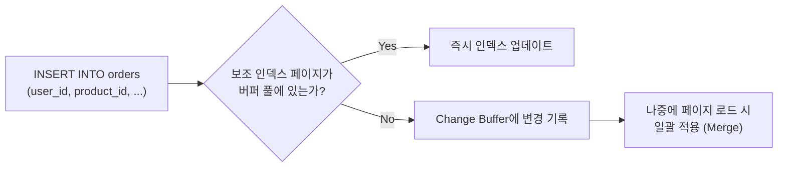
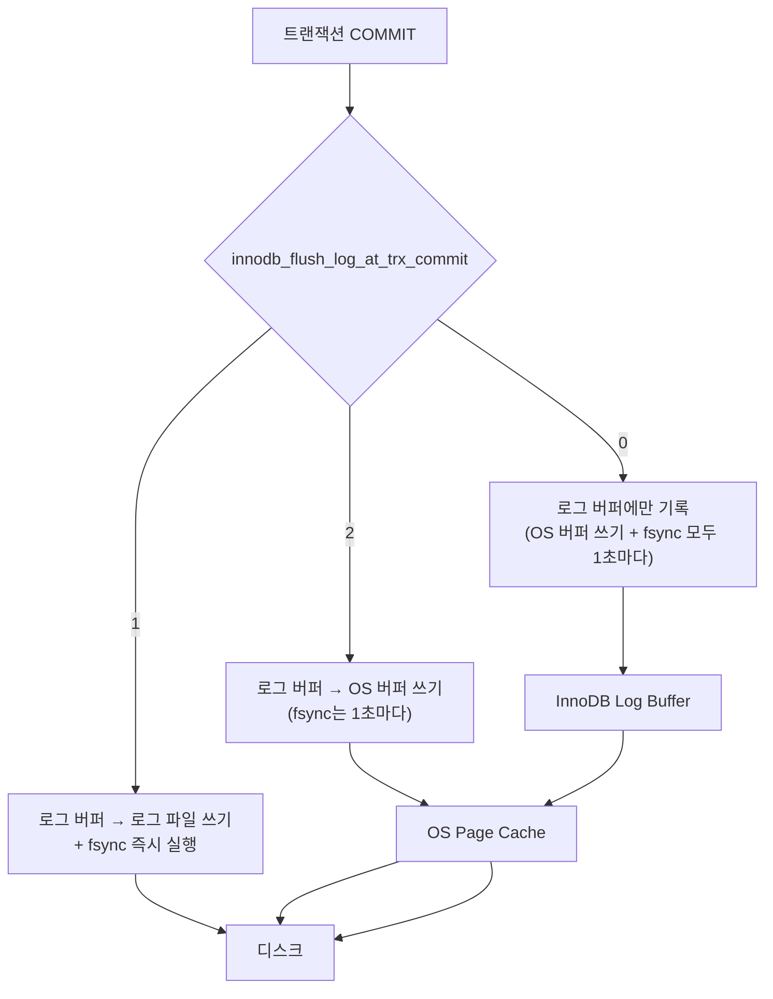
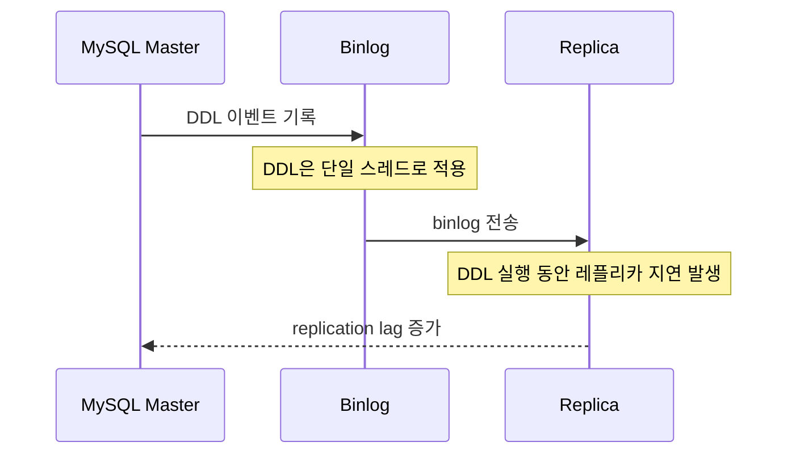

# MySQL InnoDB 튜닝

::: info 학습 목표
- InnoDB 버퍼 풀 크기를 서버 메모리에 맞게 설정하고 히트율을 확인한다.
- Change Buffer와 Adaptive Hash Index의 동작 원리와 비활성화 시점을 이해한다.
- innodb_flush_log_at_trx_commit 값 1/2/0의 성능과 안전성 트레이드오프를 파악한다.
- MySQL 8.0 Online DDL과 binlog ROW/STATEMENT 포맷의 차이를 학습한다.
:::

---

> InnoDB B+Tree 구조와 스토리지 엔진 기초는 [데이터베이스 CH10 스토리지 엔진](/study/database/10-storage-engine)에서 다룬다.

---

## 1. 버퍼 풀 설정

### 버퍼 풀이란

InnoDB 버퍼 풀(Buffer Pool)은 디스크에서 읽은 데이터 페이지와 인덱스 페이지를 메모리에 캐싱하는 공간이다. 쿼리가 데이터를 읽을 때 디스크 대신 메모리에서 제공하므로, 버퍼 풀이 클수록 디스크 I/O가 줄어들고 성능이 향상된다.

### 권장 설정

DB 전용 서버에서는 전체 메모리의 70~80%를 버퍼 풀에 할당한다.

```ini
# /etc/mysql/mysql.conf.d/mysqld.cnf

# 16GB 서버 예시: 12GB 할당 (75%)
innodb_buffer_pool_size = 12G

# 버퍼 풀 인스턴스 수: 1GB당 1개, 최대 64개
# 12GB → 8개 (병렬 접근 시 락 경합 감소)
innodb_buffer_pool_instances = 8
```

메모리 할당 가이드:

| 서버 메모리 | 버퍼 풀 권장 크기 | innodb_buffer_pool_instances |
|------------|------------------|------------------------------|
| 4GB | 2~3GB | 2 |
| 16GB | 10~12GB | 8 |
| 32GB | 22~25GB | 16 |
| 64GB | 45~50GB | 32 |
| 128GB | 90~100GB | 64 |

DB와 애플리케이션이 같은 서버에 있는 경우에는 50~60%로 낮춘다. OS 커널 캐시, 연결 스레드, 정렬 버퍼 등에 사용할 메모리를 남겨야 한다.

### 히트율 확인

버퍼 풀 히트율이 99% 미만이면 빈번한 디스크 I/O가 발생하고 있으므로 버퍼 풀 확장을 검토한다.

```sql
-- 버퍼 풀 히트율 확인
SELECT
    variable_name,
    variable_value
FROM performance_schema.global_status
WHERE variable_name IN (
    'Innodb_buffer_pool_read_requests',   -- 총 읽기 요청
    'Innodb_buffer_pool_reads'            -- 디스크에서 읽은 횟수 (캐시 미스)
);

-- 히트율 계산 쿼리
SELECT
    round(
        (1 - (
            (SELECT variable_value FROM performance_schema.global_status
             WHERE variable_name = 'Innodb_buffer_pool_reads') /
            (SELECT variable_value FROM performance_schema.global_status
             WHERE variable_name = 'Innodb_buffer_pool_read_requests')
        )) * 100, 4
    ) AS buffer_pool_hit_rate_pct;
```

99% 미만 대응 방법:
1. 버퍼 풀 크기 증설 (서버 메모리 여유가 있는 경우)
2. 서버 메모리 증설 후 버퍼 풀 재조정
3. 자주 접근하는 테이블/인덱스를 식별하여 불필요한 풀 스캔 제거

```sql
-- 버퍼 풀에서 가장 많은 페이지를 차지하는 테이블
SELECT table_name, index_name,
       count(*) AS pages,
       count(*) * 16 / 1024 AS size_mb   -- 기본 페이지 크기 16KB
FROM information_schema.innodb_buffer_page
GROUP BY table_name, index_name
ORDER BY pages DESC
LIMIT 20;
```

---

## 2. Change Buffer와 Adaptive Hash Index

### Change Buffer

보조 인덱스(Secondary Index)를 업데이트할 때, 해당 인덱스 페이지가 버퍼 풀에 없으면 디스크에서 읽어야 한다. 이 랜덤 I/O는 쓰기 성능의 병목이 된다.

Change Buffer는 Non-unique 보조 인덱스 변경을 즉시 반영하지 않고 버퍼에 누적했다가, 나중에 해당 인덱스 페이지가 버퍼 풀에 로드될 때 일괄 적용하는 기법이다.



```ini
# my.cnf: Change Buffer 설정
innodb_change_buffer_max_size = 25   # 버퍼 풀 대비 최대 비율 (기본 25%)
innodb_change_buffering = all        # all / inserts / deletes / purges / none
```

Change Buffer가 비효율적인 워크로드:
- 읽기 위주 서비스: 쓰기가 적어 Change Buffer의 이점이 없다
- SSD 환경: 랜덤 I/O 비용이 HDD에 비해 크지 않아 효과가 제한적이다
- Unique 인덱스: Unique 검증이 필요해 Change Buffer를 사용할 수 없다

### Adaptive Hash Index (AHI)

InnoDB는 B+Tree 인덱스를 기본으로 사용한다. 자주 조회되는 B+Tree 경로를 내부적으로 해시 구조로 캐싱하여 탐색 단계를 단축하는 것이 Adaptive Hash Index다. 자동으로 활성/비활성화되며 DBA가 직접 제어하지 않는다.

```sql
-- AHI 사용 현황 확인
SHOW ENGINE INNODB STATUS\G
-- HASH INDEX 섹션에서 확인

-- AHI 통계
SELECT variable_name, variable_value
FROM performance_schema.global_status
WHERE variable_name LIKE 'Innodb_adaptive_hash%';
```

AHI를 OFF로 전환하는 것이 나은 워크로드:
- 다양한 쿼리 패턴이 섞여 캐시 히트율이 낮은 OLAP 워크로드
- AHI 락 경합이 심한 고동시성 쓰기 환경 (SHOW ENGINE INNODB STATUS에서 RW-latch contention이 보일 때)

```ini
# AHI 비활성화 (재시작 없이 동적 변경 가능)
[mysqld]
innodb_adaptive_hash_index = OFF
```

```sql
-- 런타임 변경
SET GLOBAL innodb_adaptive_hash_index = OFF;
```

---

## 3. innodb_flush_log_at_trx_commit

### fsync 동작 원리

InnoDB의 Redo Log(WAL)는 트랜잭션 커밋 시 디스크에 기록된다. OS는 쓰기 요청을 즉시 디스크에 쓰지 않고 버퍼에 모았다가 처리한다(Page Cache). `fsync()`는 OS 버퍼를 디스크로 강제 플러시하는 시스템 콜이다.

서버가 갑자기 꺼질 때 fsync를 하지 않으면 OS 버퍼의 데이터가 유실된다. `innodb_flush_log_at_trx_commit` 설정은 이 fsync 타이밍을 제어한다.

### 값 비교

| 값 | 동작 | 성능 | 내구성 | 권장 환경 |
|----|------|------|--------|-----------|
| 1 | 커밋마다 로그 파일에 쓰고 fsync | 느림 | 완전 보장 (ACID) | 금융, 결제, 주문 시스템 |
| 2 | 커밋마다 OS 버퍼에 쓰고, 1초마다 fsync | 중간 | OS 크래시에는 최대 1초 유실 | 일반 서비스, 레플리카 |
| 0 | 1초마다 OS 버퍼에 쓰고 fsync | 빠름 | MySQL 크래시에도 최대 1초 유실 | 로그성 대량 적재, 비중요 데이터 |



```ini
# my.cnf
# 금융/결제: 완전 내구성
innodb_flush_log_at_trx_commit = 1

# 일반 서비스: 성능/내구성 균형
innodb_flush_log_at_trx_commit = 2

# 로그성 대량 적재, 초기 데이터 이관
innodb_flush_log_at_trx_commit = 0
```

값 2를 사용하면 OS 크래시(서버 전원 차단, 커널 패닉)에만 데이터 유실이 발생한다. MySQL 프로세스 크래시에는 안전하므로 대부분의 서비스는 값 2로 운영한다.

`sync_binlog = 1`과 함께 사용하면 binlog도 커밋마다 fsync를 수행하므로 완전한 내구성을 보장한다.

---

## 4. Online DDL과 binlog

### MySQL 8.0 Online DDL

MySQL 8.0은 DDL 작업 대부분을 Online으로 수행할 수 있다. `ALGORITHM`과 `LOCK` 절로 동작 방식을 명시할 수 있다.

```sql
-- INPLACE: 테이블 복사 없이 제자리 변경 (지원 범위 제한)
ALTER TABLE orders
  ADD COLUMN memo TEXT,
  ALGORITHM=INPLACE, LOCK=NONE;

-- COPY: 전통적 방식 (테이블 복사, 서비스 중단 위험)
ALTER TABLE orders
  CHANGE COLUMN old_name new_name VARCHAR(255),
  ALGORITHM=COPY, LOCK=SHARED;

-- INSTANT: MySQL 8.0.12+, 메타데이터만 변경 (가장 빠름)
ALTER TABLE orders
  ADD COLUMN memo TEXT,
  ALGORITHM=INSTANT;
```

Online DDL 지원 여부 (MySQL 8.0 기준):

| DDL 작업 | ALGORITHM | LOCK |
|---------|-----------|------|
| 컬럼 추가 (nullable) | INSTANT | NONE |
| 컬럼 추가 (not null, 기본값 있음) | INSTANT | NONE |
| 인덱스 추가 | INPLACE | NONE |
| 인덱스 삭제 | INPLACE | NONE |
| 컬럼 타입 변경 | COPY | SHARED |
| Primary Key 추가 | INPLACE | NONE |
| Foreign Key 추가 | INPLACE | NONE |

INSTANT는 가장 빠르지만 제약이 있다. 컬럼을 테이블의 중간에 추가하거나 일부 타입 변경은 INSTANT를 지원하지 않는다.

### binlog 포맷

MySQL binlog는 레플리케이션과 데이터 복구에 사용된다. 포맷은 세 가지다.

| 포맷 | 기록 방식 | 크기 | 안전성 | 사용 권장 |
|------|----------|------|--------|-----------|
| STATEMENT | 실행된 SQL 문장 | 작음 | Non-deterministic 함수(NOW(), RAND()) 결과 불일치 가능 | 레거시 |
| ROW | 변경된 행의 실제 값 | 큼 | 완전히 결정론적 | 권장 |
| MIXED | 기본 STATEMENT, 필요 시 ROW | 중간 | 조건부 안전 | 특수 케이스 |

```ini
# my.cnf
binlog_format = ROW                  # 권장
binlog_row_image = MINIMAL           # 변경된 컬럼만 기록 (크기 절감)
```

ROW 포맷은 `DELETE FROM large_table WHERE condition`처럼 다수의 행이 변경될 때 binlog 크기가 매우 커진다. `binlog_row_image = MINIMAL`을 설정하면 변경된 컬럼 값만 기록하여 크기를 줄일 수 있다.

### binlog와 레플리카 지연의 관계



Online DDL(`ALGORITHM=INPLACE, LOCK=NONE`)은 마스터에서는 DML을 차단하지 않지만, 레플리카에서는 여전히 단일 스레드로 직렬 적용된다. 대형 테이블 DDL은 레플리카 지연을 유발하므로 [모니터링 지표](/study/db-optimization/10-monitoring)에서 배운 Replication Lag 알림과 함께 운영해야 한다.

레플리카 지연 최소화 방법:
- DDL을 트래픽이 적은 시간대에 수행한다
- MySQL 8.0의 Multithreaded Replication으로 DDL 이외의 작업 병렬화
- gh-ost 사용 시 레플리카 측 binlog를 읽어 처리하므로 지연이 더 적다

::: tip 핵심 정리
- 버퍼 풀은 전용 서버 기준 총 메모리의 70~80%로 설정하고, 히트율 99% 미만이면 확장을 검토한다.
- Change Buffer는 Non-unique 보조 인덱스의 랜덤 I/O를 줄이며, SSD 환경이나 읽기 위주 서비스에서는 효과가 제한적이다.
- innodb_flush_log_at_trx_commit은 금융=1, 일반 서비스=2, 대량 적재=0으로 설정한다.
- MySQL 8.0 ALGORITHM=INSTANT는 메타데이터만 변경하여 대부분의 컬럼 추가를 즉시 처리한다.
- binlog는 ROW 포맷과 binlog_row_image=MINIMAL을 조합하면 안전성과 크기를 모두 확보할 수 있다.
- Online DDL은 마스터에서 DML을 차단하지 않지만 레플리카에서는 지연을 유발한다.
:::
