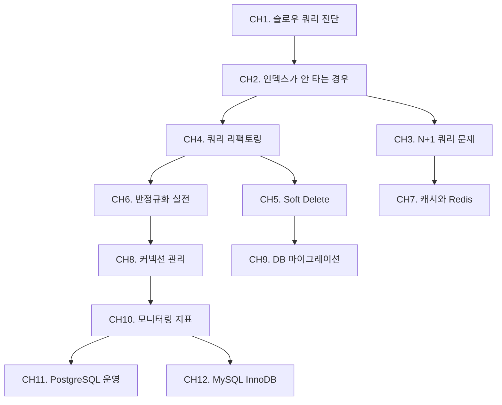

# DB 성능 최적화

데이터베이스 스터디가 이론과 기초를 다룬다면, 이 스터디는 실전 성능 문제 해결에 집중한다. 슬로우 쿼리 진단, N+1 문제, Redis 캐시, Zero-Downtime 마이그레이션 등 면접과 실무에서 바로 쓰이는 주제를 다룬다.

## 학습 로드맵

## 목차

### 쿼리 최적화
1. [슬로우 쿼리 진단](/study/db-optimization/01-slow-query) — pt-query-digest, pg_stat_statements, Performance Schema
2. [인덱스가 안 타는 경우](/study/db-optimization/02-index-not-used) — NOT IN/EXISTS, LIKE, 함수, 타입 변환
3. [N+1 쿼리 문제](/study/db-optimization/03-n-plus-one) — Lazy Loading, fetch join, Batch Size
4. [쿼리 리팩토링](/study/db-optimization/04-query-refactoring) — 서브쿼리→JOIN, Keyset 페이징, Covering Index

### 스키마 최적화
5. [Soft Delete와 아카이빙](/study/db-optimization/05-soft-delete) — Partial Index, 파티션 아카이빙
6. [반정규화 실전](/study/db-optimization/06-denormalization) — 요약 테이블, 카운터 캐시, JSON 컬럼

### 인프라 최적화
7. [캐시 전략과 Redis](/study/db-optimization/07-cache-redis) — Cache-Aside, 스탬피드 방지, TTL
8. [커넥션 관리](/study/db-optimization/08-connection-pool) — HikariCP 사이징, PgBouncer
9. [DB 마이그레이션](/study/db-optimization/09-migration) — Flyway, gh-ost, Zero-Downtime DDL

### 모니터링과 운영
10. [모니터링 지표](/study/db-optimization/10-monitoring) — QPS, p99, Grafana + Prometheus
11. [PostgreSQL 운영](/study/db-optimization/11-postgresql) — VACUUM, Autovacuum, Table Bloat
12. [MySQL InnoDB 튜닝](/study/db-optimization/12-mysql-innodb) — 버퍼 풀, Change Buffer, flush 설정

## 연관 스터디

- [데이터베이스](/study/database/) — 이론 기초 (정규화, 트랜잭션, 인덱스 구조 등)

## 연관 블로그 포스트

- [Lateral Join을 사용해보자](/posts/database/2025-04-20-leteraljoin) — CH4 쿼리 리팩토링
- [실행 계획으로 확인하는 Like 검색 최적화](/posts/database/2025-09-30-likesearch) — CH2 인덱스가 안 타는 경우
