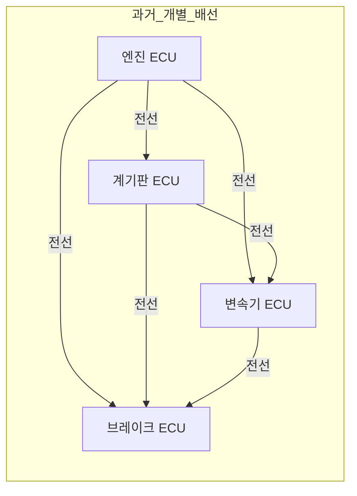
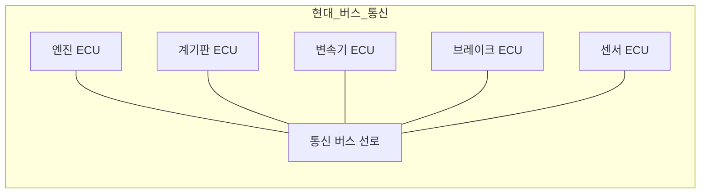
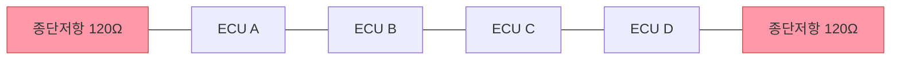

# 통신의 기초

## 학습 목표
- 현대 기계 시스템에서 ECU 간 통신이 필요한 이유를 설명할 수 있다.
- 아날로그 신호와 디지털 신호의 차이를 이해한다.
- 직렬 통신과 병렬 통신의 차이를 비교할 수 있다.
- 버스(Bus) 구조의 개념과 장점을 설명할 수 있다.
- 프로토콜의 역할과 프레임 구조를 이해한다.

---

## 1. 왜 기계끼리 대화해야 하는가

현대 자동차나 농기계 안에는 수십 개의 **ECU(Electronic Control Unit, 전자 제어 장치)**가 들어 있습니다. 엔진을 제어하는 ECU, 변속기를 제어하는 ECU, 브레이크를 제어하는 ECU, 계기판 ECU 등이 각자의 역할을 맡고 있습니다.

이 ECU들은 서로 정보를 주고받아야 합니다. 예를 들어 엔진 ECU가 "현재 회전수는 2000 RPM"이라고 알려주면, 계기판 ECU가 그 값을 화면에 표시합니다. 변속기 ECU는 엔진 토크 정보를 받아야 최적의 기어를 선택할 수 있습니다.

**과거 방식: 개별 배선(Point-to-Point)**

과거에는 ECU마다 직접 전선을 연결했습니다. A가 B에게 보내려면 A↔B 전선, A가 C에게 보내려면 A↔C 전선이 필요했습니다.



ECU가 10개이면 최대 45개의 전선이 필요합니다. 전선이 늘어날수록 무게, 비용, 고장 위험이 모두 증가합니다.

**현대 방식: 버스(Bus) 통신**

현대에는 하나의 통신 선로에 모든 ECU를 연결합니다.



전선 수는 최소화되고, 새로운 ECU를 추가하더라도 버스에 연결만 하면 됩니다.

---

## 2. 아날로그 vs 디지털 신호

### 아날로그 신호

아날로그 신호는 연속적으로 변하는 전압값입니다. 온도 센서가 0~5V 사이의 전압을 출력한다면, 2.3V, 3.7V, 4.1V처럼 어떤 값이든 가질 수 있습니다.

문제는 **노이즈(잡음)**입니다. 전선 주변에 모터나 점화장치가 있으면 전압에 미세한 떨림이 생깁니다. 아날로그에서는 이 떨림이 그대로 측정값 오차로 이어집니다.

### 디지털 신호

디지털 신호는 **0 또는 1**, 두 가지 상태만 가집니다. 전압이 높으면 1, 낮으면 0입니다. 예를 들어 2.5V 이상이면 1, 이하면 0으로 판단합니다.

노이즈가 끼어도 전압이 약간 흔들릴 뿐, 0인지 1인지 판단하는 데는 문제가 없습니다. 이것이 디지털 통신이 노이즈에 강한 이유입니다.

**비트(Bit)**: 0 또는 1 하나를 비트라 합니다. 8비트를 묶으면 1바이트(Byte)가 되고, 이 단위로 데이터를 표현합니다.

---

## 3. 직렬 통신 vs 병렬 통신

### 병렬 통신

여러 비트를 한 번에 전송하는 방식입니다. 8비트를 동시에 보내려면 8개의 전선이 필요합니다. 짧은 거리에서는 빠르지만, 거리가 길어지면 각 선의 신호 도달 시간이 미묘하게 달라져 오류가 발생합니다.

### 직렬 통신

비트를 하나씩 순서대로 보내는 방식입니다. 전선은 1~2개만 필요합니다.

```
병렬: [1][0][1][1][0][0][1][0] → 8개 선으로 동시 전송
직렬: 1→0→1→1→0→0→1→0    → 1개 선으로 순서대로 전송
```

장거리·고속 통신에서는 직렬이 유리합니다. 선이 적으니 전자기 간섭도 줄고, 신호 동기화 문제도 없습니다.

**대표적인 직렬 통신 방식:**

| 방식 | 특징 | 주요 용도 |
|------|------|-----------|
| UART | 비동기, 2선(TX/RX), 간단 | 시리얼 콘솔, GPS |
| SPI | 동기, 4선, 빠름, 1:N | 플래시 메모리, 센서 |
| I2C | 동기, 2선, 다중 장치 주소 | 온도 센서, EEPROM |
| **CAN** | 비동기, 2선, 멀티마스터, 높은 신뢰성 | 자동차/농기계 ECU |

---

## 4. 버스(Bus)란 무엇인가

**버스**는 여러 장치가 공유하는 하나의 통신 선로입니다. 도시 버스처럼 정해진 노선(선로)에 여러 정류장(장치)이 붙어 있는 구조입니다.

버스 구조에서는 한 장치가 메시지를 보내면 버스에 연결된 모든 장치가 그 메시지를 받습니다. 각 장치는 자신에게 필요한 메시지만 골라서 처리합니다.

**버스 토폴로지 (선형 버스):**



버스의 양 끝에는 **종단 저항(120Ω)**을 달아 신호 반사를 막아야 합니다. 이 내용은 CAN 물리 계층 챕터에서 자세히 다룹니다.

**버스의 장점:**
- 전선 수 최소화
- 장치 추가/제거 용이
- 표준 프로토콜 사용 가능

---

## 5. 프로토콜이란

**프로토콜(Protocol)**은 통신 규약입니다. 서로 다른 장치가 올바르게 소통하려면 "어떤 형식으로, 어떤 순서로, 어떤 의미로 데이터를 주고받는가"를 미리 약속해야 합니다.

### 편지 봉투 비유

```
┌──────────────────────────────────────┐
│  보내는 사람: ECU A (주소: 0x7E8)    │  ← 발신자 ID
│  받는 사람:   ECU B (주소: 0x7E0)    │  ← 수신자 ID
│  ────────────────────────────────    │
│  내용: 엔진 RPM = 2000               │  ← 페이로드(실제 데이터)
│  ────────────────────────────────    │
│  오류 검사: CRC 0xA3B2               │  ← 에러 검출 코드
└──────────────────────────────────────┘
```

이 봉투 구조 전체를 **프레임(Frame)**이라 합니다.

프로토콜이 없으면 같은 전선에 연결돼도 서로 "말"을 이해할 수 없습니다. ISOBUS는 농기계 전용 프로토콜로, 트랙터와 작업기가 브랜드가 달라도 통신할 수 있도록 표준을 정의합니다.

---

## 6. 통신의 기본 용어 정리

| 용어 | 설명 |
|------|------|
| **프레임(Frame)** | 헤더 + 페이로드 + 트레일러로 구성된 전송 단위 |
| **헤더(Header)** | 프레임 앞부분. 발신자/수신자 ID, 데이터 길이 등 포함 |
| **페이로드(Payload)** | 실제 전달하려는 데이터 내용 |
| **트레일러(Trailer)** | 프레임 뒷부분. CRC 등 에러 검출 코드 |
| **유니캐스트(Unicast)** | 특정 한 장치에게만 보내는 전송 |
| **브로드캐스트(Broadcast)** | 버스에 연결된 모든 장치에게 보내는 전송 |
| **주소(Address)** | 장치를 식별하는 고유 번호 |
| **ID / 식별자** | CAN에서는 주소 대신 메시지 종류를 나타내는 ID 사용 |
| **비트레이트(Bit rate)** | 초당 전송 비트 수. 단위는 bps(bits per second) |
| **버스 로드(Bus load)** | 버스가 사용되는 시간 비율. 70% 이하 권장 |
| **ACK(Acknowledgement)** | 수신 측이 정상 수신을 알려주는 신호 |
| **CRC(Cyclic Redundancy Check)** | 데이터 오류를 검출하는 체크섬 방식 |

**프레임 구조 요약:**

```
[ SOF | ID | DLC | 데이터(0~8byte) | CRC | ACK | EOF ]
   ↑    ↑     ↑         ↑            ↑     ↑     ↑
  시작  식별  길이     페이로드     오류검출 확인  종료
```

---

::: tip 핵심 정리
- 현대 기계에는 수십 개의 ECU가 있고, 이들은 버스 통신으로 효율적으로 연결됩니다.
- 디지털 신호는 0과 1만 사용해 노이즈에 강합니다.
- 직렬 통신은 선 수가 적고 장거리·고속에 유리합니다.
- 버스는 여러 장치가 공유하는 선로이며, 양 끝에 종단 저항이 필요합니다.
- 프로토콜은 통신 규약이며, 프레임이라는 봉투 구조로 데이터를 주고받습니다.
:::

## 다음 챕터

[CAN 통신 입문](/study/isobus/02-can-intro)으로 이어집니다.
