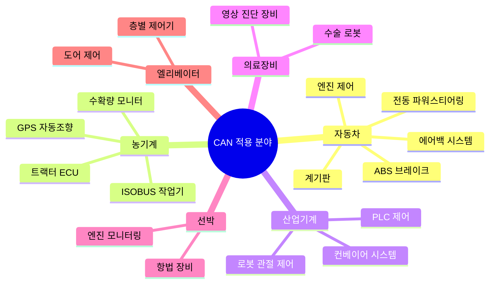
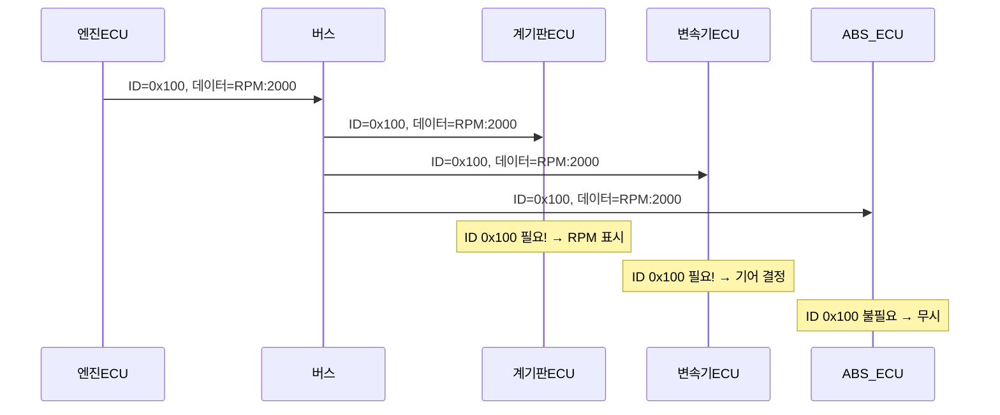

# CAN 통신 입문

## 학습 목표
- CAN의 탄생 배경과 ISO 11898 표준을 설명할 수 있다.
- CAN이 사용되는 분야를 나열할 수 있다.
- 멀티마스터, 메시지 기반 브로드캐스트, 중재(Arbitration) 개념을 이해한다.
- CAN과 다른 통신 방식의 차이를 비교할 수 있다.

---

## 1. CAN이란

<strong>CAN(Controller Area Network)</strong>은 1986년 <strong>Bosch(보쉬)</strong>가 개발한 직렬 통신 프로토콜이다. 원래 자동차 내부의 여러 ECU를 적은 배선으로 연결하기 위해 설계되었다.

당시 자동차 전장 시스템이 복잡해지면서 배선 무게만 50~60kg에 달했다. Bosch는 이 문제를 해결하기 위해 2선 버스 하나로 모든 ECU를 연결하는 방식을 고안했다.

1991년 Mercedes-Benz S-Class에 처음 양산 적용되었고, 이후 <strong>ISO 11898</strong>로 국제 표준화되었다.

**CAN 표준 체계:**

| 표준 | 내용 |
|------|------|
| ISO 11898-1 | 데이터 링크 계층 (프레임 구조, 에러 처리) |
| ISO 11898-2 | 고속 물리 계층 (최대 1 Mbps) |
| ISO 11898-3 | 저속 내결함성 물리 계층 (최대 125 kbps) |
| ISO 11898-5 | 저전력 모드 (슬립/웨이크업) |

---

## 2. CAN을 쓰는 곳

CAN은 자동차에서 시작했지만, 지금은 훨씬 넓은 분야에서 사용된다.



특히 <strong>ISOBUS(ISO 11783)</strong>는 CAN을 기반으로 농기계 전용으로 확장한 표준이다. 트랙터와 작업기(파종기, 방제기 등)가 브랜드가 달라도 서로 통신할 수 있다.

---

## 3. CAN의 핵심 특징

### 3.1 멀티마스터 (Multi-Master)

기존 통신 방식은 마스터(명령하는 쪽)가 슬레이브(응답하는 쪽)에게 일방적으로 요청하는 구조가 많다. CAN에서는 <strong>어떤 노드든 원할 때 메시지를 전송</strong>할 수 있다.

엔진 ECU도 먼저 보낼 수 있고, 브레이크 ECU도 먼저 보낼 수 있다. 단, 동시에 두 노드가 전송을 시도하면 **중재(Arbitration)** 과정을 통해 우선순위가 높은 메시지가 먼저 전송된다.

### 3.2 메시지 기반 브로드캐스트

CAN에서는 "누구에게 보낸다"는 수신자 주소가 없다. 대신 <strong>메시지 ID</strong>로 내용의 종류를 나타냅니다.

예를 들어 ID `0x0CF004B4`라면 "엔진 상태 정보"를 의미한다고 약속한다. 이 메시지가 버스에 올라오면 버스에 연결된 모든 노드가 받다. 각 노드는 자신이 필요한 ID만 골라서 처리한다.



### 3.3 우선순위 기반 중재 (CSMA/CD+AMP)

CAN은 **CSMA/CD+AMP** 방식을 사용한다.

- **CSMA (Carrier Sense Multiple Access)**: 버스가 비어 있을 때만 전송 시작
- **CD (Collision Detection)**: 충돌 감지
- **AMP (Arbitration on Message Priority)**: 메시지 우선순위로 중재

두 노드가 동시에 전송을 시작하면, **ID 값이 낮을수록 우선순위가 높다**. ID를 비트 단위로 비교해 나가면서 먼저 Recessive(1)를 보낸 노드가 자동으로 물러납니다.

```
노드A가 보내는 ID: 0 1 0 0 ...
노드B가 보내는 ID: 0 1 1 0 ...
                         ↑
                   이 비트에서 충돌
                   노드A(0=Dominant) 승리
                   노드B는 재전송 대기
```

충돌이 발생해도 **전송 중인 메시지는 손상되지 않고** 우선순위가 높은 메시지가 그대로 전송된다. 이것이 CAN 중재의 핵심이다.

### 3.4 높은 신뢰성 — 에러 검출 및 복구

CAN은 5가지 에러 검출 메커니즘을 내장한다.

| 에러 종류 | 검출 방법 |
|-----------|-----------|
| 비트 에러 | 전송하며 동시에 버스 읽기, 내가 보낸 값과 다르면 에러 |
| 스터프 에러 | 같은 비트가 5개 연속이면 에러 (비트 스터핑 규칙 위반) |
| CRC 에러 | 수신된 CRC가 계산값과 다르면 에러 |
| 형식 에러 | 프레임 형식이 규격과 다르면 에러 |
| ACK 에러 | 수신자가 ACK를 보내지 않으면 에러 |

에러가 감지되면 에러 프레임을 전송해 버스에 알리고, 자동으로 재전송한다. 노드가 과도하게 에러를 일으키면 <strong>Bus-Off 상태</strong>로 전환되어 버스 보호도 된다.

---

## 4. CAN vs 다른 통신 방식

농기계와 자동차 분야에서 자주 언급되는 통신 방식들과 CAN을 비교한다.

| 항목 | CAN | RS-485 | LIN | FlexRay | Automotive Ethernet |
|------|-----|--------|-----|---------|-------------------|
| 표준 | ISO 11898 | EIA-485 | ISO 17987 | ISO 17458 | IEEE 802.3 |
| 최대 속도 | 1 Mbps | 10 Mbps | 20 kbps | 10 Mbps | 100 Mbps ~ 1 Gbps |
| 토폴로지 | 선형 버스 | 선형 버스 | 단일 마스터 버스 | 이중 채널 버스 | 스타/링 |
| 배선 수 | 2선 | 2선 | 1선 | 4선 | 2선(UTP) |
| 마스터 구조 | 멀티마스터 | 멀티마스터 | 단일마스터 | 멀티마스터 | 멀티마스터 |
| 실시간성 | 높음 | 중간 | 낮음 | 매우 높음 | 높음(TSN) |
| 비용 | 낮음 | 낮음 | 매우 낮음 | 높음 | 중간 |
| 주요 용도 | ECU 제어, ISOBUS | 산업 자동화 | 시트·미러·조명 | 고안전 시스템 | ADAS, 인포테인먼트 |

**선택 기준 요약:**
- **단순하고 저비용**: LIN (창문, 좌석 등 저속 기능)
- **ECU 제어, 안정성**: CAN (엔진, 브레이크, ISOBUS)
- **고속 + 높은 안전성**: FlexRay (전자식 파워트레인, X-by-wire)
- **영상·대용량 데이터**: Automotive Ethernet (카메라, 라이다)

현재 자동차 한 대에는 CAN, LIN, Automotive Ethernet이 모두 함께 사용된다. 농기계에서는 CAN 기반의 ISOBUS가 핵심 표준이다.

---

::: tip 핵심 정리
- CAN은 1986년 Bosch가 개발한 2선 직렬 통신 프로토콜로 ISO 11898로 표준화되었다.
- 자동차, 농기계, 산업기계, 의료장비 등 폭넓게 사용된다.
- 멀티마스터: 어떤 노드든 자유롭게 전송 가능.
- 메시지 기반 브로드캐스트: 수신자 주소 없이 ID로 메시지 종류를 식별.
- 중재(AMP): ID 값이 낮을수록 우선순위가 높고, 충돌 없이 고우선순위 메시지가 전송된다.
- 5가지 에러 검출 메커니즘으로 높은 신뢰성을 보장한다.
:::

## 다음 챕터

[CAN 물리 계층](/study/isobus/03-can-physical)으로 이어집니다.
