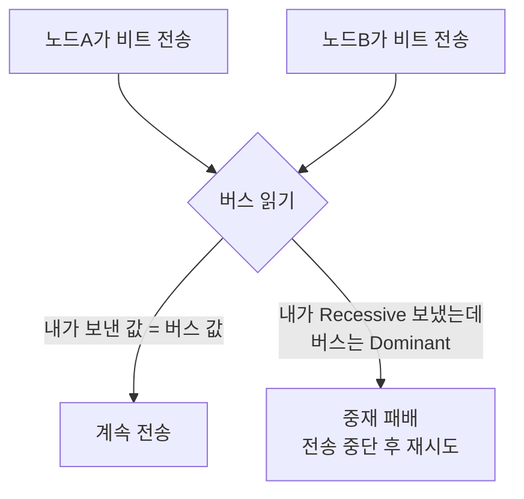
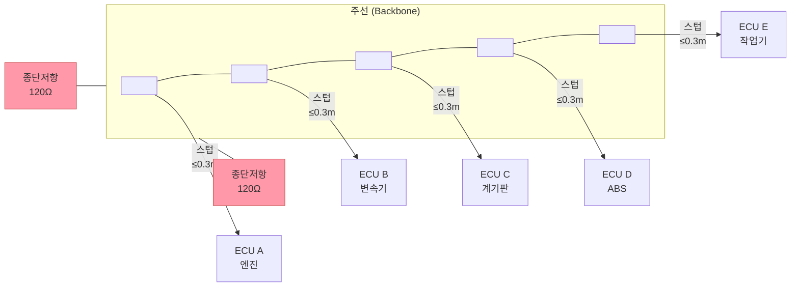
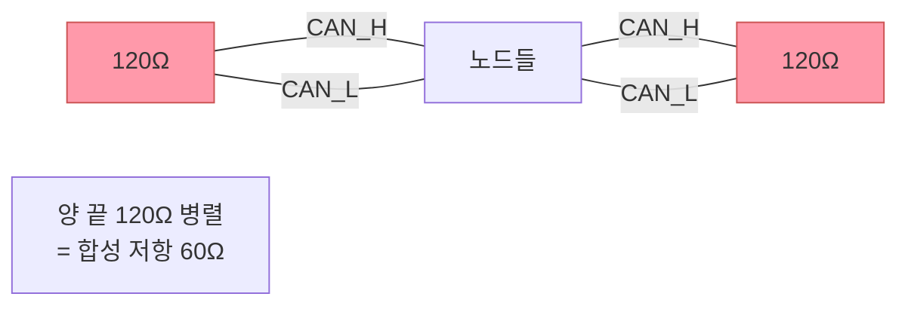
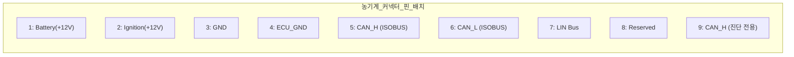

# CAN 물리 계층

## 학습 목표
- CAN_H와 CAN_L 차동 신호의 원리와 노이즈 내성을 설명할 수 있다.
- Dominant(0)과 Recessive(1) 상태의 전압을 암기하고 Wired-AND 동작을 이해한다.
- CAN 버스의 선형 토폴로지와 종단 저항의 역할을 설명할 수 있다.
- 통신 속도에 따른 최대 버스 길이를 이해한다.
- DB9 커넥터 핀 배치를 확인할 수 있다.

---

## 1. CAN_H와 CAN_L — 차동 신호

CAN은 <strong>두 개의 선(CAN_H, CAN_L)</strong>으로 신호를 전달합니다. 이 방식을 <strong>차동 신호(Differential Signal)</strong>라고 합니다.

### 왜 두 선이 필요한가

한 선만 쓰면(단선 신호) 외부 노이즈가 신호에 직접 더해집니다. 그런데 두 선을 쓰면 노이즈가 두 선에 **같은 크기로<strong> 더해집니다. 수신 측은 두 선의 </strong>전압 차이**만 보기 때문에, 두 선에 동일하게 더해진 노이즈는 자동으로 상쇄됩니다.

```
노이즈 발생 시:
  CAN_H: 3.5V + 0.3V(노이즈) = 3.8V
  CAN_L: 1.5V + 0.3V(노이즈) = 1.8V
  전압 차: 3.8 - 1.8 = 2.0V  ← 노이즈가 상쇄되어 원래 신호 유지
```

모터, 점화 플러그 등 노이즈가 많은 농기계 환경에서 CAN이 선택된 핵심 이유입니다.

### 전압 레벨

| 상태 | CAN_H | CAN_L | 전압 차(CAN_H - CAN_L) |
|------|-------|-------|----------------------|
| Dominant (비트 0) | 2.75 ~ 3.5 V | 1.5 ~ 2.25 V | ≥ 1.5 V (통상 2 V) |
| Recessive (비트 1) | 2.5 V | 2.5 V | ~0 V |
| 유휴(버스 비어 있음) | 2.5 V | 2.5 V | ~0 V |

```
전압(V)
 3.5 ─ ─ ─ ┌────┐    ┌────┐   CAN_H
 2.5 ───────┘    └────┘    └────
            │                    
 2.5 ───────┐    ┌────┐    ┌────  CAN_L
 1.5 ─ ─ ─ └────┘    └────┘   

          [Dominant][Rec][Dominant][Rec]
          [  bit 0 ][ 1 ][  bit 0 ][ 1 ]
```

---

## 2. Dominant vs Recessive — Wired-AND 동작

### 상태 정의

- **Dominant (우세, 비트 0)**: CAN_H=3.5V, CAN_L=1.5V, 전압 차 2V
- **Recessive (열세, 비트 1)**: CAN_H=CAN_L=2.5V, 전압 차 0V

### Wired-AND란

버스에 연결된 노드 중 <strong>단 하나라도 Dominant(0)</strong>를 보내면, 버스 전체가 Dominant가 됩니다. 모든 노드가 Recessive(1)를 보낼 때만 버스가 Recessive 상태가 됩니다.

논리식으로: `버스 상태 = 노드A AND 노드B AND 노드C AND ...`  
(0이 "강한" 값이므로, 하나라도 0이면 결과는 0)

이것이 중재(Arbitration) 메커니즘의 기반입니다.



---

## 3. 파형으로 보는 CAN 신호

오실로스코프로 CAN 버스를 측정하면 CAN_H와 CAN_L이 서로 반전된 형태로 움직이는 것을 볼 수 있습니다.

**이상적인 파형:**

```
CAN_H ──┐  ┌──┐  ┌──┐  ┌──
         └──┘  └──┘  └──┘  
CAN_L ──┐  ┌──┐  ┌──┐  ┌──  ← 반전 (CAN_H와 대칭)
         └──┘  └──┘  └──┘  
Diff  ──┐  ┌──┐  ┌──┐  ┌──  ← 차동 전압 (CAN_H - CAN_L)
     0V ┘  └  ┘  └  ┘  └  
```

**실제 파형에서 보이는 현상:**

| 현상 | 원인 | 대처 |
|------|------|------|
| 신호 끝이 뭉툭함 | 버스 커패시턴스(배선 길이) | 배선 단축, 비트레이트 낮추기 |
| 링잉(파형 진동) | 종단 저항 미설치 또는 불일치 | 양 끝 120Ω 확인 |
| 전압 레벨 비대칭 | 접지(GND) 연결 불량 | GND 배선 점검 |
| 신호 없음 | CAN_H/CAN_L 단선 또는 합선 | 배선 점검, 저항값 측정 |

오실로스코프 없이 멀티미터로도 기본 점검이 가능합니다. 버스가 유휴 상태일 때 CAN_H와 CAN_L 모두 약 2.5V이어야 합니다.

---

## 4. 버스 토폴로지

CAN은 **선형 버스(Linear Bus)** 구조를 사용합니다. 하나의 주선(Backbone)에 각 노드가 짧은 분기선(Stub)으로 연결됩니다.



**스텁(Stub) 길이 제한:**
- 스텁이 길면 신호 반사가 발생합니다.
- 1 Mbps에서는 스텁 0.3m 이하 권장 (속도가 낮을수록 허용 스텁 길이가 늘어남).
- ISOBUS(250 kbps)에서는 최대 스텁 길이 1m.

**최대 노드 수:**
- CAN 사양 상 이론적 최대 노드 수는 제한이 없으나, 실제로는 버스 전기적 특성으로 약 110개 노드가 한계입니다.
- ISOBUS 구현에서는 실용적으로 30개 이하를 권장합니다.

---

## 5. 종단 저항 (120Ω)

### 왜 필요한가

전선은 일종의 전송 선로입니다. 신호가 선로 끝에 도달하면 "반사"가 일어납니다. 반사된 신호가 되돌아오면 원래 신호를 왜곡시킵니다.

<strong>종단 저항(Termination Resistor)</strong>은 버스 양 끝에 달아 신호를 흡수해 반사를 막습니다. 저항값이 선로 특성 임피던스(120Ω)와 같아야 합니다.



두 종단 저항이 병렬 연결되므로 버스 전체 임피던스는 <strong>60Ω</strong>입니다. 이 값이 맞지 않으면 파형이 불안정해집니다.

**멀티미터로 종단 저항 확인하는 방법:**

```
1. 버스의 전원을 끈다.
2. CAN_H와 CAN_L 사이의 저항을 측정한다.
3. 정상: 약 60Ω
   종단저항 1개 없음: 약 120Ω
   종단저항 모두 없음: 무한대(∞)
   단선: 무한대(∞)
   CAN_H/CAN_L 단락: 0Ω
```

```python
# 종단 저항 측정값 해석 예시 (진단 스크립트)
def interpret_termination_resistance(ohm):
    if ohm < 10:
        return "ERROR: CAN_H/CAN_L 단락 (Short circuit)"
    elif 50 <= ohm <= 70:
        return "OK: 정상 (양쪽 120Ω 종단저항 장착됨)"
    elif 110 <= ohm <= 130:
        return "WARNING: 종단저항 1개만 장착됨"
    elif ohm > 1000:
        return "ERROR: 종단저항 없음 또는 단선"
    else:
        return f"WARNING: 비정상 저항값 {ohm}Ω — 배선 점검 필요"

print(interpret_termination_resistance(60))   # OK
print(interpret_termination_resistance(120))  # WARNING
print(interpret_termination_resistance(9999)) # ERROR
```

---

## 6. 통신 속도와 버스 길이

CAN에서 **속도와 거리는 반비례** 관계입니다. 속도가 빠를수록 비트 하나의 시간이 짧아지는데, 버스가 길면 신호가 양 끝을 왕복하는 시간(전파 지연)이 비트 시간을 초과해 버립니다.

| 비트레이트 | 최대 버스 길이 | 주요 용도 |
|-----------|--------------|-----------|
| 1 Mbps | 약 25 m | 고속 제어 (소형 ECU 네트워크) |
| 500 kbps | 약 100 m | 자동차 파워트레인 네트워크 |
| **250 kbps** | 약 250 m | **ISOBUS 표준 속도** |
| 125 kbps | 약 500 m | 저속 기능 버스 (차체 계통) |
| 50 kbps | 약 1000 m | 장거리 산업 네트워크 |

ISOBUS는 250 kbps를 표준으로 사용합니다. 트랙터 + 작업기의 연결 거리를 고려해도 충분한 속도와 거리를 제공합니다.

```c
/* CAN 비트 타이밍 설정 예시 (250 kbps, 16 MHz 클럭) */
/* Bit time = 1 / 250,000 = 4 µs */
/* TQ(Time Quantum) 단위로 비트 시간을 분할 */

typedef struct {
    uint8_t brp;   /* Baud Rate Prescaler */
    uint8_t tseg1; /* Time Segment 1 */
    uint8_t tseg2; /* Time Segment 2 */
    uint8_t sjw;   /* Synchronization Jump Width */
} CAN_BitTiming;

/* 250 kbps @ 16 MHz: BRP=4, TSEG1=11, TSEG2=4, SJW=1 */
/* Bit time = (1 + TSEG1 + TSEG2) * TQ = 16 TQ          */
/* TQ = BRP / f_clk = 4 / 16MHz = 0.25 µs               */
/* Bit time = 16 * 0.25 µs = 4 µs → 250 kbps            */
CAN_BitTiming timing_250k = {
    .brp   = 4,
    .tseg1 = 11,
    .tseg2 = 4,
    .sjw   = 1
};
```

---

## 7. 커넥터와 핀아웃

### DB9 커넥터 (ISO 11898 권장)

CAN 디버깅 장비나 PC 인터페이스에서 가장 많이 쓰이는 9핀 D-Sub 커넥터입니다.

```
DB9 Female (장비 측)
 ┌─────────────────────┐
 │  ○   ○   ○   ○   ○  │  ← 핀 1~5
 │    ○   ○   ○   ○    │  ← 핀 6~9
 └─────────────────────┘

핀 번호 → 신호:
  Pin 1: 없음 (NC)
  Pin 2: CAN_L  ← 통신
  Pin 3: GND    ← 접지
  Pin 4: 없음 (NC)
  Pin 5: CAN_SHLD (선택적, 차폐 연결)
  Pin 6: GND    ← 접지 (선택적)
  Pin 7: CAN_H  ← 통신
  Pin 8: 없음 (NC)
  Pin 9: CAN_V+ (선택적, 전원 공급)
```

**핵심 핀 요약:**

| 핀 번호 | 신호명 | 설명 |
|---------|--------|------|
| 2 | CAN_L | 통신 선 (저전압 측) |
| 3 | GND | 공통 접지 |
| 7 | CAN_H | 통신 선 (고전압 측) |

### ISOBUS / 농기계 진단 커넥터

트랙터와 작업기 연결에는 **AMP Deutsch DT 시리즈** 방수 커넥터가 많이 사용됩니다. 진단 목적으로는 <strong>9핀 Deutsch 커넥터</strong>가 표준입니다.



실제 농기계 커넥터 배치는 제조사마다 다를 수 있으므로, 항상 해당 기종의 전기 회로도를 참고해야 합니다.

**현장에서 CAN 신호 확인 방법:**

```c
/* CAN 메시지 수신 및 출력 예시 (의사코드 / 임베디드 C) */
#include <stdio.h>
#include <stdint.h>

typedef struct {
    uint32_t id;
    uint8_t  dlc;       /* Data Length Code: 0~8 */
    uint8_t  data[8];
} CAN_Message;

void on_can_receive(CAN_Message *msg) {
    printf("ID: 0x%08X  DLC: %d  Data:", msg->id, msg->dlc);
    for (int i = 0; i < msg->dlc; i++) {
        printf(" %02X", msg->data[i]);
    }
    printf("\n");
}

/* 출력 예시:
   ID: 0x0CF004B4  DLC: 8  Data: F0 00 FF 00 00 00 00 FF
   → ISOBUS J1939 EEC1 (엔진 전자 제어 #1) 메시지
*/
```

---

::: tip 핵심 정리
- CAN은 CAN_H/CAN_L 두 선의 <strong>전압 차이</strong>로 신호를 전달해 노이즈에 강합니다.
- Dominant(0): CAN_H=3.5V, CAN_L=1.5V / Recessive(1): 양쪽 2.5V.
- 종단 저항 120Ω을 버스 양 끝에 반드시 설치해야 합니다. 합성 저항 60Ω.
- 멀티미터로 CAN_H-CAN_L 간 저항을 측정해 60Ω이면 정상입니다.
- ISOBUS 표준 속도는 250 kbps이며, 최대 버스 길이는 약 250m입니다.
- DB9 커넥터 기준 CAN_H=핀7, CAN_L=핀2, GND=핀3입니다.
:::

## 다음 챕터

[CAN 데이터 프레임](/study/isobus/04-can-data-frame)으로 이어집니다.
